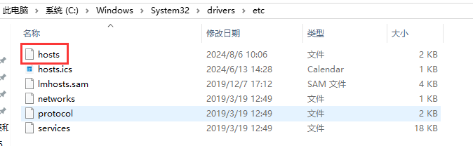

#### 部署nginx-ingress

部署的是阿里云nginx-ingress控制器

地址 https://help.aliyun.com/zh/ack/product-overview/nginx-ingress-controller#title-ek8-hx4-hlm


Ingress基本概念

在Kubernetes集群中，Ingress作为集群内服务对外暴露的访问接入点，几乎承载着集群内服务访问的所有流量。Ingress是Kubernetes中的一个资源对象，用来管理集群外部访问集群内部服务的方式。您可以通过Ingress资源来配置不同的转发规则，从而实现根据不同的规则设置访问集群内不同的Service所对应的后端Pod。


Nginx Ingress Controller工作原理

为了使得Nginx Ingress资源正常工作，集群中必须要有一个Nginx Ingress Controller来解析Nginx Ingress的转发规则。Nginx Ingress Controller收到请求，匹配Nginx Ingress转发规则转发到后端Service所对应的Pod，由Pod处理请求。Kubernetes中的Service、Nginx Ingress与Nginx Ingress Controller有着以下关系：

- Service是后端真实服务的抽象，一个Service可以代表多个相同的后端服务。
- Nginx Ingress是反向代理规则，用来规定HTTP/HTTPS请求应该被转发到哪个Service所对应的Pod上。例如根据请求中不同的Host和URL路径，让请求落到不同的Service所对应的Pod上。
- Nginx Ingress Controller是Kubernetes集群中的一个组件，负责解析Nginx Ingress的反向代理规则。如果Nginx Ingress有增删改的变动，Nginx Ingress Controller会及时更新自己相应的转发规则，当Nginx Ingress Controller收到请求后就会根据这些规则将请求转发到对应Service的Pod上。


Ingress Controller通过API Server获取Ingress资源的变化，动态地生成Load Balancer（例如Nginx）所需的配置文件（例如nginx.conf），然后重新加载Load Balancer（例如执行nginx -s load重新加载Nginx。）来生成新的路由转发规则。


aliyun-ingress-controller有一个很重要的修改，就是它支持路由配置的动态更新，大家用过Nginx的可以知道，在修改完Nginx的配置，我们是需要进行nginx -s reload来重加载配置才能生效的，在K8s上，这个行为也是一样的，但由于K8s运行的服务会非常多，所以它的配置更新是非常频繁的，因此，如果不支持配置动态更新，对于在高频率变化的场景下，Nginx频繁Reload会带来较明显的请求访问问题：

造成一定的QPS抖动和访问失败情况
对于长连接服务会被频繁断掉
造成大量的处于shutting down的Nginx Worker进程，进而引起内存膨胀
详细原理分析见这篇文章： https://developer.aliyun.com/article/692732


#### harbor仓库创建项目  

  


#### 下载镜像

```shell
### 下载nginx-ingress镜像
root@ops:~# docker pull registry-cn-hangzhou.ack.aliyuncs.com/acs/aliyun-ingress-controller:v1.9.3-aliyun.1

# docker tag registry-cn-hangzhou.ack.aliyuncs.com/acs/aliyun-ingress-controller:v1.9.3-aliyun.1 harbor.alnk.com/public/aliyun-ingress-controller:v1.9.3-aliyun.1

# docker push harbor.alnk.com/public/aliyun-ingress-controller:v1.9.3-aliyun.1


### 下载busybox镜像
# docker pull registry.cn-hangzhou.aliyuncs.com/alnktest/busybox:latest

# docker tag registry.cn-hangzhou.aliyuncs.com/alnktest/busybox:latest harbor.alnk.com/public/busybox:latest

# docker push harbor.alnk.com/public/busybox:latest


### 下载kube-webhook-certge
# docker pull registry.cn-beijing.aliyuncs.com/acs/kube-webhook-certgen:v1.5.1

# docker tag registry.cn-beijing.aliyuncs.com/acs/kube-webhook-certgen:v1.5.1 harbor.alnk.com/public/kube-webhook-certgen:v1.5.1

# docker push harbor.alnk.com/public/kube-webhook-certgen:v1.5.1


```

  


#### 统一管理yaml文件

```shell
# vi /etc/nginx/conf.d/k8s-yaml.alnk.com.conf
server {
    listen       80;
    server_name  k8s-yaml.alnk.com;

    location / {
        autoindex on;
        default_type text/plain;
        root /data/k8s-yaml;
    }
}

root@ops:~# mkdir /data/k8s-yaml
root@ops:~# nginx -t

root@ops:~# systemctl reload nginx

####
## 修改hosts
## 10.0.1.21、10.0.1.201、10.0.1.202、10.0.1.203、10.0.1.204都做一下
root@ops:/opt/harbor# vi /etc/hosts
10.0.1.21 k8s-yaml.alnk.com
```


#### 修改windows系统的hosts文件  

  

```
10.0.1.21 k8s-yaml.alnk.com
```


```shell
#创建对应的目录
root@ops:~# cd /data/k8s-yaml/
root@ops:/data/k8s-yaml# mkdir ingress-nginx
root@ops:/data/k8s-yaml# cd ingress-nginx/
root@ops:/data/k8s-yaml/ingress-nginx#
```


#### rbac.yaml  

```yaml
---
apiVersion: v1
kind: ServiceAccount
metadata:
  name: ingress-nginx
  namespace: kube-system

---
apiVersion: rbac.authorization.k8s.io/v1
kind: Role
metadata:
  labels:
    app.kubernetes.io/component: controller
    app.kubernetes.io/instance: ingress-nginx
    app.kubernetes.io/name: ingress-nginx
    app.kubernetes.io/part-of: ingress-nginx
    app.kubernetes.io/version: 1.9.3
  name: ingress-nginx
  namespace: kube-system
rules:
- apiGroups:
  - ""
  resources:
  - namespaces
  verbs:
  - get
- apiGroups:
  - ""
  resources:
  - configmaps
  - pods
  - secrets
  - endpoints
  verbs:
  - get
  - list
  - watch
- apiGroups:
  - ""
  resources:
  - services
  verbs:
  - get
  - list
  - watch
- apiGroups:
  - networking.k8s.io
  resources:
  - ingresses
  verbs:
  - get
  - list
  - watch
- apiGroups:
  - networking.k8s.io
  resources:
  - ingresses/status
  verbs:
  - update
- apiGroups:
  - networking.k8s.io
  resources:
  - ingressclasses
  verbs:
  - get
  - list
  - watch
- apiGroups:
  - ""
  resourceNames:
  - ingress-controller-leader-nginx
  resources:
  - configmaps
  verbs:
  - get
  - update
- apiGroups:
  - ""
  resources:
  - configmaps
  verbs:
  - create
- apiGroups:
  - coordination.k8s.io
  resourceNames:
  - ingress-controller-leader-nginx
  resources:
  - leases
  verbs:
  - get
  - update
- apiGroups:
  - coordination.k8s.io
  resources:
  - leases
  verbs:
  - create
- apiGroups:
  - ""
  resources:
  - events
  verbs:
  - create
  - patch
- apiGroups:
  - discovery.k8s.io
  resources:
  - endpointslices
  verbs:
  - list
  - watch
  - get
---
apiVersion: rbac.authorization.k8s.io/v1
kind: ClusterRole
metadata:
  labels:
    app.kubernetes.io/instance: ingress-nginx
    app.kubernetes.io/name: ingress-nginx
    app.kubernetes.io/part-of: ingress-nginx
    app.kubernetes.io/version: 1.9.3
  name: ingress-nginx
rules:
- apiGroups:
  - ""
  resources:
  - configmaps
  - endpoints
  - nodes
  - pods
  - secrets
  - namespaces
  verbs:
  - list
  - watch
- apiGroups:
  - coordination.k8s.io
  resources:
  - leases
  verbs:
  - list
  - watch
- apiGroups:
  - ""
  resources:
  - nodes
  verbs:
  - get
- apiGroups:
  - ""
  resources:
  - services
  verbs:
  - get
  - list
  - watch
- apiGroups:
  - networking.k8s.io
  resources:
  - ingresses
  verbs:
  - get
  - list
  - watch
- apiGroups:
  - ""
  resources:
  - events
  verbs:
  - create
  - patch
- apiGroups:
  - networking.k8s.io
  resources:
  - ingresses/status
  verbs:
  - update
- apiGroups:
  - networking.k8s.io
  resources:
  - ingressclasses
  verbs:
  - get
  - list
  - watch
- apiGroups:
  - discovery.k8s.io
  resources:
  - endpointslices
  verbs:
  - list
  - watch
  - get
---
apiVersion: rbac.authorization.k8s.io/v1
kind: RoleBinding
metadata:
  labels:
    app.kubernetes.io/component: controller
    app.kubernetes.io/instance: ingress-nginx
    app.kubernetes.io/name: ingress-nginx
    app.kubernetes.io/part-of: ingress-nginx
    app.kubernetes.io/version: 1.9.3
  name: ingress-nginx
  namespace: kube-system
roleRef:
  apiGroup: rbac.authorization.k8s.io
  kind: Role
  name: ingress-nginx
subjects:
- kind: ServiceAccount
  name: ingress-nginx
  namespace: kube-system
---
apiVersion: rbac.authorization.k8s.io/v1
kind: ClusterRoleBinding
metadata:
  labels:
    app.kubernetes.io/instance: ingress-nginx
    app.kubernetes.io/name: ingress-nginx
    app.kubernetes.io/part-of: ingress-nginx
    app.kubernetes.io/version: 1.9.3
  name: ingress-nginx
roleRef:
  apiGroup: rbac.authorization.k8s.io
  kind: ClusterRole
  name: ingress-nginx
subjects:
- kind: ServiceAccount
  name: ingress-nginx
  namespace: kube-system

---
apiVersion: v1
kind: ServiceAccount
metadata:
  name: ingress-nginx-admission
  namespace: kube-system
---
apiVersion: rbac.authorization.k8s.io/v1
kind: ClusterRole
metadata:
  name: ingress-nginx-admission
rules:
  - apiGroups:
      - admissionregistration.k8s.io
    resources:
      - validatingwebhookconfigurations
    verbs:
      - get
      - update
---
apiVersion: rbac.authorization.k8s.io/v1
kind: ClusterRoleBinding
metadata:
  name: ingress-nginx-admission
roleRef:
  apiGroup: rbac.authorization.k8s.io
  kind: ClusterRole
  name: ingress-nginx-admission
subjects:
  - kind: ServiceAccount
    name: ingress-nginx-admission
    namespace: kube-system
---
apiVersion: rbac.authorization.k8s.io/v1
kind: Role
metadata:
  name: ingress-nginx-admission
  namespace: kube-system
rules:
  - apiGroups:
      - ""
    resources:
      - secrets
    verbs:
      - get
      - create
---
apiVersion: rbac.authorization.k8s.io/v1
kind: RoleBinding
metadata:
  name: ingress-nginx-admission
  namespace: kube-system
roleRef:
  apiGroup: rbac.authorization.k8s.io
  kind: Role
  name: ingress-nginx-admission
subjects:
  - kind: ServiceAccount
    name: ingress-nginx-admission
    namespace: kube-system
```


#### cm.yaml  

```yaml
# all configmaps means:
# https://github.com/kubernetes/ingress-nginx/blob/master/docs/user-guide/nginx-configuration/configmap.md

kind: ConfigMap
apiVersion: v1
metadata:
  name: nginx-configuration
  namespace: kube-system
  labels:
    app: ingress-nginx
data:
  allow-snippet-annotations: "true"
  allow-backend-server-header: "true"
  disable-access-log: "false"
  enable-underscores-in-headers: "true"
  generate-request-id: "true"
  ignore-invalid-headers: "true"
  keep-alive: "900"
  keep-alive-requests: "10000"
  large-client-header-buffers: 5 20k
  log-format-upstream: '{"@timestamp": "$time_iso8601","remote_addr": "$remote_addr","x-forward-for": "$proxy_add_x_forwarded_for","request_id": "$req_id","remote_user": "$remote_user","bytes_sent": $bytes_sent,"request_time": $request_time,"status": $status,"vhost": "$host","request_proto": "$server_protocol","path": "$uri","request_query": "$args","request_length": $request_length,"duration": $request_time,"method": "$request_method","http_referrer": "$http_referer","http_user_agent":  "$http_user_agent","upstream-sever":"$proxy_upstream_name","proxy_alternative_upstream_name":"$proxy_alternative_upstream_name","upstream_addr":"$upstream_addr","upstream_response_length":$upstream_response_length,"upstream_response_time":$upstream_response_time,"upstream_status":$upstream_status}'
  max-worker-connections: "65536"
  proxy-body-size: 20m
  proxy-connect-timeout: "10"
  proxy-read-timeout: "60"
  proxy-send-timeout: "60"
  reuse-port: "true"
  server-tokens: "false"
  ssl-redirect: "false"
  upstream-keepalive-connections: "300"
  upstream-keepalive-requests: "1000"
  upstream-keepalive-timeout: "900"
  worker-cpu-affinity: ""
  worker-processes: "1"
  http-redirect-code: "301"
  proxy_next_upstream: error timeout http_502
  ssl-ciphers: ECDHE-RSA-AES128-GCM-SHA256:ECDHE-ECDSA-AES128-GCM-SHA256:ECDHE-RSA-AES256-GCM-SHA384:ECDHE-ECDSA-AES256-GCM-SHA384:DHE-RSA-AES128-GCM-SHA256:DHE-DSS-AES128-GCM-SHA256:kEDH+AESGCM:ECDHE-RSA-AES128-SHA256:ECDHE-ECDSA-AES128-SHA256:ECDHE-RSA-AES128-SHA:ECDHE-ECDSA-AES128-SHA:ECDHE-RSA-AES256-SHA384:ECDHE-ECDSA-AES256-SHA384:ECDHE-RSA-AES256-SHA:ECDHE-ECDSA-AES256-SHA:DHE-RSA-AES128-SHA256:DHE-RSA-AES128-SHA:DHE-DSS-AES128-SHA256:DHE-RSA-AES256-SHA256:DHE-DSS-AES256-SHA:DHE-RSA-AES256-SHA:AES128-GCM-SHA256:AES256-GCM-SHA384:AES128-SHA256:AES256-SHA256:AES128-SHA:AES256-SHA:AES:CAMELLIA:DES-CBC3-SHA:!aNULL:!eNULL:!EXPORT:!DES:!RC4:!MD5:!PSK:!aECDH:!EDH-DSS-DES-CBC3-SHA:!EDH-RSA-DES-CBC3-SHA:!KRB5-DES-CBC3-SHA
  ssl-protocols: TLSv1 TLSv1.1 TLSv1.2

---
kind: ConfigMap
apiVersion: v1
metadata:
  name: tcp-services
  namespace: kube-system
  labels:
    app: ingress-nginx

---
kind: ConfigMap
apiVersion: v1
metadata:
  name: udp-services
  namespace: kube-system
  labels:
    app: ingress-nginx
```


#### ds.yaml  

```yaml
apiVersion: apps/v1
kind: DaemonSet
#kind: Deployment
metadata:
  name: nginx-ingress-controller
  namespace: kube-system
  labels:
    app: ingress-nginx
  annotations:
    component.revision: "2"
    component.version: 1.9.3
spec:
  # Deployment need:
  # ----------------
  # replicas: 1
  # ----------------
  selector:
    matchLabels:
      app: ingress-nginx
  template:
    metadata:
      labels:
        app: ingress-nginx
      annotations:
        prometheus.io/port: "10254"
        prometheus.io/scrape: "true"
    spec:
      # DaemonSet need:
      # ----------------
      hostNetwork: true
      # ----------------
      affinity:
        podAntiAffinity:
          preferredDuringSchedulingIgnoredDuringExecution:
          - podAffinityTerm:
              labelSelector:
                matchExpressions:
                - key: app
                  operator: In
                  values:
                  - ingress-nginx
              topologyKey: kubernetes.io/hostname
            weight: 100
        nodeAffinity:
          requiredDuringSchedulingIgnoredDuringExecution:
            nodeSelectorTerms:
            - matchExpressions:
              - key: type
                operator: NotIn
                values:
                - virtual-kubelet
              - key: k8s.aliyun.com
                operator: NotIn
                values:
                - "true"
      containers:
      - args:
          - /nginx-ingress-controller
          - --election-id=ingress-controller-leader-nginx
          - --ingress-class=nginx
          - --watch-ingress-without-class
          - --controller-class=k8s.io/ingress-nginx
          - --configmap=$(POD_NAMESPACE)/nginx-configuration
          - --tcp-services-configmap=$(POD_NAMESPACE)/tcp-services
          - --udp-services-configmap=$(POD_NAMESPACE)/udp-services
          - --annotations-prefix=nginx.ingress.kubernetes.io
          - --publish-service=$(POD_NAMESPACE)/nginx-ingress-lb
          - --validating-webhook=:8443
          - --validating-webhook-certificate=/usr/local/certificates/cert
          - --validating-webhook-key=/usr/local/certificates/key
          - --enable-metrics=false
          - --v=2
        env:
          - name: POD_NAME
            valueFrom:
              fieldRef:
                fieldPath: metadata.name
          - name: POD_NAMESPACE
            valueFrom:
              fieldRef:
                fieldPath: metadata.namespace
          - name: LD_PRELOAD
            value: /usr/local/lib/libmimalloc.so
        image: harbor.alnk.com/public/aliyun-ingress-controller:v1.9.3-aliyun.1
        imagePullPolicy: IfNotPresent
        lifecycle:
          preStop:
            exec:
              command:
                - /wait-shutdown
        livenessProbe:
          failureThreshold: 5
          httpGet:
            path: /healthz
            port: 10254
            scheme: HTTP
          initialDelaySeconds: 10
          periodSeconds: 10
          timeoutSeconds: 1
          successThreshold: 1
        name: nginx-ingress-controller
        ports:
          - name: http
            containerPort: 80
            protocol: TCP
            #hostPort: 81
          - name: https
            containerPort: 443
            protocol: TCP
            #hostPort: 4443
          - name: webhook
            containerPort: 8443
            protocol: TCP
            #hostPort: 9443
        readinessProbe:
          failureThreshold: 3
          httpGet:
            path: /healthz
            port: 10254
            scheme: HTTP
          initialDelaySeconds: 10
          periodSeconds: 10
          timeoutSeconds: 1
          successThreshold: 1
#        resources:
#          limits:
#            cpu: 1
#            memory: 2G
#          requests:
#            cpu: 1
#            memory: 2G
        securityContext:
          allowPrivilegeEscalation: true
          capabilities:
            drop:
              - ALL
            add:
              - NET_BIND_SERVICE
          runAsUser: 101
          # if get 'mount: mounting rw on /proc/sys failed: Permission denied', use:
#          privileged: true
#          procMount: Default
#          runAsUser: 0
        volumeMounts:
        - name: webhook-cert
          mountPath: /usr/local/certificates/
          readOnly: true
        - mountPath: /etc/localtime
          name: localtime
          readOnly: true
      dnsPolicy: ClusterFirst
      initContainers:
      - command:
        - /bin/sh
        - -c
        - |
          if [ "$POD_IP" != "$HOST_IP" ]; then
          mount -o remount rw /proc/sys
          sysctl -w net.core.somaxconn=65535
          sysctl -w net.ipv4.ip_local_port_range="1024 65535"
          sysctl -w kernel.core_uses_pid=0
          fi
        env:
        - name: POD_IP
          valueFrom:
            fieldRef:
              apiVersion: v1
              fieldPath: status.podIP
        - name: HOST_IP
          valueFrom:
            fieldRef:
              apiVersion: v1
              fieldPath: status.hostIP
        image: harbor.alnk.com/public/busybox:latest
        imagePullPolicy: IfNotPresent
        name: init-sysctl
        resources:
          limits:
            cpu: 100m
            memory: 70Mi
          requests:
            cpu: 100m
            memory: 70Mi
        securityContext:
          capabilities:
            add:
            - SYS_ADMIN
            drop:
            - ALL
          # if get 'mount: mounting rw on /proc/sys failed: Permission denied', use:
          privileged: true
          procMount: Default
          runAsUser: 0
      # choose node with set this label running
      # kubectl label node xx.xx.xx.xx alnk/ingress-controller-ready=true
      # kubectl get node --show-labels
      # kubectl label node xx.xx.xx.xx alnk/ingress-controller-ready-
      nodeSelector:
        alnk/ingress-controller-ready: "true"
      priorityClassName: system-node-critical
      restartPolicy: Always
      schedulerName: default-scheduler
      securityContext: {}
      serviceAccount: ingress-nginx
      serviceAccountName: ingress-nginx
      terminationGracePeriodSeconds: 300
      # kubectl taint nodes xx.xx.xx.xx alnk/ingress-controller-ready="true":NoExecute
      # kubectl taint nodes xx.xx.xx.xx alnk/ingress-controller-ready:NoExecute-
      tolerations:
      - operator: Exists
#      tolerations:
#      - effect: NoExecute
#        key: alnk/ingress-controller-ready
#        operator: Equal
#        value: "true"
      volumes:
      - name: webhook-cert
        secret:
          defaultMode: 420
          secretName: ingress-nginx-admission
      - hostPath:
          path: /etc/localtime
          type: File
        name: localtime

```


#### svc.yaml  

```yaml
apiVersion: v1
kind: Service
metadata:
  labels:
    app: ingress-nginx
  name: nginx-ingress-lb
  namespace: kube-system
spec:
  # DaemonSet need:
  # ----------------
  type: ClusterIP
  # ----------------
  # Deployment need:
  # ----------------
#  type: NodePort
  # ----------------
  ports:
  - name: http
    port: 80
    targetPort: 80
    protocol: TCP
  - name: https
    port: 443
    targetPort: 443
    protocol: TCP
  - name: metrics
    port: 10254
    protocol: TCP
    targetPort: 10254
  selector:
    app: ingress-nginx

---
apiVersion: v1
kind: Service
metadata:
  name: ingress-nginx-controller-admission
  namespace: kube-system
spec:
  type: ClusterIP
  ports:
    - name: https-webhook
      port: 443
      targetPort: 8443
  selector:
    app: ingress-nginx
```


#### ingressclass.yaml  

```yaml
apiVersion: networking.k8s.io/v1
kind: IngressClass
metadata:
  name: nginx-master
  namespace: kube-system
  annotations:
   ingressclass.kubernetes.io/is-default-class: "true"
spec:
  controller: k8s.io/ingress-nginx

---
apiVersion: admissionregistration.k8s.io/v1
kind: ValidatingWebhookConfiguration
metadata:
  labels:
    name: ingress-nginx
  name: ingress-nginx-admission
webhooks:
  - name: validate.nginx.ingress.kubernetes.io
    matchPolicy: Equivalent
    rules:
      - apiGroups:
          - networking.k8s.io
        apiVersions:
          - v1
        operations:
          - CREATE
          - UPDATE
        resources:
          - ingresses
    failurePolicy: Fail
    sideEffects: None
    admissionReviewVersions:
      - v1
    clientConfig:
      service:
        namespace: kube-system
        name: ingress-nginx-controller-admission
        path: /networking/v1/ingresses
```


#### job.yaml  

```yaml
apiVersion: batch/v1
kind: Job
metadata:
  name: ingress-nginx-admission-create
  labels:
    name: ingress-nginx
  namespace: kube-system
spec:
  template:
    metadata:
      name: ingress-nginx-admission-create
      labels:
        name: ingress-nginx
    spec:
      containers:
        - name: create
          #image: registry.cn-hangzhou.aliyuncs.com/acs/kube-webhook-certgen:v1.1.1 # if error use this image
          image: harbor.alnk.com/public/kube-webhook-certgen:v1.5.1
          imagePullPolicy: IfNotPresent
          args:
            - create
            - --host=ingress-nginx-controller-admission,ingress-nginx-controller-admission.$(POD_NAMESPACE).svc
            - --namespace=$(POD_NAMESPACE)
            - --secret-name=ingress-nginx-admission
          env:
            - name: POD_NAMESPACE
              valueFrom:
                fieldRef:
                  fieldPath: metadata.namespace
      restartPolicy: OnFailure
      serviceAccountName: ingress-nginx-admission
      securityContext:
        runAsNonRoot: true
        runAsUser: 2000
---
apiVersion: batch/v1
kind: Job
metadata:
  name: ingress-nginx-admission-patch
  labels:
    name: ingress-nginx
  namespace: kube-system
spec:
  template:
    metadata:
      name: ingress-nginx-admission-patch
      labels:
        name: ingress-nginx
    spec:
      containers:
        - name: patch
          image: harbor.alnk.com/public/kube-webhook-certgen:v1.5.1  
          imagePullPolicy: IfNotPresent
          args:
            - patch
            - --webhook-name=ingress-nginx-admission
            - --namespace=$(POD_NAMESPACE)
            - --patch-mutating=false
            - --secret-name=ingress-nginx-admission
            - --patch-failure-policy=Fail
          env:
            - name: POD_NAMESPACE
              valueFrom:
                fieldRef:
                  fieldPath: metadata.namespace
          securityContext:
            allowPrivilegeEscalation: false
      restartPolicy: OnFailure
      serviceAccountName: ingress-nginx-admission
      securityContext:
        runAsNonRoot: true
        runAsUser: 2000

---
## Deployment need for aliyun k8s
#apiVersion: v1
#kind: Service
#metadata:
#  annotations:
#    service.beta.kubernetes.io/alibaba-cloud-loadbalancer-id: "lb-xxxxxxxxxxxxxxxxx"
#    service.beta.kubernetes.io/alibaba-cloud-loadbalancer-force-override-listeners: "true"
#  labels:
#    app: nginx-ingress-lb
#  name: nginx-ingress-lb-boge
#  namespace: kube-system
#spec:
#  externalTrafficPolicy: Local
#  ports:
#  - name: http
#    port: 80
#    protocol: TCP
#    targetPort: 80
#  - name: https
#    port: 443
#    protocol: TCP
#    targetPort: 443
#  selector:
#    app: ingress-nginx
#  type: LoadBalancer

```


#### 给名称空间设置访问harbor仓库权限

```shell
## 前面docker已经登陆harbor仓库
## 容器运行时为docker时
root@master-1:~#  kubectl create secret docker-registry harbor --docker-server=harbor.alnk.com --docker-username=admin --docker-password=Harbor12345 -n kube-system

#########################################################################################
## 容器运行时为containerd
#containerd配置(k8s集群中的每台机器都需要)
root@master-1:~# vi /etc/containerd/config.toml
[plugins."io.containerd.grpc.v1.cri".registry]

      [plugins."io.containerd.grpc.v1.cri".registry.auths]
      [plugins."io.containerd.grpc.v1.cri".registry.configs."harbor.alnk.com".auth]
            username = "admin"
            password = "Harbor12345"

      [plugins."io.containerd.grpc.v1.cri".registry.configs]
        [plugins."io.containerd.grpc.v1.cri".registry.configs."easzlab.io.local:5000".tls]
          insecure_skip_verify = true
        [plugins."io.containerd.grpc.v1.cri".registry.configs."harbor.easzlab.io.local:8443".tls]
          insecure_skip_verify = true
        [plugins."io.containerd.grpc.v1.cri".registry.configs."harbor.alnk.com".tls]
          insecure_skip_verify = true

      [plugins."io.containerd.grpc.v1.cri".registry.headers]

      [plugins."io.containerd.grpc.v1.cri".registry.mirrors]
        [plugins."io.containerd.grpc.v1.cri".registry.mirrors."easzlab.io.local:5000"]
          endpoint = ["http://easzlab.io.local:5000"]
        [plugins."io.containerd.grpc.v1.cri".registry.mirrors."harbor.easzlab.io.local:8443"]
          endpoint = ["https://harbor.easzlab.io.local:8443"]
        [plugins."io.containerd.grpc.v1.cri".registry.mirrors."harbor.alnk.com"]
          endpoint = ["http://harbor.alnk.com"]


# 在一台主节点执行即可
# systemctl daemon-reload && systemctl restart containerd
# kubectl create secret docker-registry harbor --docker-server=harbor.alnk.com --docker-username=admin --docker-password=Harbor12345 -n kube-system

```


#### kubectl执行yaml文件

```shell
【10.0.1.201】
# kubectl apply -f http://k8s-yaml.alnk.com/ingress-nginx/rbac.yaml
# kubectl apply -f http://k8s-yaml.alnk.com/ingress-nginx/cm.yaml
# kubectl apply -f http://k8s-yaml.alnk.com/ingress-nginx/ds.yaml
# kubectl apply -f http://k8s-yaml.alnk.com/ingress-nginx/svc.yaml
# kubectl apply -f http://k8s-yaml.alnk.com/ingress-nginx/ingressclass.yaml
# kubectl apply -f http://k8s-yaml.alnk.com/ingress-nginx/job.yaml

## 此时查看是没有pod生成的，因为上面的yaml配置里面，使用了节点选择配置，只有打了指定lable标签的node节点会被允许调度pod上去运行
# kubectl label node 10.0.1.203 alnk/ingress-controller-ready=true
# kubectl label node 10.0.1.204 alnk/ingress-controller-ready=true
# kubectl get pod -n kube-system
NAME                                         READY   STATUS    RESTARTS        AGE
nginx-ingress-controller-grcht               1/1     Running   0               109s
nginx-ingress-controller-wbh4j               1/1     Running   0               2m23s


```


#### 通过访问ingress所在节点访问后端服务

##### http访问

```shell
【10.0.1.21】
## 1.创建yaml文件
# cd /data/k8s-yaml/
# mkdir nginx && cd nginx

## 2.拉取镜像
# docker pull registry.cn-hangzhou.aliyuncs.com/alnktest/nginx:latest
# docker tag registry.cn-hangzhou.aliyuncs.com/alnktest/nginx:latest harbor.alnk.com/public/nginx:latest
# docker push harbor.alnk.com/public/nginx:latest

## 3.编辑yaml文件
# vi dp.yaml
apiVersion: apps/v1     # <---  apiVersion 是当前配置格式的版本
kind: Deployment     #<--- kind 是要创建的资源类型，这里是 Deployment
metadata:        #<--- metadata 是该资源的元数据，name 是必需的元数据项
  creationTimestamp: null
  labels:
    app: nginx
  name: nginx
  namespace: alnk  #<--- 名称空间
spec:        #<---    spec 部分是该 Deployment 的规格说明
  replicas: 1        #<---  replicas 指明副本数量，默认为 1
  selector:
    matchLabels:
      app: nginx
  strategy: {}
  template:        #<---   template 定义 Pod 的模板，这是配置文件的重要部分
    metadata:        #<---     metadata 定义 Pod 的元数据，至少要定义一个 label。label 的 key 和 value 可以任意指定
      creationTimestamp: null
      labels:
        app: nginx
    spec:           #<---  spec 描述 Pod 的规格，此部分定义 Pod 中每一个容器的属性，name 和 image 是必需的
      containers:
      - image: harbor.alnk.com/public/nginx:latest
        name: nginx
        resources: {}
status: {}

# vi svc.yaml
kind: Service
apiVersion: v1
metadata:
  namespace: alnk
  name: nginx
spec:
  selector:
    app: nginx
  ports:
    - name: http-port
      port: 80
      protocol: TCP
      targetPort: 80

#vi ingress.yaml
apiVersion: networking.k8s.io/v1
kind: Ingress
metadata:
  name: nginx
  namespace: alnk
  annotations:
    kubernetes.io/ingress.class: nginx
spec:
  rules:
    - host: hellonginx.alnk.com
      http:
        paths:
          - backend:
              service:
                name: nginx
                port:
                  number: 80
            path: /
            pathType: Prefix
            
【10.0.1.201 执行命令】
## deployment
# kubectl apply -f http://k8s-yaml.alnk.com/nginx/dp.yaml
# kubectl get deployments.apps
# kubectl get pod -o wide

## svc
# kubectl apply -f http://k8s-yaml.alnk.com/nginx/svc.yaml
service/nginx created

# kubectl get svc
NAME         TYPE        CLUSTER-IP    EXTERNAL-IP   PORT(S)   AGE
nginx        ClusterIP   10.68.51.90   <none>        80/TCP    3s


## ingress报错处理
# kubectl apply -f http://k8s-yaml.alnk.com/nginx/ingress.yaml
Error from server (InternalError): error when creating "http://k8s-yaml.alnk.com/nginx/ingress.yaml": Internal error occurred: failed calling webhook "validate.nginx.ingress.kubernetes.io": failed to call webhook: Post "https://ingress-nginx-controller-admission.kube-system.svc:443/networking/v1/ingresses?timeout=10s": tls: failed to verify certificate: x509: certificate signed by unknown authority

# kubectl delete -A ValidatingWebhookConfiguration ingress-nginx-admission
# kubectl apply -f http://k8s-yaml.alnk.com/nginx/ingress.yaml


windows修改hosts文件，然后浏览器访问
10.0.1.203 hellonginx.alnk.com
```

> 这里好像ingress直接自带访问https，但是证书签发是k8s

  


##### https访问

> 因为http属于是明文传输数据不安全，在生产中通常会配置https加密通信，现在实战下Ingress的tls配置

```shell
【https访问】
生成证书【10.0.1.201】
# 这里我先自签一个https的证书
# 证书目录
# mkdir /root/alnk.com-ssl && cd alnk.com-ssl

#先生成私钥key
# openssl genrsa -out alnk.key 2048

#再基于key生成tls证书(注意：这里用的*.alnk.com，这是生成泛域名的证书，后面所有新增加的三级域名都是可以用这个证书的)
# openssl req -new -x509 -key alnk.key -out alnk.csr -days 360 -subj /CN=*.alnk.com

# 看下创建结果
root@ops:~/ssl# ll
-rw-r--r-- 1 root root 1115 Nov  1 17:16 alnk.csr
-rw------- 1 root root 1704 Nov  1 17:16 alnk.key

### k8s 名称空间加载证书
### kubectl -n <namespace> create secret tls alnk-com-tls --key alnk.key --cert alnk.csr
# kubectl -n alnk create secret tls alnk-com-tls --key alnk.key --cert alnk.csr
# kubectl -n alnk get secrets
NAME                  TYPE                                  DATA   AGE
alnk-com-tls          kubernetes.io/tls                     2      11s
default-token-wlwl8   kubernetes.io/service-account-token   3      42m

# kubectl -n alnk describe secrets alnk-com-tls
Name:         alnk-com-tls
Namespace:    alnk
Labels:       <none>
Annotations:  <none>

Type:  kubernetes.io/tls

Data
====
tls.crt:  1115 bytes
tls.key:  1704 bytes


修改上面的ingress.yaml文件【10.0.1.21】
# vi ingress.yaml 
apiVersion: networking.k8s.io/v1
kind: Ingress
metadata:
  name: nginx
  namespace: alnk
  annotations:
    kubernetes.io/ingress.class: nginx
    # 强制https
    nginx.ingress.kubernetes.io/force-ssl-redirect: "true"
spec:
  tls: 
  - hosts:
    - hellonginx.alnk.com
    secretName: alnk-com-tls
  rules:
    - host: hellonginx.alnk.com
      http:
        paths:
          - backend:
              service:
                name: nginx
                port:
                  number: 80
            path: /
            pathType: Prefix
 
【10.0.1.201 执行命令】
# kubectl apply -f http://k8s-yaml.alnk.com/nginx/ingress.yaml

windows修改hosts文件，然后浏览器访问
10.0.1.203 hellonginx.alnk.com
```

> 访问https，查看签发证书

   


#### keepalived+nginx (VIP) 模拟云厂商的SLB

> 在生产环境中，如果是自建机房，通常会在至少2台node节点上运行有ingress-nginx的pod,那么有必要在这两台node上面部署负载均衡软件做调度，来起到高可用的作用，这里用haproxy+keepalived
>
> 如果生产环境是在云上，假设是阿里云，那么只需要购买一个负载均衡器SLB，将运行有ingress-nginx的pod的节点服务器加到这个SLB的后端来，然后将请求域名和这个SLB的公网IP做好解析即可


`注意：在前端nginx就卸载http证书了，所以后端服务不要强制开启https，不然可能会出问题`

```shell
【10.0.1.101 和 10.0.1.102 机器上】
# 安装nginx和keepalived
root@ha-1:~# apt-get install nginx -y
root@ha-1:~# apt-get install keepalived -y

# 安装nginx和keepalived
root@ha-2:~# apt-get install nginx -y
root@ha-2:~# apt-get install keepalived -y

## 配置keepalived
# 10.0.1.101
root@ha-1:~# vi /etc/keepalived/keepalived.conf
global_defs {
}

vrrp_track_process check-nginx {
    process nginx
    weight -60
    delay 3
}

vrrp_instance VI-01 {
    state BACKUP
    priority 96
    unicast_src_ip 10.0.1.101
    unicast_peer {
        10.0.1.102
    }
    dont_track_primary
    interface ens32
    virtual_router_id 222
    advert_int 3
    track_process {
        check-nginx
    }
    virtual_ipaddress {
        10.0.1.100
    }
}

# 10.0.1.102
root@ha-2:~# vi /etc/keepalived/keepalived.conf
global_defs {
}

vrrp_track_process check-nginx {
    process nginx
    weight -60
    delay 3
}

vrrp_instance VI-01 {
    state MASTER
    priority 120
    unicast_src_ip 10.0.1.102
    unicast_peer {
        10.0.1.101
    }
    dont_track_primary
    interface ens32
    virtual_router_id 222
    advert_int 3
    track_process {
        check-nginx
    }
    virtual_ipaddress {
        10.0.1.100
    }
}


【10.0.1.101 和 10.0.1.102 机器上】
root@ha-1:~# systemctl start keepalived.service
root@ha-2:~# systemctl start keepalived.service

root@ha-1:~# systemctl enable keepalived.service
root@ha-2:~# systemctl enable keepalived.service

root@ha-1:~# ip addr
root@ha-2:~# ip addr
    inet 10.0.1.100/32 scope global ens32


## nginx配置反向代理(后端不要强制https，不然会出问题)
## 开启http和https代理
【10.0.1.101 和 10.0.1.102 机器上】
# vi /etc/nginx/conf.d/alnk.com.conf
upstream default_backend_nginx {
    server 10.0.1.203:80    max_fails=3 fail_timeout=10s;
    server 10.0.1.204:80    max_fails=3 fail_timeout=10s;
}

server {
    listen      80;
    server_name *.alnk.com;

    location / {
        proxy_pass http://default_backend_nginx;
        proxy_set_header Host       $http_host;
        proxy_set_header x-forwarded-for $proxy_add_x_forwarded_for;
    }
}

server {
    listen       443 ssl;
    server_name *.alnk.com;

    ssl_certificate "certs/alnk.csr";
    ssl_certificate_key "certs/alnk.key";
    ssl_session_cache shared:SSL:1m;
    ssl_session_timeout  10m;
    ssl_ciphers HIGH:!aNULL:!MD5;
    ssl_prefer_server_ciphers on;

    location / {
        proxy_pass http://default_backend_nginx;
        proxy_set_header Host       $http_host;
        proxy_set_header x-forwarded-for $proxy_add_x_forwarded_for;
    }
}


# nginx -t
# systemctl reload nginx
# systemctl enable nginx
# systemctl enable nginx
```


> ####windows修改hosts文件，然后浏览器访问
>
> ####注意这里的地址为vip地址
>
> 10.0.1.100 hellonginx.alnk.com

http

  

https

  


    


