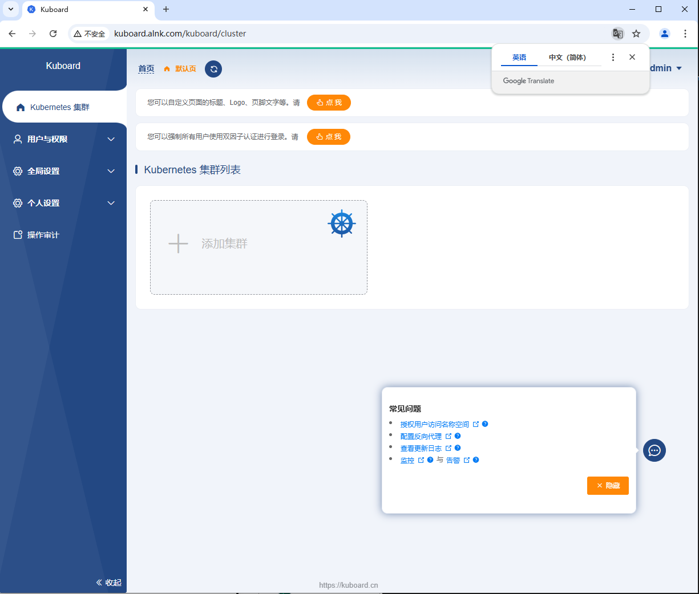

#### 部署kuboard

> 在10.0.1.21 ops运维机器上部署kuboard，本次直接采用docker部署

```shell
## 下载镜像
# docker pull swr.cn-east-2.myhuaweicloud.com/kuboard/kuboard:v3
# docker tag swr.cn-east-2.myhuaweicloud.com/kuboard/kuboard:v3 harbor.alnk.com/public/kuboard:v3
# docker push harbor.alnk.com/public/kuboard:v3

## 启动容器
# sudo docker run -d \
  --restart=unless-stopped \
  --name=kuboard \
  -p 8888:80/tcp \
  -p 10081:10081/tcp \
  -e KUBOARD_ENDPOINT="http://10.0.1.21:8888" \
  -e KUBOARD_AGENT_SERVER_TCP_PORT="10081" \
  -v /data/kuboard:/data \
  harbor.alnk.com/public/kuboard:v3

root@ops:~# docker ps |grep kuboard
```


#### 反向代理

```shell
# vi /etc/nginx/conf.d/kuboard.alnk.com.conf
http {

  # 您需要的其他配置

  map $http_upgrade $connection_upgrade {
      default upgrade;
      '' close;
  }

  server {
    listen       80; 
    server_name  kuboard.alnk.com; # 替换成你的域名

    location / {
      proxy_pass http://127.0.0.1:8888;  # 替换成你的 Kuboard IP 地址和端口
      client_max_body_size 10m;
      gzip on;
    }

    location /k8s-ws/ {
      proxy_pass  http://127.0.0.1:8888/k8s-ws/;  # 替换成你的 Kuboard IP 地址和端口
      proxy_http_version 1.1;
      proxy_pass_header Authorization;
      proxy_set_header Upgrade "websocket";
      proxy_set_header Connection "upgrade";
      proxy_set_header Host $host;
      proxy_set_header X-Real-IP $remote_addr;
      proxy_set_header X-Forwarded-For $proxy_add_x_forwarded_for;
      # proxy_set_header X-Forwarded-Proto https; # 如果您在反向代理上启用了 HTTPS
    }

    location /k8s-proxy/ {
      proxy_pass  http://127.0.0.1:8888/k8s-proxy/;  # 替换成你的 Kuboard IP 地址和端口
      proxy_http_version 1.1;
      proxy_pass_header Authorization;
      proxy_set_header Upgrade $http_upgrade;
      proxy_set_header Connection $connection_upgrade;

      proxy_set_header Host $host;
      proxy_set_header X-Real-IP $remote_addr;
      proxy_set_header X-Forwarded-For $proxy_add_x_forwarded_for;
      # proxy_set_header X-Forwarded-Proto https; # 如果您在反向代理上启用了 HTTPS
      gzip on;
    }

    error_page 404 /404.html;
        location = /40x.html {
    }

    error_page 500 502 503 504 /50x.html;
        location = /50x.html {
    }
  }
}

# nginx -t
# systemctl reload nginx
```


#### 访问kuboard

> 默认账号： admin
>
> 默认密码：Kuboard123

  


导入集群

```
# cat /root/.kube/config
apiVersion: v1
clusters:
- cluster:
    certificate-authority-data: LS0tLS1CRUdJTiBDRVJUSUZJQ0FURS0tLS0tCk1JSURsRENDQW55Z0F3SUJBZ0lVQ2dlRnA2WDNDWHE5K29MTzUrWUF2aDBmWHVRd0RRWUpLb1pJaHZjTkFRRUwKQlFBd1lURUxNQWtHQTFVRUJoTUNRMDR4RVRBUEJnTlZCQWdUQ0VoaGJtZGFhRzkxTVFzd0NRWURWUVFIRXdKWQpVekVNTUFvR0ExVUVDaE1EYXpoek1ROHdEUVlEVlFRTEV3WlRlWE4wWlcweEV6QVJCZ05WQkFNVENtdDFZbVZ5CmJtVjBaWE13SUJjTk1qUXhNRE14TVRBd09EQXdXaGdQTWpFeU5ERXdNRGN4TURBNE1EQmFNR0V4Q3pBSkJnTlYKQkFZVEFrTk9NUkV3RHdZRFZRUUlFd2hJWVc1bldtaHZkVEVMTUFrR0ExVUVCeE1DV0ZNeEREQUtCZ05WQkFvVApBMnM0Y3pFUE1BMEdBMVVFQ3hNR1UzbHpkR1Z0TVJNd0VRWURWUVFERXdwcmRXSmxjbTVsZEdWek1JSUJJakFOCkJna3Foa2lHOXcwQkFRRUZBQU9DQVE4QU1JSUJDZ0tDQVFFQXBjT2tSL3F4bzJveHRUblJPRVY0VlhpUEJoQnAKOHpLSStMeFQxTVI4bDc3YThzekE2NTg2eHJ6bUVYNmh1VHRRRXJDeVBLeGZ0a2Y5UkVSSUgrVEEzYXBpb1JPSwoySkVpM0prVC85eHMzUVpSU2l3V2l3bGhTVXFFUllFcGVuYWU0MTVjazBER1p6Rk9wK2pUd3NMS29QNklOREt1CnhQZ1BGZkhwc0wvWjVuVVBIMm5aT1UweEN4MURJejg3R2luL2hiMGQwODBrWDdlUjZ3UUhHekFCa3c1RnZ3SGcKYlBmVHVxRGgrQ0UydHpURFZha0l5NllMQkNNekVZUy9Pc0xaVlBPcjdzWGtGMTFRU2NxZkoyV0h4cnhkSEp1Wgo0ZEJFVGlNK3dpVWJXVjJUa0R1Y0FkQUlBUVNWTE91a1pPUjVweTJGdjRyTHFFbFYrNmo1bURFN2JRSURBUUFCCm8wSXdRREFPQmdOVkhROEJBZjhFQkFNQ0FRWXdEd1lEVlIwVEFRSC9CQVV3QXdFQi96QWRCZ05WSFE0RUZnUVUKRXJyZ0xWM2tJT2loUnNIejJwVDZVd2VOZWR3d0RRWUpLb1pJaHZjTkFRRUxCUUFEZ2dFQkFIS3NaNUk5SHJicAp5aUpjb2lUY0F3S292YUZsbjE1MjRVSUNXWjdFc1RjN1hVNGJ2a3I0cDkwRmpWV3N3V3VncGtMdFBUOEZjYS9RCkk4TnlOc3RNNkwyMk1hNXFVSmxDN0habHhaVnI0SmNqOVBmUzNURXRHRzBEdXpCZHYzSDI3QkFhcVc0aE4zK3YKMjZTbTNtZlRUaHltSkEyaFZRTkF2NzFEWGtjandGSS9XKzd4dUtXU2VSYS92ek9LSWt4YXdlMWZkcXBKUVFibApQeDBNSVJ3M0xXeVJvaGVhVXJwV2paZTF6SkpnT2RXVkVMUEVNbTU2Y2h0dFRsU21xbkhOY0FFb3RnRllSREF2ClhBSHllWGtpVzV6RFYyazIyaEtnUGRMTk5VbHNUMFlNOWFXMnNjL2UrTVJIOG5DcHBmWFhjZTdzNUJ6WXErUXcKT0dmVy9NQzdQYm89Ci0tLS0tRU5EIENFUlRJRklDQVRFLS0tLS0K
    server: https://10.0.1.200:8443
  name: cluster1
contexts:
- context:
    cluster: cluster1
    user: admin
  name: context-cluster1
current-context: context-cluster1
kind: Config
preferences: {}
users:
- name: admin
  user:
    client-certificate-data: LS0tLS1CRUdJTiBDRVJUSUZJQ0FURS0tLS0tCk1JSUQxekNDQXIrZ0F3SUJBZ0lVQWErM1FxMzYzZkxkSENKTlpkYmtrY1VTUEhvd0RRWUpLb1pJaHZjTkFRRUwKQlFBd1lURUxNQWtHQTFVRUJoTUNRMDR4RVRBUEJnTlZCQWdUQ0VoaGJtZGFhRzkxTVFzd0NRWURWUVFIRXdKWQpVekVNTUFvR0ExVUVDaE1EYXpoek1ROHdEUVlEVlFRTEV3WlRlWE4wWlcweEV6QVJCZ05WQkFNVENtdDFZbVZ5CmJtVjBaWE13SUJjTk1qUXhNRE14TVRBeE5EQXdXaGdQTWpBM05ERXdNVGt4TURFME1EQmFNR2N4Q3pBSkJnTlYKQkFZVEFrTk9NUkV3RHdZRFZRUUlFd2hJWVc1bldtaHZkVEVMTUFrR0ExVUVCeE1DV0ZNeEZ6QVZCZ05WQkFvVApEbk41YzNSbGJUcHRZWE4wWlhKek1ROHdEUVlEVlFRTEV3WlRlWE4wWlcweERqQU1CZ05WQkFNVEJXRmtiV2x1Ck1JSUJJakFOQmdrcWhraUc5dzBCQVFFRkFBT0NBUThBTUlJQkNnS0NBUUVBeHBVajZxT0s4L3ZQMTFrakFNRkcKUnladmdENFVuQjBVSVVRV0RsYXQvbEppcWJ2RTlvdVRIYjlNcGtvUHgxME96VC8wUlNjQUR0M0RmZ1dwYlJwaQpYZFg0M1VXTDZhV0t5NE02YmJyK3l0UDk3eVIvWEdUTFdqTTFRcXk4Rkp1N2NPckVjL2hzRmUxdDdQdzZnVzgvCldJdU1QcDhUanVPemhhK1RaQmZRTFAzM3o1SytSOEd6S1lYQ1RHY1NCdElhdHBDNXhUTUJTU2FtbGN4a2tSc3kKY1FKUjIwd1VjdDZpSkRmdGRRd200TjhhOXkzS1ZMM2pFUUR1a25mTVF6cnJaVG83OHZ4YTBTMGxPc003bzNRaApYcFBlVlQwUHFycGVpVVVabEZHdXB3bnpBZ2x0Ryt4ejhxUVBhaHNvVmF0ZHRzZjRoOTFjZDFrS3NqeUZKYnlPClZ3SURBUUFCbzM4d2ZUQU9CZ05WSFE4QkFmOEVCQU1DQmFBd0hRWURWUjBsQkJZd0ZBWUlLd1lCQlFVSEF3RUcKQ0NzR0FRVUZCd01DTUF3R0ExVWRFd0VCL3dRQ01BQXdIUVlEVlIwT0JCWUVGSWlCaFREeWJZekRvWHFsS09jRApURm1CVDBhK01COEdBMVVkSXdRWU1CYUFGQks2NEMxZDVDRG9vVWJCODlxVStsTUhqWG5jTUEwR0NTcUdTSWIzCkRRRUJDd1VBQTRJQkFRQ1dFYUJzNDhncnVBTXd1RnFPeWcvZkRMRlJzcFpOUmxUMDBHTUhXR2ZuWVVDS0NxTlQKYW1jMjdGM1Vjc1FtdGJncHA2UFJ1WTZQaFhXTVEwT0RxQW4xaDhJbXg4TkVJUlh1aGFtdm9SWDFSKyt2S3Rkegpkc0xuRzhWSHdibWRLTzFDK2NpN0FyTWhkWFlxUGNaNUNMbUpEWm5hNGJHN1U3Umd0cWxnZUo4eXNDSG4zMG5ZClRvUHVXMlhCMCtKOEJydFA4eDh4MFh2MmQ1NGp6ZUhYUFVBN1RqR1F4L3RuZnNqazIydlhFUXRZMWdVV2hEYTMKOUZyVkc3aWNxUFJPMTAxRERwYkJVbEt1SW5DR1puL2pXbkdYKzNyT1IzUzRlczgvei91ejFNWm5tMXBKMk9qeApBaUVEZ1JCSjZKb1BDc0wxMTJ4YXhWK0R2YXI4d21OUkZBYXUKLS0tLS1FTkQgQ0VSVElGSUNBVEUtLS0tLQo=
    client-key-data: LS0tLS1CRUdJTiBSU0EgUFJJVkFURSBLRVktLS0tLQpNSUlFb3dJQkFBS0NBUUVBeHBVajZxT0s4L3ZQMTFrakFNRkdSeVp2Z0Q0VW5CMFVJVVFXRGxhdC9sSmlxYnZFCjlvdVRIYjlNcGtvUHgxME96VC8wUlNjQUR0M0RmZ1dwYlJwaVhkWDQzVVdMNmFXS3k0TTZiYnIreXRQOTd5Ui8KWEdUTFdqTTFRcXk4Rkp1N2NPckVjL2hzRmUxdDdQdzZnVzgvV0l1TVBwOFRqdU96aGErVFpCZlFMUDMzejVLKwpSOEd6S1lYQ1RHY1NCdElhdHBDNXhUTUJTU2FtbGN4a2tSc3ljUUpSMjB3VWN0NmlKRGZ0ZFF3bTROOGE5eTNLClZMM2pFUUR1a25mTVF6cnJaVG83OHZ4YTBTMGxPc003bzNRaFhwUGVWVDBQcXJwZWlVVVpsRkd1cHduekFnbHQKRyt4ejhxUVBhaHNvVmF0ZHRzZjRoOTFjZDFrS3NqeUZKYnlPVndJREFRQUJBb0lCQVFDMGJGeXRtdGxzdzZVYQo2NG01N2VDRVZJK0ozTjJzMlY2b3VzdXZTMkhhWjgvc2x3VmxXM3JXMURBNEJhSkFhSFJDVjVFQUkyY1NHcnE3CmpUbGFQMWFRR3hCNU9lN2M0ZU13OUpIcGtMUmVaQzJiVVhYRjVHNCtEYmllVTRLdTFxOSs4RTU5YjRBRWpDd0wKM1Q3cXlzQ3JHbDdacG42R25LdEhFemEvQWtQS0czdUxCVjVQZi9lbjFUbDlNWHRsck1iT2lvZWhkM1hTNjF3OQplbzZCdW02c293azMyQUZneFdqNU43dzhScHN4UEJZZmVnN1F1d1pXT2JUTGE4SWh3T2JWejBPOVJ4Q0RKRjZGCmJKM2FZOGU4WDdBTFpDdHN0VTg4cXZZTXdDTXlyRFdoWEhMZXlRVFFLS1VNMG5RUTFUc3hFTC91TnFob0ZTTE8Ka2pHcHZSL0JBb0dCQU4vc1JZemZXTDBKNDJZbng5MzVMcktKb05sMVRwK0hTSGVkRzRJQndkSy9zVEgxY0JGZgpEb1A2MG9wSTVoSk4wZWtaNmt4Y01iL0s1alE3Q3Y0WXBZUmIySnlYaDBkWnF3NE5jeWIxbEp0UDkySDJMSmd5CkFZSlhyamZlWHNsdXRJK2xvWkVpa1UzaUk1eW50MVdsaFNwbW03TFd0R3ZYTUdxZktoM2dKME5yQW9HQkFPTUgKbFlUM1U5akFWdjdSMnZxVlV5VU9vU2VQajRoNXZLL0dyNm4vSU1JaVprQ1BmUzQwZmtBMzZGYk91RzZucURidwpmVkVrZnZmM0t4WTQ0VStSN1Q1OXBNbnJITERxbXpuVzFMb29FaE1rdzVMYUxlbm1LYm9IL3llaTc3Sm9MZDRGCjVOMnVESndyd05qallHb0N3b0hYK3hWZk5BNHRGYUNCZFIyRE9VZkZBb0dBRWtRUndGWVB4UXZqY3RmWDQvR0oKcjZLdWJrNjFaU29CN1UveGlIOWdNakxVMzRCbjdlTFZLa3J4bGJvd21sbWl2K01QUzc5Umg1V2poYXN6VUZydQpWWWV3ZWNXYWtXVnRJSzVVTUY5a0NlOVIvTG02RllndXUxVXZydnNDdkdlOWJ1SlI5YWJlTjM0MDdYaDQ2aEdnCmRUNzlnRzhuTkl6UE5FTmJpaWhZeTVVQ2dZQjMrVVVKZkU1QjUvclJOSU1kRXhaYUtlMzk0djY5NTE5UUlKWXEKSnRuZjNaL2RsRFpaMllHeVhCa2E3cWxHU0xFN1AwRnFSUGdYLy9VMERDRDlGS2VqODIvSENNa2pzUWNRdkxlMApISUxZdlAvaE5nMDNZdHRBSlFPd3BZazM1WmYva1d2TnZqR0p3aEZxVEZaaUQwMU1vcDljUHZCYVlYYmhXQ2hVCnpValM1UUtCZ0RBVVpaRDZjWmJSbCsrK3d4OG1FeGU0RUhPQy9KN2V6QXZXeVBra2lOaGEreEhYdzdGSzliMWcKNnJJTXZlc2hmL1ZYV2lpZno1VjMxK1BBdnR2QVR0S3BtOUlzL2V2b0FWSEt6UTJXZG5Wenl6cWZ1TE5aamxQOQoycE1aVExJUW9MQklISEZIRFNQakh5YWN0TzdlSG9mVGI4S2pMekt5UnE3SkRqZDg3TG9WCi0tLS0tRU5EIFJTQSBQUklWQVRFIEtFWS0tLS0tCg==

```


