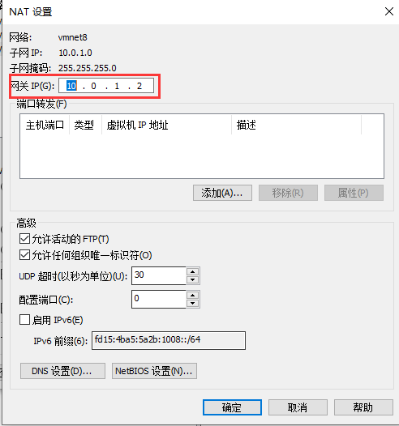
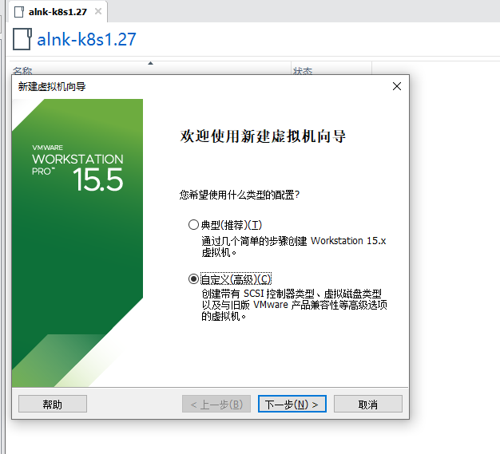
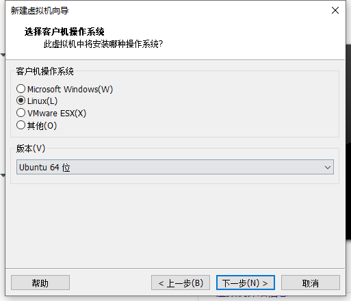
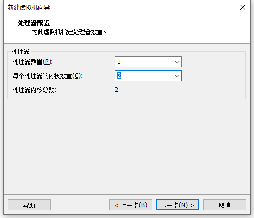
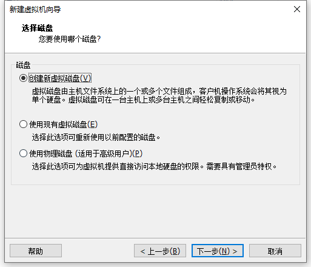
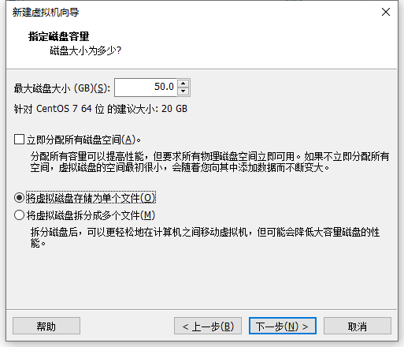

#### 虚拟机软件   
  

#### ssh工具  
    


#### 服务器安装  


​    

  

  

文件 --> 新建虚拟机    

  


  


  


  

  

  


  


  


  


   


  


  


    


  


  


#### 初始化配置

```shell
# sudo -i
# vi ubuntu-init.sh
# bash ubuntu-init.sh
Input IP address(ip_address): 10.0.1.11
Input IP address(ip_gateway): 10.0.1.2
Input IP address(dns1_ip): 114.114.114.114
Input IP address(dns2_ip): 8.8.8.8
```

ubuntu系统初始化功能脚本`ubuntu-init.sh`

```shell
#!/bin/bash
# ubuntu系统初始化功能脚本

# Control switch
iptables_yn="${1:-n}"

# Custom profile
cat > /etc/profile.d/boge.sh << EOF
HISTSIZE=10000
HISTTIMEFORMAT="%F %T \$(whoami) "

alias l='ls -AFhlt --color=auto'
alias lh='l | head'
alias ll='ls -l --color=auto'
alias ls='ls --color=auto'
alias vi=vim

GREP_OPTIONS="--color=auto"
alias grep='grep --color'
alias egrep='egrep --color'
alias fgrep='fgrep --color'
EOF

sed -i 's@^"syntax on@syntax on@' /etc/vim/vimrc

# PS1
[ -z "$(grep ^PS1 ~/.bashrc)" ] && echo "PS1='\${debian_chroot:+(\$debian_chroot)}\\[\\e[1;32m\\]\\u@\\h\\[\\033[00m\\]:\\[\\033[01;34m\\]\\w\\[\\033[00m\\]\\$ '" >> ~/.bashrc

# history
[ -z "$(grep history-timestamp ~/.bashrc)" ] && echo "PROMPT_COMMAND='{ msg=\$(history 1 | { read x y; echo \$y; });user=\$(whoami); echo \$(date \"+%Y-%m-%d %H:%M:%S\"):\$user:\`pwd\`/:\$msg ---- \$(who am i); } >> /tmp/\`hostname\`.\`whoami\`.history-timestamp'" >> ~/.bashrc

# /etc/security/limits.conf
[ -e /etc/security/limits.d/*nproc.conf ] && rename nproc.conf nproc.conf_bk /etc/security/limits.d/*nproc.conf
[ -z "$(grep 'session required pam_limits.so' /etc/pam.d/common-session)" ] && echo "session required pam_limits.so" >> /etc/pam.d/common-session
sed -i '/^# End of file/,$d' /etc/security/limits.conf
cat >> /etc/security/limits.conf <<EOF
# End of file
* soft nproc 1000000
* hard nproc 1000000
* soft nofile 1000000
* hard nofile 1000000
root soft nproc 1000000
root hard nproc 1000000
root soft nofile 1000000
root hard nofile 1000000
EOF

ulimit -SHn 1000000

# /etc/hosts
[ "$(hostname -i | awk '{print $1}')" != "127.0.0.1" ] && sed -i "s@127.0.0.1.*localhost@&\n127.0.0.1 $(hostname)@g" /etc/hosts

# Set timezone
rm -rf /etc/localtime
ln -s /usr/share/zoneinfo/Asia/Shanghai /etc/localtime


# /etc/sysctl.conf
:<<BOGE
fs.file-max = 1000000
这个参数定义了系统中最大的文件句柄数。文件句柄是用于访问文件的数据结构。增加这个值可以提高系统同时打开文件的能力。

fs.inotify.max_user_instances = 8192
inotify是Linux内核中的一个机制，用于监视文件系统事件。这个参数定义了每个用户可以创建的inotify实例的最大数量。

net.ipv4.tcp_syncookies = 1
当系统遭受SYN洪水攻击时，启用syncookies可以防止系统资源被耗尽。SYN cookies是一种机制，用于在TCP三次握手中保护服务器端资源。

net.ipv4.tcp_fin_timeout = 30
这个参数定义了TCP连接中，等待关闭的时间。当一端发送FIN信号后，等待对端关闭连接的超时时间。

net.ipv4.tcp_tw_reuse = 1
启用该参数后，可以允许将TIME-WAIT状态的TCP连接重新用于新的连接。这可以减少系统中TIME-WAIT连接的数量。

net.ipv4.ip_local_port_range = 1024 65000
这个参数定义了本地端口的范围，用于分配给发送请求的应用程序。它限制了可用于客户端连接的本地端口范围。

net.ipv4.tcp_max_syn_backlog = 16384
这个参数定义了TCP连接请求的队列长度。当系统处理不及时时，超过该队列长度的连接请求将被拒绝。

net.ipv4.tcp_max_tw_buckets = 6000
这个参数定义了系统同时保持TIME-WAIT状态的最大数量。超过这个数量的连接将被立即关闭。

net.ipv4.route.gc_timeout = 100
这个参数定义了内核路由表清理的时间间隔，单位是秒。它影响路由缓存的生命周期。

net.ipv4.tcp_syn_retries = 1
这个参数定义了在发送SYN请求后，等待对端回应的次数。超过指定次数后仍未响应，连接将被认为失败。

net.ipv4.tcp_synack_retries = 1
这个参数定义了在发送SYN+ACK回应后，等待对端发送ACK的次数。超过指定次数后仍未收到ACK，连接将被认为失败。

net.core.somaxconn = 32768
这个参数定义了监听队列的最大长度。当服务器正在处理的连接数超过此值时，新的连接请求将被拒绝。

net.core.netdev_max_backlog = 32768
这个参数定义了网络设备接收队列的最大长度。当接收队列已满时，新的数据包将被丢弃。

net.core.netdev_budget = 5000
这个参数定义了每个网络设备接收队列在每个时间间隔中可以处理的数据包数量。

net.ipv4.tcp_timestamps = 0
禁用TCP时间戳。时间戳可以用于解决网络中的数据包乱序问题，但在高负载环境下可能会增加开销。

net.ipv4.tcp_max_orphans = 32768
这个参数定义了系统中允许存在的最大孤立（没有关联的父连接）TCP连接数量。超过这个数量的孤立连接将被立即关闭。
BOGE


[ -z "$(grep 'fs.file-max' /etc/sysctl.conf)" ] && cat >> /etc/sysctl.conf << EOF
fs.file-max = 1000000
fs.inotify.max_user_instances = 8192
net.ipv4.tcp_syncookies = 1
net.ipv4.tcp_fin_timeout = 30
net.ipv4.tcp_tw_reuse = 1
net.ipv4.ip_local_port_range = 1024 65000
net.ipv4.tcp_max_syn_backlog = 16384
net.ipv4.tcp_max_tw_buckets = 6000
net.ipv4.route.gc_timeout = 100
net.ipv4.tcp_syn_retries = 1
net.ipv4.tcp_synack_retries = 1
net.core.somaxconn = 32768
net.core.netdev_max_backlog = 32768
net.core.netdev_budget = 5000
net.ipv4.tcp_timestamps = 0
net.ipv4.tcp_max_orphans = 32768
EOF
sysctl -p

# Normal display of Chinese in the text
echo 'export LANG=en_US.UTF-8'|tee -a /etc/profile && source /etc/profile

sed -i 's@^ACTIVE_CONSOLES.*@ACTIVE_CONSOLES="/dev/tty[1-2]"@' /etc/default/console-setup
sed -i 's@^@#@g' /etc/init/tty[3-6].conf
locale-gen en_US.UTF-8
echo "en_US.UTF-8 UTF-8" > /var/lib/locales/supported.d/local
cat > /etc/default/locale << EOF
LANG=en_US.UTF-8
LANGUAGE=en_US:en
EOF
sed -i 's@^@#@g' /etc/init/control-alt-delete.conf


# Update time
which ntpdate || apt-get update;apt install ntpdate
ntpdate pool.ntp.org
[ ! -e "/var/spool/cron/crontabs/root" -o -z "$(grep ntpdate /var/spool/cron/crontabs/root 2>/dev/null)" ] && { echo "*/20 * * * * $(which ntpdate) pool.ntp.org > /dev/null 2>&1" >> /var/spool/cron/crontabs/root;chmod 600 /var/spool/cron/crontabs/root; }

# iptables
if [ "${iptables_yn}" == 'y' ]; then
  apt-get -y install debconf-utils
  echo iptables-persistent iptables-persistent/autosave_v4 boolean true | sudo debconf-set-selections
  echo iptables-persistent iptables-persistent/autosave_v6 boolean true | sudo debconf-set-selections
  apt-get -y install iptables-persistent
  if [ -e "/etc/iptables/rules.v4" ] && [ -n "$(grep '^:INPUT DROP' /etc/iptables/rules.v4)" -a -n "$(grep 'NEW -m tcp --dport 22 -j ACCEPT' /etc/iptables/rules.v4)" -a -n "$(grep 'NEW -m tcp --dport 80 -j ACCEPT' /etc/iptables/rules.v4)" ]; then
    IPTABLES_STATUS=yes
  else
    IPTABLES_STATUS=no
  fi

  if [ "${IPTABLES_STATUS}" == "no" ]; then
    cat > /etc/iptables/rules.v4 << EOF
# Firewall configuration written by system-config-securitylevel
# Manual customization of this file is not recommended.
*filter
:INPUT DROP [0:0]
:FORWARD ACCEPT [0:0]
:OUTPUT ACCEPT [0:0]
:syn-flood - [0:0]
-A INPUT -i lo -j ACCEPT
-A INPUT -m state --state RELATED,ESTABLISHED -j ACCEPT
-A INPUT -p tcp -m state --state NEW -m tcp --dport 22 -j ACCEPT
-A INPUT -p tcp -m state --state NEW -m tcp --dport 80 -j ACCEPT
-A INPUT -p tcp -m state --state NEW -m tcp --dport 443 -j ACCEPT
-A INPUT -p icmp -m icmp --icmp-type 8 -j ACCEPT
COMMIT
EOF
  fi

  FW_PORT_FLAG=$(grep -ow "dport ${ssh_port}" /etc/iptables/rules.v4)
  [ -z "${FW_PORT_FLAG}" -a "${ssh_port}" != "22" ] && sed -i "s@dport 22 -j ACCEPT@&\n-A INPUT -p tcp -m state --state NEW -m tcp --dport ${ssh_port} -j ACCEPT@" /etc/iptables/rules.v4
  iptables-restore < /etc/iptables/rules.v4
  /bin/cp /etc/iptables/rules.v{4,6}
  sed -i 's@icmp@icmpv6@g' /etc/iptables/rules.v6
  ip6tables-restore < /etc/iptables/rules.v6
  ip6tables-save > /etc/iptables/rules.v6 
fi
service rsyslog restart
service ssh restart

. /etc/profile
. ~/.bashrc


# set ip and dns
validate_ip() {
    local ip_var_name=$1

    while true; do
        read -p "Input IP address($ip_var_name): " $ip_var_name

        # 检测是否为空
        if [ -z "${!ip_var_name}" ]; then
            echo "Input is empty. Please try again."
            continue
        fi

        # 检测是否符合IP地址的格式
        if ! [[ ${!ip_var_name} =~ ^([0-9]{1,3}\.){3}[0-9]{1,3}$ ]]; then
            echo "Invalid IP address format. Please try again."
            continue
        fi

        # 输入符合要求，跳出循环
        break
    done
}

# 调用函数并传递变量名作为参数
validate_ip "ip_address"
echo "IP address: $ip_address"

validate_ip "ip_gateway"
echo "IP gateway: $ip_gateway"

validate_ip "dns1_ip"
echo "Dns1 ip: $dns1_ip"

validate_ip "dns2_ip"
echo "Dns2 ip: $dns2_ip"


cat > /etc/netplan/00-installer-config.yaml << EOF
network:
  version: 2
  renderer: networkd
  ethernets:
    ens32:
      dhcp4: false
      dhcp6: false
      addresses:
        - ${ip_address}/24
      routes:
        - to: default
          via: ${ip_gateway}
      nameservers:
          addresses: [${dns1_ip}, ${dns2_ip}]
EOF

netplan apply


apt install resolvconf -y

cat > /etc/resolvconf/resolv.conf.d/head << EOF
nameserver ${dns1_ip}
nameserver ${dns2_ip}
EOF

systemctl restart resolvconf


# Change apt-get source list
#  https://opsx.alibaba.com/mirror
ubuntuCodename=$(lsb_release -a 2>/dev/null|awk 'END{print $NF}')
\cp /etc/apt/sources.list{,_bak}
#sed -ri "s+archive.ubuntu.com+mirrors.aliyun.com+g" /etc/apt/sources.list

# https://developer.aliyun.com/mirror/ubuntu?spm=a2c6h.13651102.0.0.3e221b11ev6YG5
#  ubuntu 22.04: jammy
#  ubuntu 20.04: focal
#  ubuntu 18.04: bionic
#  ubuntu 16.04: xenial

echo "
deb https://mirrors.aliyun.com/ubuntu/ ${ubuntuCodename} main restricted universe multiverse
deb-src https://mirrors.aliyun.com/ubuntu/ ${ubuntuCodename} main restricted universe multiverse

deb https://mirrors.aliyun.com/ubuntu/ ${ubuntuCodename}-security main restricted universe multiverse
deb-src https://mirrors.aliyun.com/ubuntu/ ${ubuntuCodename}-security main restricted universe multiverse

deb https://mirrors.aliyun.com/ubuntu/ ${ubuntuCodename}-updates main restricted universe multiverse
deb-src https://mirrors.aliyun.com/ubuntu/ ${ubuntuCodename}-updates main restricted universe multiverse

deb https://mirrors.aliyun.com/ubuntu/ ${ubuntuCodename}-backports main restricted universe multiverse
deb-src https://mirrors.aliyun.com/ubuntu/ ${ubuntuCodename}-backports main restricted universe multiverse

" > /etc/apt/sources.list

apt-get update

# install ssh and configure
apt-get install openssh-server -y
echo 'PermitRootLogin yes' >> /etc/ssh/sshd_config
echo 'root:root123'|chpasswd
systemctl restart sshd && systemctl status ssh -l --no-pager


# Install package
pkgList="curl wget unzip gcc swig automake make perl cpio git libmbedtls-dev libudns-dev libev-dev vim python-pip python3-pip lrzsz iftop nethogs nload htop ifstat iotop iostat" &&\
for Package in ${pkgList}; do apt-get -y install $Package;done
apt-get clean all
```


