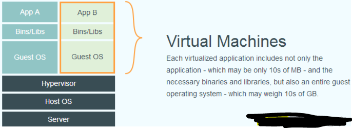
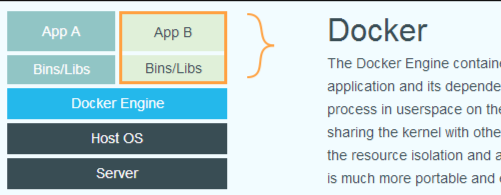
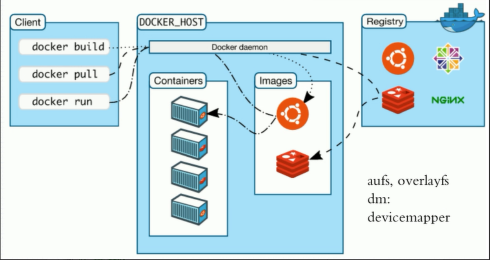
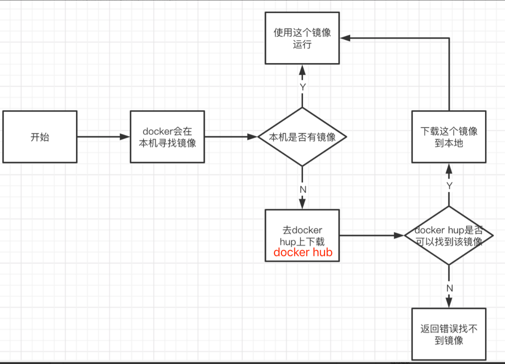
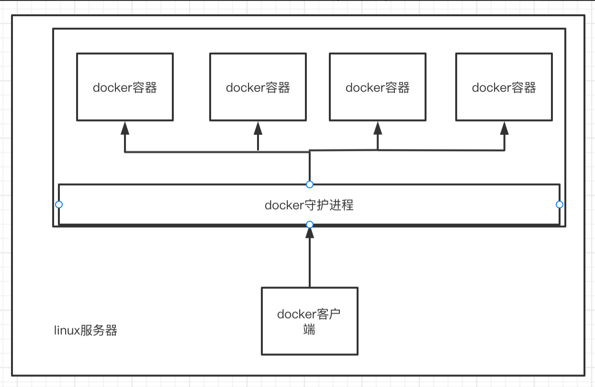

#### docker介绍

##### 基本介绍

> ```text
> Docker是一个开源的应用容器引擎，基于Go语言 并遵从Apache2.0协议开源
> Docker可以让开发者打包他们的应用以及依赖包到一个轻量级、可移植的容器中，然后发布到任何流行的Linux机器上，也可以实现虚拟化
> Docker容器是完全使用沙箱机制，相互之间不会有任何接口（类似iPhone的app）,更重要的是容器性能开销极低
> Docker从17.03版本之后分为CE（Community Edition: 社区版）和 EE（Enterprise Edition: 企业版）
> 官方文档地址: https://docs.docker.com/
> ```


##### 容器的前世今生

> ```text
> 前世
> FreeBASE jail   ------> Linux vserver
> chroot          ------> 完整的根文件系统(FHS)标准的
> namespaces      ------> UTS Mount IPC PID user network
> cgroup	        ------> 资源的分配和监控
> 
> 通过比较复杂的代码开发的过程,调用以上三项技术
> 实现容器的创建   ---->  管理  ---->  销毁
> 
> 今生
> 实现隔离能力!
> LXC  (LinuXContainer)  
> 
> 对于原有的常用功能进行了封装,方便我们做容器的生命周期
> -----> Docker (dotcloud)
> ```


##### 应用场景

> ```text
> web应用的自动化打包和发布
> 
> 自动化测试和持续集成发布
> 
> 在服务型环境中部署和调整数据库或其他的后台应用
> 
> 从头编译或者扩展现有的OpenShif或 Cloud Foundry 平台来搭建自己的PaaS环境
> ```


##### 传统虚拟化技术和容器对比

> ```text
> 传统虚拟机技术是虚拟出一套硬件后，在其上运行一个完整操作系统，在该系统上再运行所需应用进程
> 虚拟化技术特点
>   1 资源占用多
>   2 冗余步骤多
>   3 启动很慢
>   
> 容器内的应用进程直接运行于宿主的内核，容器内没有自己的内核，而且也没有进行硬件虚拟
> 因此容器要比传统虚拟机更为轻便，容器化技术不是模拟的一个完整的操作系统
> 容器化特点
>   1 应用更快速的交付和部署
>       传统：一堆帮助文档，安装程序
>       docker：打包镜像发布测试，一键运行
>   2 更便捷的升级和扩缩容
>       使用docker之后，部署应用就像搭建积木一样简单
>       项目打包成为一个镜像，也更利于水平扩展
>   3 更简单的系统运维
>       在容器化以后，开发和测试环境是高度一致的
>   4 更高效的计算资源利用
>       docker是内核级别的虚拟化，可以在一个物理机上运行很多容器实例，服务器的性能可以使用到极致
> 
> 比较docker和虚拟机的不同
>   1 传统虚拟机，虚拟出硬件，运行一个完整的操作系统，然后在这个系统上安装和运行软件
>   2 docker容器内的应用直接运行在宿主机内，容器是没有自己的内核的，也没有虚拟硬件
>   3 每个容器都是相互隔离的，每个容器都有属于自己的文件系统，互不影响
> 
> ## 
> 1 docker有着比虚拟机更少的抽象层
> 2 docker利用的是宿主机的内核，虚拟机则需要guest os
> 所以说，新建一个容器的时候，docker不需要像虚拟机一样重新加载一个操作系统的内核，避免引导操作
> 虚拟机是需要加载操作系统的，分钟级别。而docker是宿主机的操作系统，秒级
> ```
>
> | 特性       | 容器               | 虚拟机      |
> | ---------- | ------------------ | ----------- |
> | 启动       | 秒级               | 分钟级      |
> | 硬盘使用   | 一般为 `MB`        | 一般为 `GB` |
> | 性能       | 接近原生           | 弱于        |
> | 系统支持量 | 单机支持上千个容器 | 一般几十个  |
>
>   
>
>  

 

#####  docker的基本组成结构

>   
>
> ```text
> 镜像（image）
> docker镜像就好比是一个模板，可以通过这个模板来创建容器服务，tomcat镜像-->run-->tomcat01容器（提供容器服务）
> 通过这个镜像可以创建多个容器，最终的服务或者项目就是运行在容器中的
> 
> 容器（container）
> docker利用容器技术，独立运行一个或者一组应用，通过这个镜像来创建的
> 启动--停止--删除，基本命令
> 
> 仓库（repository）
> 仓库就是存放镜像的地
> 仓库分为公有仓库和私有仓库
> docker hub 默认国外的网站比较慢
> 
> Dockerfile
> Dockerfile是一个简易的文本文件，其中包含了一个命令集合，Docker可以利用这个命令集合自动构建出一个新的Docker image
> ```
>
> ```text
> ### 登陆docker镜像仓库
> #docker login "仓库地址" -u "仓库用户名" -p "仓库密码"
> 
> ### 从仓库下载镜像
> docker pull "仓库地址"/"仓库命名空间"/"镜像名称":"版本号"
> 
> ### 基于Dockerfile构建本地镜像
> ## 简单命令
> # docker build -t "仓库地址"/"仓库命名空间"/"镜像名称":"镜像版本号" .
> 
> ## 复杂命令
> # docker build --network host --build-arg PYPI_IP="xx.xx.xx.xx" --cache-from "仓库地址"/"仓库命名空间"/"镜像名称":latest --tag "仓库地址"/"仓库命名空间"/"镜像名称":"镜像版本号" --tag "仓库地址"/"仓库命名空间"/"镜像名称":"版本号" .
> 
> ### 将构建好的本地镜像推到远端镜像仓库里面
> #docker push "仓库地址"/"仓库命名空间"/"镜像名称":"镜像版本号"
> 
> ## 减少镜像大小方法，加速镜像构建
> # 选择轻量级的基础镜像
> # 编译型语言（go、java），打包镜像和运行镜像分开，分层构建
> # 利用缓存，注意Dockerfile中run指令尽量在一层，以便于后面构建可以直接使用缓存
> ```


##### docker容器运行流程

>  


##### docker是怎么工作的

> ```text
> docker是一个client-server(c/s)结构的系统，docker的守护进程运行在宿主机上
> docker客户端通过socker访问docker服务端
> 服务端接收到客户端的指令，就会去执行相应的操作
> ```
>
>    


#### docker安装(ubuntu 2204)

> ```shell
> ## 更换国内源
> # cat /etc/os-release
> PRETTY_NAME="Ubuntu 22.04.4 LTS"
> 
> # cp /etc/apt/sources.list /etc/apt/sources.list.backup
> # cat /etc/apt/sources.list
> deb https://mirrors.ustc.edu.cn/ubuntu/ jammy main restricted universe multiverse
> deb https://mirrors.ustc.edu.cn/ubuntu/ jammy-updates main restricted universe multiverse
> deb https://mirrors.ustc.edu.cn/ubuntu/ jammy-backports main restricted universe multiverse
> deb https://mirrors.ustc.edu.cn/ubuntu/ jammy-security main restricted universe multiverse
> deb https://mirrors.ustc.edu.cn/ubuntu/ jammy-proposed main restricted universe multiverse
> deb-src https://mirrors.ustc.edu.cn/ubuntu/ jammy main restricted universe multiverse
> deb-src https://mirrors.ustc.edu.cn/ubuntu/ jammy-updates main restricted universe multiverse
> deb-src https://mirrors.ustc.edu.cn/ubuntu/ jammy-backports main restricted universe multiverse
> deb-src https://mirrors.ustc.edu.cn/ubuntu/ jammy-security main restricted universe multiverse
> deb-src https://mirrors.ustc.edu.cn/ubuntu/ jammy-proposed main restricted universe multiverse
> 
> ## 更新软件包列表
> # apt update
> 
> ## 安装docker
> # apt install docker.io
> 
> ## 配置阿里云镜像加速 && 配置harbor仓库http登录
> # cat /etc/docker/daemon.json
> {
>   "registry-mirrors": ["https://npl9kd2m.mirror.aliyuncs.com"],
>   "data-root": "/var/lib/docker",
>   "exec-opts": ["native.cgroupdriver=systemd"],
>   "insecure-registries": ["127.0.0.1/8","harbor.alnk.com"],
>   "max-concurrent-downloads": 10,
>   "live-restore": true,
>   "bip": "172.1.20.1/25",
>   "log-driver": "json-file",
>   "log-level": "warn",
>   "log-opts": {
>     "max-size": "50m",
>     "max-file": "1"
>     },
>   "storage-driver": "overlay2"
> }
> ### 配置文件解析
> ## registry-mirrors：国内加速源
> ## data-root：docker的工作目录，docker会在下面生成一大堆文件
> ## insecure-registries：私有仓库,http登录
> ## bip：docker容器地址（修改为便于记忆的IP，方便出问题了快速定位在哪个宿主机）
> ## live-restrore：容器引擎死掉的事情，起来的docker是否继续活着
> ## storage-driver： 存储驱动
> 
> ## 启动docker
> # systemctl restart docker
> # systemctl status docker
> # systemctl enable docker
> ```


#### docker镜像国内不能访问解决办法

> ```text
> ## 1. 可以在华为云购买香港服务器进行下载，按量按需按时间付费不贵
> 
> ## 2. 利用github上的开源工具把镜像存入阿里云仓库，然后从阿里云仓库下载
> ## github开源工具https://github.com/tech-shrimp/docker_image_pusher
> 
> ###阿里云docker镜像仓库资料
> ##空间名称：alnktest
> ##账号：1029612787@qq.com
> ##链接：registry.cn-hangzhou.aliyuncs.com
> ##密码：*******
> 
> ##登录阿里云docker镜像仓库命令
> # sudo docker login --username=1029612787@qq.com registry.cn-hangzhou.aliyuncs.com
> 
> ##下载阿里云docker镜像
> # docker pull registry.cn-hangzhou.aliyuncs.com/alnktest/alpine:3.19.1
> ```

