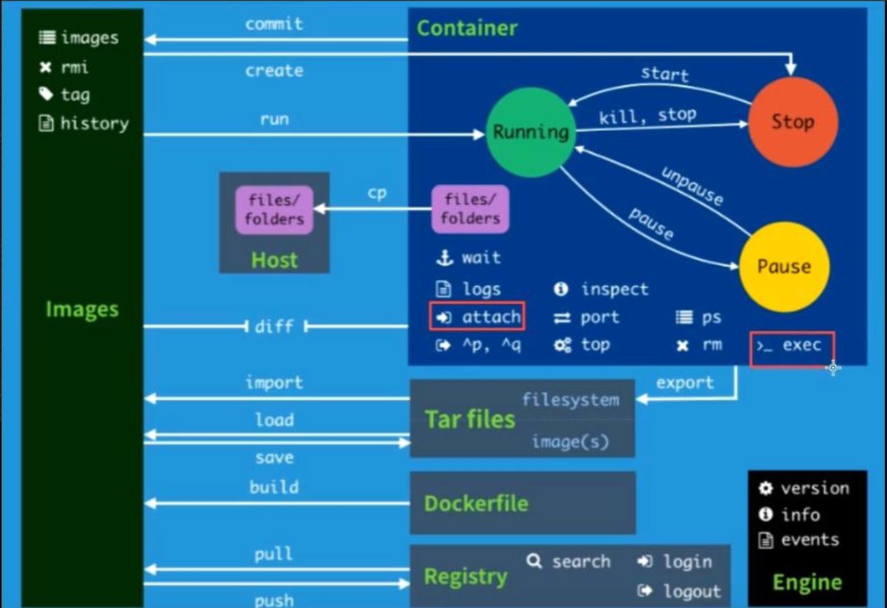

#### 帮助命令

> ```text
> docker version         # 显示docker版本信息
> docker info            # 显示docker系统详细信息，包括镜像和容器的数量
> docker command --help  # 万能命令
> 
> 帮助文档的地址：https://docs.docker.com/engine/reference/commandline/docker/
> 
> ```


#### 镜像命令

##### docker images 查看所有镜像

> ```text
> # docker images
> REPOSITORY    TAG       IMAGE ID       CREATED        SIZE
> hello-world   latest    d1165f221234   5 months ago   13.3kB
> 
> # 说明
> REPOSITORY: 镜像的仓库源名称
> TAG:        镜像的标签
> IMAGE ID:   镜像的ID
> CREATED:    镜像的创建时间
> SIZE:       镜像的大小
> 
> # 可选参数
> -a/--all    列出所有镜像
> -q/--quiet  只显示镜像的ID
> ```


##### docker search 搜索镜像

> ```text
> # docker search mysql
> NAME                              DESCRIPTION                                     STARS     OFFICIAL   AUTOMATED
> mysql                             MySQL is a widely used, open-source relation…   11296     [OK]       
> mariadb                           MariaDB Server is a high performing open sou…   4291      [OK]       
> ...
> 
> # 可选参数
> # docker search --help
> Usage:  docker search [OPTIONS] TERM
> Search the Docker Hub for images
> Options:
>   -f, --filter filter   Filter output based on conditions provided
>       --format string   Pretty-print search using a Go template
>       --limit int       Max number of search results (default 25)
>       --no-trunc        Don't truncate output
> 
> # 搜索STARS数超过3000的镜像
> # docker search mysql --filter=STARS=3000
> NAME      DESCRIPTION                                     STARS     OFFICIAL   AUTOMATED
> mysql     MySQL is a widely used, open-source relation…   11296     [OK]       
> mariadb   MariaDB Server is a high performing open sou…   4291      [OK]     
> ```


##### docker pull 下载镜像

> ```text
> # docker pull mysql
> Using default tag: latest                # 如果不写tag，默认就是latest
> latest: Pulling from library/mysql
> e1acddbe380c: Pull complete              # 分层下载，docker image的核心（联合文件系统）
> bed879327370: Pull complete 
> 03285f80bafd: Pull complete 
> ccc17412a00a: Pull complete 
> 1f556ecc09d1: Pull complete 
> ......
> Digest: sha256:d45561a65aba6edac77be36e0a53f0c1fba67b951cb728348522b671ad63f926  # 签名
> Status: Downloaded newer image for mysql:latest
> # 下载镜像的真实地址 docker pull mysql 等价于 docker pull docker.io/library/mysql:latest
>  
> # 指定下载版本
> # 需要确定所指定的版本在docker hub上是否存在
> # docker pull mysql:5.7
> 5.7: Pulling from library/mysql
> e1acddbe380c: Already exists   # 分层，上面下载mysql的时候，已经下载过该层了，所以这里不需要下载了
> bed879327370: Already exists 
> 03285f80bafd: Already exists 
> ccc17412a00a: Already exists 
> 1f556ecc09d1: Already exists 
> adc5528e468d: Already exists 
> 1afc286d5d53: Already exists 
> 4d2d9261e3ad: Pull complete 
> ac609d7b31f8: Pull complete 
> 53ee1339bc3a: Pull complete 
> b0c0a831a707: Pull complete 
> Digest: sha256:7cf2e7d7ff876f93c8601406a5aa17484e6623875e64e7acc71432ad8e0a3d7e
> Status: Downloaded newer image for mysql:5.7
> docker.io/library/mysql:5.7
> 
> # docker images
> REPOSITORY    TAG       IMAGE ID       CREATED        SIZE
> mysql         5.7       6c20ffa54f86   2 days ago     448MB
> mysql         latest    5a4e492065c7   2 days ago     514MB
> hello-world   latest    d1165f221234   5 months ago   13.3kB
> ```


##### docker rmi 删除镜像

> ```text
> # 1 删除指定的镜像ID
> # [docker image rm -f 镜像ID] 等价于 [docker rmi -f 镜像ID]
> # docker image rm -f 6c20ffa54f86
> # docker images
> REPOSITORY    TAG       IMAGE ID       CREATED        SIZE
> mysql         latest    5a4e492065c7   2 days ago     514MB
> hello-world   latest    d1165f221234   5 months ago   13.3kB
> 
> # docker rmi -f 5a4e492065c7
> # docker images
> REPOSITORY    TAG       IMAGE ID       CREATED        SIZE
> hello-world   latest    d1165f221234   5 months ago   13.3kB
> 
> # 2 删除多个镜像ID
> # docker rmi -f 镜像ID 镜像ID 镜像ID
> 
> # 3 删除全部的镜像ID
> # docker rmi -f $(docker images -aq)
> ```


#### 容器命令

##### docker run 新建容器并启动

> ```text
> # docker run [可选参数] image ID
> 
> # 参数说明
> --name="Name"  # 容器的名字 tomcat01 tomcat02，用来区分容器
> -d             # 后台方式运行
> -it            # 使用交互方式运行，进入容器内部
> -p             # 指定容器的端口 -p 8080:8080
>     -p ip:主机端口:容器端口
>     -p 主机端口:容器端口（这个比较常用）
>     -p 容器端口
> -P(大P)         # 随机指定端口
> 
> # 测试启动并进入容器
> # docker run -it centos /bin/bash
> # ls     # 查看容器内的centos目录
> bin  dev  etc  home  lib  lib64  lost+found  media  mnt  opt  proc  root  run  sbin  srv  sys  tmp  usr  var
> 
> # 从容器中退回宿主机
> # exit   # 容器也停止启动了
> exit
> ```


##### docker ps 列出所有运行的容器

> ```text
> # 只列出当前正在运行的容器
> # docker ps   
> CONTAINER ID   IMAGE     COMMAND   CREATED   STATUS    PORTS     NAMES
> 
> 
> # 只要运行过的容器都会列出
> # docker ps -a  
> CONTAINER ID   IMAGE          COMMAND                  CREATED              STATUS                      PORTS     NAMES
> b18875371eb6   centos         "/bin/bash"              About a minute ago   Exited (0) 37 seconds ago             awesome_sutherland
> e4db40e5b185   hello-world    "/hello"                 3 hours ago          Exited (0) 3 hours ago                sleepy_pascal
> 44691d4d482a   hello-world    "/hello"                 3 hours ago          Exited (0) 3 hours ago                quizzical_pike
> d2ccea721005   c39a868aad02   "/docker-entrypoint.…"   9 months ago         Exited (0) 9 months ago               eager_hawking
> 0955422d3a0f   c39a868aad02   "/docker-entrypoint.…"   9 months ago         Exited (0) 9 months ago               exciting_wilson
> 0e6a2a251e67   c39a868aad02   "/docker-entrypoint.…"   9 months ago         Exited (0) 9 months ago               gracious_ritchie
> bfe19a44963b   c39a868aad02   "/docker-entrypoint.…"   9 months ago         Exited (0) 9 months ago               mystifying_shockley
> e57d00bc206a   c39a868aad02   "/docker-entrypoint.…"   9 months ago         Exited (0) 9 months ago              nervous_rubin
> ```


##### 退出容器

> ```
> # 1 exit退出容器，如果该容器没有其他进程则该容器会停止
> # docker ps
> CONTAINER ID   IMAGE     COMMAND   CREATED   STATUS    PORTS     NAMES
> 
> # docker run -it centos /bin/bash
> # exit
> exit
> # docker ps
> CONTAINER ID   IMAGE     COMMAND   CREATED   STATUS    PORTS     NAMES
> 
> 
> # 2 ctrl+p+q 容器不停止退出
> # docker run -it centos /bin/bash
> # ls
> bin  dev  etc  home  lib  lib64  lost+found  media  mnt  opt  proc  root  run  sbin  srv  sys  tmp  usr  var
> 
> [root@a3527e17bf8d /]# # ls
> deploy_targz.py  id_rsa  ip.txt  test
> 
> # docker ps
> CONTAINER ID   IMAGE     COMMAND       CREATED              STATUS              PORTS     NAMES
> a3527e17bf8d   centos    "/bin/bash"   About a minute ago   Up About a minute             angry_hofstadter 
> ```


##### docker rm 删除容器

> ```
> # 删除指定的容器
> # -f 强制删除，如果不加该参数，那么正在运行的容器不能删除
> # docker container ps 
> # docker ps
> # docker ps -a 
> # docker rm a3527e17bf8d
> Error response from daemon: You cannot remove a running container 
> # docker rm -f a3527e17bf8d
> # docker ps
> 
> # 删除所有的容器
> # docker ps -a
> # docker ps -aq  # 查看所有运行过的容器ID
> # docker rm -f $(docker ps -aq)
> # docker ps -a
> ```


##### docker start/stop/kill 启动和停止容器

> ```text
> # 1 停止当前正在运行的容器  [docker stop 容器ID/容器名称]
> # docker stop 5710624009cd
> # docker ps -a
> STATUS 的状态是Exited，退出
> 
> # 2 启动容器 [docker start 容器ID/容器名称] 
> # docker start 5710624009cd
> 
> # 3 重启容器 [docker restart 容器ID/容器名称]
> # docker restart 5710624009cd
> # docker ps -a
> # 注意看STATUS运行时间
> 
> # 4 强制停止当前运行的容器 [docker kill 容器ID/容器名称]
> # docker kill 5710624009cd
> ```


#### 其他命令

##### 后台启动容器

> ```
> # docker run -d 镜像ID
> 
> # docker ps
> CONTAINER ID   IMAGE     COMMAND   CREATED   STATUS    PORTS     NAMES
> 
> # docker run -d centos
> # docker ps
> # 发现centos的容器已经停止了
> # docker容器使用后台运行，就必须要有一个前台进程，不然docker发现没有应用，就会自动停止
> # centos容器启动以后，发现自己没有提供服务，就会立刻停止掉
> 
> # 编写一段shell脚本模拟一个前台进程
> # docker run -d centos /bin/sh -c "while true; do echo Alnk; sleep 5; done"
> # docker ps
> ```


##### 查看容器日志

> ```
> # docker logs -f -t --tail 容器ID
> # 如果容器中没有日志，那么就不会打印
> 
> # docker run -d centos /bin/sh -c "while true; do echo Alnk; sleep 5; done"
> # #docker logs -tf --tail -f 53a4982258bb 
> # docker logs -tf --tail 10 53a4982258bb
> 
> # docker ps 
> ```


##### 查看容器中进程信息

> ```
> # docker top 容器ID
> # docker ps
> # docker top 53a4982258bb
> ```


##### 查看镜像或容器的元数据

> ```
> # docker inspect 容器ID/镜像ID
> 
> # 镜像
> # docker images
> # docker inspect 300e315adb2f
> 
> # 容器
> # docker ps
> # docker inspect 53a4982258bb
> ```


##### 进入当前正在运行的容器

> ```
> # 通常启动容器都是以后台方式运行的，需要进入容器，修改配置
> 
> # 1 docker exec -it 容器ID/容器名称 /bin/bash
> # docker exec -it 322bff6c0db2 /bin/bash
> root@322bff6c0db2:/# whereis nginx
> nginx: /usr/sbin/nginx /usr/lib/nginx /etc/nginx /usr/share/nginx
> root@322bff6c0db2:/# exit   # 这里这样退出容器不会停止，因为还有nginx的进程存在
> # docker ps 
> 
> # 2 docker attach  容器ID/容器名称（不建议使用）
> # docker ps 
> # docker attach 322bff6c0db2
> ### 正在执行的当前的进程，如果退出则该进程也退出了，容器会停止
> ^P^H^C2021/08/20 07:38:52 [notice] 1#1: signal 2 (SIGINT) received, exiting
> 2021/08/20 07:38:52 [notice] 31#31: exiting
> 2021/08/20 07:38:52 [notice] 31#31: exit
> 2021/08/20 07:38:52 [notice] 1#1: signal 17 (SIGCHLD) received from 31
> 2021/08/20 07:38:52 [notice] 1#1: worker process 31 exited with code 0
> 2021/08/20 07:38:52 [notice] 1#1: exit
> ```


##### 拷贝容器的文件到宿主机

> ```
> # docker cp 容器ID:容器内路径 目的主机路径
> 
> # docker run -d nginx
> # docker exec -it 0ee284bfe727  /bin/bash
> root@0ee284bfe727:/home# touch alnk.txt
> 
> # docker cp 0ee284bfe727:/home/alnk.txt .
> alnk.txt  deploy_targz.py  id_rsa  ip.txt  test
> ```


##### docker常用命令小结

>   


#### docker安装es

> ```
> # ES 暴露的端口很多
> # ES 很消耗内存
> # ES 数据一般需要放置到安全目录挂载
> # --net somenetwork 网络配置
> # -e 配置参数
> 
> # 启动
> # docker run -d --name elasticsearch  -p 9200:9200 -p 9300:9300 -e "discovery.type=single-node" elasticsearch:6.8.18
> 
> # 查看容器所占宿主机资源信息
> # docker stats
> CONTAINER ID   NAME            CPU %     MEM USAGE / LIMIT     MEM %     NET I/O      BLOCK I/O       PIDS
> 9a29b81431ac   elasticsearch   0.30%     1.204GiB / 1.795GiB   67.07%    1.1kB / 0B   208MB / 451kB   43
> # 这里可以看到ES 占用了差不多1.2G的内存
> 
> # 测试
> # curl localhost:9200
> {
>   "name" : "EQRxQXZ",
>   "cluster_name" : "docker-cluster",
>   "cluster_uuid" : "eXQ9ip8yTJ2TeWVjTYsExw",
>   "version" : {
>     "number" : "6.8.18",
>     "build_flavor" : "default",
>     "build_type" : "docker",
>     "build_hash" : "aca2329",
>     "build_date" : "2021-07-28T16:06:05.232873Z",
>     "build_snapshot" : false,
>     "lucene_version" : "7.7.3",
>     "minimum_wire_compatibility_version" : "5.6.0",
>     "minimum_index_compatibility_version" : "5.0.0"
>   },
>   "tagline" : "You Know, for Search"
> }
> 
> 
> # 增加内存限制
> # docker run -d --name elasticsearch02 -p 9200:9200 -p 9300:9300 -e "discovery.type=single-node" -e ES_JAVA_OPTS="-Xms64m -Xmx512m" elasticsearch:6.8.18
> 
> # docker stats
> CONTAINER ID   NAME              CPU %     MEM USAGE / LIMIT     MEM %     NET I/O     BLOCK I/O       PIDS
> 0951372fe3fd   elasticsearch02   0.48%     354.9MiB / 1.795GiB   19.31%    656B / 0B   104MB / 451kB   43
> ```