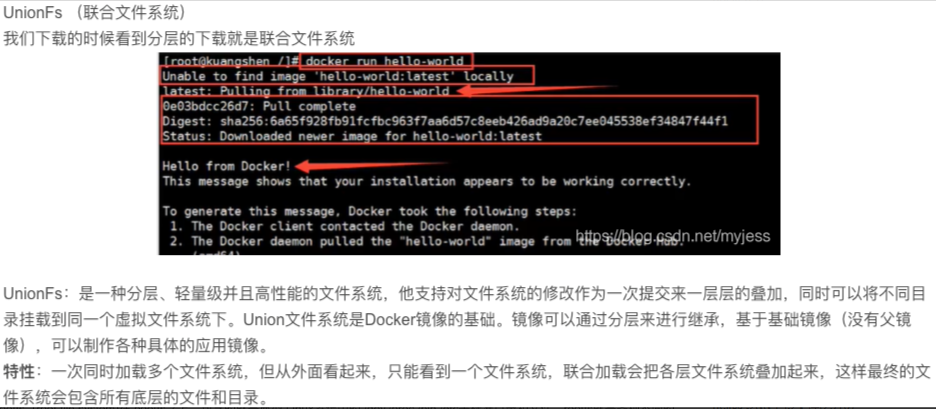
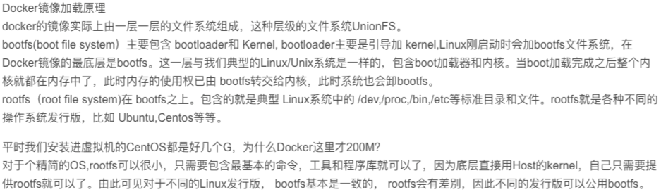
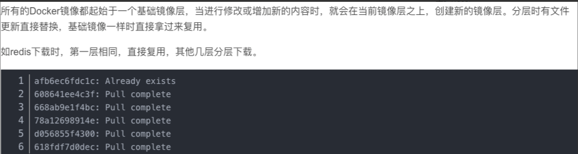
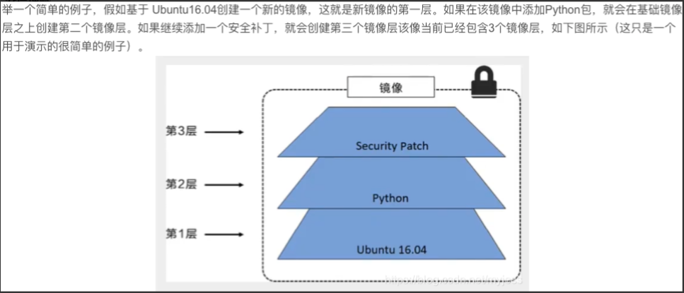
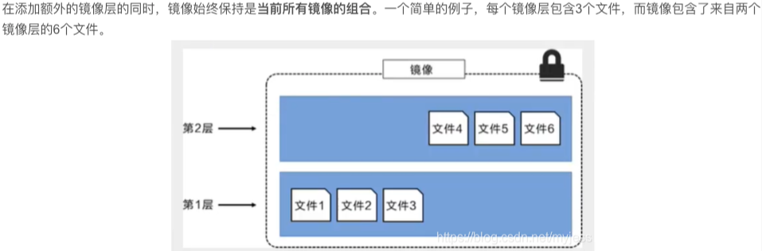
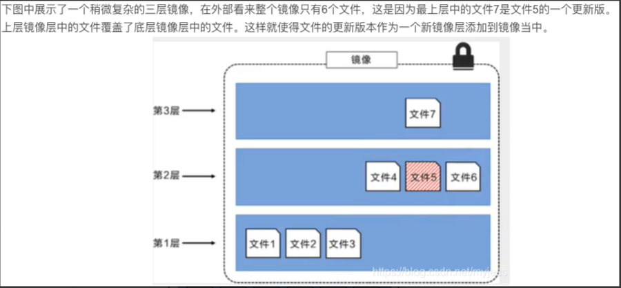
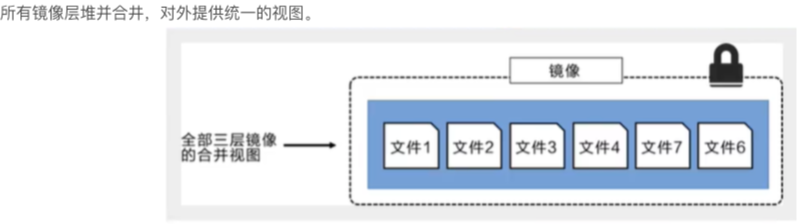
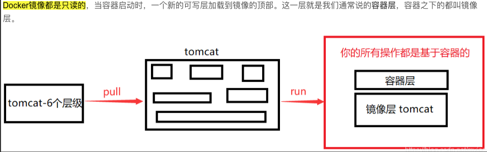

#### docker镜像详解

##### 镜像是什么

> ```
> 镜像是一种轻量级、可执行的独立软件包，用来打包软件运行环境和基于运行环境开发的软件，它包含了某个软件所需的所有内容，包括代码、依赖库和配置文件等等
> 
> 所有的应用，直接打包成docker镜像，就可以跑起来
> ```


##### 如何得到镜像

> ```
> 1 从远程dockerhub仓库下载
> 2 拷贝别人的镜像
> 3 自己制作一个镜像 DockerFile
> ```


##### docker镜像加载原理

>  
>
>  


##### 分层理解

>   
>
>   
>
>   
>
>   
>
>   
>
>   


##### commit提交镜像

> ```
> # [docker commit 容器ID] 提交容器成为一个新的镜像
> # 命令和git原理类似
> # docker commit -m="描述信息" -a="作者" 容器ID 目标镜像名:[tag]
> 
> # 提交一个镜像
> # 1 启动一个默认的tomcat
> # docker run -d -p 3355:8080 --name tomcat01 tomcat
> 
> 
> # 2 发现默认的tomcat容器中，webapps目录没有应用
> # docker exec -it tomcat01 /bin/bash
> root@0d26448b910f:/usr/local/tomcat# ls webapps
> 
> # 3 拷贝基本的应用进去
> root@0d26448b910f:/usr/local/tomcat# cp -a webapps.dist/* webapps
> 
> # 4 commit提交为一个镜像
> # docker commit -a="Alnk" -m="add some file to webapps" 0d26448b910f tomecat02:1.0
> 
> # docker images
> REPOSITORY               TAG       IMAGE ID       CREATED         SIZE
> tomecat02                1.0       d638be1bcd4f   5 seconds ago   673MB
> tomcat                   9.0       266d1269bb29   37 hours ago    668MB
> ```

