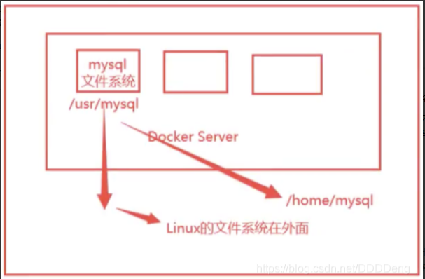
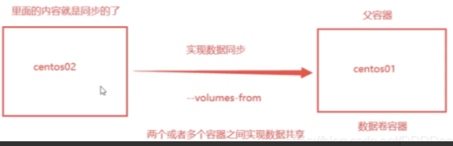

#### 容器的数据卷

##### 什么是容器的数据卷

> ```
> docker的理念回顾
> 将应用和环境打包成一个镜像
> 对于数据，如果数据都在容器中，那么我们删除容器，数据就会丢失，这样会存在很大的问题
> 
> 需求：容器内的数据需要持久化
> 例如MySQL如果数据都存在容器中，那么容器删了，数据就丢失了，所以需要MySQL的数据可以存储在本地
> 
> 容器和宿主机之间有一种数据共享的技术，docker容器中产生的数据，可以同步到本地宿主机存储
> 这就是卷技术
> 将我们容器内的目录，挂载到宿主机Linux上
> 
> 总结: 容器可以持久化数据和同步数据操作，容器之间的数据也是可以共享的
> ```
>
>   


#### 容器的数据卷三种挂载方式

##### 指定路径挂载

> ```
> # 指定路径挂载
> # 命令
> # docker run -it -v /主机目录:容器目录
> 
> # 测试
> # 删除所有容器（生产环境慎用）
> # docker rm -f $(docker ps -aq)
> # 删除所有镜像（生产环境慎用）
> # docker rmi -f `docker images -qa`
> # 启动一个容器并且挂载一个目录
> # docker run -it -v /home/ceshi:/home centos /bin/bash
> 
> # 查看
> # docker ps
> # docker inspect 48acac4be5e7
>         "Mounts": [
>             {
>                 "Type": "bind",
>                 "Source": "/home/ceshi",    # 宿主机内目录
>                 "Destination": "/home",     # docker容器内的地址
>                 "Mode": "",
>                 "RW": true,
>                 "Propagation": "rprivate"
>             }
>         ],
> 
> 
> ## 测试文件同步
> # 1 在容器内创建/home/docker.txt，在宿主机/home/ceshi目录可以查看到docker.txt文件
> # 容器内
> [root@48acac4be5e7 home]# touch docker.txt
> # 宿主机内
> # pwd
> /home/ceshi
> # ls
> docker.txt
> 
> # 2 停止容器，然后在宿主机/home/ceshi目录创建base.txt，最后启动容器，然后查看容器/home目录下是否有base.txt
> # 2.1 停止容器
> # docker stop 48acac4be5e7
> 
> # 2.2 创建base.txt文件
> # touch base.txt
> 
> # 2.3 启动容器
> # docker start 48acac4be5e7
> 
> # 2.4 进入容器查看，存在base.txt文件
> # docker exec -it 48acac4be5e7 /bin/bash
> # ls /home/
> base.txt  docker.txt
> 
> 总结: 以后可以在本地修改文件内容，容器也会自动同步文件
> ```


##### 匿名挂载

> ```
> # 匿名挂载
> # -v 容器内路径
> # -P(大写P) 随机映射端口
> # docker run -d -P --name nginx01 -v /etc/nginx nginx
> 
> # 查看所有的volume情况
> # 这里发现，这种就是匿名挂载，我们在 -v 后只写了容器的路径，没有写容器外宿主机的路径
> # docker volume ls
> DRIVER    VOLUME NAME
> local     23b1b49331e52db9ef2c90369b5ef7a10a59c7648e5d823c344ce99967ffa092
> ```


##### 具名挂载

> ```
> # 具名挂载
> # -v 卷名:容器内路径
> # docker run -d -P --name nginx02 -v jumingguazai-nginx:/etc/nginx nginx
> 
> # 查看所有的卷情况
> # docker volume ls
> DRIVER    VOLUME NAME
> local     jumingguazai-nginx
> 
> # 查看具体某个卷的详细情况
> # docker volume inspect jumingguazai-nginx
> [
>     {
>         "CreatedAt": "2021-08-24T10:57:12+08:00",
>         "Driver": "local",
>         "Labels": null,
>         "Mountpoint": "/var/lib/docker/volumes/jumingguazai-nginx/_data",
>         "Name": "jumingguazai-nginx",
>         "Options": null,
>         "Scope": "local"
>     }
> ]
> 
> docker容器内的所有卷，在没有指定目录的情况下，那么都是挂载在宿主机/var/lib/docker/volumes目录下
> 我们可以通过具名挂载很方便的找到一个卷，大多数情况下我们使用具名挂载
> ```


##### 拓展

> ```
> # 通过 -v 卷名:容器内路径:ro/rw 改变读写权限
> 
> # ro 只读权限
> # ro 只要看到ro就说明这个路径只能通过宿主机来操作，容器内是无法操作的
> # docker run -d -P --name nginx05 -v juming-ro:/etc/nginx:ro nginx
> # docker exec -it nginx05 /bin/bash
> root@9ed43b3cebf8:/# cd /etc/nginx/
> root@9ed43b3cebf8:/etc/nginx# ls
> conf.d	fastcgi_params	mime.types  modules  nginx.conf  scgi_params  uwsgi_params
> root@9ed43b3cebf8:/etc/nginx# touch test.txt  # 容器内创建文件报错
> touch: cannot touch 'test.txt': Read-only file system
> 
> 
> # rw 读写权限
> # docker run -d -P --name nginx06 -v juming-rw:/etc/nginx:rw nginx
> # docker exec -it nginx06 /bin/bash
> root@e855897172c4:/# cd /etc/nginx/
> root@e855897172c4:/etc/nginx# touch test.txt
> root@e855897172c4:/etc/nginx# ls
> conf.d	fastcgi_params	mime.types  modules  nginx.conf  scgi_params  test.txt	uwsgi_params
> root@e855897172c4:/etc/nginx#
> ```


##### mysql指定存储卷

> ```
> # 安装MySQL，并且数据要持久化
> 
> # 1 获取镜像
> # https://hub.docker.com/_/mysql 可以去官网查看具体版本
> # docker pull mysql:5.7
> 
> # 2 运行容器，需要做数据挂载，安装启动mysql需要配置密码，具体可以参考官网
> # 启动mysql容器
> # docker run -d -p 3306:3306 -v /home/mysql/conf:/etc/mysql/conf.d -v /home/mysql/data:/var/lib/mysql -e MYSQL_ROOT_PASSWORD=123456 --name mysql01 mysql:5.7
> ## 参数解释
> # -d 后台运行
> # -p 端口映射
> # -v 挂载卷
> # -e 环境配置
> # --name 容器名字
> 
> # 3 测试，在宿主机连接MySQL容器
> # 3.1 宿主机没有启动mysql数据库
> # ps -ef|grep mysql  
> polkitd  28393 28370  0 10:35 ?        00:00:00 mysqld
> root     29289 27971  0 10:39 pts/3    00:00:00 grep --color=auto mysql
> 
> # 3.2 宿主机启动了MySQL容器
> # docker ps
> 05d6248b5f65
> 
> # 3.3 查看宿主机IP
> # ip addr
> 2: eth0: <BROADCAST,MULTICAST,UP,LOWER_UP> 
>     inet 172.17.0.3/20 brd 172.17.15.255 scope global eth0
> 
> # 3.4 连接MySQL容器
> # mysql -h172.17.0.3 -uroot -p123456
> MySQL [(none)]>
> 
> # 3.5 查看宿主机的挂载目录
> # conf 和 data 目录已经挂载到MySQL容器中
> # pwd
> /home/mysql
> # ls
> conf  data
> # 删除MySQL容器查看conf和data目录依然存在
> # 说明挂载到本地的数据卷即使容器删除，数据也没有丢失，实现了容器数据的持久化
> # docker rm -f 05d6248b5f65
> 05d6248b5f65
> # ls
> conf  data
> ```


##### 容器的数据卷总结

> ```
> # 容器的数据卷 使用的三种方法
> -v 容器内路径             # 匿名挂载
> -v 卷名:容器内路径         # 具名挂载
> -v /宿主机路径:容器内路径   # 指定路径挂载。docker volume ls 查看不到这种挂载
> ```


#### 数据卷容器

##### 初识dockerfile

> ```
> dockerfile 就是用来构建docker镜像的构建文件，是一个命令脚本，通过这个脚本可以生成镜像，镜像是一层一层的，脚本是从上到下按顺序执行的，每个命令都是镜像的一层
> 
> ### 通过dockfile创建镜像
> # 创建一个dockerfile文件，文件名字建议为Dockerfile
> # 文件中的内容，指令需要大写
> # 这里的每个指令就是镜像的一层
> FROM centos
> VOLUME ["volume01", "volume02"]
> CMD echo "---end---"
> CMD /bin/bash
> 
> # 1 编辑dockerfile
> # cat dockerfile1
> FROM centos
> VOLUME ["volume01", "volume02"]
> CMD echo "---end---"
> CMD /bin/bash
> 
> # 2 通过dockerfile创建自己的镜像
> # docker build -f [dockfile] -t [名称:tag]
> # 注意这里的名称必须是小写，不然会报错
> # docker build -f ./dockerfile1 -t alnk/centos:1.0 ./
> 
> # 3 查看镜像
> # docker images
> REPOSITORY    TAG       IMAGE ID       CREATED          SIZE
> alnk/centos   1.0       054fab57047c   13 seconds ago   209MB
> 
> ### 通过dockfile创建的镜像启动容器
> # 1 启动容器
> # volume01 volume02 目录就是我们生成镜像的时候自动挂载的目录
> # docker run -it --name diy_centos_01 alnk/centos:1.0
> 
> 
> # 2 在宿主机查看自动挂载的卷的路径
> # docker  inspect d73f4179c91f
> "Mounts": [
>   {
>     "Type": "volume",
>     "Name": "46c3221cd9c47e29cdd41b8c19c7620eae4323ac6843b30ed0c7c75480450271",
>     "Source": "/var/lib/docker/volumes/46c3221cd9c47e29cdd41b8c19c7620eae4323ac6843b30ed0c7c75480450271/_data",
>     "Destination": "volume01",
>     "Driver": "local",
>     "Mode": "",
>     "RW": true,
>     "Propagation": ""
>   },
>   {
>     "Type": "volume",
>     "Name": "f43218b4b1f7e6805fa70dbac5b67b9224228e490a6f94bf78ce3516b53eb568",
>     "Source": "/var/lib/docker/volumes/f43218b4b1f7e6805fa70dbac5b67b9224228e490a6f94bf78ce3516b53eb568/_data",
>     "Destination": "volume02",
>     "Driver": "local",
>     "Mode": "",
>     "RW": true,
>     "Propagation": ""
>   }
> ],
> 
> # 这种方式使用的十分多，因为我们通常会构建自己的镜像
> # 假设构建镜像的时候没有挂载卷，那么就需要手动挂载了[-v 卷名:容器内路径]
> ```


##### 数据卷容器

> ```
> # 数据卷容器 --volumes-from
> # 1 启动三个容器，通过之前自定义的镜像
> # docker run -it --name test01 alnk/centos:1.0
> # cd volume01/
> # touch test01.txt
> 
> #  --volumes-from
> # docker run -it --name test02 --volumes-from test01 alnk/centos:1.0
> # ls  # test01容器创建的内容同步到test02容器
> 
> #  --volumes-from
> # docker run -it --name test03 --volumes-from test01 alnk/centos:1.0
> 
> 
> # 删除test01,查看test02和test03是否可以访问test01.txt文件
> # 依旧可以访问
> # 可以看出 test01 test02 test03 之间应该是互相拷贝的关系
> # docker rm -f test01
> # docker exec -it test02 /bin/bash
> # ls volume01/
> test01.txt
> ```


##### 多个mysql实现数据共享

>   
>
> ```
> # 这个时候可以实现数据同步
> # 1 启动第一个mysql
> # docker run -d -p 3306:3306 -v /home/mysql/conf:/etc/mysql/conf.d -v /home/mysql/data:/var/lib/mysql \
> -e MYSQL_ROOT_PASSWORD=123456 --name mysql01 mysql:5.7
> 
> 
> # 2 启动第二个mysql 
> # --volumes-from
> # docker run -d -p 3307:3306 -e MYSQL_ROOT_PASSWORD=123456 --name mysql02 --volumes-from mysql01 mysql:5.7
> 
> 
> # 3 进入到第一个MySQL容器创建一个alnk数据库
> # mysql -h172.17.0.3 -p3306 -uroot -p123456
> MySQL [(none)]> create database alnk;
> 
> 
> 
> # 4 进入第二个mysql容器查看是否存在alnk数据库
> # 存在alnk数据库
> # mysql -h172.17.0.3 -p3307 -uroot -p123456
> MySQL [(none)]> show databases;
> +--------------------+
> | Database           |
> +--------------------+
> | information_schema |
> | alnk               |
> | mysql              |
> | performance_schema |
> | sys                |
> +--------------------+
> 
> 容器之间的数据信息可以共享
> 数据卷容器的生命周期一直持续到没有共享的数据卷容器为止
> 但是一旦你持久化到了本地，那么即是没有容器了，本地的数据也是不会删除的
> ```


