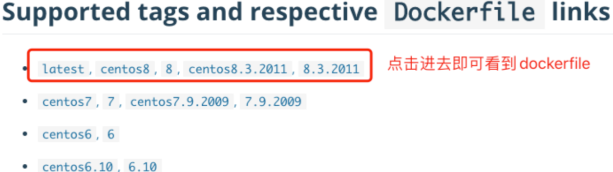
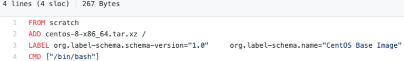
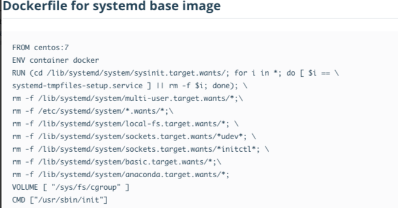
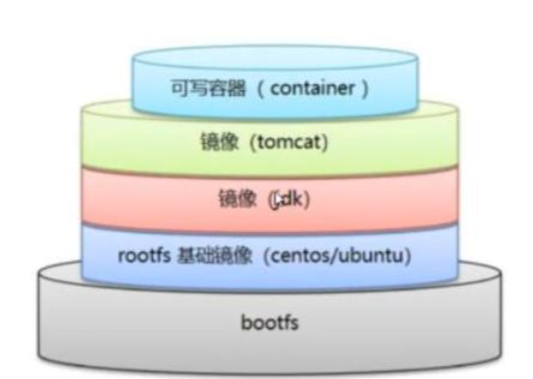
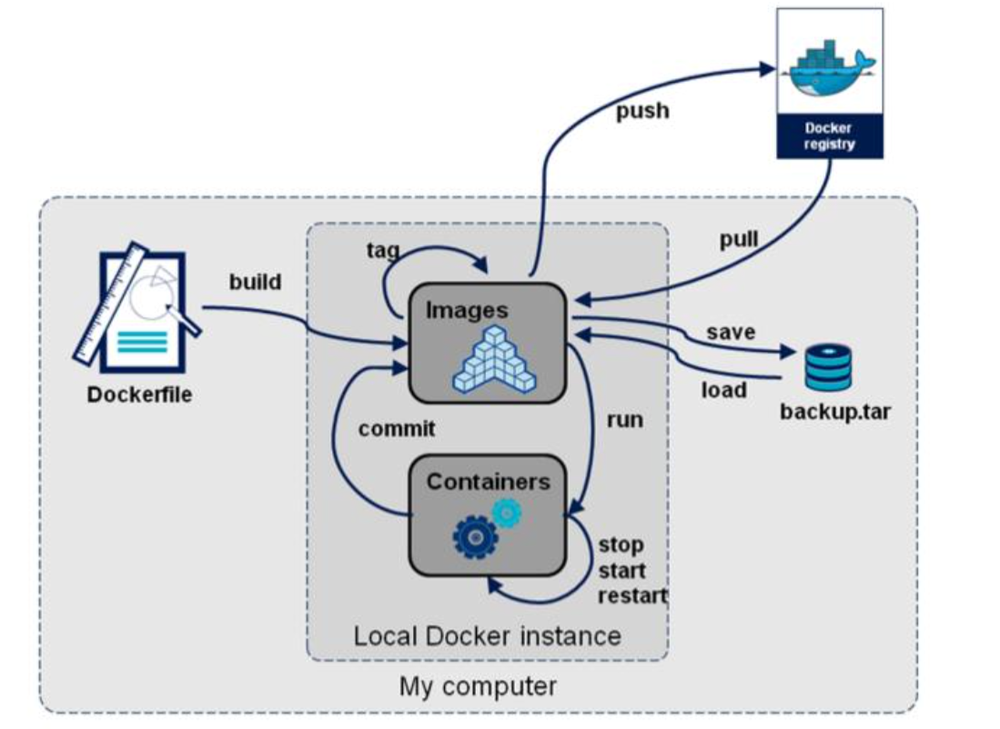

## dockerfile介绍

> ```
> dockerfile 是用来构建docker镜像的文件，是一些命令参数所编写的脚本
> 
> 构建步骤
> 1 编写一个dockerfile文件
> 2 docker build 构建成为一个镜像
> 3 docker run 运行镜像
> 4 docker push 发布镜像（dockerhub、阿里云仓库）
> 
> 查看一下官方是怎么做的
> 很多官方镜像都是基础包，很多功能没有，我们通常会搭建自己的镜像
> 官方既然可以制作镜像，那我们也可以
> ```
>
>   
>
>   
>
>  


## dockerfile构建过程

> ```
> 基础知识
> 1 每个保留关键字(指令)都必须是大写字母
> 2 执行从上到下顺序执行
> 3 #表示注释
> 4 每一个指定都会创建并且提交一个新的镜像层
> 
> dockerfile是面向开发的，我们以后要发布项目，制作镜像，就需要编写dockerfile文件，这个文件十分简单
> docker镜像逐渐成为企业交付的标准
> dockerfile：构建文件，定义了一切的步骤，源代码
> docker images：通过dockerfile构建生成的镜像，最终发布和运行的产品
> docker容器：容器就是镜像运行起来提供服务
> ```
>
>  


## dockerfile指令

> ```
> FROM        # 基础镜像，一切从这里开始构建
> MAINTAINER  # 镜像是谁写的，姓名+邮箱
> RUN         # 镜像构建的时候需要运行的命令
> ADD         # 步骤，例如添加tomcat压缩包，会自动解压
> WORKDIR     # 镜像的工作目录
> VOLUME      # 挂载的目录
> EXPOSE      # 保留端口配置
> CMD         # 指定这个容器启动的时候要运行的命令，只有最后一个会生效，会被替代
> ENTRYPOINT  # 指定这个容器启动的时候要运行的命令，可以追加命令
> ONBUILD     # 当构建一个被继承dockerfile，这个时候就会运行ONBUILD的指令，触发指令
> COPY        # 类似ADD，将我们文件拷贝到镜像中
> ENV         # 构建镜像的时候设置环境变量
> ```
>
>   


## 练习:创建一个centos镜像

> ```
> # 1 编写dockerfile的文件
> FROM centos
> MAINTAINER alnk<1029612787@qq.com>
> ENV MYPATH /usr/local
> WORKDIR $MYPATH
> RUN yum -y install vim
> RUN yum -y install net-tools
> EXPOSE 80
> CMD echo $MYPATH
> CMD echo "---end---"
> CMD /bin/bash
> 
> 
> # 2 通过这个文件构建镜像
> # docker build -f 文件路径 -t 镜像名[:tag] .
> # cat DockerFile
> FROM centos
> MAINTAINER alnk<1029612787@qq.com>
> ENV MYPATH /usr/local
> WORKDIR $MYPATH
> RUN yum -y install vim
> RUN yum -y install net-tools
> EXPOSE 80
> CMD echo $MYPATH
> CMD echo "---end---"
> CMD /bin/bash
> 
> # docker build -f ./DockerFile  -t mycentos:0.1 .
> 
> # 3 测试运行
> # 官方的centos没有 ifconfig 和 vim 命令
> # 官方默认的工作目录是 / 目录
> # docker run -it --name mycentos01 mycentos:0.1 /bin/bash
> 
> # 4 列出该镜像的变更历史
> # docker history 57db65f9db70
> IMAGE          CREATED         CREATED BY                                      SIZE      COMMENT
> 57db65f9db70   5 minutes ago   /bin/sh -c #(nop)  CMD ["/bin/sh" "-c" "/bin…   0B
> 11f16407289b   5 minutes ago   /bin/sh -c #(nop)  CMD ["/bin/sh" "-c" "echo…   0B
> 110af6c27d7f   5 minutes ago   /bin/sh -c #(nop)  CMD ["/bin/sh" "-c" "echo…   0B
> c61839342400   5 minutes ago   /bin/sh -c #(nop)  EXPOSE 80                    0B
> 20468d0a15c7   5 minutes ago   /bin/sh -c yum -y install net-tools             29.5MB
> c3b52ed45701   6 minutes ago   /bin/sh -c yum -y install vim                   68.1MB
> 0e902d08e457   6 minutes ago   /bin/sh -c #(nop) WORKDIR /usr/local            0B
> 76bca7b3b4f3   6 minutes ago   /bin/sh -c #(nop)  ENV MYPATH=/usr/local        0B
> 5b47927ad0f9   6 minutes ago   /bin/sh -c #(nop)  MAINTAINER alnk<102961278…   0B
> 300e315adb2f   8 months ago    /bin/sh -c #(nop)  CMD ["/bin/bash"]            0B
> <missing>      8 months ago    /bin/sh -c #(nop)  LABEL org.label-schema.sc…   0B
> <missing>      8 months ago    /bin/sh -c #(nop) ADD file:bd7a2aed6ede423b7…   209MB
> ```


## CMD和ENTRYPOINT区别

> ```
> CMD         # 指定这个容器启动的时候要运行的命令，只有最后一个会生效，会被替代
> ENTRYPOINT  # 指定这个容器启动的时候要运行的命令，可以追加命令
> ```


### 测试CMD指令

> ```
> # 1 编写dockerfile
> # cat dockerfile-test-cmd
> FROM centos
> CMD ["ls", "-a"]
> 
> # 2 构建镜像
> # docker build -f ./dockerfile-test-cmd -t cmd-test:0.1 .
> 
> # 3 运行镜像
> # 3.1 直接运行镜像
> # docker run -it cmd-test:0.1
> 
> # 3.2 运行镜像时执行 ls -al 命令
> # docker run -it cmd-test:0.1 ls -al
> 
> # 3.3 运行镜像的时候想追加命令参数 -l 使命令成为 ls -al
> # cmd 的情况下 -l 替换了 CMD [“ls”, “-a”]。 所以报错了
> # docker run cmd-test:0.1 -l
> docker: Error response from daemon: OCI runtime create failed: container_linux.go:380: starting container process caused: exec: "-l": executable file not found in $PATH: unknown.
> ```


### 测试ENTRYPOINT指令

> ```
> # 1 编写dockerfile
> # cat dockerfile-test-entrypoint
> FROM centos
> ENTRYPOINT ["ls",  "-a"]
> 
> 
> # 2 构建镜像
> # docker build -f ./dockerfile-test-entrypoint -t entrypoint:0.1 .
> Successfully built 33ef43867938
> Successfully tagged entrypoint:0.1
> 
> 
> # 3 运行镜像
> # 3.1 直接运行镜像
> # docker run -it entrypoint:0.1
> .   .dockerenv	dev  home  lib64       media  opt   root  sbin	sys  usr
> 
> # 3.2 运行镜像时执行 ls -al 命令
> # 这里报错的原因是entrypoint会把后面的命令和参数当做参数传递到容器
> # 就变成了 ls -a ls -al 所以报错了
> # docker run -it entrypoint:0.1 ls -al
> ls: cannot access 'ls': No such file or directory
> 
> # 3.3 运行镜像的时候想追加命令参数 -l 使命令成为 ls -al
> # ls -a -l
> # docker run -it entrypoint:0.1 -l
> total 56
> drwxr-xr-x   1 root root 4096 Aug 24 07:34 .
> ```


## 练习:制作tomcat镜像

> ```
> # 1 准备tomcat压缩包和jdk压缩包，上传到服务器
> # ls
> apache-tomcat-9.0.52.tar.gz  jdk-8u11-linux-x64.tar.gz readme.txt
> 
> 
> # 2 编写dockerfile文件，官方建议命名为Dockerfile，这样build的时候就会自动去寻找这个文件了
> # cat Dockerfile 
> # 基础镜像
> FROM centos
> # 作者信息
> MAINTAINER alnk<1029612787@qq.com>
> # 拷贝readme文件
> COPY readme.txt /usr/local/readme.txt
> # 复制解压软件包
> ADD jdk-8u11-linux-x64.tar.gz /usr/local
> ADD apache-tomcat-9.0.52.tar.gz /usr/local
> # 安装vim
> RUN yum -y install vim
> # 设置工作目录
> ENV MYPATH /usr/local
> WORKDIR $MYPATH
> # tomcat jdk 环境变量
> ENV JAVA_HOME /usr/local/jdk1.8.0_11
> ENV CLASSPATH $JAVA_HOME/lib/dt.jar:$JAVA_HOME/lib/tools.jar
> ENV CATALINA_HOME /usr/local/apache-tomcat-9.0.52
> ENV CATALINA_BASH /usr/local/apache-tomcat-9.0.52
> ENV PATH $PATH:$JAVA_HOME/bin:$CATALINA_HOME/lib:$CATALINA_HOME/bin
> # 暴露8080端口
> EXPOSE 8080
> # 启动tomcat并且追踪日志
> CMD /usr/local/apache-tomcat-9.0.52/bin/startup.sh && tail -F /usr/local/apache-tomcat-9.0.52/bin/logs/catalina.out
> 
> 
> # 3 构建镜像
> # ls
> apache-tomcat-9.0.52.tar.gz  Dockerfile  jdk-8u11-linux-x64.tar.gz  readme.txt
> # 如果dockerfile文件的名称为 Dockerfile ，并且在该文件同一个目录build的时候，不需要-f参数
> # docker build -t diytomcat .
> 
> 
> # 4 启动镜像
> # docker run -d -p 8080:8080 --name alnktomcat \
> -v /home/tomcat/test:/usr/local/apache-tomcat-9.0.52/webapps/test \
> -v /home/tomcat/tomcatlogs:/usr/local/apache-tomcat-9.0.52/logs diytomcat
> 
> # 测试
> # 访问IP:PORT
> # 发布项目的话，直接在本地发布就可以了，因为做了卷挂载
> ```


## 小结

>  


