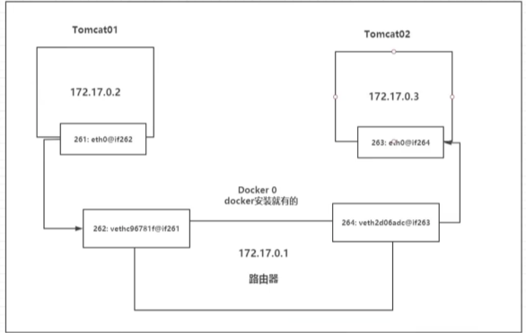
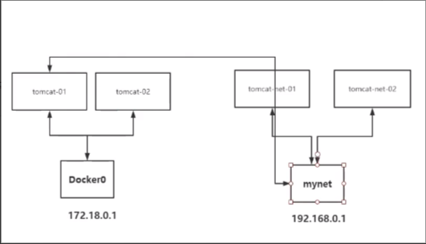
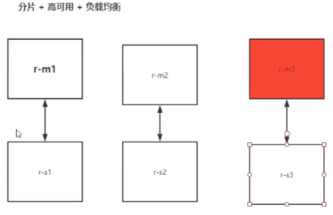

## docker网络

### docker0

> ```
> 清空环境
> # docker rm -f `docker ps -qa`         # 删除所有容器
> # docker rmi -f `docker images -qa`    # 删除所有镜像
> 
> 
> 查看服务器的网络，发现有三个网络
> # ip addr
> # 本机回环地址
> 1: lo: <LOOPBACK,UP,LOWER_UP> mtu 65536 qdisc noqueue state UNKNOWN group default qlen 1000
>     link/loopback 00:00:00:00:00:00 brd 00:00:00:00:00:00
>     inet 127.0.0.1/8 scope host lo
> 
> # 服务器内网地址
> 2: eth0: <BROADCAST,MULTICAST,UP,LOWER_UP> mtu 1500 qdisc pfifo_fast state UP group default qlen 1000
>     link/ether 52:54:00:cc:34:ff brd ff:ff:ff:ff:ff:ff
>     inet 172.17.0.3/20 brd 172.17.15.255 scope global eth0
> 
> # docker0地址
> 3: docker0: <NO-CARRIER,BROADCAST,MULTICAST,UP> mtu 1500 qdisc noqueue state DOWN group default 
>     link/ether 02:42:3b:63:5a:2f brd ff:ff:ff:ff:ff:ff
>     inet 172.18.0.1/16 brd 172.18.255.255 scope global docker0
> 
> 
> docker是如何处理容器网络访问的
> # 启动一个tomcat容器
> # docker run -d -P --name tomcat01 tomcat
> 
> # 查看tomcat容器内
> # 发现启动容器的时候会得到一个 127: eth0@if128 IP地址，这个地址是docker分配的
> # docker exec -it tomcat01 ip addr
> ......
> 127: eth0@if128: <BROADCAST,MULTICAST,UP,LOWER_UP> mtu 1500 qdisc noqueue state UP group default 
>     link/ether 02:42:ac:12:00:02 brd ff:ff:ff:ff:ff:ff link-netnsid 0
>     inet 172.18.0.2/16 brd 172.18.255.255 scope global eth0
>        valid_lft forever preferred_lft forever
> 
> # 宿主机linux可以ping通容器
> # ping 172.18.0.2
> PING 172.18.0.2 (172.18.0.2) 56(84) bytes of data.
> 64 bytes from 172.18.0.2: icmp_seq=1 ttl=64 time=0.061 ms
> 64 bytes from 172.18.0.2: icmp_seq=2 ttl=64 time=0.043 ms
> 
> 
> 原理
> 1 我们每启动一个docker容器，docker就会给docker容器分配一个IP，我们只要安装了docker，就会有一个网卡Docker0，使用的模式是桥接模式，使用的技术是veth pair技术
> # 再次测试 ip addr
> # 发现 128: vethacda187@if127 网卡
> # ip addr
> ......
> 128: vethacda187@if127: <BROADCAST,MULTICAST,UP,LOWER_UP> mtu 1500 qdisc noqueue master docker0 state UP group default 
>     link/ether 76:33:e7:6a:34:54 brd ff:ff:ff:ff:ff:ff link-netnsid 0
>     inet6 fe80::7433:e7ff:fe6a:3454/64 scope link 
>        valid_lft forever preferred_lft forever
> 
> 2 在启动一个容器测试，发现又多了一张网卡，我们发现这个容器带来的网卡，都是一对一对的，veth pair就是一对的虚拟设备接口，他们是成对出现的，一端连接协议，一端彼此相连，正是因为有这个特性，veth pair 充当一个桥梁，连接各种虚拟设备的，OpenStack，docker容器之间的连接，OVS的连接，都是使用veth pair技术
> # docker run -d -P --name tomcat02 tomcat
> a8b98f97a10a40a0178c0a4762dc00154f64c1d461f42b7c37745d0657e5210f
> # ip addr
> 3: docker0: <BROADCAST,MULTICAST,UP,LOWER_UP> mtu 1500 qdisc noqueue state UP group default 
>     link/ether 02:42:3b:63:5a:2f brd ff:ff:ff:ff:ff:ff
>     inet 172.18.0.1/16 brd 172.18.255.255 scope global docker0
>        valid_lft forever preferred_lft forever
>     inet6 fe80::42:3bff:fe63:5a2f/64 scope link 
>        valid_lft forever preferred_lft forever
> 128: vethacda187@if127: <BROADCAST,MULTICAST,UP,LOWER_UP> mtu 1500 qdisc noqueue master docker0 state UP group default 
>     link/ether 76:33:e7:6a:34:54 brd ff:ff:ff:ff:ff:ff link-netnsid 0
>     inet6 fe80::7433:e7ff:fe6a:3454/64 scope link 
>        valid_lft forever preferred_lft forever
> 130: veth0f47a56@if129: <BROADCAST,MULTICAST,UP,LOWER_UP> mtu 1500 qdisc noqueue master docker0 state UP group default 
>     link/ether 32:24:4f:7c:84:6b brd ff:ff:ff:ff:ff:ff link-netnsid 1
>     inet6 fe80::3024:4fff:fe7c:846b/64 scope link 
>        valid_lft forever preferred_lft forever
> 
> 
> 3 测试一下tomcat01和tomcat02是否可以ping通
> # 查看tomcat02容器的IP地址
> # docker exec -it tomcat02 ip addr
> 129: eth0@if130: <BROADCAST,MULTICAST,UP,LOWER_UP> mtu 1500 qdisc noqueue state UP group default 
>     link/ether 02:42:ac:12:00:03 brd ff:ff:ff:ff:ff:ff link-netnsid 0
>     inet 172.18.0.3/16 brd 172.18.255.255 scope global eth0
>        valid_lft forever preferred_lft forever
>  
> # 可以ping通
> # docker exec -it tomcat01 ping 172.18.0.3
> PING 172.18.0.3 (172.18.0.3) 56(84) bytes of data.
> 64 bytes from 172.18.0.3: icmp_seq=1 ttl=64 time=0.084 ms
> 
> 1 tomcat01 和 tomcat02 是公用的一个路由器，docker0，
> 2 所有的容器在不指定网络的情况下，都是docker0路由的，docker会给我们的容器分配一个默认的可用IP
> 
> docker使用的是Linux的桥接，宿主机是一个docker容器的网桥docker0
> docker中所有网络接口都是虚拟的，虚拟的转发效率更高
> 只要删除容器，那么对应的一对网桥也会删除
> ```
>
>   


### link

> ```
> 如果编写了一个微服务，数据库database url=ip:port，项目不重启，数据库ip换了，那么可以怎样处理这个问题呢，是否可以通过名字来访问容器呢？
> 
> # tomcat02直接通过容器名称ping不通tomcat01
> # docker exec -it tomcat02 ping tomcat01
> ping: tomcat01: Name or service not known
> 
> 
> # 通过 --link 启动tomcat03
> # docker run -d -P --name tomcat03 --link tomcat01 tomcat
> 
> 
> # tomcat03 可以ping通 tomcat01
> # docker exec -it tomcat03 ping tomcat01
> PING tomcat01 (172.18.0.2) 56(84) bytes of data.
> 64 bytes from tomcat01 (172.18.0.2): icmp_seq=1 ttl=64 time=0.124 ms
> 64 bytes from tomcat01 (172.18.0.2): icmp_seq=2 ttl=64 time=0.070 ms
> 
> 
> # 查看tomcat03 hosts文件
> # 发现已经把tomcat01的解析到了hosts文件里
> # docker exec -it tomcat03 cat /etc/hosts
> 127.0.0.1       localhost
> ::1     localhost ip6-localhost ip6-loopback
> fe00::0 ip6-localnet
> ff00::0 ip6-mcastprefix
> ff02::1 ip6-allnodes
> ff02::2 ip6-allrouters
> 172.18.0.2      tomcat01 ae50bb31cb99
> 172.18.0.4      2780bdbfd6dd
> 
> --link的本质就是在hosts配置中添加映射，现在使用docker已经不建议使用--link了
> ```


### 自定义网络

> ```
> # 查看所有的docker网络
> # docker network ls
> NETWORK ID     NAME          DRIVER    SCOPE
> 05624c7238ea   bridge        bridge    local
> 755daa13446d   host          host      local
> 01f3a203ade1   none          null      local
> f41002c3ebfc   somenetwork   bridge    local
> 
> # 网络模式
> # bridge      桥接docker（默认的，自定义网络也是用bridge模式）
> # none        不配置网络，一般不用
> # host        和宿主机共享网络
> # container   容器网络连通（用得少，局限很大）
> 
> # docker0：默认不能通过容器名称访问，虽然可以通过--link进行绑定，但是还是比较麻烦
> # 直接启动的命令 --net bridge，而这个就是我们的docker0
> # 如果没指定 --net ，则默认会加上 --net bridge
> # docker run -d -P --name tomcat04 tomcat
> # docker run -d -P --name tomcat05 --net bridge tomcat
> 
> 
> # 创建一个自定义网络
> # --driver bridge          # 网络模式 桥接
> # --subnet 192.168.0.0/16  # 子网
> # --gateway 192.168.0.1    # 网关
> # docker network create --driver bridge --subnet 192.168.0.0/16 --gateway 192.168.0.1 mynet
> 
> # docker network ls
> NETWORK ID     NAME          DRIVER    SCOPE
> 05624c7238ea   bridge        bridge    local
> 755daa13446d   host          host      local
> 8f534c483e85   mynet         bridge    local
> 01f3a203ade1   none          null      local
> f41002c3ebfc   somenetwork   bridge    local
> 
> # docker network inspect mynet
> [
>     {
>         "Name": "mynet",
>         "Id": "8f534c483e856ff5861cc7a9a8909631f0a6d2717ef4c7c7a7237a046f3d5eee",
>         "Created": "2021-08-25T10:53:17.551563058+08:00",
>         "Scope": "local",
>         "Driver": "bridge",
>         "EnableIPv6": false,
>         "IPAM": {
>             "Driver": "default",
>             "Options": {},
>             "Config": [
>                 {
>                     "Subnet": "192.168.0.0/16",
>                     "Gateway": "192.168.0.1"
>                 }
>             ]
>         },
>         "Internal": false,
>         "Attachable": false,
>         "Ingress": false,
>         "ConfigFrom": {
>             "Network": ""
>         },
>         "ConfigOnly": false,
>         "Containers": {},
>         "Options": {},
>         "Labels": {}
>     }
> ]
> 
> 
> # 测试
> # 在自定义网络下启动2个docker容器
> # docker run -d -P --name tomcat-mynet-01 --net mynet tomcat
> 
> # docker run -d -P --name tomcat-mynet-02 --net mynet tomcat
> 
> # docker exec -it tomcat-mynet-01 ping tomcat-mynet-02
> PING tomcat-mynet-02 (192.168.0.3) 56(84) bytes of data.
> 64 bytes from tomcat-mynet-02.mynet (192.168.0.3): icmp_seq=1 ttl=64 time=0.079 ms
> 
> # docker network inspect mynet 
> # 这里可以看出，已经把容器名和对应的IP绑定到了mynet这个网络中了
> [
>         ......
>         "Containers": {
>             "13e2135acda3dc1d2216a816bd370159ec9dc4685e93b994a5686950b662bde2": {
>                 "Name": "tomcat-mynet-01",
>                 "EndpointID": "46bd745c7c20c6e10f01cc5f000d816a5062750d5ae3f548f2c1725cfed422ab",
>                 "MacAddress": "02:42:c0:a8:00:02",
>                 "IPv4Address": "192.168.0.2/16",
>                 "IPv6Address": ""
>             },
>             "b1d20bb3c43b70e3e140e71e87dff763e4933c8fc57d5d01497ab3827be79f43": {
>                 "Name": "tomcat-mynet-02",
>                 "EndpointID": "b6f06e95afd870a1e64d906f1f30c12c9c538092e132f0f2146949f1aad28445",
>                 "MacAddress": "02:42:c0:a8:00:03",
>                 "IPv4Address": "192.168.0.3/16",
>                 "IPv6Address": ""
>             }
>          ......
> ]
> 
> 
> # 自定义网络的优点
> # 自定义网络已经帮我们维护好了对应的关系，推荐使用这种网络
> # 以后mysql集群，redis集群等可以设置不同的自定义网络，这样更加灵活和方便
> ```


### 网络连通

> ```
> # docker network --help
> Usage:  docker network COMMAND
> Manage networks
> Commands:
>   connect     Connect a container to a network
>   create      Create a network
>   disconnect  Disconnect a container from a network
>   inspect     Display detailed information on one or more networks
>   ls          List networks
>   prune       Remove all unused networks
>   rm          Remove one or more networks
> Run 'docker network COMMAND --help' for more information on a command.
> 
> # docker network connect --help
> Usage:  docker network connect [OPTIONS] NETWORK CONTAINER
> Connect a container to a network
> Options:
>       --alias strings           Add network-scoped alias for the container
>       --driver-opt strings      driver options for the network
>       --ip string               IPv4 address (e.g., 172.30.100.104)
>       --ip6 string              IPv6 address (e.g., 2001:db8::33)
>       --link list               Add link to another container
>       --link-local-ip strings   Add a link-local address for the container
> 
> 
> 测试打通tomcat01和mynet
> # docker ps
> CONTAINER ID   IMAGE     COMMAND             CREATED        STATUS          PORTS                                       NAMES
> b1d20bb3c43b   tomcat    "catalina.sh run"   23 hours ago   Up 3 seconds    0.0.0.0:49169->8080/tcp, :::49169->8080/tcp   tomcat-mynet-02
> 13e2135acda3   tomcat    "catalina.sh run"   23 hours ago   Up 6 seconds    0.0.0.0:49168->8080/tcp, :::49168->8080/tcp   tomcat-mynet-01
> a8b98f97a10a   tomcat    "catalina.sh run"   24 hours ago   Up 14 seconds   0.0.0.0:49167->8080/tcp, :::49167->8080/tcp   tomcat02
> ae50bb31cb99   tomcat    "catalina.sh run"   40 hours ago   Up 16 seconds   0.0.0.0:49166->8080/tcp, :::49166->8080/tcp   tomcat01
> 
> 
> # 连通以后就是将tomcat01容器放到mynet网络下
> # 一个容器两个IP地址
> # docker network connect mynet tomcat01 
> # docker network inspect mynet 
> [
>     {
>         "IPAM": {
>             "Driver": "default",
>             "Options": {},
>             "Config": [
>                 {
>                     "Subnet": "192.168.0.0/16",
>                     "Gateway": "192.168.0.1"
>                 }
>             ]
>         },
>         "Containers": {
>             "13e2135acda3dc1d2216a816bd370159ec9dc4685e93b994a5686950b662bde2": {
>                 "Name": "tomcat-mynet-01",
>                 "EndpointID": "8b3294b281752e2713f91a1b1e18b91c7e0602e2748931ca630f80cf657f2d51",
>                 "MacAddress": "02:42:c0:a8:00:02",
>                 "IPv4Address": "192.168.0.2/16",
>                 "IPv6Address": ""
>             },
>             "ae50bb31cb994ce18a41b4b7b383bbf1e6458e788b3304daa8f89fe34027d619": {
>                 "Name": "tomcat01",
>                 "EndpointID": "f01cd4d789e2a2dc8cf1e8e7032d263a41cd42eda0da3432189d9698a36e7519",
>                 "MacAddress": "02:42:c0:a8:00:04",
>                 "IPv4Address": "192.168.0.4/16",
>                 "IPv6Address": ""
>             },
>             "b1d20bb3c43b70e3e140e71e87dff763e4933c8fc57d5d01497ab3827be79f43": {
>                 "Name": "tomcat-mynet-02",
>                 "EndpointID": "d84e4f3cb6421a5bce69e748090706763faa1de8af6b89429f35dec3547a3f48",
>                 "MacAddress": "02:42:c0:a8:00:03",
>                 "IPv4Address": "192.168.0.3/16",
>                 "IPv6Address": ""
>             }
>         },
>     }
> ]
> 
> # docker exec -it tomcat01 ip addr
> 142: eth0@if143: <BROADCAST,MULTICAST,UP,LOWER_UP> mtu 1500 qdisc noqueue state UP group default 
>     link/ether 02:42:ac:12:00:02 brd ff:ff:ff:ff:ff:ff link-netnsid 0
>     inet 172.18.0.2/16 brd 172.18.255.255 scope global eth0
>        valid_lft forever preferred_lft forever
> 150: eth1@if151: <BROADCAST,MULTICAST,UP,LOWER_UP> mtu 1500 qdisc noqueue state UP group default 
>     link/ether 02:42:c0:a8:00:04 brd ff:ff:ff:ff:ff:ff link-netnsid 0
>     inet 192.168.0.4/16 brd 192.168.255.255 scope global eth1
>        valid_lft forever preferred_lft forever
> 
> 
> # tomcat01测试连通ok
> # docker exec -it tomcat01 ping tomcat-mynet-01 
> PING tomcat-mynet-01 (192.168.0.2) 56(84) bytes of data.
> 64 bytes from tomcat-mynet-01.mynet (192.168.0.2): icmp_seq=1 ttl=64 time=0.068 ms
> 
> # docker exec -it tomcat01 ping tomcat-mynet-02
> PING tomcat-mynet-02 (192.168.0.3) 56(84) bytes of data.
> 64 bytes from tomcat-mynet-02.mynet (192.168.0.3): icmp_seq=1 ttl=64 time=0.073 ms
> 
> 
> # tomcat02依旧不能连通，因为没有connect
> # docker exec -it tomcat02 ping tomcat-mynet-01 
> ping: tomcat-mynet-01: Name or service not known
> 
> 结论：假设要跨网络访问别的容器，那就需要使用docker network connect
> ```
>
>  


## 练习：部署redis

> ```
> # 1 创建网卡
> # docker network create redis --subnet 172.38.0.0/16
> 5ccf584f29c1f12415bd13346b968cf3f19ccd80e32d83883f5adfb454f5a453
> # docker network ls
> NETWORK ID     NAME          DRIVER    SCOPE
> 05624c7238ea   bridge        bridge    local
> 755daa13446d   host          host      local
> 01f3a203ade1   none          null      local
> 5ccf584f29c1   redis         bridge    local
> f41002c3ebfc   somenetwork   bridge    local
> 
> 
> # 2 通过脚本创建6个redis配置
> for port in $(seq 1 6); \
> do \
> mkdir -p /mydata/redis/node-${port}/conf
> touch /mydata/redis/node-${port}/conf/redis.conf
> cat << EOF >/mydata/redis/node-${port}/conf/redis.conf
> port 6379
> bind 0.0.0.0
> cluster-enabled yes
> cluster-config-file nodes.conf
> cluster-node-timeout 5000
> cluster-announce-ip 172.38.0.1${port}
> cluster-announce-port 6379
> cluster-announce-bus-port 16379
> appendonly yes
> EOF
> done
> 
> 
> # 3 创建节点
> # 创建节点1
> docker run -p 6371:6379 -p 16371:16379 --name redis-1 \
> -v /mydata/redis/node-1/data:/data \
> -v /mydata/redis/node-1/conf/redis.conf:/etc/redis/redis.conf \
> -d --net redis --ip 172.38.0.11 redis:5.0.9-alpine3.11 redis-server /etc/redis/redis.conf
> 
> # 创建结点2
> docker run -p 6372:6379 -p 16372:16379 --name redis-2 \
> -v /mydata/redis/node-2/data:/data \
> -v /mydata/redis/node-2/conf/redis.conf:/etc/redis/redis.conf \
> -d --net redis --ip 172.38.0.12 redis:5.0.9-alpine3.11 redis-server /etc/redis/redis.conf
> 
> # 创建结点3
> docker run -p 6373:6379 -p 16373:16379 --name redis-3 \
> -v /mydata/redis/node-3/data:/data \
> -v /mydata/redis/node-3/conf/redis.conf:/etc/redis/redis.conf \
> -d --net redis --ip 172.38.0.13 redis:5.0.9-alpine3.11 redis-server /etc/redis/redis.conf
> 
> # 创建结点4
> docker run -p 6374:6379 -p 16374:16379 --name redis-4 \
> -v /mydata/redis/node-4/data:/data \
> -v /mydata/redis/node-4/conf/redis.conf:/etc/redis/redis.conf \
> -d --net redis --ip 172.38.0.14 redis:5.0.9-alpine3.11 redis-server /etc/redis/redis.conf
> 
> # 创建结点5
> docker run -p 6375:6379 -p 16375:16379 --name redis-5 \
> -v /mydata/redis/node-5/data:/data \
> -v /mydata/redis/node-5/conf/redis.conf:/etc/redis/redis.conf \
> -d --net redis --ip 172.38.0.15 redis:5.0.9-alpine3.11 redis-server /etc/redis/redis.conf
> 
> # 创建结点6
> docker run -p 6376:6379 -p 16376:16379 --name redis-6 \
> -v /mydata/redis/node-6/data:/data \
> -v /mydata/redis/node-6/conf/redis.conf:/etc/redis/redis.conf \
> -d --net redis --ip 172.38.0.16 redis:5.0.9-alpine3.11 redis-server /etc/redis/redis.conf
> 
> 
> # 4 创建集群
> # docker exec -it redis-1 /bin/sh
> /data # pwd
> /data
> /data # ls
> appendonly.aof  nodes.conf
> /data # redis-cli --cluster create 172.38.0.11:6379 172.38.0.12:6379 172.38.0.13:6379 172.38.0.14:6379 172.38.0.15:6379 172.38.0.16:6379 --cluster-replicas 1
> >>> Performing hash slots allocation on 6 nodes...
> Master[0] -> Slots 0 - 5460
> Master[1] -> Slots 5461 - 10922
> Master[2] -> Slots 10923 - 16383
> Adding replica 172.38.0.15:6379 to 172.38.0.11:6379
> Adding replica 172.38.0.16:6379 to 172.38.0.12:6379
> Adding replica 172.38.0.14:6379 to 172.38.0.13:6379
> M: e3eb7dc2d2cd1797bc0aa27ad255877883c1c7a4 172.38.0.11:6379
>    slots:[0-5460] (5461 slots) master
> M: 0aeed35dc30c2ba23624dee22b06282770e2073e 172.38.0.12:6379
>    slots:[5461-10922] (5462 slots) master
> M: c61fa9e154257a420147fec91ca0f718ed38f868 172.38.0.13:6379
>    slots:[10923-16383] (5461 slots) master
> S: 7c27423a4b5da0e486f9c4feaf8495a02d2ee175 172.38.0.14:6379
>    replicates c61fa9e154257a420147fec91ca0f718ed38f868
> S: 89f1e36ad0b5d410337d7029b14d2bc30dabad69 172.38.0.15:6379
>    replicates e3eb7dc2d2cd1797bc0aa27ad255877883c1c7a4
> S: 90353663a727aebbc5639ac435f72f3c7f166ffb 172.38.0.16:6379
>    replicates 0aeed35dc30c2ba23624dee22b06282770e2073e
> Can I set the above configuration? (type 'yes' to accept): yes
> >>> Nodes configuration updated
> >>> Assign a different config epoch to each node
> >>> Sending CLUSTER MEET messages to join the cluster
> Waiting for the cluster to join
> ...
> >>> Performing Cluster Check (using node 172.38.0.11:6379)
> M: e3eb7dc2d2cd1797bc0aa27ad255877883c1c7a4 172.38.0.11:6379
>    slots:[0-5460] (5461 slots) master
>    1 additional replica(s)
> M: 0aeed35dc30c2ba23624dee22b06282770e2073e 172.38.0.12:6379
>    slots:[5461-10922] (5462 slots) master
>    1 additional replica(s)
> S: 89f1e36ad0b5d410337d7029b14d2bc30dabad69 172.38.0.15:6379
>    slots: (0 slots) slave
>    replicates e3eb7dc2d2cd1797bc0aa27ad255877883c1c7a4
> M: c61fa9e154257a420147fec91ca0f718ed38f868 172.38.0.13:6379
>    slots:[10923-16383] (5461 slots) master
>    1 additional replica(s)
> S: 7c27423a4b5da0e486f9c4feaf8495a02d2ee175 172.38.0.14:6379
>    slots: (0 slots) slave
>    replicates c61fa9e154257a420147fec91ca0f718ed38f868
> S: 90353663a727aebbc5639ac435f72f3c7f166ffb 172.38.0.16:6379
>    slots: (0 slots) slave
>    replicates 0aeed35dc30c2ba23624dee22b06282770e2073e
> [OK] All nodes agree about slots configuration.
> >>> Check for open slots...
> >>> Check slots coverage...
> [OK] All 16384 slots covered.
> 
> 
> # 查看集群节点
> # docker exec -it redis-1 /bin/sh
> /data # redis-cli 
> 127.0.0.1:6379> CLUSTER  nodes
> 0aeed35dc30c2ba23624dee22b06282770e2073e 172.38.0.12:6379@16379 master - 0 1629970661172 2 connected 5461-10922
> 89f1e36ad0b5d410337d7029b14d2bc30dabad69 172.38.0.15:6379@16379 slave e3eb7dc2d2cd1797bc0aa27ad255877883c1c7a4 0 1629970660670 5 connected
> c61fa9e154257a420147fec91ca0f718ed38f868 172.38.0.13:6379@16379 master - 0 1629970660000 3 connected 10923-16383
> 7c27423a4b5da0e486f9c4feaf8495a02d2ee175 172.38.0.14:6379@16379 slave c61fa9e154257a420147fec91ca0f718ed38f868 0 1629970660000 4 connected
> e3eb7dc2d2cd1797bc0aa27ad255877883c1c7a4 172.38.0.11:6379@16379 myself,master - 0 1629970659000 1 connected 0-5460
> 90353663a727aebbc5639ac435f72f3c7f166ffb 172.38.0.16:6379@16379 slave 0aeed35dc30c2ba23624dee22b06282770e2073e 0 1629970662176 6 connected
> 
> 
> # 测试节点
> # 注意要 -c
> /data # redis-cli -c
> 127.0.0.1:6379> set k1 v1
> -> Redirected to slot [12706] located at 172.38.0.13:6379
> OK
> 172.38.0.13:6379> get k1 
> "v1"
> ```
>
>   

