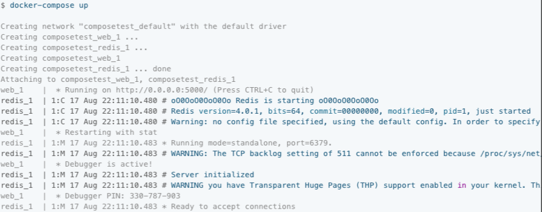

#### 简介

> ```
> 为什么需要有Compose？
> 如果有100个docker服务需要启动，那么依靠dockfile一个一个的去启动太麻烦，效率太低下
> 
> Compose是一个用于定义和运行多容器Docker应用程序的工具
> 使用Compose，可以使用一个YAML文件来配置应用程序的服务
> 然后，通过一个命令，可以创建并启动配置中的所有服务
> 
> Compose适用于所有环境:生产、演示、开发、测试以及CI工作流
> 
> 使用Compose的三个步骤
> 1. 用Dockerfile定义应用程序环境，这样它就可以在任何地方复制
> 2. 在docker-compose.yml文件中定义组成应用程序的服务，以便它们可以在一个独立的环境中一起运行
> 3. 运行docker-compose up, docker-compose命令会启动并运行整个应用程序
> ```


#### 安装

> ```
> 官网安装文档地址： https://docs.docker.com/compose/install/
> 
> 1. 下载docker compose当前的版本（下载可能会比较慢）
> curl -L "https://github.com/docker/compose/releases/download/1.29.2/docker-compose-$(uname -s)-$(uname -m)" -o /usr/local/bin/docker-compose
> 
> 2. 对二进制文件赋予可执行权限
> chmod +x /usr/local/bin/docker-compose
> 
> 3. 查看compose当前使用版本
> # docker-compose version
> docker-compose version 1.29.2, build 5becea4c
> docker-py version: 5.0.0
> CPython version: 3.7.10
> OpenSSL version: OpenSSL 1.1.0l  10 Sep 2019
> 
> # docker-compose --version
> docker-compose version 1.29.2, build 5becea4c
> ```


#### 官方示例 1

##### 1 基础设置

> ```
> 1.1 创建项目目录
> mkdir composetest
> cd composetest
> 
> 
> 1.2 创建app.py文件在项目目录下
> 注意get_hit_count函数的编写方式
> 这个基本的重试循环让我们尝试我们的请求多次，如果redis服务不可用
> 这在应用上线时启动时很有用，但如果Redis服务在应用的生命周期中需要随时重启，
> 这也会使我们的应用更有弹性
> 在集群中，这也有助于处理节点之间的瞬时连接丢失
> [root@alnk composetest]# cat app.py 
> import time
> 
> import redis
> from flask import Flask
> 
> app = Flask(__name__)
> # redis是应用程序网络上redis容器的主机名
> # 我们使用Redis的默认端口6379
> cache = redis.Redis(host='redis', port=6379)
> 
> def get_hit_count():
>     retries = 5
>     while True:
>         try:
>             return cache.incr('hits')
>         except redis.exceptions.ConnectionError as exc:
>             if retries == 0:
>                 raise exc
>             retries -= 1
>             time.sleep(0.5)
> 
> @app.route('/')
> def hello():
>     count = get_hit_count()
>     return 'Hello World! I have been seen {} times.\n'.format(count)
> 
> 
> 1.3 创建requirements.txt文件在项目目录下
> [root@alnk composetest]# cat requirements.txt 
> flask
> redis
> ```

##### 2 创建dockerfile文件

> ```
> [root@alnk composetest]# cat Dockerfile 
> FROM python:3.7-alpine
> WORKDIR /code
> ENV FLASK_APP=app.py
> ENV FLASK_RUN_HOST=0.0.0.0
> RUN apk add --no-cache gcc musl-dev linux-headers
> COPY requirements.txt requirements.txt
> RUN pip install -r requirements.txt
> EXPOSE 5000
> COPY . .
> CMD ["flask", "run"]
> 
> 说明
> 1.    从Python 3.7映像开始构建映像
> 2.    将工作目录设置为 /code
> 3和4. 设置flask命令使用的环境变量
> 5.    安装gcc和其他依赖
> 6和7. 复制requirements.txt到容器中，并安装Python依赖项
> 8.    向镜像添加元数据，以说明容器正在监听端口5000
> 9.    复制宿主机当前目录下的所有文件到容器的工作目录/code
> 10.   为容器设置运行 flask 的默认命令
> ```

##### 3 创建docker-compose.yml文件

> ```
> [root@alnk composetest]# cat docker-compose.yml 
> # 使用的yml版本
> version: "3.9"
> 
> # 服务
> services:
>   # web服务
>   web:
>     # 构建镜像
>     build: .
>     # 绑定端口
>     ports:
>       - "5000:5000"
>   
>   # redis服务
>   redis:
>     image: "redis:alpine"
>     
>  
> 说明
> web服务使用从当前目录中的Dockerfile构建的映像
> 然后它将容器和主机绑定到公开的端口5000
> 这个示例服务使用Flask web服务器的默认端口5000
> 
> redis服务使用从Docker Hub注册表拉取的公共redis镜像
> ```

##### 4 使用compose构建并且运行应用程序

> ```
> 1 在项目目录下直接运行 docker-compose up
> Compose生成一个Redis镜像，并为你的代码构建一个镜像，然后启动你定义的服务
> 在本例中，代码在构建时静态地复制到镜像中
> 注意这一步在国内的服务器需要等待较长的时间
> 
> 2 在浏览器输入http://IP:5000访问
> 
> 3 刷新一下，可以看到访问次数增加了
> 
> 4 切换到另外的终端，查看容器详细信息
> [root@alnk ~]# docker images 
> REPOSITORY        TAG                IMAGE ID       CREATED         SIZE
> composetest_web   latest             01f415a70d53   2 days ago      184MB
> redis             alpine             f6f2296798e9   6 days ago      32.3MB
> python            3.7-alpine         ab6374cb8b8e   6 days ago      41.9MB
> 
> 
> [root@alnk ~]# docker inspect composetest_web
> [
>     {
>             "Env": [
>                 "PATH=/usr/local/bin:/usr/local/sbin:/usr/local/bin:/usr/sbin:/usr/bin:/sbin:/bin",
>                 "LANG=C.UTF-8",
>                 "GPG_KEY=0D96DF4D4110E5C43FBFB17F2D347EA6AA65421D",
>                 "PYTHON_VERSION=3.7.11",
>                 "PYTHON_PIP_VERSION=21.2.4",
>                 "PYTHON_GET_PIP_URL=https://github.com/pypa/get-pip/raw/c20b0cfd643cd4a19246ccf204e2997af70f6b21/public/get-pip.py",
>                 "PYTHON_GET_PIP_SHA256=fa6f3fb93cce234cd4e8dd2beb54a51ab9c247653b52855a48dd44e6b21ff28b",
>                 "FLASK_APP=app.py",
>                 "FLASK_RUN_HOST=0.0.0.0"
>             ],
>             "Cmd": [
>                 "/bin/sh",
>                 "-c",
>                 "#(nop) ",
>                 "CMD [\"flask\" \"run\"]"
>             ],
>             "Image": "sha256:f1a6ad3eb5adea4f9dd035986b43bc548e79e2d3fdea0362ed6fa6d06a49b2d9",
>             "Volumes": null,
>             "WorkingDir": "/code",
>         },
>         "DockerVersion": "20.10.8",
>         "Author": "",
>         "Config": {
>             "Hostname": "",
>             "Domainname": "",
>             "User": "",
>             "AttachStdin": false,
>             "AttachStdout": false,
>             "AttachStderr": false,
>             "ExposedPorts": {
>                 "5000/tcp": {}
>             },
>             "Tty": false,
>             "OpenStdin": false,
>             "StdinOnce": false,
>             "Env": [
>                 "PATH=/usr/local/bin:/usr/local/sbin:/usr/local/bin:/usr/sbin:/usr/bin:/sbin:/bin",
>                 "LANG=C.UTF-8",
>                 "GPG_KEY=0D96DF4D4110E5C43FBFB17F2D347EA6AA65421D",
>                 "PYTHON_VERSION=3.7.11",
>                 "PYTHON_PIP_VERSION=21.2.4",
>                 "PYTHON_GET_PIP_URL=https://github.com/pypa/get-pip/raw/c20b0cfd643cd4a19246ccf204e2997af70f6b21/public/get-pip.py",
>                 "PYTHON_GET_PIP_SHA256=fa6f3fb93cce234cd4e8dd2beb54a51ab9c247653b52855a48dd44e6b21ff28b",
>                 "FLASK_APP=app.py",
>                 "FLASK_RUN_HOST=0.0.0.0"
>             ],
>             "Cmd": [
>                 "flask",
>                 "run"
>             ],
>             "Image": "sha256:f1a6ad3eb5adea4f9dd035986b43bc548e79e2d3fdea0362ed6fa6d06a49b2d9",
>             "Volumes": null,
>             "WorkingDir": "/code",
>         },
>         "Architecture": "amd64",
>         "Size": 183746591,
>         "VirtualSize": 183746591,
>         "GraphDriver": {
>             "Name": "overlay2"
>         },
>  
> 
>     }
> ]
> 
> 
> 5 停止应用程序
> 停止应用程序，要么在第二个终端的项目目录下运行docker-compose，要么在启动应用程序的原始终端上按CTRL+C
> # 注意需要在该项目目录下
> [root@alnk composetest]# pwd
> /root/docker_notes/composetest
> 
> [root@alnk composetest]# docker-compose down   # 停止删除运行的容器
> Stopping composetest_web_1   ... 
> Stopping composetest_web_1   ... done
> Removing composetest_web_run_db790d99eceb ... done
> Removing composetest_web_1                ... done
> Removing composetest_redis_1              ... done
> Removing network composetest_default
> ```
>
>  


##### 5 编辑compose文件添加挂载

> ```
> [root@alnk composetest]# cat docker-compose.yml 
> version: "3.9"
> services:
>   web:
>     build: .
>     ports:
>       - "5000:5000"
>     volumes:
>       - .:/code
>     environment:
>       FLASK_ENV: development
>   redis:
>     image: "redis:alpine"
> 
> 
> # 说明
> volumes键将主机上的项目目录(当前目录)挂载到容器内的/code中，允许动态地修改代码，而不必重新构建映像
> environment键设置FLASK_ENV环境变量，该变量告诉flask以开发模式运行并在更改时重新加载代码
> 这种模式只能在开发中使用
> ```


##### 6 重新使用compose构建并且运行程序

> ```
> [root@alnk composetest]# docker-compose up
> Creating network "composetest_default" with the default driver
> Creating composetest_web_1   ... done
> Creating composetest_redis_1 ... done
> ...
> 
> # 查看挂载
> [root@alnk composetest]# docker-compose images 
> composetest_redis_1   redis             alpine   f6f2296798e9   32.31 MB
> composetest_web_1     composetest_web   latest   01f415a70d53   183.7 MB
>  
> [root@alnk composetest]# docker inspect composetest_web_1
> ....
> # 挂载
> "Mounts": [
>             {
>                 "Type": "bind",
>                 "Source": "/root/docker_notes/composetest",
>                 "Destination": "/code",
>                 "Mode": "rw",
>                 "RW": true,
>                 "Propagation": "rprivate"
>             }
>         ]
> # 环境变量
> "Env": [
>                 "FLASK_ENV=development",
>                 "FLASK_APP=app.py",
>                 "FLASK_RUN_HOST=0.0.0.0"
>         ]
> ```

##### 7 更新app.py的应用代码

> ```
> [root@alnk composetest]# cat app.py 
> import time
> 
> import redis
> from flask import Flask
> 
> app = Flask(__name__)
> # redis是应用程序网络上redis容器的主机名
> # 我们使用Redis的默认端口6379
> cache = redis.Redis(host='redis', port=6379)
> 
> def get_hit_count():
>     retries = 5
>     while True:
>         try:
>             return cache.incr('hits')
>         except redis.exceptions.ConnectionError as exc:
>             if retries == 0:
>                 raise exc
>             retries -= 1
>             time.sleep(0.5)
> 
> @app.route('/')
> def hello():
>     count = get_hit_count()
>     return 'Hello from Docker! I have been seen {} times.\n'.format(count)
> ```

##### 8 其他的一些命令

> ```
> 1 后台运行 docker-compose up -d
> [root@alnk composetest]# pwd
> /root/docker_notes/composetest
> 
> [root@alnk composetest]# docker-compose up -d
> Starting composetest_web_1   ... done
> Starting composetest_redis_1 ... done
> 
> 
> [root@alnk composetest]# docker-compose ps
>        Name                      Command               State                    Ports                  
> --------------------------------------------------------------------------------------
> composetest_redis_1   docker-entrypoint.sh redis ...   Up      6379/tcp                                
> composetest_web_1     flask run                        Up      0.0.0.0:5000->5000/tcp,:::5000->5000/tcp
> 
> 
> 2 查看服务可以使用那些变量 docker-compose run 服务名 env
> [root@alnk composetest]# docker-compose run web env
> Creating composetest_web_run ... done
> PATH=/usr/local/bin:/usr/local/sbin:/usr/local/bin:/usr/sbin:/usr/bin:/sbin:/bin
> HOSTNAME=8ef7e6484e67
> TERM=xterm
> FLASK_ENV=development
> LANG=C.UTF-8
> GPG_KEY=0D96DF4D4110E5C43FBFB17F2D347EA6AA65421D
> PYTHON_VERSION=3.7.11
> PYTHON_PIP_VERSION=21.2.4
> PYTHON_GET_PIP_URL=https://github.com/pypa/get-pip/raw/c20b0cfd643cd4a19246ccf204e2997af70f6b21/public/get-pip.py
> PYTHON_GET_PIP_SHA256=fa6f3fb93cce234cd4e8dd2beb54a51ab9c247653b52855a48dd44e6b21ff28b
> FLASK_APP=app.py
> FLASK_RUN_HOST=0.0.0.0
> HOME=/root
> 
> [root@alnk composetest]# docker-compose ps
>        Name                      Command               State                    Ports                  
> -------------------------------------------------------------------------------------------------------
> composetest_redis_1   docker-entrypoint.sh redis ...   Up      6379/tcp                                
> composetest_web_1     flask run                        Up      0.0.0.0:5000->5000/tcp,:::5000->5000/tcp
> 
> 3 停止 docker-compose stop
> [root@alnk composetest]# docker-compose stop
> Stopping composetest_web_1   ... done
> Stopping composetest_redis_1 ... done
> 
> 4 删除所有容器
> 可以使用down命令将所有内容删除，完全删除容器，包括挂载的卷
> 也可以删除Redis容器
> 
> [root@alnk composetest]# docker-compose down --volumes
> ```


#### 官方示例2 开源博客

##### 1 基础设置

> ```
> 官方参考链接: https://docs.docker.com/samples/wordpress/
> 
> 创建项目目录
> [root@alnk docker_notes]# mkdir my_wordpress
> [root@alnk docker_notes]# cd my_wordpress/
> [root@alnk my_wordpress]# pwd
> /root/docker_notes/my_wordpress
> ```

##### 2 创建compose文件

> ```
> [root@alnk my_wordpress]# cat docker-compose.yml 
> version: "3.9"
>     
> services:
>   db:
>     image: mysql:5.7
>     volumes:
>       - db_data:/var/lib/mysql
>     restart: always
>     environment:
>       MYSQL_ROOT_PASSWORD: somewordpress
>       MYSQL_DATABASE: wordpress
>       MYSQL_USER: wordpress
>       MYSQL_PASSWORD: wordpress
>     
>   wordpress:
>     depends_on:
>       - db
>     image: wordpress:latest
>     volumes:
>       - wordpress_data:/var/www/html
>     ports:
>       - "8000:80"
>     restart: always
>     environment:
>       WORDPRESS_DB_HOST: db:3306
>       WORDPRESS_DB_USER: wordpress
>       WORDPRESS_DB_PASSWORD: wordpress
>       WORDPRESS_DB_NAME: wordpress
> volumes:
>   db_data: {}
>   wordpress_data: {}
> 
> 
> 卷挂载说明
> db服务卷挂载 - db_data:/var/lib/mysql
> 当前项目目录
> [root@alnk my_wordpress]# pwd
> /root/docker_notes/my_wordpress
> 查看卷挂载 具名挂载
> [root@alnk my_wordpress]# docker volume ls
> DRIVER    VOLUME NAME
> local     my_wordpress_db_data
> local     my_wordpress_wordpress_data
> 结论
> 可以看出 这种具名挂载的名称是拼接的 项目名+配置文件里的挂载名称
> ```

##### 3 构建并且启动项目

> ```
> [root@alnk my_wordpress]# docker-compose up -d
> Creating my_wordpress_db_1 ... done
> Creating my_wordpress_wordpress_1 ... done
> 
> [root@alnk my_wordpress]# docker-compose ps
>           Name                        Command               State                  Ports                
> --------------------------------------------------------------------------------------------------------
> my_wordpress_db_1          docker-entrypoint.sh mysqld      Up      3306/tcp, 33060/tcp                 
> my_wordpress_wordpress_1   docker-entrypoint.sh apach ...   Up      0.0.0.0:8000->80/tcp,:::8000->80/tcp
> ```

##### 4 测试

> ```
> 浏览器访问 http://IP:8000
> ```


#### 自定义微服务

##### 1 基础设置

> ```
> 创建项目目录
> [root@alnk docker_notes]# mkdir my_hello
> [root@alnk docker_notes]# cd my_hello/
> ```

##### 2 编写golang文件并打包上传到服务器

> ```
> package main
> 
> import (
> 	"fmt"
> 	"github.com/gin-gonic/gin"
> 	"github.com/go-redis/redis"
> 	"net/http"
> )
> 
> // 声明redis全局变量
> var rdb *redis.Client
> 
> // initRedis 初始化redis
> func initRedis() (err error) {
> 	// 创建连接
> 	rdb = redis.NewClient(&redis.Options{
> 		//Addr: "127.0.0.1:6379",
> 		Addr: "redis:6379",
> 		DB:   0,
> 	})
> 
> 	// 测试连接
> 	_, err = rdb.Ping().Result()
> 	if err != nil {
> 		return err
> 	}
> 
> 	return
> }
> 
> // 入口函数
> func main() {
> 	// 初始化redis连接
> 	err := initRedis()
> 	if err != nil {
> 		fmt.Printf("connect redis server failed, err:%v\n", err)
> 		return
> 	}
> 
> 	// 初始化gin框架路由
> 	r := gin.Default()
> 
> 	// 创建路由
> 	r.GET("/hello", func(c *gin.Context) {
> 		rdb.Incr("k1") // 每访问一次自增1次统计
> 		c.String(http.StatusOK, "该网页被点击了[%s]次", rdb.Get("k1").Val())
> 	})
> 
> 	// 监听端口
> 	r.Run(":8080")
> }
> 
> # 打包命令 命令行执行如下命令（注意 当前编码的是mac系统）
> CGO_ENABLED=0 GOOS=linux GOARCH=amd64 go build -o my_hello_linux
> 
> 
> # 上传my_hello_linux文件到服务器的项目目录
> [root@alnk my_hello]# chmod 777 my_hello_linux
> [root@alnk my_hello]# ll 
> -rwxrwxrwx 1 root root 16547445 9月   3 19:15 my_hello_linux
> [root@alnk my_hello]# pwd
> /root/docker_notes/my_hello
> ```

##### 3 创建dockerfile文件

> ```
> # 项目目录下
> [root@alnk my_hello]# cat Dockerfile 
> FROM centos
> WORKDIR /code
> EXPOSE 8080
> COPY . .
> CMD ["./my_hello_linux"]
> ```

##### 4 创建docker-compose.yml文件

> ```
> # 项目目录下
> [root@alnk my_hello]# cat docker-compose.yml 
> version: "3.9"
> 
> services:
>   web:
>     build: .
>     depends_on:
>       - redis
>     ports:
>       - "8080:8080"
> 
>   redis:
>     image: "redis:alpine"
> ```

##### 5 使用compose构建并且运行应用程序

> ```
> # 构建并且运行项目
> [root@alnk my_hello]# docker-compose up
> web_1    | [GIN-debug] Listening and serving HTTP on :8080
> 
> 
> [root@alnk my_hello]# docker-compose images 
>    Container        Repository     Tag       Image Id       Size  
> ------------------------------------------------------------------
> my_hello_redis_1   redis          alpine   f6f2296798e9   32.31 MB
> my_hello_web_1     my_hello_web   latest   cca8f07a19b3   225.9 MB
> 
> [root@alnk my_hello]# docker-compose ps
>       Name                    Command               State                    Ports                  
> ----------------------------------------------------------------------------------------------------
> my_hello_redis_1   docker-entrypoint.sh redis ...   Up      6379/tcp                                
> my_hello_web_1     ./my_hello_linux                 Up      0.0.0.0:8080->8080/tcp,:::8080->8080/tcp
> 
> [root@alnk my_hello]# pwd
> /root/docker_notes/my_hello
> 
> 
> [root@alnk my_hello]# docker ps -a
> CONTAINER ID   IMAGE              COMMAND                  CREATED          STATUS                      PORTS                                       NAMES
> 262a453b98bc   my_hello_web       "./my_hello_linux"       20 minutes ago   Up 20 minutes               0.0.0.0:8080->8080/tcp, :::8080->8080/tcp   my_hello_web_1
> 
> 6e0b357d7491   redis:alpine       "docker-entrypoint.s…"   20 minutes ago   Up 20 minutes               6379/tcp                                    my_hello_redis_1
> ```

##### 6 简单测试

> ```
> 1 浏览器访问 http://IP:PORT/hello
> 
> 2 多次刷新网页
> ```


