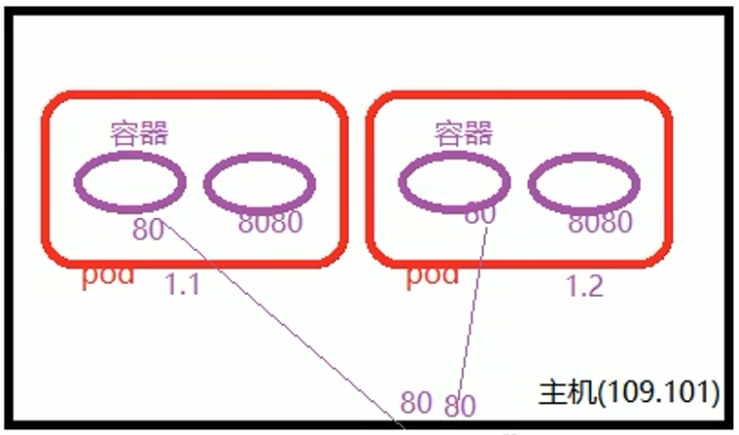
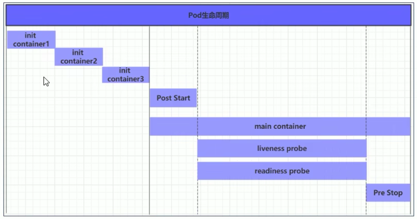
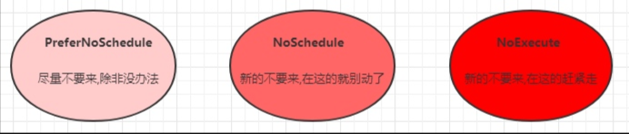
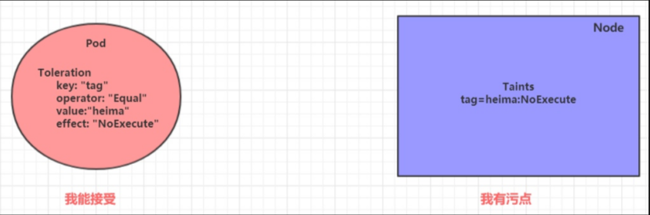

### pod的介绍

#### pod的结构

>   
>
> ```
> 每个Pod中都可以包含一个或者多个容器，这些容器可以分为2大类
> 1. 用户所在的容器，数量可多可少（用户容器）
> 2. pause容器，这是每个pod都会有的一个根容器，作用有2个
> 	1. 可以以它为根据，评估整个pod的健康状态
> 	2. 可以在根容器上面设置ip地址，其他容器都以此ip，实现Pod内部的网络通信
> 	   这里的pod内部通讯是pod之间采用二层网络技术来实现
> 	   其他容器都共享这个根容器的ip地址，外界访问这个根容器ip地址+端口即可
> ```


#### pod的定义

> ```shell
> ### pod的资源清单属性，依次类推的进行查找
> # kubectl  explain pod
> ### 查看二级属性
> # kubectl  explain pod.metadata
> 
> ### apiVersion 版本
> #查看所有的版本
> # kubectl  api-versions
> 
> ### kind 类型
> # 查看资源的类型
> # kubectl  api-resources
>  
> ### metadata元数据，资源的名字，标签等等
> # kubectl  explain  pod.metadata
>  
> ### status   状态信息，自动的进行生成，不需要自己定义
> # kubectl  get pods -o yaml
>  
> ### spec定义资源的详细信息
> ### 下面的子属性
> containers：   容器列表，用于定义容器的详细信息
> nodename：     根据nodename的值将pod的调度到指定的node节点，pod部署在哪个Pod上面
> nodeselector： pod标签选择器，可以将pod调度到包含这些label的Node上
> hostnetwork：  默认是false，k8s自动的分配一个ip地址，如果设置为true，就使用宿主机的ip
> volumes：      存储卷，用于定义pod上面挂载的存储信息
> restartpolicy：重启策略，表示pod在遇到故障的时候处理的策略
> ```


#### pod的资源隔离

> ```
> ### docker隔离了哪些资源
> 1 - UTS 主机名和域名
> UTS 全称为 UNIX Time-sharing System 该种隔离提供对于主机名和域名的隔离，Docker利用该种隔离机制为每个Docker提供独立的机器名和域名，在网络中就可以被当做单独的一个服务节点使用
> 
> 2 - IPC 信号量、消息队列、共享内存
> IPC的全称是 Inter-Process Communication 是Linux系统提供的进程间通信机制，常见的包括 信号量、消息队列、共享内存等。申请IPC资源其实就是向内核申请了一个全局唯一的32位ID，在同一个IPC namespace下的进程彼此可见，不同IPC namespace下的进程互不可见。Docker运用该机制实现了容器之间IPC的隔离
> 
> 3 - PID 进程号
> PID 是Linux系统的进程号，每个pid namespace 中都有一个计数器用于标识当前最大的PID，pid namespace隔离可以对每个namespace中pid计数器重新标号，不同pid namespace中的进程可以拥有相同的pid号。内核中对PID namespace 的组织是个树状结构，在树形的父节点中可以看到子节点的所有进程，反之则不行。即父级 pid namespace可以看到子级pid namespace中所有的进程，并可以对其进行管理，而子级pid namespace中进程无法看到且管理兄弟或父级pid namespace
> 
> 4 - Mount 文件系统(挂载点)
> Mount namespace 通过隔离文件系统的挂载点提供对隔离文件系统的支持。在创建新的mount ns时，系统会复制当前的文件结构给新的namespace。在新的nsmespace中进行的相关操作则不会再影响以前的ns
> 
> 5 - Network 网络设备、网络栈、端口
> Network ns主要提供关于网络资源的隔离，包括网络设备、协议栈、路由表、防火墙、/proc/net目录、/sys/class/net目录、socket等的隔离
> 
> 6 - User 用户和用户组
> User ns主要提供用户安全相关的隔离，例如用户组ID、用户ID、root目录、秘钥文件等隔离。通过该隔离手段可以达到更加灵活的权限控制。例如，某个用户在宿主机上拥有普通用户权限，但是其进入容器后却可以用于容器的root权限，也就是说，容器里的root用户并不是真正的root用户，映射到宿主机上只是宿主机上一个普通用户而已
> 
> 
> ### pod中的容器隔离和共享了哪些资源
> ## 资源共享
> uts、ipc、network
> 
> ## 资源隔离
> pid、mount、user
> ```
> 
>   


#### pod的常用命令

> ```shell
> ### 1. 创建资源对象
> # 使用命令行创建pod资源
> kubectl run nginx --image=nginx:latest --port=80 --replicas=3
> 
> ### 2. 查看pod对象
> # 查看某个名称空间下的所有Pod列表
> kubectl get pods
> # 显示Pod的更多信息
> kubectl get pod <pod-name> -o wide 
> # 以yaml格式显示Pod的详细信息
> kubectl get pod <pod-name> -o yaml 
> # 查看所有命名空间
> kubectl get namespaces 
> # 查看所有命令空间pod
> kubectl get pod --all-namespaces  或者 kubectl get pod -A
> # 查看指定命名空间pod信息
> kubectl get pod -n kube 
> # 查看所有pod标签信息
> kubectl get pods --show-labels 
> # 查看指定标签的pod
> kubectl get pods -l app=rs-demo 
> 
> ### 3. 查看pod对象的详细信息
> # 显示Pod的详细信息
> kubectl describe pods <pod-name> 
> 
> ### 4. 查看容器中的日志信息
> # 查看容器的日志
> kubectl logs <pod-name> 
> # 实时查看日志
> kubectl logs -f <pod-name> 
> 
> ### 5. 在pod中执行命令
> # 执行Pod的data命令，默认是用Pod中的第一个容器执行
> kubectl exec <pod-name> data 
> # 指定Pod中某个容器执行data命令
> kubectl exec <pod-name> -c <container-name> data 
> # 通过bash获得Pod中某个容器的TTY，相当于登录容器
> kubectl exec -it <pod-name> -c <container-name> bash 
> 
> ### 6. 删除pod对象
> # 基于Pod.yaml定义的名称删除Pod
> kubectl delete -f pod.yaml 
> # 删除所有包含某个label的Pod
> kubectl delete pods -l name=<label-name> 
> # 删除所有Pod
> kubectl delete pods --all 
> 
> ### 7. 其他相关命令
> # 编辑名为 docker-registry 的 pod
> kubectl edit pod docker-registry  
> # 获取相关的使用帮助
> kubectl explain pods 
> kubectl explain pods.spec 
> # 给pod资源添加lables标签
> kubectl label pods/pod-with-labels version=v1 
> # 修改已有pod资源标签
> kubectl label pods/pod-with-labels version=v2 --overwrite 
> ```


#### pod的配置

> 主要关于pod.spec.containers属性
>
> ```
> # kubectl  explain pod.spec.containers
> KIND:       Pod
> VERSION:    v1
>  
> name：容器名称
> image：容器需要的镜像地址
> imagePullPolicy：镜像拉取策略  本地的还是远程的
> command：容器的启动命令列表，如不指定，使用打包时使用的启动命令  string
> args：容器的启动命令需要的参数列表，也就是上面的列表的命令   string
> env：容器环境变量的配置   object
> ports：容器需要暴露的端口列表   object
> resources：资源限制和资源请求的设置   object
> ```
>

##### 基本配置

> ```
> # cat pod-base.yaml
> apiVersion: v1
> kind: Pod
> metadata:
>   name: pod-base
>   namespace: dev
>   labels:
>     user: qqqq
> spec:
>    containers:
>      - name: nginx
>        image: nginx:1.17.1
>      - name: busybox
>        image: busybox:1.30
>  
> 简单的Pod的配置，里面有2个容器
> nginx: 轻量级的web软件
> busybox：就是一个小巧的Linux命令集合
> 
> 
> # kubectl create  -f pod-base.yaml
> pod/pod-base created
>  
> #查看Pod状态
> # kubectl get pods -n dev
> NAME       READY   STATUS             RESTARTS      AGE
> pod-base   1/2     CrashLoopBackOff   4 (29s ago)   2m36s
> ready：pod里面有2个容器，但是只有一个是准备就绪的，还有一个没有启动
> restarts：重启的次数，因为有一个容器故障了，Pod一直重启试图恢复它
> 
>  
> #可以查看pod详情
> # kubectl describe  pods pod-base -n dev
> ```

##### 镜像拉取

> ```
> imagePullPolicy
> 就是pod里面有个容器，一个有本地镜像，一个没有，可以使用这个参数来进行控制是本地还是远程的
> 
> imagePullPolicy的值
> 　　Always：总是从远程仓库进行拉取镜像（一直用远程下载）
> 　　ifNotPresent：本地有则使用本地的镜像，本地没有则使用从远程仓库拉取镜像
> 　　Never：一直使用本地的，不使用远程下载
> 
> 如果镜像的tag为具体的版本号：默认值是ifNotPresent
> 如果镜像的tag为latest：    默认策略是always
> 
> # cat pod-policy.yaml
> apiVersion: v1
> kind: Pod
> metadata:
>   name: pod-imagepullpolicy
>   namespace: dev
>   labels:
>     user: qqqq
> spec:
>    containers:
>      - name: nginx
>        image: nginx:1.17.2
>        imagePullPolicy: Never
>      - name: busybox
>        image: busybox:1.30
> 
> ## 创建
> # kubectl create -f pod-policy.yaml
>  
> #查看pods状态
> # kubectl get pods -n dev
> pod-imagepullpolicy   0/2     CrashLoopBackOff   1 (9s ago)      19s
>  
> #查看详细的信息
> # kubectl describe  pods pod-imagepullpolicy -n dev
> Warning  Failed   38s (x6 over 64s)  kubelet  Error: ErrImageNeverPull
> 
> #直接报了一个错误，就是镜像拉取失败了
> #解决的措施，修改里面的策略为ifnotpresent即可
> pod-imagepullpolicy   1/2     CrashLoopBackOff   4 (63s ago)      2m55s
> ```

##### 启动命令

> ```
> command：容器启动的命令列表，如果不指定的话，使用打包时使用的启动命令
> args：   容器的启动命令需要的参数列表
> 
> 为什么没有busybox运行了，busybox并不是一个程序，而是类似于一个工具类的集合，他会自动的进行关闭，解决的方法就是让其一直的运行，这就要使用command命令了
> 
> # cat command.yaml
> apiVersion: v1
> kind: Pod
> metadata:
>   name: pod-command
>   namespace: dev
> spec:
>    containers:
>      - name: nginx
>        image: nginx:1.17.1
>      - name: busybox
>        image: busybox:1.30
>        command: ["/bin/sh","-c","touch /tmp/hello.txt;while true;do /bin/echo $(date +%T) >> /tmp/hell0.txt;sleep 3;done;"]
> 
> ## /bin/sh  命令行脚本
> -c  之后的字符串作为一个命令来执行
> 向这个文件里面执行时间，然后执行结束后，休息3秒钟，这个就是一个进程一直在运行
>  
> ## 这样就好了，都启动了
> # kubectl get pods -n dev
> pod-command   2/2     Running   0          6s
>  
> ## 进入这个容器
> # kubectl  exec pod-command -n dev -it -c busybox /bin/sh
> 
> ## 这样就成功的进入里面去了
> / # cat /tmp/hell0.txt ，因为有这个进程的存在，就不是关闭掉
> 
> 说明：发现command已经完成启动命令后和传递参数后的功能，为什么还需要提供一个args的选项了，用于传递参数呢，这其实跟docker有点关系，就是覆盖dockerfile中的entrypoint的功能
> 
> k8s拉取镜像的时候，里面有一个dockerfile来构建镜像，然后k8s的command和args会替换
> 情况：
> 　　1，如果command和args没有写，那么用dockerfile的配置
> 　　2、如果command写了，但是args没有写，那么用dockerfile默认配置会被忽略，执行输入的command命令
> 　　3、如果command没写，但是args写了，那么dockerfile中的配置的entrypoint命令会被执行，使用当前的args的参数
> 　　4、如果都写了，那么dockerfile的配置被忽略，执行command并追上args参数
> ```

##### 环境变量

> ```
> ## env向容器里面传入环境变量，object类型的数组
> ## 键值对，就是一个键加上一个值即可
> 
> # cat pod-env.yaml
> apiVersion: v1
> kind: Pod
> metadata:
>   name: pod-command
>   namespace: dev
> spec:
>    containers:
>      - name: nginx
>        image: nginx:1.17.1
>      
>      - name: busybox
>        image: busybox:1.30
>        command: ["/bin/sh","-c","touch /tmp/hello.txt;while true;do /bin/echo $(date +%T) >> /tmp/hell0.txt;sleep 3;done;"]
>        env:
>        - name: "username"
>           vaule : "admin"
>        - name: "password"
>          vaule: "123456"
>  
>  
> ## 创建Pod
> # kubectl create -f pod-env.yaml
> 
> ## 进入容器里面
> ## -c选项，只有一个容器的话，可以省略掉即可
> # kubectl  exec -ti pod-command -n dev -c busybox /bin/sh
> / # echo $username
> admin
> / # echo password
> password
> ```

##### 端口设置

> ```
> ## 查看端口一些选项
> # kubectl  explain  pod.spec.containers.ports
> ports
>    name：端口的名称，必须是在Pod中是唯一的
>    containerport: 容器要监听的端口
>    hostport: 容器在主机上公开的端口，主机上只能运行容器的一个副本多个Pod会占用一个端口
>    hostip: 要将外部端口绑定到主机的Ip（一般省略了）
>    protocol: 端口协议，默认是TCP，UTP,SCTP
> ```
>
>   
>
> ```
> # cat pod-port.yaml
> apiVersion: v1
> kind: Pod
> metadata:
>   name: pod-ports
>   namespace: dev
> spec:
>    containers:
>    - name: nginx
>      image: nginx:1.17.1
>      ports:
>      - name: nginx-port
>        containerPort: 80
>        protocol: TCP
> ```

##### 资源限制

> ```
> 因为容器的运行需要占用一些资源，就是对某些容器进行资源的限制，如果某个资源突然大量的值内存的话，其他的容器就不能正常的工作了，就会出现问题
> 就是规定A容器只需要600M内存，如果大于的话，就出现了问题，进行重启容器的操作
> 
> 有2个字选项：
> limits：用于限制运行时容器的最大占用资源，当容器占用的资源超过了limits会被终止，并就进行重启（上限）
> requests：用于设置容器需要的最小资源，如果环境资源不够的话，容器无法进行启动（下限）　　
> 　　作用：
> 　　　　1、只针对cpu，内存
> 　　　　
> 　　　　
> # cat pod-r.yaml
> apiVersion: v1
> kind: Pod
> metadata:
>   name: pod-resources
>   namespace: dev
> spec:
>    containers:
>    - name: nginx
>      image: nginx:1.17.1
>      resources:
>         limits:
>            cpu: "2"
>            memory: "10Gi"
>         requests:
>             cpu: "1"
>             memory: "10Mi"
>  
> 
> ## 规定最少需要10G才能启动容器，但是不会进行启动
> # cat pod-r.yaml
> apiVersion: v1
> kind: Pod
> metadata:
>   name: pod-resources
>   namespace: dev
> spec:
>    containers:
>    - name: nginx
>      image: nginx:1.17.1
>      resources:
>         limits:
>            cpu: "2"
>            memory: "10Gi"
>         requests:
>             cpu: "1"
>             memory: "10G"
> 
> ## 查找状态
> # kubectl create -f pod-r.yaml
> # kubectl get pods -n dev
> NAME            READY   STATUS    RESTARTS   AGE
> pod-resources   0/1     Pending   0          89s
>  
> 
> ### 说明 
> CPU：一个核心（1core）相当于1000个微核心（millicores），因此500m相当于是0.5个核心，即二分之一个核心，例如: 使用半个核"500m"，使用1个核心"1"
> 内存：默认单位是字节，也可以使用E、P、T、G、M和K作为单位后缀，或Ei、Pi、Ti、Gi、Mi和Ki形式的单位后缀，例如: 使用128M "128Mi"
> 
> ##
> reousrces: # 资源限制
>   requests: # 最少需要多少资源
>     cpu: 100m # 限制 cpu 最少使用 0.1 个核心
>     memory: 128Mi # 限制内存最少使用 128兆
>   limits: # 最多可以用多少资源
>     cpu: 200m # 限制 cpu 最多使用 0.2 个核心
>     memory: 256Mi # 限制 最多使用 256兆
>         
> limits属性则用于限制资源可用的最大值，即硬限制，如果pod使用的资源超过该限制，控制器将会杀死该pod
> 
> Pod资源的默认重启策略为Always，在资源达到硬限制而被终止后会立即重启
> 多次重复的因为资源耗尽而重启会触发ks8系统的重启延迟机制，即每次重启的时间间隔会不断地拉长
> 于是，用户看到的Pod资源的相关状态通常为“CrashLoopBackOff”
> 
> 在编写资源清单时，强烈建议添加limits参数，防止pod异常导致占用节点过多资源，从而导致该节点上的其他pod因资源不足而异常退出
> 只设置limits而未设置requests时，默认的requests值等于limits值　　
> ```

##### pod优先级

> ```
> k8s允许节点资源对limits的过载使用
> 当在内存、cpu等资源紧缺时，节点无法同时满足其上的所有Pod对象以资源满载的方式运行
> k8s会通过Pod对象的优先级完成先后终止哪些Pod对象判定
> 
> 根据Pod对象的requests和limits属性，k8s将Pod对象归类到BestEffort、Burstable和Guaranteed三个服务质量（Quality of Service, QoS）类别下
> 
> 1. Guaranteed：每个容器都为CPU、内存等资源设置了具有相同值的requests和limits属性，这类Pod资源具有最高优先级
> 
> 2. Burstable：至少有一个容器设置了CPU或内存资源的requests属性，它们具有中等优先级
> 
> 3. BestEffort：没有为任何一个容器设置requests或limits属性，它们的优先级为最低级别
> 
> 运行等级 Guaranteed > Burstable > BestEffort
> 
> 注意： 在内存、cpu等资源紧缺时，
> BestEffort类别的容器最先被终止，因为系统不为其提供任何级别的资源保证，但换来的好处是，它们能够在可用时做到尽可能多地占用资源
> 若已然不存任何BestEffort类别的容器，则接下来是有着中等优先级的Burstable类别的Pod被终止
> Guaranteed类别的容器拥有最高优先级，它们不会被杀死，除非其内存资源需求超限，或者OOM时没有其他更低优先级的Pod资源存在
> ```


### pod的生命周期

#### 概念

> ```
> 一般是指Pod对象从创建至终的时间范围称为pod的生命周期，主要包含以下过程
> 1. pod创建过程
> 2. 运行初始化容器过程，它是容器的一种，可多可少，一定在主容器运行之前执行
> 3. 运行主容器过程
> 		容器启动后钩子，容器终止前钩子，就是启动之后的一些命令，2个特殊的点
> 		容器的存活性探测，就绪性探测
> 4、pod终止过程
> ```
>
>   
>
> ```
> Pod有以下几个状态
> 1. Pending 		等待中
> Pod已经被创建，但还没有完成调度，可能处在：写数据到etcd，调度，pull镜像，启动容器这四个阶段中的任何一个阶段，pending伴随的事件通常会有：ADDED, Modified这两个事件的产生
> 
> 2. Running 		运行中
> 该 Pod 已经绑定到了一个节点上，Pod 中所有的容器都已被创建。至少有一个容器正在运行，或者正处于启动或重启状态。
> 
> 3. Succeeded 	正常终止
> Pod中的所有的容器已经正常的执行后退出，并且不会自动重启，一般会是在部署job的时候会出现。
> 
> 4. Failed 		异常停止
> Pod 中的所有容器都已终止了，并且至少有一个容器是因为失败终止。也就是说，容器以非0状态退出或者被系统终止。
> 
> 5. Unkonwn 		未知状态
> API Server无法正常获取到Pod对象的状态信息，通常是由于其无法与所在工作节点的kubelet通信所致。
> 
> 
> pod从创建到成功或失败的事件
> 1. PodScheduled
> pod正处于调度中，刚开始调度的时候，hostip还没绑定上，持续调度之后，有合适的节点就会绑定hostip，然后更新etcd数据
> 
> 2. Initialized
> pod中的所有初始化容器已经初启动完毕
> 
> 3. Ready
> pod中的容器可以提供服务了
> 
> 4. Unschedulable
> 不能调度，没有合适的节点
> 
> Pod状态的详细说明
> CrashLoopBackOff： 				容器退出，kubelet正在将它重启
> InvalidImageName： 				无法解析镜像名称
> ImageInspectError： 				无法校验镜像
> ErrImageNeverPull： 				策略禁止拉取镜像
> ImagePullBackOff： 				正在重试拉取
> RegistryUnavailable： 			连接不到镜像中心
> ErrImagePull：					通用的拉取镜像出错
> CreateContainerConfigError： 	不能创建kubelet使用的容器配置
> CreateContainerError： 			创建容器失败
> m.internalLifecycle.PreStartContainer 执行hook报错
> RunContainerError： 				启动容器失败
> PostStartHookError： 			执行hook报错
> ContainersNotInitialized： 		容器没有初始化完毕
> ContainersNotReady： 			容器没有准备完毕
> ContainerCreating：				容器创建中
> PodInitializing：				pod 初始化中
> DockerDaemonNotReady：			docker还没有完全启动
> NetworkPluginNotReady： 			网络插件还没有完全启动
> Evicte: 						 pod被驱赶
> ```


#### 初始化容器

> ```
> init container1 init container2 ....
> 主要做的就是主容器的前置工作（环境的准备）
> 1、初始化容器必须运行在完成直至结束，若某初始化容器运行失败了，那么k8s需要重启它知道成功完成
> 2、初始化容器必须按照定义的顺序执行，当且仅当前一个成功了，后面的一个才能运行，否则不运行
> 
> 初始化容器应用场景：
> 提供主容器进行不具备工具程序或自定义代码
> 初始化容器需要先于应用容器串行启动并运行成功，因此，可应用容器的启动直至依赖的条件得到满足
> 
> 测试
> nginx，mysql，redis
> 先连mysql，不成功，则会一直处于连接
> 直到mysql连接成功，就会去连接redis
> 这2个条件都满足了nginx这个主容器就会启动了
> 
> 规定mysql 192.168.109.201  redis 192.168.109.202
> 
> # cat pod-init.yaml
> apiVersion: v1
> kind: Pod
> metadata:
>    name: pod-init
>    namespace: dev
> spec:
>    containers:
>    - name: main-container
>      image: nginx:1.17.1
>      ports:
>      - name: nginx-port
>        containerPort: 80
>    initContainers:
>    - name: test-mysql
>      image: busybox:1.30
>      command: ['sh','-c','util ping 192.168.109.201 -c 1;do echo waiting for mysql;sleep 2;done;']
>    
>    - name: test-redis
>      image: busybox:1.30
>      command: ['sh','-c','util ping 192.168.109.202 -c 1;di echo waiting for redis;sleep 2;done']
> 
> #由于没有地址，所以的话，初始化失败
> # kubectl get pods -n dev
> NAME       READY   STATUS                  RESTARTS      AGE
> pod-init   0/1     Init:CrashLoopBackOff   3 (27s ago)   83s
>  
> #添加地址，第一个初始化容器就能运行了
> [root@master ~]# ifconfig  ens33:1 192.168.109.201 netmask 255.255.255.0 up
>  
> #再次添加地址，第二个初始化容器也能运行了
> # ifconfig  ens33:2 192.168.109.202 netmask 255.255.255.0 up
> # kubectl get pods -n dev -w
> NAME       READY   STATUS     RESTARTS   AGE
> pod-init   0/1     Init:0/2   0          6s
> pod-init   0/1     Init:1/2   0          13s
> pod-init   0/1     Init:1/2   0          14s
> pod-init   0/1     PodInitializing   0          27s
> pod-init   1/1     Running           0          28s
> ```


#### 主容器钩子函数

> ```
> post start：容器启动后钩子，容器启动之后会立即的执行，成功了，则启动，否则，会重启
> prestop：容器终止前钩子，容器在删除之前执行，就是terming状态，会阻塞容器删除，执行成功了，就会删除
> 
> 常用的三种定义动作的方式
> exec命令：在容器内执行一次命令
> lifecycle：
>    podstart：
>      exec：
>        command:
>         - cat
>         - /tmp/healthy　
>         
> tcpsocket：在当前容器内尝试访问指定socket，在容器内部访问8080端口
> lifecycle：
>    podstart:
>       tcpsocket：
>          port：8080   #会尝试连接8080端口　　
>          
> httpget：在当前容器中向某url发起http请求
> lifecycle：
>    poststart:
>     httpGet:
>      path： url地址
>      port：   80
>      host: 主机地址
>      schme： HTTP 支持的协议　　
> 
> 案例
> apiVersion: v1
> kind: Pod
> metadata:
>    name: pod-exec
>    namespace: dev
> spec:
>    containers:
>    - name: main-container
>      image: nginx:1.17.1
>      ports:
>      - name: nginx-port
>        containerPort: 80  #容器内部的端口，一般是service将公开pod端口，将pod端口映射到主机上面
>      
>      lifecycle:
>        postStart:
>          exec:   ###在启动的时候，执行一个命令，修改默认网页内容
>             command: ["/bin/sh","-c","echo poststart > /usr/share/nginx/html/index.html"]
>        preStop:
>           exec:    ###停止容器的时候，-s传入一个参数，优雅的停止nginx服务
>              command: ["/usr/sbin/nginx","-s","quit"]
>  
> # kubectl create -f pod-exec.yaml
> # kubectl get pods -n dev -o wide
> NAME       READY   STATUS    RESTARTS   AGE   IP           NODE    NOMINATED NODE   READINESS GATES
> pod-exec   1/1     Running   0          53s   10.244.1.7   node1   <none>           <none>
> pod-init   1/1     Running   0          27m   10.244.1.6   node1   <none>           <none>
>  
> 访问一下pod里面容器的服务即可
> 格式为pod的ip+容器的端口
> # curl 10.244.1.7:80
> poststart
> ```


#### 容器的探针

> ```
> 用于检测容器中的应用实例是否正常的工作，是保障业务可用性的一种传统机制，如果经过了探测，实例的状态不符合预期，那么k8s就会把问题的实例摘除，不承担业务的流量
> 
> 1 - startupProbe: k8s 1.16 版本新增的探针，用于判断应用程序是否已经启动了,当配置了后，会先禁用其他探针，直到startupProbe成功后，其他探针才会继续
> 作用：由于有时候不能准确预估应用一定是多长时间启动成功，因此配置另外两种方式不方便配置初始化时长来检测，而配置了statupProbe后，只有在应用启动成功了，才会执行另外两种探针，可以更加方便的结合使用另外两种探针使用
> 
> 2 - liveness probes：存活性探针，用于检测应用实例，是否处于正常的运行状态，如果不是，k8s会重启容器；用于决定是否重启容器
> 
> 3 - readiness probes：就绪性探针，用于检测应用实例是否可以接受请求，如果不能，k8s不会转发流量nginx需要读取很多的web文件，在读取的过程中，service认为nginx已经成功了，如果有个请求的话，那么就无法提供了服务；所以就不会将请求转发到这里了
> 
> 常用的配置解释
> initialDelaySeconds <integer>  容器启动后等待多少秒执行第一次探测
> timeoutSeconds  <integer>   探测超时时间，默认是1秒，最小1秒
> periodSeconds   <integer>   执行探测的频率，默认是10秒，最小是1秒
> failureThreshold    <integer>    连续探测失败多少次后才被认为失败，默认是3，最小值是1
> successThreshold    <integer>  连续探测成功多少次后才被认定为成功，默认是1
> 
> 常用的三种探测方式
> 1 - exec：退出码为0，则正常
> livenessProbe
>    exec:
>      command:
>        - cat
>        - /tmp/healthy
>        
> 2 - tcpsocket
> livenessProbe:
>     tcpSocket:
>        port: 8080
>        
> 3 - httpget：返回的状态码在200个399之间，则认为程序正常，否则不正常
> livenessProbe:
>     httpGet:
>       path: /  url地址
>        port：80  主机端口
>        host：主机地址
>        scheme：http
> ```
>
> ```
> ### exec
> # cat pod-live-exec.yaml
> apiVersion: v1
> kind: Pod
> metadata:
>    name: pod-liveness-exec
>    namespace: dev
> spec:
>    containers:
>    - name: main-container
>      image: nginx:1.17.1
>      ports:
>      - name: nginx-port
>        containerPort: 80
>      livenessProbe:
>         exec:
>           command: ["/bin/cat","/tmp/hello.txt"]   #由于没有这个文件，所以就会一直进行重启
> ```
>
> ```
> ### tcpsocket
> # cat tcp.yaml
> apiVersion: v1
> kind: Pod
> metadata:
>    name: pod-liveness-tcp
>    namespace: dev
> spec:
>    containers:
>    - name: main-container
>      image: nginx:1.17.1
>      ports:
>      - name: nginx-port
>        containerPort: 80
>      livenessProbe:
>         tcpSocket:
>            port: 8080    访问容器的8080端口
> ```
>
> ```
> ### httpget
> # cat tcp.yaml
> apiVersion: v1
> kind: Pod
> metadata:
>    name: pod-liveness-http
>    namespace: dev
> spec:
>    containers:
>    - name: main-container
>      image: nginx:1.17.1
>      ports:
>      - name: nginx-port
>        containerPort: 80
>      livenessProbe:
>         httpGet:
>            scheme: HTTP
>            port: 80
>            path: /hello   # http://127.0.0.1:80/hello
> ```


#### 重启策略

> ```
> 容器探测出现了问题，k8s就会对容器所在的Pod进行重启，这个由pod的重启策略决定的，pod的重启策略有三种
> always：容器失效时，自动重启该容器，默认值
> onfailure：容器终止运行且退出码不为0时重启，异常终止
> never：不论状态为何，都不重启该容器
> 
> 重启策略适用于Pod对象中的所有容器，首次需要重启的容器，将在需要时立即重启，随后再次需要重启的操作由kubelet延迟一段时间进行，且反复的重启操作的延迟时长为10S，20S，300s为最大的延迟时长
> 
> 
> restartPolicy: Always
> restartPolicy: onfailure
> restartPolicy: never
> ```


#### pod的创建和终止

##### pod的创建过程

> ```
> 情况一、使用kubectl run命令创建的pod
> 注意：
> kubectl run 在旧版本中创建的是deployment，
> 但在新的版本中创建的是pod则其创建过程不涉及deployment
> 如果是单独的创建一个pod，则其创建过程是这样的：
> 
> 1、首先，用户通过kubectl或其他api客户端工具提交需要创建的pod信息给apiserver；
> 2、apiserver验证客户端的用户权限信息，验证通过开始处理创建请求生成pod对象信息，并将信息存入etcd，然后返回确认信息给客户端；
> 3、apiserver开始反馈etcd中pod对象的变化，其他组件使用watch机制跟踪apiserver上的变动；
> 4、scheduler发现有新的pod对象要创建，开始调用内部算法机制为pod分配最佳的主机，并将结果信息更新至apiserver；
> 5、node节点上的kubelet通过watch机制跟踪apiserver发现有pod调度到本节点，尝试调用docker启动容器，并将结果反馈apiserver；
> 6、apiserver将收到的pod状态信息存入etcd中。
> 至此，整个pod创建完毕。
> 
> 
> 
> 情况二、使用deployment来创建pod
> 1、首先，用户使用kubectl create命令或者kubectl apply命令提交了要创建一个deployment资源请求；
> 
> 2、api-server收到创建资源的请求后，会对客户端操作进行身份认证，在客户端的~/.kube文件夹下，已经设置好了相关的用户认证信息，这样api-server会知道我是哪个用户，并对此用户进行鉴权，当api-server确定客户端的请求合法后，就会接受本次操作，并把相关的信息保存到etcd中，然后返回确认信息给客户端。
> 
> 3、apiserver开始反馈etcd中过程创建的对象的变化，其他组件使用watch机制跟踪apiserver上的变动。
> 
> 4、controller-manager组件会监听api-server的信息，controller-manager是有多个类型的，比如Deployment Controller, 它的作用就是负责监听Deployment，此时Deployment Controller发现有新的deployment要创建，那么它就会去创建一个ReplicaSet，一个ReplicaSet的产生，又被另一个叫做ReplicaSet Controller监听到了，紧接着它就会去分析ReplicaSet的语义，它了解到是要依照ReplicaSet的template去创建Pod, 它一看这个Pod并不存在，那么就新建此Pod，当Pod刚被创建时，它的nodeName属性值为空，代表着此Pod未被调度。
> 
> 5、调度器Scheduler组件开始介入工作，Scheduler也是通过watch机制跟踪apiserver上的变动，发现有未调度的Pod，则根据内部算法、节点资源情况，pod定义的亲和性反亲和性等等，调度器会综合的选出一批候选节点，在候选节点中选择一个最优的节点，然后将pod绑定该该节点，将信息反馈给api-server。
> 
> 6、kubelet组件布署于Node之上，它也是通过watch机制跟踪apiserver上的变动，监听到有一个Pod应该要被调度到自身所在Node上来，kubelet首先判断本地是否在此Pod，如果不存在，则会进入创建Pod流程，创建Pod有分为几种情况，第一种是容器不需要挂载外部存储，则相当于直接docker run把容器启动，但不会直接挂载docker网络，而是通过CNI调用网络插件配置容器网络，如果需要挂载外部存储，则还要调用CSI来挂载存储。kubelet创建完pod，将信息反馈给api-server，api-servier将pod信息写入etcd。
> 
> 7、Pod建立成功后，ReplicaSet Controller会对其持续进行关注，如果Pod因意外或被我们手动退出，ReplicaSet Controller会知道，并创建新的Pod，以保持replicas数量期望值。
> 
> ```


##### pod的终止过程

> ```
> 当用户提交删除请求之后，系统就会进行强制删除操作的宽限期倒计时，并将TERM信息发送给pod对象的每个容器中的主进程。宽限期倒计时结束后，这些进程将收到强制终止的KILL信号，pod对象随即也将由api server删除，如果在等待进程终止的过程中，kubelet或容器管理器发生了重启，那么终止操作会重新获得一个满额的删除宽限期并重新执行删除操作。
> 
> 一个典型的pod对象终止流程具体如下：
> 1. 用户发送删除pod对象的命令
> 
> 2. api服务器中的pod对象会随着时间的推移而更新，在宽限期内（默认30s），pod被视为dead
> 
> 3. 将pod标记为terminating状态
> 
> 4. 与第三步同时运行，kubelet在监控到pod对象转为terminating状态的同时启动pod关闭过程
> 
> 5. 与第三步同时运行，端点控制器监控到pod对象的关闭行为时将其从所有匹配到此端点的service 资源的端点列表中移除
> 
> 6. 如果当前pod对象定义了preStop钩子处理器，则在其标记为terminating后即会以同步的方式启动 执行；若宽限期结束后，preStop仍未执行结束，则第二步会被重新执行并额外获取一个时长为2s 的小宽限期
> 
> 7. pod对象中的容器进程收到TERM信号
> 
> 8. 宽限期结束后，若存在任何一个仍在运行的进程，那么pod对象即会收到SIGKILL信号
> 
> 9. kubelet请求api server将此pod资源的宽限期设置为0从而完成删除操作，它变得对用户不再可 见。
> 
> 默认情况下，所有删除操作的宽限期都是30s，不过，kubectl delete命令可以使用“--grace-period=”选 项自定义其时长，若使用0值则表示直接强制删除指定的资源，不过此时需要同时使用命令“--forece”选 项
> ```


### pod调度

> ```
> 在默认情况下，一个Pod在哪个Node节点上运行，是由Scheduler组件采用相应的算法计算出来的，这个过程是不受人工控制的。但是在实际使用中，这并不满足的需求，因为很多情况下，我们想控制某些Pod到达某些节点上，那么应该怎么做呢？
> 
> 这就要求了解kubernetes对Pod的调度规则，kubernetes提供了四大类调度方式：
> 1. 自动调度：运行在哪个节点上完全由Scheduler经过一系列的算法计算得出
> 2. 定向调度：通过nodename属性（node的名字），nodeselector（标签）
> 3. 亲和性调度：NodeAffinity，PodAffinity，podANtiAffinity
> 4. 污点(容忍)调度：Taints、Toleration
> ```


#### 定向调度

> ```
> 定向调度，指的是利用在pod上声明nodeName或者nodeSelector，以此将Pod调度到期望的node节点上。注意，这里的调度是强制的，这就意味着即使要调度的目标Node不存在，也会向上面进行调度，只不过pod运行失败而已
> ```

##### NodeName

> ```
> NodeName用于强制约束将Pod调度到指定的Name的Node节点上。这种方式，其实是直接跳过Scheduler的调度逻辑，直接将Pod调度到指定名称的节点
> 
> ### 案例
> # vim pod-nodename.yaml
> apiVersion: v1
> kind: Pod
> metadata:
>   name: pod-nodename
>   namespace: default
> spec:
>   containers:
>   - name: nginx
>     image: harbor.alnk.com/public/nginx:1.27.1
>   nodeName: 10.0.1.203     # 指定调度到10.0.1.203节点上
> 
> # kubectl apply -f  pod-nodename.yaml
> # kubectl get pod -o wide
> ```

##### NodeSelector

> ```
> NodeSelector用于将pod调度到添加了指定标签的node节点上。它是通过kubernetes的label-selector机制实现的，也就是说，在pod创建之前，会由scheduler使用MatchNodeSelector调度策略进行label匹配，找出目标node，然后将pod调度到目标节点，该匹配规则是强制约束
> 
> ### 案例
> # vim pod-nodeselector.yaml
> apiVersion: v1
> kind: Pod
> metadata:
>   name: pod-nodeselector
>   namespace: default
> spec:
>   containers:
>   - name: nginx
>     image: harbor.alnk.com/public/nginx:1.27.1
>   nodeSelector: 
>     node: prometheus # 指定调度到具有node=prometheus标签的节点上
> 
> # kubectl apply -f pod-nodeselector.yaml 
> ## 发现没有调度pod，因为没有节点有node=prometheus标签
> ## 给203添加标签
> # kubectl label nodes 10.0.1.203 node=prometheus
> ## 再次查看，pod已经调度
> # kubectl apply -f pod-nodeselector.yaml 
> ```


#### 亲和性调度

> ```
> 上面介绍了两种定向调度的方式，使用起来非常方便，但是也有一定的问题，那就是如果没有满足条件的Node，那么Pod将不会被运行，即使在集群中还有可用Node列表也不行，这就限制了它的使用场景
> 
> 基于上面的问题，k8s还提供了一种亲和性调度（Affinity）。它在NodeSelector的基础之上的进行了扩展，可以通过配置的形式，实现优先选择满足条件的Node进行调度，如果没有，也可以调度到不满足条件的节点上，使调度更加灵活
> 
> Affinity主要分为三类
> nodeAffinity(node亲和性）: 以node为目标，解决pod可以调度到哪些node的问题
> podAffinity(pod亲和性) : 以pod为目标，解决pod可以和哪些已存在的pod部署在同一个拓扑域中的问题
> podAntiAffinity(pod反亲和性) : 以pod为目标，解决pod不能和哪些已存在pod部署在同一个拓扑域中的问题
>                         
> 关于亲和性（反亲和性）使用场景的说明
> 亲和性: 如果两个应用频繁交互，那就有必要利用亲和性让两个应用的尽可能的靠近，这样可以减少因网络通信而带	   来的性能损耗
> 反亲和性: 当应用的采用多副本部署时，有必要采用反亲和性让各个应用实例打散分布在各个node上，这样可以提高 			服务的高可用性
> ```

##### nodeAffinity（node亲和性）

> node的亲和性，2大类，硬限制，软限制，节点上面的标签作为选择
>
> ```
> # kubectl explain pod.spec.affinity.nodeAffinity
> 
> ## node节点必须满足指定的所有规划才可以，相当于硬限制
> ## 如果有符合的条件，就调度，没有符合的条件就调度失败
> requiredDuringSchedulingIgnoredDuringExecution  
>    nodeSelectorTerms：节点选择列表
>        matchFields：按节点字段列出的节点选择器要求列表
>        matchExpressions  按节点标签列出的节点选择器要求列表（标签）
>          key：
>          vaules：
>          operator：关系符 支持Exists, DoesNotExist, In, NotIn, Gt, Lt
>  
> 
> ## 软限制，优先找这些满足的节点 
> ## 如果找不到的话，就从其他的节点调度上去
> preferredDuringSchedulingIgnoredDuringExecution     
>     preference    一个节点选择器，以相应的权重相关联
>             matchFields：按节点字段列出的节点选择器要求列表
>             matchExpressions  按节点标签列出的节点选择器要求列表 
>                  key：键
>                  vaules：
>                  operator：
>     weight：倾向权重，1~100  ##就是倾向调度  
>   
> 关系符的使用说明:
> - matchExpressions:
>   - key: nodeenv              # 匹配存在标签的key为nodeenv的节点
>     operator: Exists
>   - key: nodeenv              # 匹配标签的key为nodeenv,且value是"xxx"或"yyy"的节点
>     operator: In
>     values: ["xxx","yyy"]
>   - key: nodeenv              # 匹配标签的key为nodeenv,且value大于"xxx"的节点
>     operator: Gt
>     values: "xxx"
> ```
>
> ```
> ## requiredDuringSchedulingIgnoredDuringExecution
> 
> # vim pod-nodeaffinity-required.yaml
> apiVersion: v1
> kind: Pod
> metadata:
>   name: pod-nodeaffinity-required
>   namespace: default
> spec:
>   containers:
>   - name: nginx
>     image: harbor.alnk.com/public/nginx:1.27.1
>   affinity:  # 亲和性设置
>     nodeAffinity: # 设置node亲和性
>       requiredDuringSchedulingIgnoredDuringExecution: # 硬限制
>         nodeSelectorTerms:
>         - matchExpressions: # 匹配env的值在["xxx","yyy"]中的标签
>           - key: nodeenv
>             operator: In
>             values: ["xxx","yyy"]
> 
> 
> ## 创建pod
> # kubectl create -f pod-nodeaffinity-required.yaml
> 
> ## 查看pod状态 （运行失败）
> # kubectl get pods pod-nodeaffinity-required -n default -o wide
> pod-nodeaffinity-required   0/1     Pending   0          16s   <none>   <none>  
>  
> ## 查看Pod的详情# 发现调度失败，提示node选择失败
> # kubectl describe pod pod-nodeaffinity-required -n default
> Warning  FailedScheduling  <unknown>  default-scheduler  0/3 nodes are available: 3 
> node(s) didn't match node selector.
>  
> ## 接下来，停止pod
> # kubectl delete -f pod-nodeaffinity-required.yaml
> 
> ## 修改文件，将values: ["xxx","yyy"]------> ["prometheus","yyy"]
> # vim pod-nodeaffinity-required.yaml
>  
> ## 再次启动
> # kubectl create -f pod-nodeaffinity-required.yaml
> 
> ## 此时查看，发现调度成功，已经将pod调度到了node1上
> # kubectl get pods pod-nodeaffinity-required -n default -o wide
> pod-nodeaffinity-required   1/1     Running  
> ```
>
> ```
> ## preferredDuringSchedulingIgnoredDuringExecution
> 
> # vim pod-nodeaffinity-preferred.yaml
> apiVersion: v1
> kind: Pod
> metadata:
>   name: pod-nodeaffinity-preferred
>   namespace: default
> spec:
>   containers:
>   - name: nginx
>     image: harbor.alnk.com/public/nginx:1.27.1
>   affinity:  # 亲和性设置
>     nodeAffinity: # 设置node亲和性
>       preferredDuringSchedulingIgnoredDuringExecution: # 软限制
>       - weight: 1
>         preference:
>           matchExpressions: # 匹配env的值在["xxx","yyy"]中的标签(当前环境没有)
>           - key: nodeenv
>             operator: In
>             values: ["xxx","yyy"]
>  
> # 创建pod
> # kubectl create -f pod-nodeaffinity-preferred.yaml
> pod/pod-nodeaffinity-preferred created
>  
> # 查看pod状态 （运行成功）
> # kubectl get pod pod-nodeaffinity-preferred -n dev
> pod-nodeaffinity-preferred   1/1     Running   0          40s                     
> ```
>
> ```
> 如果同时定义了nodeSelector和nodeAffinity，那么必须两个条件都得到满足，Pod才能运行在指定的Node上
> 
> 如果nodeAffinity指定了多个nodeSelectorTerms，那么只需要其中一个能够匹配成功即可
> 
> 如果nodeSelectorTerms中有多个matchExpressions ，则一个节点必须满足所有的才能匹配成功。
> 
> 如果一个pod所在的Node在Pod运行期间其标签发生了改变，不再符合该Pod的节点亲和性需求，则系统将忽略此变化                      
> ```


##### PodAffinity（pod亲和性）

> 就是以正在运行的pod为参照，硬限制和软限制
>
> ```
> ## PodAffinity主要实现以运行的Pod为参照，实现让新创建的Pod跟参照pod在一个区域的功能
> 
> ## PodAffinity的可配置项
> pod.spec.affinity.podAffinity
>   requiredDuringSchedulingIgnoredDuringExecution  硬限制
>     namespaces       指定参照pod的namespace
>     topologyKey      指定调度作用域
>     labelSelector    标签选择器
>       matchExpressions  按节点标签列出的节点选择器要求列表(推荐)
>         key    键
>         values 值
>         operator     关系符 支持In, NotIn, Exists, DoesNotExist.
>       matchLabels    指多个matchExpressions映射的内容
>   
>   preferredDuringSchedulingIgnoredDuringExecution 软限制
>     podAffinityTerm  选项
>       namespaces      
>       topologyKey
>       labelSelector
>         matchExpressions  
>           key    键
>           values 值
>           operator
>         matchLabels 
>     weight 倾向权重，在范围1-100
>     
> topologyKey用于指定调度时作用域，例如
> 如果指定为kubernetes.io/hostname，那就是以Node节点为区分范围
> 如果指定为beta.kubernetes.io/os,则以Node节点的操作系统类型来区分
> ```
>
> ```
> ## requiredDuringSchedulingIgnoredDuringExecution 
> ## 创建一个参照Pod
> # vim pod-podaffinity-target.yaml
> apiVersion: v1
> kind: Pod
> metadata:
>   name: pod-podaffinity-target
>   namespace: dev
>   labels:
>     podenv: pro #设置标签
> spec:
>   containers:
>   - name: nginx
>     image: nginx:1.17.1
>   nodeName: node1 # 将目标pod名确指定到node1上
> 
> ## 启动目标pod
> # kubectl create -f pod-podaffinity-target.yaml
> 
> ## 查看pod状况
> # kubectl get pods  pod-podaffinity-target -n dev
> 
>  
> ## 创建pod-podaffinity-required.yaml，内容如下
> apiVersion: v1
> kind: Pod
> metadata:
>   name: pod-podaffinity-required
>   namespace: dev
> spec:
>   containers:
>   - name: nginx
>     image: nginx:1.17.1
>   affinity:  #亲和性设置
>     podAffinity: #设置pod亲和性
>       requiredDuringSchedulingIgnoredDuringExecution: # 硬限制
>       - labelSelector:
>           matchExpressions: # 匹配env的值在["xxx","yyy"]中的标签
>           - key: podenv
>             operator: In
>             values: ["xxx","yyy"]
>         topologyKey: kubernetes.io/hostname
>  
> ## 上面配置表达的意思是：新Pod必须要与拥有标签nodeenv=xxx或者nodeenv=yyy的pod在同一Node上，
> ## 显然现在没有这样pod，接下来，运行测试一下
>  
> ## 启动pod
> # kubectl create -f pod-podaffinity-required.yaml
> 
> ##  查看pod状态，发现未运行
> # kubectl get pods pod-podaffinity-required -n dev
> pod-podaffinity-required   0/1     Pending   0          9s
>  
> ## 查看详细信息
> # kubectl describe pods pod-podaffinity-required  -n dev
> Warning  FailedScheduling  <unknown>  default-scheduler  0/3 nodes are available: 2 node(s) didn't match pod affinity rules, 1 node(s) had taints that the pod didn't tolerate.
>  
> ##  接下来修改  values: ["xxx","yyy"]----->values:["pro","yyy"]
> # # 意思是：新Pod必须要与拥有标签nodeenv=xxx或者nodeenv=yyy的pod在同一Node上
> # vim pod-podaffinity-required.yaml
>  
> ## 然后重新创建pod，查看效果
> # kubectl delete -f  pod-podaffinity-required.yaml
> # kubectl create -f pod-podaffinity-required.yaml
> pod/pod-podaffinity-required created
>  
> ## 发现此时Pod运行正常
> # kubectl get pods pod-podaffinity-required -n dev
> pod-podaffinity-required   1/1     Running   0          6s    <none>
> ```

##### PodAntiAffinity（pod反亲和性）

> 就是不在这个pod所在节点上面进行调度，在另外的一个pod上面进行调度即可
>
> ```
> ## PodAntiAffinity主要实现以运行的Pod为参照，让新创建的Pod跟参照pod不在一个区域中的功能
> 
> ## 继续使用上个案例中目标pod
> # kubectl get pods -n dev -o wide --show-labelsNAME
> 
> ## 创建pod-podantiaffinity-required.yaml，内容如下
> # vim pod-podantiaffinity-required.yaml
> apiVersion: v1
> kind: Pod
> metadata:
>   name: pod-podantiaffinity-required
>   namespace: dev
> spec:
>   containers:
>   - name: nginx
>     image: nginx:1.17.1
>   affinity:  # 反亲和性设置
>     podAntiAffinity: # 反设置pod亲和性
>       requiredDuringSchedulingIgnoredDuringExecution: # 硬限制
>       - labelSelector:
>           matchExpressions: # 匹配podenv的值在["pro"]中的标签
>           - key: podenv
>             operator: In
>             values: ["pro"]
>         topologyKey: kubernetes.io/hostname
>  
> ## 上面配置表达的意思是：新Pod必须要与拥有标签nodeenv=pro的pod不在同一Node上，运行测试一下。
>  
> ## 创建pod
> [root@k8s-master01 ~]# kubectl create -f pod-podantiaffinity-required.yaml
> pod/pod-podantiaffinity-required created
>  
> ## 查看pod# 发现调度到了node2上
> [root@k8s-master01 ~]# kubectl get pods pod-podantiaffinity-required -n dev -o wide
> ```


#### 污点和容忍

##### 污点

> ```
> 前面的调度方式都是站在Pod的角度上，通过在Pod上添加属性，来确定Pod是否要调度到指定的Node上，其实我们也可以站在Node的角度上，通过在Node上添加污点属性，来决定是否允许Pod调度过来
> 
> Node被设置上污点之后就和Pod之间存在了一种相斥的关系，进而拒绝Pod调度进来，甚至可以将已经存在的Pod驱逐出去
> 
> 污点的格式为：key=value:effect, key和value是污点的标签，effect描述污点的作用
> 支持如下三个选项
> PreferNoSchedule：kubernetes将尽量避免把Pod调度到具有该污点的Node上，除非没有其他节点可调度
> NoSchedule：kubernetes将不会把Pod调度到具有该污点的Node上，但不会影响当前Node上已存在的Pod
> NoExecute：kubernetes将不会把Pod调度到具有该污点的Node上，同时也会将Node上已存在的Pod驱离
> ```
>
>   
>
> ```
> ## 使用kubectl设置和去除污点的命令示例
> ## 设置污点
> # kubectl taint nodes node1 key=value:effect
> 
> ## 去除污点
> # kubectl taint nodes node1 key:effect-
> 
> ## 去除所有污点
> # kubectl taint nodes node1 key-
> 
> 
> ### 准备节点node1，先暂时停止node2节点
> ### 为node1节点一个污点，tag=heima:PreferNoSchedule
> ### 然后创建pod1
> ### 修改node1节点设置一个污点；tag=heima:NoSchedule 
> ### 然后创建pod2，不在接收新的pod，原来的也不会离开
> ### 修改node1节点设置一个污点；tag=heima:NoExecute
> ### 然后创建pod3，pod3也不会被创建，都没有了pod了
>  
> 
> ### 设置node1污点
> # kubectl taint  nodes node1 tag=heima:PreferNoSchedule
> 
> ### 查看污点
> # kubectl describe  nodes -n dev node1| grep heima
> 
>  
> ### 第一个pod可以进行运行
> # kubectl run taint1 --image=nginx:1.17.1 -n dev
> # kubectl  get pods -n dev
> taint1       1/1     Running       0          6s
>  
> ### 修改node1的污点
> # kubectl taint  nodes node1 tag=heima:PreferNoSchedule-
> # kubectl taint  nodes node1 tag=heima:NoSchedule
> 
> ### 第一个正常的运行，第二个运行不了
> # kubectl run taint2 --image=nginx:1.17.1 -n dev
> # kubectl get pods -n dev
> taint1       1/1     Running       0          3m35s
> taint2       0/1     Pending       0          3s
>  
> ### 第三种污点的级别
> # kubectl taint  nodes node1 tag=heima:NoSchedule-
> # kubectl taint  nodes node1 tag=heima:NoExecute
> 
> ### 新的pod也会不能创建了
> # kubectl run taint3 --image=nginx:1.17.1 -n dev
> # kubectl get pods -n dev
> taint3   0/1     Pending       0          4s
> ```


##### 容忍

> ```
> 上面介绍了污点的作用，可以在node上添加污点用于拒绝pod调度上来，但是如果就是想将一个pod调度到一个有污点的node上去，这时候应该怎么做呢？这就要使用到容忍
> ```
>
>   
>
> ```
> 污点就是拒绝，容忍就是忽略，Node通过污点拒绝pod调度上去，Pod通过容忍忽略拒绝
> 
> 上面已经在node1节点上打上了NoExecute的污点，此时pod是调度不上去的
> 这里可以通过给pod添加容忍，然后将其调度上去
> 
> # vim pod-toleration.yaml
> apiVersion: v1
> kind: Pod
> metadata:
>   name: pod-toleration
>   namespace: dev
> spec:
>   containers:
>   - name: nginx
>     image: nginx:1.17.1
>   tolerations:      # 添加容忍
>   - key: "tag"        # 要容忍的污点的key
>     operator: "Equal" # 操作符
>     value: "chenyu"    # 容忍的污点的value
>     effect: "NoExecute"   # 添加容忍的规则，这里必须和标记的污点规则相同
>  
> ### 添加容忍之前的pod
> # kubectl get pods -n dev -o wide
> NAME             READY   STATUS    RESTARTS   AGE   IP       NODE     NOMINATED 
> pod-toleration   0/1     Pending   0          3s    <none>   <none>   <none>           
> ### 添加容忍之后的pod
> # kubectl get pods -n dev -o wide
> 
> 
> Key:对应的容忍的污点的值，空意味着匹配的所有的键
> value：对应着容忍的污点的值
> operator：key-value的运算符，支持Equal和Exists（默认），对于所有的键进行操作，跟值就没有关系了
> effect：对应的污点的effect，空意味着匹配所有的影响
> tolerationSeconds:容忍的时间，当effect为NoExecute时生效，表示pod在node上停留的时间
> ```

