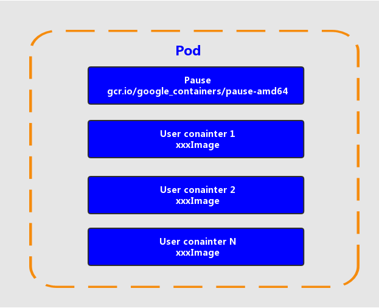
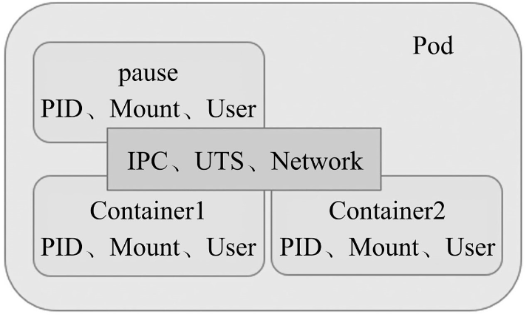

### pod介绍

#### pod概念

> ```
> Pod是k8s的最重要也最基本的概念，每个Pod都有一个特殊的被称为“根容器”的Pause容器
> Pause容器对应的镜像属于k8s平台的一部分，除了Pause容器，每个Pod还包含一个或多个紧密相关的用户业务容器
> ```
>
>   


#### pod特点

> ```
> ### docker隔离了哪些资源
> 1 - UTS 主机名和域名
> UTS 全称为 UNIX Time-sharing System 该种隔离提供对于主机名和域名的隔离，Docker利用该种隔离机制为每个Docker提供独立的机器名和域名，在网络中就可以被当做单独的一个服务节点使用
> 
> 2 - IPC 信号量、消息队列、共享内存
> IPC的全称是 Inter-Process Communication 是Linux系统提供的进程间通信机制，常见的包括 信号量、消息队列、共享内存等。申请IPC资源其实就是向内核申请了一个全局唯一的32位ID，在同一个IPC namespace下的进程彼此可见，不同IPC namespace下的进程互不可见。Docker运用该机制实现了容器之间IPC的隔离
> 
> 3 - PID 进程号
> PID 是Linux系统的进程号，每个pid namespace 中都有一个计数器用于标识当前最大的PID，pid namespace隔离可以对每个namespace中pid计数器重新标号，不同pid namespace中的进程可以拥有相同的pid号。内核中对PID namespace 的组织是个树状结构，在树形的父节点中可以看到子节点的所有进程，反之则不行。即父级 pid namespace可以看到子级pid namespace中所有的进程，并可以对其进行管理，而子级pid namespace中进程无法看到且管理兄弟或父级pid namespace
> 
> 4 - Mount 文件系统(挂载点)
> Mount namespace 通过隔离文件系统的挂载点提供对隔离文件系统的支持。在创建新的mount ns时，系统会复制当前的文件结构给新的namespace。在新的nsmespace中进行的相关操作则不会再影响以前的ns
> 
> 5 - Network 网络设备、网络栈、端口
> Network ns主要提供关于网络资源的隔离，包括网络设备、协议栈、路由表、防火墙、/proc/net目录、/sys/class/net目录、socket等的隔离
> 
> 6 - User 用户和用户组
> User ns主要提供用户安全相关的隔离，例如用户组ID、用户ID、root目录、秘钥文件等隔离。通过该隔离手段可以达到更加灵活的权限控制。例如，某个用户在宿主机上拥有普通用户权限，但是其进入容器后却可以用于容器的root权限，也就是说，容器里的root用户并不是真正的root用户，映射到宿主机上只是宿主机上一个普通用户而已
> 
> 
> ### pod中的容器隔离和共享了哪些资源
> ## 资源共享
> uts、ipc、network
> 
> ## 资源隔离
> pid、mount、user
> ```
> 
>   


#### pod常用命令

> ```shell
> ### 1. 创建资源对象
> # 使用命令行创建pod资源
> kubectl run nginx --image=nginx:latest --port=80 --replicas=3
> 
> ### 2. 查看pod对象
> # 查看某个名称空间下的所有Pod列表
> kubectl get pods
> # 显示Pod的更多信息
> kubectl get pod <pod-name> -o wide 
> # 以yaml格式显示Pod的详细信息
> kubectl get pod <pod-name> -o yaml 
> # 查看所有命名空间
> kubectl get namespaces 
> # 查看所有命令空间pod
> kubectl get pod --all-namespaces  或者 kubectl get pod -A
> # 查看指定命名空间pod信息
> kubectl get pod -n kube 
> # 查看所有pod标签信息
> kubectl get pods --show-labels 
> # 查看指定标签的pod
> kubectl get pods -l app=rs-demo 
> 
> ### 3. 查看pod对象的详细信息
> # 显示Pod的详细信息
> kubectl describe pods <pod-name> 
> 
> ### 4. 查看容器中的日志信息
> # 查看容器的日志
> kubectl logs <pod-name> 
> # 实时查看日志
> kubectl logs -f <pod-name> 
> 
> ### 5. 在pod中执行命令
> # 执行Pod的data命令，默认是用Pod中的第一个容器执行
> kubectl exec <pod-name> data 
> # 指定Pod中某个容器执行data命令
> kubectl exec <pod-name> -c <container-name> data 
> # 通过bash获得Pod中某个容器的TTY，相当于登录容器
> kubectl exec -it <pod-name> -c <container-name> bash 
> 
> ### 6. 删除pod对象
> # 基于Pod.yaml定义的名称删除Pod
> kubectl delete -f pod.yaml 
> # 删除所有包含某个label的Pod
> kubectl delete pods -l name=<label-name> 
> # 删除所有Pod
> kubectl delete pods --all 
> 
> ### 7. 其他相关命令
> # 编辑名为 docker-registry 的 pod
> kubectl edit pod docker-registry  
> # 获取相关的使用帮助
> kubectl explain pods 
> kubectl explain pods.spec 
> # 给pod资源添加lables标签
> kubectl label pods/pod-with-labels version=v1 
> # 修改已有pod资源标签
> kubectl label pods/pod-with-labels version=v2 --overwrite 
> ```


#### pod yaml配置文件资源模板

> ```yaml
> apiVersion: v1 # api 文档版本
> kind: Pod  # 资源对象类型，也可以配置为像Deployment、StatefulSet这一类的对象
> metadata: # Pod 相关的元数据，用于描述 Pod 的数据
>   name: nginx-demo # Pod 的名称
>   labels: # 定义 Pod 的标签
>     type: app # 自定义 label 标签，名字为 type，值为 app
>     test: 1.0.0 # 自定义 label 标签，描述 Pod 版本号
>   namespace: 'default' # 命名空间的配置
> spec: # 期望 Pod 按照这里面的描述进行创建
>   containers: # 对于 Pod 中的容器描述
>   - name: nginx # 容器的名称
>     image: nginx:1.7.9 # 指定容器的镜像
>     # 镜像拉取策略，指定如果本地有就用本地的，如果没有就拉取远程的
>     imagePullPolicy: IfNotPresent 
>     command: # 指定容器启动时执行的命令
>     - nginx
>     - -g
>     - 'daemon off;' # nginx -g 'daemon off;'
>     workingDir: /usr/share/nginx/html # 定义容器启动后的工作目录
>     ports:
>     - name: http # 端口名称
>       containerPort: 80 # 描述容器内要暴露什么端口
>       protocol: TCP # 描述该端口是基于哪种协议通信的
>     - env: # 环境变量
>       name: JVM_OPTS # 环境变量名称
>       value: '-Xms128m -Xmx128m' # 环境变量的值
>     reousrces:
>       requests: # 最少需要多少资源
>         cpu: 100m # 限制 cpu 最少使用 0.1 个核心
>         memory: 128Mi # 限制内存最少使用 128兆
>       limits: # 最多可以用多少资源
>         cpu: 200m # 限制 cpu 最多使用 0.2 个核心
>         memory: 256Mi # 限制 最多使用 256兆
>   restartPolicy: OnFailure # 重启策略，只有失败的情况才会重启  
> ```
>


### 探针

> ```
> 容器内应用的监测机制，根据不同的探针来判断容器应用当前的状态
> ```


#### 参数配置

> ```
> initialDelaySeconds: 60 # 初始化时间
> timeoutSeconds: 2 # 超时时间
> periodSeconds: 5 # 监测间隔时间
> successThreshold: 1 # 检查1次成功就表示成功
> failureThreshold: 2 # 监测失败2次就表示失败
> ```


#### 类型

##### StartupProbe

> ```
> k8s 1.16 版本新增的探针，用于判断应用程序是否已经启动了
> 
> 当配置了startupProbe后，会先禁用其他探针，直到startupProbe成功后，其他探针才会继续
> 
> 作用：由于有时候不能准确预估应用一定是多长时间启动成功，因此配置另外两种方式不方便配置初始化时长来检测，而配置了statupProbe后，只有在应用启动成功了，才会执行另外两种探针，可以更加方便的结合使用另外两种探针使用
> 
> startupProbe:
>   httpGet:
>     path: /api/startup
>     port: 80
> ```

##### LivenessProbe

> ```
> 用于探测容器中的应用是否运行，如果探测失败，kubelet会根据配置的重启策略进行重启，若没有配置，默认就认为容器启动成功，不会执行重启策略
> 
> livenessProbe:
>   failureThreshold: 5
>   httpGet:
>     path: /health
>     port: 8080
>     scheme: HTTP
>   initialDelaySeconds: 60
>   periodSeconds: 10
>   successThreshold: 1
>   timeoutSeconds: 5
> ```

##### ReadinessProbe

> ```
> 用于探测容器内的程序是否健康，它的返回值如果返回success，那么就认为该容器已经完全启动，并且该容器是可以接收外部流量的
> 
> readinessProbe:
>   failureThreshold: 3 # 错误次数
>   httpGet:
>     path: /ready
>     port: 8181
>     scheme: HTTP
>   periodSeconds: 10 # 间隔时间
>   successThreshold: 1
>   timeoutSeconds: 1
> ```


#### 探测方式

##### ExecAction

> ```
> 在容器内部执行一个命令，如果返回值为 0，则任务容器时健康的。
> 
> livenessProbe:
>   exec:
>     command:
>       - cat
>       - /health    
> ```

##### TCPSocketAction

> ```
> 通过 tcp 连接监测容器内端口是否开放，如果开放则证明该容器健康
> 
> livenessProbe:
>   tcpSocket:
>     port: 80
> ```

##### HTTPGetAction

> ```
> 生产环境用的较多的方式，发送 HTTP 请求到容器内的应用程序，如果接口返回的状态码在 200~400 之间，则认为容器健康。
> 
> livenessProbe:
>   failureThreshold: 5
>   httpGet:
>     path: /health
>     port: 8080
>     scheme: HTTP
>     httpHeaders:
>       - name: xxx
>         value: xxx
> ```


### 生命周期

#### pod退出流程

> ```
> 执行删除操作后
> 1. Endpoint删除pod的ip地址
> 
> 2. Pod变成Terminating状态
> 变为删除中的状态后，会给pod一个宽限期，让pod去执行一些清理或销毁操作
> 配置参数：
> # 作用于pod中的所有容器
> terminationGracePeriodSeconds: 30
> containers:
>   - xxx
> 
> 3. 执行 preStop 的指令
> 
> 
> PreStop的应用
> 如果应用销毁操作耗时需要比较长，可以在preStop按照如下方式进行配置
> preStop:
> exec:
>  command:
>         - sh
>          - -c
>       - 'sleep 20; kill pgrep java'
> 
> 但是需要注意，由于k8s默认给pod的停止宽限时间为30s，如果我们停止操作会超过30s时，不要光设置sleep 50，还要将terminationGracePeriodSeconds: 30 也更新成更长的时间，否则k8s最多只会在这个时间的基础上再宽限几秒，不会真正等待50s
> 
> 
> 用途
> 1. 注册中心下线
> 2. 数据清理
> 3. 数据销毁
> ```


### pod资源需求与限制

```text
CPU：一个核心（1core）相当于1000个微核心（millicores），因此500m相当于是0.5个核心，即二分之一个核心
例如: 使用半个核"500m"，使用1个核心"1"

内存：默认单位是字节，也可以使用E、P、T、G、M和K作为单位后缀，或Ei、Pi、Ti、Gi、Mi和Ki形式的单位后缀
例如: 使用128M "128Mi"

##
reousrces: # 资源限制
  requests: # 最少需要多少资源
    cpu: 100m # 限制 cpu 最少使用 0.1 个核心
    memory: 128Mi # 限制内存最少使用 128兆
  limits: # 最多可以用多少资源
    cpu: 200m # 限制 cpu 最多使用 0.2 个核心
    memory: 256Mi # 限制 最多使用 256兆
        
limits属性则用于限制资源可用的最大值，即硬限制，如果pod使用的资源超过该限制，控制器将会杀死该pod

Pod资源的默认重启策略为Always，在资源达到硬限制而被终止后会立即重启
多次重复的因为资源耗尽而重启会触发ks8系统的重启延迟机制，即每次重启的时间间隔会不断地拉长
于是，用户看到的Pod资源的相关状态通常为“CrashLoopBackOff”

在编写资源清单时，强烈建议添加limits参数，防止pod异常导致占用节点过多资源，从而导致该节点上的其他pod因资源不足而异常退出
只设置limits而未设置requests时，默认的requests值等于limits值
```


### pod服务质量（优先级）

```text
k8s允许节点资源对limits的过载使用
当在内存、cpu等资源紧缺时，节点无法同时满足其上的所有Pod对象以资源满载的方式运行
k8s会通过Pod对象的优先级完成先后终止哪些Pod对象判定

根据Pod对象的requests和limits属性，k8s将Pod对象归类到BestEffort、Burstable和Guaranteed三个服务质量（Quality of Service, QoS）类别下

1. Guaranteed：每个容器都为CPU、内存等资源设置了具有相同值的requests和limits属性，这类Pod资源具有最高优先级

2. Burstable：至少有一个容器设置了CPU或内存资源的requests属性，它们具有中等优先级

3. BestEffort：没有为任何一个容器设置requests或limits属性，它们的优先级为最低级别

运行等级 Guaranteed > Burstable > BestEffort

注意： 在内存、cpu等资源紧缺时，
BestEffort类别的容器最先被终止，因为系统不为其提供任何级别的资源保证，但换来的好处是，它们能够在可用时做到尽可能多地占用资源
若已然不存任何BestEffort类别的容器，则接下来是有着中等优先级的Burstable类别的Pod被终止
Guaranteed类别的容器拥有最高优先级，它们不会被杀死，除非其内存资源需求超限，或者OOM时没有其他更低优先级的Pod资源存在
```

