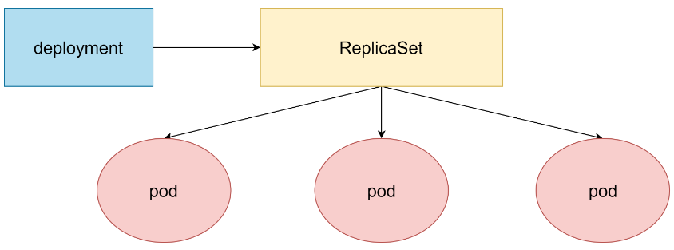
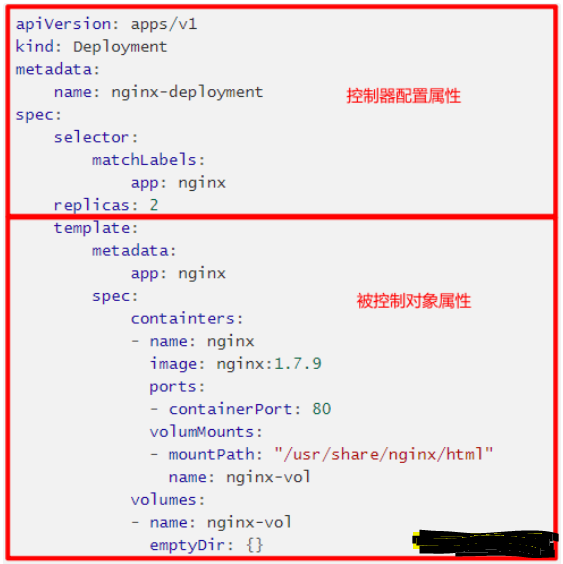

### 概述

> ```text
> k8s的Deployment控制器是用于管理Pod的更高层次的抽象
> Deployment并不直接管理Pod，而是通过管理ReplicaSet来间接管理Pod
> 这意味着Deployment的功能比ReplicaSet更加强大，因为它可以提供更高级别的抽象和更灵活的管理策略
> 
> 在k8s中大部分都是用Deployment发布业务服务
> 
> Deployment的主要功能
> 1. 扩缩容：Deployment支持对Pod进行扩缩容操作，可以根据需要增加或减少Pod的数量
> 2. 滚动更新和回滚：Deployment支持滚动更新，可以在不中断服务的情况下更新Pod的镜像版本。同时，它也支持    版本回滚，如果新版本出现问题，可以回滚到之前的版本
> 3. 停止和继续：Deployment支持暂停和继续发布，可以在必要时暂停发布，稍后再继续
> 
> Deployment的资源清单文件
> Deployment的资源清单文件包括以下几个部分
> 1. apiVersion: 指定使用的API版本，例如apps/v1
> 2. kind: 指定资源类型，通常为Deployment
> 3. metadata: 包含名称、命名空间等元数据
> 4. spec: 包含详细的配置信息，如副本数量、选择器、模板等
> 5. replicas: 指定Pod的副本数量
> 6. selector: 用于选择哪些Pod由Deployment管理
> 7. template: 定义Pod的模板，包括元数据、规格等
> 
> 命令行操作示例
> 使用命令行操作Deployment时，可以使用以下命令
> kubectl apply -f deployment.yaml：应用Deployment配置文件
> 
> kubectl get deployments：查看所有Deployments
> 
> kubectl describe deployment <deployment-name>：查看指定Deployment的详细信息
> 
> kubectl rollout status deployment/<deployment-name>：查看Deployment的滚动更新状态
> kubectl rollout history deployment/<deployment-name>：查看Deployment的历史版本
> kubectl rollout undo deployment/<deployment-name>：回滚到上一个版本
> ```
>
>   
>
>    


### 资源清单模板

>   
>
> ```yaml
> apiVersion: apps/v1                    
> kind: Deployment                      
> metadata:                             
>   name: pod-controller                # deploy名称 
>   namespace: dev                      # deploy所属命名空间 
>   labels:                             # 给deploy打标签 
>     controller: deploy 
> spec:                                
>   replicas: 3                         # pod副本数量。默认是1
>   revisionHistoryLimit: 3             # 保留ReplicaSet历史版本数量，默认为10 
>   paused: false                       # 暂停部署，默认是false 
>   progressDeadlineSeconds: 600        # 部署超时时间(s)，默认是600 
>   strategy:                           # Pod更新策略，默认是RollingUpdate 
>     type: RollingUpdate               # 滚动更新策略。另一种是Recreate，其没有子属性配置参数 
>     rollingUpdate:                    # 当type为RollingUpdate的时候生效，为其配置参数
>       maxSurge: 25%                   # 升级过程中可以超过期望的Pod的最大数量，可以为百分比，也可以为整数。默认是25%
>       maxUnavailable: 25%             # 升级过程中最大不可用状态的Pod数量，可以为百分比，也可以为整数。默认是25% 
>   selector:                           # 选择器，通过该控制器管理哪些pod 
>     matchLabels:                      # Labels匹配规则。和matchExpressions类似
>       app: nginx-pod 
>     matchExpressions:                 # Expressions匹配规则。和matchLabels类似 
>       - {key: app, operator: In, values: ["nginx-pod"]} 
>   template:                           # pod副本创建模板。属性和Pod的属性一样
>     metadata: 
>       labels: 
>         app: nginx-pod 
>     spec: 
>       containers: 
>       - name: nginx 
>         image: nginx:latest
>         ports: 
>         - name: nginx-port
>           containerPort: 80
>           protocol: TCP
> ```


### 创建

#### 创建

> pod-deployment.yaml
>
> ```yaml
> apiVersion: apps/v1
> kind: Deployment
> metadata:
>   name: pod-controller
>   namespace: alnk-test
>   labels:
>     controller: deploy 
> spec:
>   replicas: 3
>   selector:
>     matchLabels:
>       app: nginx-pod
>   template:
>     metadata:
>       labels:
>         app: nginx-pod
>     spec:
>       containers:
>         - name: nginx
>           image: harbor.alnk.com/public/nginx:1.27.1
>           ports:
>             - name: nginx-port
>               containerPort: 80
>               protocol: TCP
> ```
>
> ```shell
> # 创建名称空间
> # kubectl create ns alnk-test
> 
> # 应用yaml文件
> # kubectl apply -f pod-deployment.yaml
> deployment.apps/pod-controller created
> 
> # --record 参数，这个在生产中作为资源创建更新用来回滚的重要标记，强烈建议在生产中操作时都加上这个参数
> # kubectl apply -f pod-deployment.yaml --record
> Flag --record has been deprecated, --record will be removed in the future
> deployment.apps/pod-controller created
> ```

#### 查看

> ```shell
> # kubectl -n alnk-test get deployments.apps
> NAME             READY   UP-TO-DATE   AVAILABLE   AGE
> pod-controller   3/3     3            3           74s
> # UP-TO-DATE表示更新时最新版本的Pod数量
> 
> # 具体看下pod运行在哪些node节点
> # kubectl -n alnk-test get pod -o wide
> ```

#### 扩缩容

> ```shell
> # 方式一：使用命令编辑文本内容：spec: replicas: 4
> # kubectl -n alnk-test edit deploy pod-controller 
> 
> # 方式二：直接使用命令
> # kubectl -n alnk-test scale deploy pod-controller --replicas=2
> ```


#### deployment创建过程

> ```text
> ## deployment创建过程
> 1. kubectl命令将deployment配置文件提交到apiserver，apierver会进行认证鉴权、校验等操作，确保请求的有 效性，并将deployment的信息存储到etcd
> 
> 2. Controller Manager会监听etcd中的资源变化事件，当新的deployment被创建时，deployment controller会根据deployment配置文件中的规格说明，创建一个或多个replicaSet对象。replicaSet负责确保pod的副本数量符合期望的状态， ReplicaSet Controller监听ReplicaSet的创建事件，并根据ReplicaSet的规格说明（通过Pod模板）创建相应数量的Pod
> 
> 3. Scheduler它监听新创建的Pod事件，并根据调度策略（如节点亲和性、污点、容忍、硬件资源等）为Pod选择一个合适的节点。调度完成后，Scheduler会将Pod与节点的绑定信息回写到etcd
> 
> 4. Kubelet进程监听etcd中的pod变化事件，发现有新的pod被调度到本节点时，Kubelet会调用容器运行时（如Docker、containerd等）来创建和启动容器。同时Kubelet还负责Pod的生命周期管理，包括健康检查、日志收集等
> 
> 5. Kube-Proxy是运行在集群各个节点上的网络代理，它负责实现服务发现和负载均衡。当有外部请求访问服务时，Kube-Proxy会根据服务的Endpoints信息将请求转发到正确的Pod或容器上
> 
> 
> 补充：
> 这些应用的配置和当前服务的状态信息都是保存在ETCD中
> 执行kubectl get pod等操作时API Server会从ETCD中读取这些数据
> 
> calico会为每个pod分配一个ip，但要注意这个ip不是固定的，它会随着pod的重启而发生变化
> 
> Node管理：
> 禁止pod调度到该节点上
> kubectl cordon <node name> --delete-emptydir-data --ignore-daemonsets
> 
> 驱逐该节点上的所有pod
> kubectl drain <node name>
> 
> 该命令会删除该节点上的所有Pod（DaemonSet除外），在其他node上重新启动它们
> 通常该节点需要维护时使用该命令
> 直接使用该命令会自动调用kubectl cordon <node>命令
> 当该节点维护完成，启动了kubelet后
> 再使用kubectl uncordon <node>即可将该节点添加到kubernetes集群中
> ```


### 镜像版本变更

#### 概述

> ```text
> 新的Pod替代旧的Pod支持两种镜像更新策略
> 1. 重建更新Recreate：在创建出新的Pod之前会先杀掉所有已经存在的Pod
> 2. 滚动更新RollingUpdate(默认)：先杀死一部分，再启动一部分。再杀死一部分，再启动一部分。如此循环。    在更新过程中，存在两个版本的Pod
> 
> 通过strategy属性进行配置
> ```

#### 重建更新

> pod-deployment.yaml
>
> ```yaml
> apiVersion: apps/v1
> kind: Deployment
> metadata:
>   name: pod-controller
>   namespace: alnk-test
>   labels:
>     controller: deploy 
> spec:
>   replicas: 3
>   strategy:
>     type: Recreate
>   selector:
>     matchLabels:
>       app: nginx-pod
>   template:
>     metadata:
>       labels:
>         app: nginx-pod
>     spec:
>       containers:
>         - name: nginx
>           image: harbor.alnk.com/public/nginx:1.27.1
>           ports:
>             - name: nginx-port
>               containerPort: 80
>               protocol: TCP
> ```
>
> ```shell
> # 创建应用
> # kubectl apply -f pod-deployment.yaml
> 
> # 更新镜像版本
> # kubectl -n alnk-test set image deploy pod-controller nginx=harbor.alnk.com/public/nginx:latest
> 
> # 持续查看Pod版本变更情况
> # kubectl -n alnk-test get pod -w
> NAME                              READY   STATUS    RESTARTS   AGE
> pod-controller-686bff86bd-9jpz5   1/1     Running   0          18m
> pod-controller-686bff86bd-klgxv   1/1     Running   0          7s
> pod-controller-686bff86bd-s5bgv   1/1     Running   0          18m
> 
> pod-controller-686bff86bd-klgxv   1/1     Terminating   0          20s
> pod-controller-686bff86bd-s5bgv   1/1     Terminating   0          19m
> pod-controller-686bff86bd-9jpz5   1/1     Terminating   0          19m
> 
> pod-controller-686bff86bd-9jpz5   0/1     Terminating   0          19m
> pod-controller-686bff86bd-9jpz5   0/1     Terminating   0          19m
> pod-controller-686bff86bd-9jpz5   0/1     Terminating   0          19m
> pod-controller-686bff86bd-klgxv   0/1     Terminating   0          21s
> pod-controller-686bff86bd-klgxv   0/1     Terminating   0          21s
> pod-controller-686bff86bd-klgxv   0/1     Terminating   0          21s
> pod-controller-686bff86bd-s5bgv   0/1     Terminating   0          19m
> pod-controller-686bff86bd-s5bgv   0/1     Terminating   0          19m
> pod-controller-686bff86bd-s5bgv   0/1     Terminating   0          19m
> 
> pod-controller-7ccc586df4-jg9nr   0/1     Pending       0          0s
> pod-controller-7ccc586df4-4gl7d   0/1     Pending       0          0s
> pod-controller-7ccc586df4-rhpxg   0/1     Pending       0          0s
> pod-controller-7ccc586df4-4gl7d   0/1     Pending       0          0s
> pod-controller-7ccc586df4-rhpxg   0/1     Pending       0          0s
> pod-controller-7ccc586df4-jg9nr   0/1     Pending       0          0s
> 
> pod-controller-7ccc586df4-rhpxg   0/1     ContainerCreating   0          0s
> pod-controller-7ccc586df4-4gl7d   0/1     ContainerCreating   0          0s
> pod-controller-7ccc586df4-jg9nr   0/1     ContainerCreating   0          0s
> 
> pod-controller-7ccc586df4-4gl7d   1/1     Running             0          1s
> pod-controller-7ccc586df4-rhpxg   1/1     Running             0          6s
> pod-controller-7ccc586df4-jg9nr   1/1     Running             0          6s
> ```

#### 滚动更新

> pod-deployment.yaml
>
> ```yaml
> apiVersion: apps/v1
> kind: Deployment
> metadata:
>   name: pod-controller
>   namespace: alnk-test
>   labels:
>     controller: deploy 
> spec:
>   replicas: 3
>   # 注意这里，这个就是用来控制rs新旧版本迭代更新的一个频率
>   # 滚动更新的副本总数最大值(以2的基数为例)：2+2*25%=2.5 -- > 3，
>   # 可用副本数最大值(默认值两个都是25%)：2-2*25%=1.5 --> 2
>   strategy:
>     type: RollingUpdate
>     rollingUpdate:
>       maxUnavailable: 25%
>       maxSurge: 25%
>   selector:
>     matchLabels:
>       app: nginx-pod
>   template:
>     metadata:
>       labels:
>         app: nginx-pod
>     spec:
>       containers:
>         - name: nginx
>           image: harbor.alnk.com/public/nginx:1.27.1
>           ports:
>             - name: nginx-port
>               containerPort: 80
>               protocol: TCP
> ```
>
> ```shell
> # 创建应用
> # kubectl apply -f pod-deployment.yaml
> 
> # 更新镜像版本
> # kubectl -n alnk-test set image deploy pod-controller nginx=harbor.alnk.com/public/nginx:latest
> 
> # 持续查看Pod版本变更情况
> # kubectl -n alnk-test get pod -w
> NAME                              READY   STATUS    RESTARTS   AGE
> # 原有的3个pod
> pod-controller-686bff86bd-7s88d   1/1     Running   0          6s
> pod-controller-686bff86bd-n7n8c   1/1     Running   0          4s
> pod-controller-686bff86bd-pdzrp   1/1     Running   0          7s
> 
> # 创建一个新pod tm9wg
> pod-controller-7ccc586df4-tm9wg   0/1     Pending   0          0s
> pod-controller-7ccc586df4-tm9wg   0/1     Pending   0          0s
> pod-controller-7ccc586df4-tm9wg   0/1     ContainerCreating   0          0s
> pod-controller-7ccc586df4-tm9wg   1/1     Running             0          2s
> 
> # 干掉一个老pod n7n8c
> pod-controller-686bff86bd-n7n8c   1/1     Terminating         0          12s
> pod-controller-686bff86bd-n7n8c   0/1     Terminating         0          13s
> pod-controller-686bff86bd-n7n8c   0/1     Terminating         0          13s
> pod-controller-686bff86bd-n7n8c   0/1     Terminating         0          13s
> 
> # 创建一个新pod vq5gq
> pod-controller-7ccc586df4-vq5gq   0/1     Pending             0          0s
> pod-controller-7ccc586df4-vq5gq   0/1     Pending             0          0s
> pod-controller-7ccc586df4-vq5gq   0/1     ContainerCreating   0          0s
> pod-controller-7ccc586df4-vq5gq   1/1     Running             0          1s
> 
> # 干掉一个老pod 7s88d
> pod-controller-686bff86bd-7s88d   1/1     Terminating         0          15s
> pod-controller-686bff86bd-7s88d   0/1     Terminating         0          16s
> pod-controller-686bff86bd-7s88d   0/1     Terminating         0          16s
> pod-controller-686bff86bd-7s88d   0/1     Terminating         0          16s
> 
> # 创建一个新pod tbvh2
> pod-controller-7ccc586df4-tbvh2   0/1     Pending             0          0s
> pod-controller-7ccc586df4-tbvh2   0/1     Pending             0          0s
> pod-controller-7ccc586df4-tbvh2   0/1     ContainerCreating   0          0s
> pod-controller-7ccc586df4-tbvh2   1/1     Running             0          2s
> 
> # 干掉一个老pod pdzrp
> pod-controller-686bff86bd-pdzrp   1/1     Terminating         0          18s
> pod-controller-686bff86bd-pdzrp   0/1     Terminating         0          19s
> pod-controller-686bff86bd-pdzrp   0/1     Terminating         0          19s
> pod-controller-686bff86bd-pdzrp   0/1     Terminating         0          19s
> 
> 
> # 查看ReplicaSet情况
> # 可以看到原来的rs依旧存在，只是Pod的数量变为0
> # 这就是Deployment可以进行版本回退的原因
> # kubectl -n alnk-test get rs
> NAME                        DESIRED   CURRENT   READY   AGE
> pod-controller-686bff86bd   0         0         0       25m
> pod-controller-7ccc586df4   3         3         3       6m25s
> ```


### 版本回退

> ```text
> Deployment支持版本升级过程中的暂停、继续功能，以及版本回退等功能
> 
> 版本回退的命令语法如下所示
> # kubetl rollout 参数 deploy deploy-name
> 
> 支持的参数如下
> status：显示当前升级的状态
> history：显示升级历史记录。kubectl apply -f deploy.yaml需要加上--record参数，CHANGE-CAUSE字段才有数据
> pause：暂停版本升级过程
> resume：继续已经暂停的版本升级过程
> restart：重启版本升级过程
> undo：回滚到上一个版本(可以使用–to-revision参数回滚到指定的版本，可通过history进行查看版本号)
> ```

#### 查看当前升级版本的状态

> ```shell
> # kubectl -n alnk-test rollout status deployment pod-controller 
> deployment "pod-controller" successfully rolled out
> ```

#### 查看升级历史记录

> ```shell
> # kubectl -n alnk-test rollout history deployment pod-controller
> deployment.apps/pod-controller
> REVISION  CHANGE-CAUSE
> 3         <none>
> 4         <none>
> ```

#### 版本回退

> ```shell
> # 回退到3这个版本
> # 回退的时候将当前版本的Pod数量降为0，然后将回退版本的Pod数量提升为目标数量
> 
> # 先查看镜像
> # kubectl -n alnk-test  get deployment pod-controller -o wide
> ... harbor.alnk.com/public/nginx:latest   app=nginx-pod
> 
> # 先查看rs
> # kubectl -n alnk-test get rs
> NAME                        DESIRED   CURRENT   READY   AGE
> pod-controller-686bff86bd   0         0         0       34m
> pod-controller-7ccc586df4   3         3         3       15m
> 
> # 回退
> # kubectl -n alnk-test rollout undo deployment pod-controller --to-revision=3
> 
> # 再查看镜像
> # kubectl -n alnk-test  get deployment pod-controller -o wide
> ... harbor.alnk.com/public/nginx:1.27.1   app=nginx-pod
> 
> # 再查看rs
> # kubectl -n alnk-test get rs
> NAME                        DESIRED   CURRENT   READY   AGE
> pod-controller-686bff86bd   3         3         3       38m
> pod-controller-7ccc586df4   0         0         0       19m
> ```


### 金丝雀发布/灰度发布

> ```shell
> # Deployment支持更新过程中的控制，如暂停版本变更(pause)或继续版本变更操作(resume)
> # 暂停版本变更操作，可以检查变更后的Pod能否正常提供服务
> # 如不能则可以进行回退。如可以则继续版本变更操作
> # 变更Deployment的版本，并配置暂停Deployment
> 
> # 查看rs
> # kubectl -n alnk-test get rs
> NAME                        DESIRED   CURRENT   READY   AGE
> pod-controller-686bff86bd   3         3         3       43m
> pod-controller-7ccc586df4   0         0         0       24m
> 
> # 变更并暂停deployment
> # kubectl -n alnk-test set image deploy pod-controller nginx=harbor.alnk.com/public/nginx:latest && kubectl -n alnk-test rollout pause deployment pod-controller
> 
> # 再次查看rs，发现2个rs都可用
> # kubectl -n alnk-test get rs
> NAME                        DESIRED   CURRENT   READY   AGE
> pod-controller-686bff86bd   3         3         3       43m
> pod-controller-7ccc586df4   1         1         1       24m
> 
> # 查看pod，发现pod变为4个
> # kubectl -n alnk-test get pod
> NAME                              READY   STATUS    RESTARTS   AGE
> pod-controller-686bff86bd-5qzpd   1/1     Running   0          6m42s
> pod-controller-686bff86bd-ltfsw   1/1     Running   0          6m43s
> pod-controller-686bff86bd-qc7rz   1/1     Running   0          6m45s
> pod-controller-7ccc586df4-ztfxg   1/1     Running   0          17s
> 
> # 查看版本变更状态
> # kubectl -n alnk-test rollout status deployment pod-controller
> Waiting for deployment "pod-controller" rollout to finish: 1 out of 3 new replicas have been updated...
> 
> # 确保变更后的Pod没问题之后，继续更新
> # kubectl -n alnk-test rollout resume deployment pod-controller
> 
> # kubectl -n alnk-test get rs
> NAME                        DESIRED   CURRENT   READY   AGE
> pod-controller-686bff86bd   0         0         0       47m
> pod-controller-7ccc586df4   3         3         3       27m
> 
> # kubectl -n alnk-test get pod
> NAME                              READY   STATUS    RESTARTS   AGE
> pod-controller-7ccc586df4-lsvm8   1/1     Running   0          9s
> pod-controller-7ccc586df4-m6knj   1/1     Running   0          11s
> pod-controller-7ccc586df4-ztfxg   1/1     Running   0          3m16s
> ```


### 删除

> ```shell
> # Deployment管理的ReplicaSet和Pod也会一起被删除
> # kubectl delete -f pod-deployment.yaml
> deployment.apps "pod-controller" deleted
> ```


### 案例：nginx生产进阶yaml配置

> ```yaml
> ---
> kind: Service
> apiVersion: v1
> metadata:
>   name: new-nginx
> spec:
>   selector:
>     app: new-nginx
>   ports:
>     - name: http-port
>       port: 80
>       protocol: TCP
>       targetPort: 80
> 
> ---
> # 新版本k8s的ingress配置
> apiVersion: networking.k8s.io/v1
> kind: Ingress
> metadata:
>   name: new-nginx
>   annotations:
>     nginx.ingress.kubernetes.io/force-ssl-redirect: "true"
>     nginx.ingress.kubernetes.io/whitelist-source-range: 0.0.0.0/0
>     nginx.ingress.kubernetes.io/configuration-snippet: |
>       if ($host != 'www.alnk.com' ) {
>         rewrite ^ http://www.alnk.com$request_uri permanent;
>       }
> spec:
>   rules:
>     - host: alnk.com
>       http:
>         paths:
>           - backend:
>               service:
>                 name: new-nginx
>                 port:
>                   number: 80
>             path: /
>             pathType: Prefix
>     - host: m.alnk.com
>       http:
>         paths:
>           - backend:
>               service:
>                 name: new-nginx
>                 port:
>                   number: 80
>             path: /
>             pathType: Prefix
>     - host: www.alnk.com
>       http:
>         paths:
>           - backend:
>               service:
>                 name: new-nginx
>                 port:
>                   number: 80
>             path: /
>             pathType: Prefix
> #  tls:
> #      - hosts:
> #          - alnk.com
> #          - m.alnk.com
> #          - www.alnk.com
> #        secretName: alnk-com-tls
> 
> #  kubectl -n <namespace> create secret tls alnk-com-tls --key alnk.key --cert alnk.csr
> 
> ---
> apiVersion: apps/v1
> kind: Deployment
> metadata:
>   name: new-nginx
>   labels:
>     app: new-nginx
> spec:
>   replicas: 2
>   selector:
>     matchLabels:
>       app: new-nginx
>   template:
>     metadata:
>       labels:
>         app: new-nginx
>     spec:
>       containers:
> #--------------------------------------------------
>       - name: new-nginx
>         image: nginx:1.21.6
> #        image: nginx:1.25.1
>         env:
>           - name: TZ
>             value: Asia/Shanghai
>         ports:
>         - containerPort: 80
>         volumeMounts:
>           - name: html-files
>             mountPath: "/usr/share/nginx/html"
> #--------------------------------------------------
>       - name: busybox
>         image: registry.cn-shanghai.aliyuncs.com/acs/busybox:v1.29.2
> #        image: nicolaka/netshoot
>         args:
>         - /bin/sh
>         - -c
>         - >
>            while :; do
>              if [ -f /html/index.html ];then
>                echo "[$(date +%F\ %T)] ${MY_POD_NAMESPACE}-${MY_POD_NAME}-${MY_POD_IP}" > /html/index.html
>                sleep 1
>              else
>                touch /html/index.html
>              fi
>            done
>         env:
>           - name: TZ
>             value: Asia/Shanghai
>           - name: MY_POD_NAME
>             valueFrom:
>               fieldRef:
>                 apiVersion: v1
>                 fieldPath: metadata.name
>           - name: MY_POD_NAMESPACE
>             valueFrom:
>               fieldRef:
>                 apiVersion: v1
>                 fieldPath: metadata.namespace
>           - name: MY_POD_IP
>             valueFrom:
>               fieldRef:
>                 apiVersion: v1
>                 fieldPath: status.podIP
>         volumeMounts:
>           - name: html-files
>             mountPath: "/html"
>           - mountPath: /etc/localtime
>             name: tz-config
> 
> #--------------------------------------------------
>       volumes:
>         - name: html-files
>           emptyDir:
>             medium: Memory
>             sizeLimit: 10Mi
>         - name: tz-config
>           hostPath:
>             path: /usr/share/zoneinfo/Asia/Shanghai
> ```

