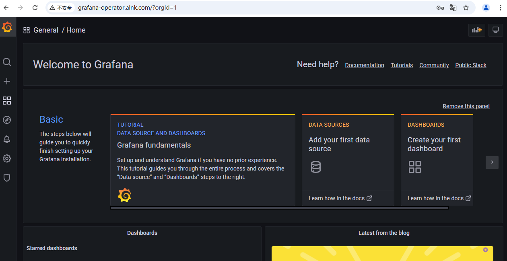
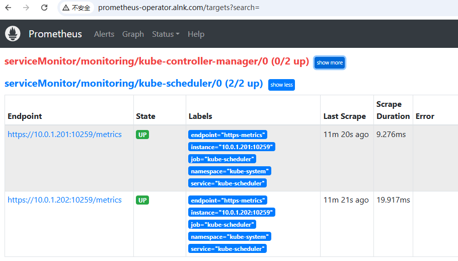
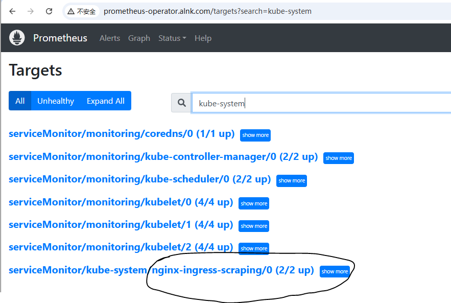
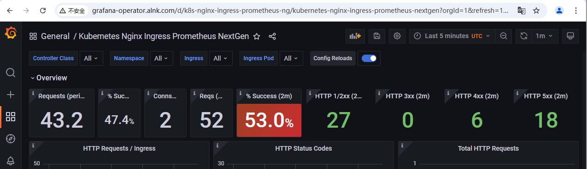
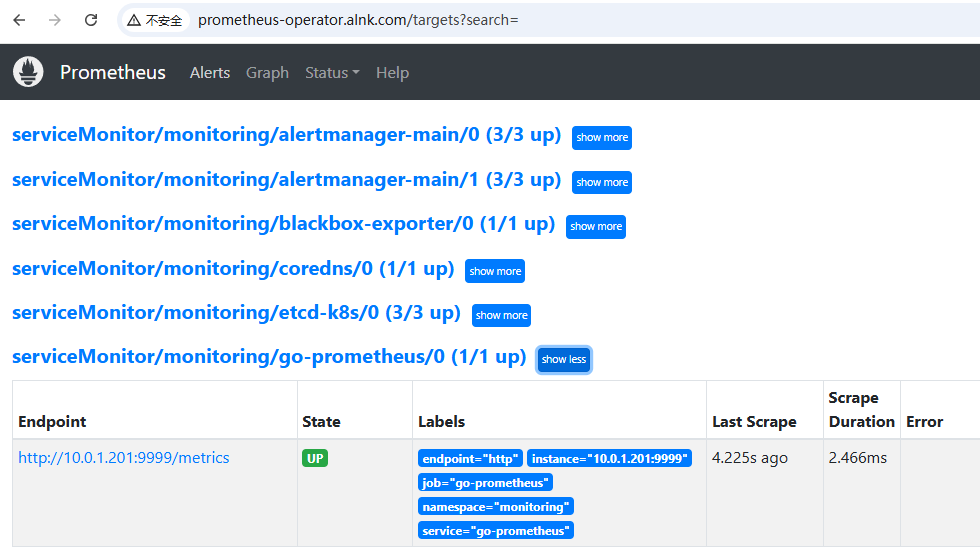
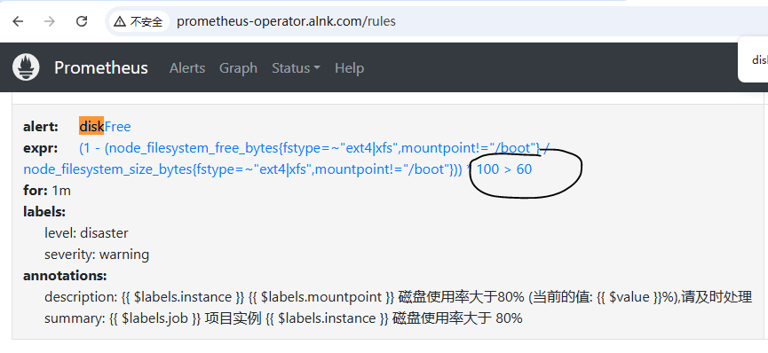
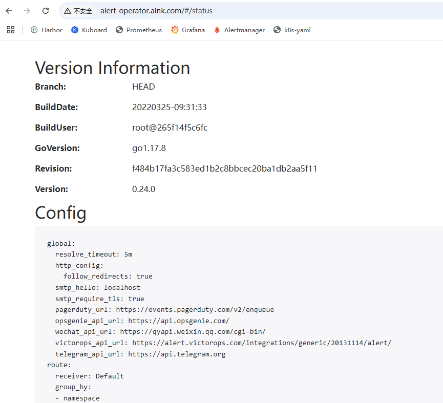
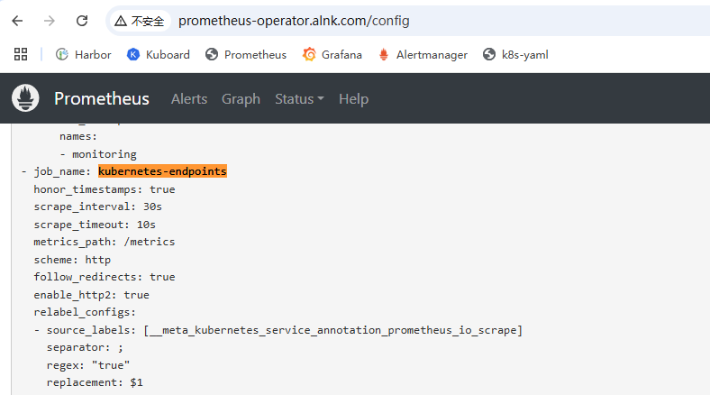
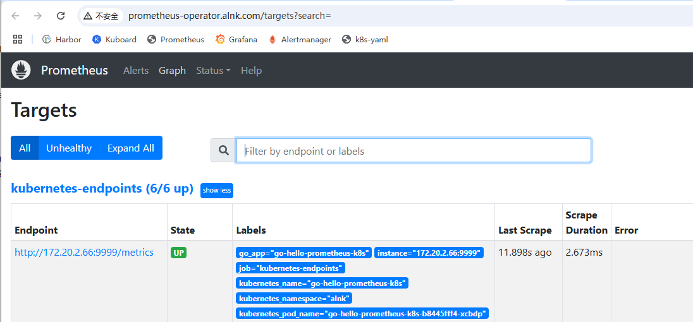

#### k8s环境

> k8s部署工具：kubeasz
>
> k8s 版本：1.23.1
>
> 容器运行时： docker
>
> 操作系统 ：ubuntu2204
>
> ##### 服务器规划
>
> | IP         | 主机名称 | 角色        | 系统       | 软件                                                            | 配置  |
> | :--------- | -------- | ----------- | ---------- | --------------------------------------------------------------- | ----- |
> | 10.0.1.21  | ops      | 运维机      | ubuntu2204 | harbor仓库、kubeasz                                             | 1c/2g |
> | 10.0.1.100 | 虚拟IP   | /           | /          | 流量入口、负载均衡、高可用、七层反向代理                        | /     |
> | 10.0.1.101 | ha-1     | 反向代理    | ubuntu2204 | nginx、keepalived                                               | 1c/2g |
> | 10.0.1.102 | ha-2     | 反向代理    | ubuntu2204 | nginx、keepalived                                               | 1c/2g |
> | 10.0.1.200 | 虚拟IP   | /           | /          | apiserver高可用、4层反向代理                                    | /     |
> | 10.0.1.201 | master-1 | k8s主节点   | ubuntu2204 | apiserver、controller、scheduler、etcd、keepalived、nginx(l4lb) | 1c/2g |
> | 10.0.1.202 | master-2 | k8s主节点   | ubuntu2204 | apiserver、controller、scheduler、etcd、keepalived、nginx(l4lb) | 1c/2g |
> | 10.0.1.203 | node-1   | k8s工作节点 | ubuntu2204 | kubelet、kube-proxy、etcd                                       | 2c/8g |
> | 10.0.1.204 | node-2   | k8s工作节点 | ubuntu2204 | kubelet、kube-proxy                                             |       |

#### Prometheus-Operator简介

##### Prometheus-Operator的架构图


##### Prometheus-Operator能做什么

> 要了解Prometheus Operator能做什么，其实就是要了解Prometheus Operator为我们提供了哪些自定义的Kubernetes资源，列出了Prometheus Operator目前提供的️4类资源：
>
> - Operator：控制器，根据自定义资源来部署和管理 Prometheus Server
> - Prometheus Server： 根据自定义资源 Prometheus 类型中定义的内容而部署的 Prometheus Server 集群，这些自定义资源可以看作是用来管理 Prometheus Server 集群的 StatefulSets 资源
> - Prometheus：声明式创建和管理Prometheus Server实例；
> - ServiceMonitor：负责声明式的管理监控配置；
> - PrometheusRule：负责声明式的管理告警配置；
> - Alertmanager：声明式的创建和管理Alertmanager实例。
>
> 简言之，Prometheus Operator能够帮助用户自动化的创建以及管理Prometheus Server以及其相应的配置

##### 几个常用概念介绍

> ServiceMonitor： ServiceMonitor 是 Prometheus Operator 用于发现监控目标的资源对象。我们可以通过创建 ServiceMonitor 来告诉 Prometheus Operator 要监控哪些服务(相当于prometheus.yaml中的scrape_configs)
>
> ```yaml
> apiVersion: monitoring.coreos.com/v1
> kind: ServiceMonitor
> metadata:
>   name: example-service-monitor
>   labels:
>     team: frontend
> spec:
>   selector:
>     matchLabels:
>       app: example-app
>   endpoints:
>     - port: web
> ```
>
> PrometheusRule ：对象来定义告警规则或记录规则。这些规则会被 Prometheus Operator 自动发现，并且应用到 Prometheus 实例中（相当于prometheus中的rules.yaml规则文件）
>
> ```yaml
> apiVersion: monitoring.coreos.com/v1
> kind: PrometheusRule
> metadata:
>   name: example
>   namespace: monitoring
> spec:
>   groups:
>   - name: example
>     rules:
>     - alert: HighRequestLatency
>       expr: job:request_latency_seconds:mean5m{job="myjob"} > 0.5
>       for: 10m
>       labels:
>         severity: page
>       annotations:
>         summary: "High request latency on {{ $labels.instance }}"
>         description: "{{ $labels.instance }} has a mean request latency above 0.5s (current value: {{ $value }}s) for the last 5 minutes."
>
> ```
>
> AlertmanagerConfig： 通过 AlertmanagerConfig，你可以定义告警路由、接收器以及其他与告警处理相关的设置，而无需直接编辑 Alertmanager 的配置文件（相当于alert的配置文件）
>
> ```yaml
> apiVersion: monitoring.coreos.com/v1alpha1
> kind: AlertmanagerConfig
> metadata:
>   name: example-alertmanager-config
>   namespace: monitoring
> spec:
>   route:
>     receiver: 'default-receiver'
>     groupBy: ['alertname', 'cluster']
>     groupWait: 30s
>     groupInterval: 5m
>     repeatInterval: 24h
>   receivers:
>   - name: 'default-receiver'
>     webhook_configs:
>     - url: 'http://your-webhook-url.example.com'
>       send_resolved: true
>   inhibitRules:
>   - sourceMatch:
>       severity: 'critical'
>     targetMatch:
>       severity: 'warning'
>     equal: ['alertname', 'cluster']
>
> ```

#### 部署Prometheus-Operator

> github地址
>
> https://github.com/prometheus-operator/kube-prometheus/releases

##### 版本对比

> | kube-prometheus stack                                                                     | Kubernetes 1.23 | Kubernetes 1.24 | Kubernetes 1.25 | Kubernetes 1.26 | Kubernetes 1.27 | Kubernetes 1.28 | Kubernetes 1.29 | Kubernetes 1.30 | Kubernetes 1.31 |
> | ----------------------------------------------------------------------------------------- | --------------- | --------------- | --------------- | --------------- | --------------- | --------------- | --------------- | --------------- | --------------- |
> | [`release-0.11`](https://github.com/prometheus-operator/kube-prometheus/tree/release-0.11) | ✔              | ✔              | ✗              | x               | x               | x               | x               | x               | x               |
> | [`release-0.12`](https://github.com/prometheus-operator/kube-prometheus/tree/release-0.12) | ✗              | ✔              | ✔              | x               | x               | x               | x               | x               | x               |
> | [`release-0.13`](https://github.com/prometheus-operator/kube-prometheus/tree/release-0.13) | ✗              | ✗              | x               | ✔              | ✔              | ✔              | x               | x               | x               |
> | [`release-0.14`](https://github.com/prometheus-operator/kube-prometheus/tree/release-0.14) | ✗              | ✗              | x               | ✔              | ✔              | ✔              | ✔              | ✔              | ✔              |
> | [`main`](https://github.com/prometheus-operator/kube-prometheus/tree/main)                 | ✗              | ✗              | x               | x               | ✔              | ✔              | ✔              | ✔              | ✔              |

##### 镜像准备与安装

```shell
【10.0.1.201】
# mkdir -p /data/operator/prometheus
# cd /data/operator/prometheus

# wget https://github.com/prometheus-operator/kube-prometheus/archive/refs/tags/v0.11.0.zip

# unzip v0.11.0.zip
# cd kube-prometheus-0.11.0/

# find ./ -type f |xargs egrep 'image: quay.io|image: registry.k8s.io|image: grafana|image: docker.io'|awk '{print $3}'|sort|uniq
# find ./ -type f |xargs egrep 'image: '|awk '{print $3}'|sort|uniq
gcr.io/google_containers/cpvpa-amd64:v0.8.1
gcr.io/google_containers/metrics-server-amd64:v0.2.0
grafana/grafana:8.5.5
jimmidyson/configmap-reload:v0.5.0
k8s.gcr.io/kube-state-metrics/kube-state-metrics:v2.5.0
k8s.gcr.io/prometheus-adapter/prometheus-adapter:v0.9.1
quay.io/brancz/kube-rbac-proxy:v0.12.0
quay.io/fabxc/prometheus_demo_service
quay.io/prometheus/alertmanager:v0.24.0
quay.io/prometheus/blackbox-exporter:v0.21.0
quay.io/prometheus/node-exporter:v1.3.1
quay.io/prometheus-operator/prometheus-operator:v0.57.0
quay.io/prometheus-operator/prometheus-config-reloader:v0.57.0  # 这个镜像命令过滤不到
quay.io/prometheus/prometheus:v2.36.1
quay.io/thanos/thanos:v0.19.0


#-------------镜像上传到本地----------------------------------------------------------------
harbor.alnk.com/public/cpvpa-amd64:v0.8.1
harbor.alnk.com/public/metrics-server-amd64:v0.2.0
harbor.alnk.com/public/grafana:8.5.5
harbor.alnk.com/public/configmap-reload:v0.5.0
harbor.alnk.com/public/kube-state-metrics:v2.5.0
harbor.alnk.com/public/prometheus-adapter:v0.9.1
harbor.alnk.com/public/kube-rbac-proxy:v0.12.0
harbor.alnk.com/public/prometheus_demo_service
harbor.alnk.com/public/alertmanager:v0.24.0
harbor.alnk.com/public/blackbox-exporter:v0.21.0
harbor.alnk.com/public/node-exporter:v1.3.1
harbor.alnk.com/public/prometheus-operator:v0.57.0
harbor.alnk.com/public/prometheus-config-reloader:v0.57.0  # 这个镜像命令过滤不到
harbor.alnk.com/public/prometheus:v2.36.1
harbor.alnk.com/public/thanos:v0.19.0
#------------镜像上传到本地-----------------------------------------------------------------


## 替换
find ./ -type f |xargs  sed -ri 's+gcr.io/.*/+harbor.alnk.com/public/+g'
find ./ -type f |xargs  sed -ri 's+grafana/+harbor.alnk.com/public/+g'
find ./ -type f |xargs  sed -ri 's+jimmidyson/+harbor.alnk.com/public/+g'
find ./ -type f |xargs  sed -ri 's+k8s.gcr.io/.*/+harbor.alnk.com/public/+g'
find ./ -type f |xargs  sed -ri 's+quay.io/.*/+harbor.alnk.com/public/+g'

# find ./ -type f |xargs egrep 'image: '|sort|uniq
harbor.alnk.com/public/alertmanager:v0.24.0
harbor.alnk.com/public/blackbox-exporter:v0.21.0
harbor.alnk.com/public/configmap-reload:v0.5.0
harbor.alnk.com/public/cpvpa-amd64:v0.8.1
harbor.alnk.com/public/grafana:8.5.5
harbor.alnk.com/public/kube-rbac-proxy:v0.12.0
harbor.alnk.com/public/metrics-server-amd64:v0.2.0
harbor.alnk.com/public/node-exporter:v1.3.1
harbor.alnk.com/public/prometheus_demo_service
harbor.alnk.com/public/prometheus-operator:v0.57.0
harbor.alnk.com/public/prometheus:v2.36.1
harbor.alnk.com/public/thanos:v0.19.0
harbor.alnk.com/public/kube-state-metrics:v2.5.0
harbor.alnk.com/public/prometheus-adapter:v0.9.1

# 开始创建所有服务
# kubectl create -f manifests/setup
# kubectl create -f manifests/

# 查看创建结果：
# kubectl -n monitoring get all
# kubectl -n monitoring get pod
NAME                                   READY   STATUS    RESTARTS   AGE
alertmanager-main-0                    2/2     Running   0          3m18s
alertmanager-main-1                    2/2     Running   0          3m18s
alertmanager-main-2                    2/2     Running   0          3m18s
blackbox-exporter-658c8565bb-rndhh     3/3     Running   0          13m
grafana-866f8fd9df-pc7bh               1/1     Running   0          13m
kube-state-metrics-6fb97bf7c8-sr6qt    3/3     Running   0          13m
node-exporter-whndx                    2/2     Running   0          13m
node-exporter-x7rfr                    2/2     Running   0          13m
node-exporter-xlwtq                    2/2     Running   0          13m
node-exporter-z2sn7                    2/2     Running   0          13m
prometheus-adapter-75d948d84f-b5jgj    1/1     Running   0          13m
prometheus-adapter-75d948d84f-bkkk8    1/1     Running   0          13m
prometheus-k8s-0                       2/2     Running   0          3m2s
prometheus-k8s-1                       2/2     Running   0          3m3s
prometheus-operator-86dd8fbd64-v26j8   2/2     Running   0          13m


# 附：清空上面部署的prometheus所有服务：
kubectl delete --ignore-not-found=true -f manifests/ -f manifests/setup

```

##### prometheus数据持久化

```shell
【10.0.1.201】
# 注意这下面的statefulset服务就是我们需要做数据持久化的地方
# kubectl -n monitoring get statefulsets.apps,pod|grep prometheus-k8s
statefulset.apps/prometheus-k8s      2/2     23h
pod/prometheus-k8s-0                       2/2     Running   0               136m
pod/prometheus-k8s-1                       2/2     Running   0               136m

# 准备prometheus持久化的pvc配置（两种方法）
# 方法1，通过k8s命令直接编辑
# kubectl -n monitoring edit prometheus k8s
spec:
......
  storage:
    volumeClaimTemplate:
      spec:
        accessModes: [ "ReadWriteOnce" ]
        storageClassName: "nfs-alnk"
        resources:
          requests:
            storage: 5Gi
          
# kubectl -n monitoring exec -it prometheus-k8s-0 -c prometheus -- sh
# df -Th
10.0.1.21:/data/nfs-volume/monitoring-prometheus-k8s-db-prometheus-k8s-0-pvc-bf4eb3e6-7c1b-4384-8ae1-04ae57977949/prometheus-db

### 注意，不要手动去删除自动生成的sc目录，好像只能生成一次
## 方法2
# cd /data/operator/prometheus/kube-prometheus-0.11.0/manifests
# vi prometheus-prometheus.yaml
# 新增持久化存储,yaml 末尾添加
spec:
......
  retention: 3d     #加这个参数，表示prometheus数据保留的天数，默认会是1天
  storage:
    volumeClaimTemplate:
      spec:
        accessModes: [ "ReadWriteOnce" ]
        storageClassName: "nfs-alnk"
        resources:
          requests:
            storage: 5Gi

# kubectl apply -f  prometheus-prometheus.yaml 
```

##### grafana数据持久化

```shell
【10.0.1.201】
# cd /data/operator/prometheus/kube-prometheus-0.11.0/otheryaml
# vi grafana-pvc.yaml
kind: PersistentVolumeClaim
apiVersion: v1
metadata:
  name: grafana-pvc
  namespace: monitoring
spec:
  storageClassName: nfs-alnk
  accessModes:
    - ReadWriteMany
  resources:
    requests:
      storage: 5Gi

# 开始创建pvc
# kubectl apply -f grafana-pvc.yaml 

# 看下创建的pvc
# kubectl -n monitoring get pvc
grafana-pvc Bound pvc-5284e95f-7abd-497b-b39e-e780c30c54d9  5Gi RWX nfs-alnk       4s


##################################################################################################################################################################################
### 准备grafana持久化的pvc配置（两种方法）
## 方法1 编辑grafana的deployment资源配置
# kubectl -n monitoring edit deployments.apps grafana 
      volumes:
      #- emptyDir: {}
      #  name: grafana-storage
      - name: grafana-storage
        persistentVolumeClaim:
          claimName: grafana-pvc

    spec:
      containers:
        env:
        - name: GF_SECURITY_ADMIN_USER
          value: admin
        - name: GF_SECURITY_ADMIN_PASSWORD
          value: admin

# 过一会，等grafana重启完成后，用上面的新密码进行登陆
# kubectl -n monitoring get pod -w|grep grafana
grafana-5698bf94f4-prbr2               0/1     Running   0          3s
grafana-5698bf94f4-prbr2               1/1     Running   0          4s

## 方法2 修改prometheus配置文件
# cd /data/operator/prometheus/kube-prometheus-0.11.0/manifests/
# vi grafana-deployment.yaml
      volumes:
      #- emptyDir: {}
      #  name: grafana-storage
      - name: grafana-storage
        persistentVolumeClaim:
          claimName: grafana-pvc

    spec:
      containers:
        env:
        - name: GF_SECURITY_ADMIN_USER
          value: admin
        - name: GF_SECURITY_ADMIN_PASSWORD
          value: admin


# kubectl apply -f grafana-deployment.yaml

# 因为先前的数据并未持久化，所以会发现先导入的ETCD模板已消失，这时重新再导入一次，后面重启也不会丢了

### 添加prometheus数据源
# 查看prometheus的详细地址 并编辑进去保存：
# kubectl -n monitoring get secrets grafana-datasources -o yaml
# 然后把Secret解码一下
# # echo 'ewogICAgImFwaVZlcnNpb24iOiAxLAogICAgImRhdGFzb3VyY2VzIjogWwogICAgICAgIHsKICAgICAgICAgICAgImFjY2VzcyI6ICJwcm94eSIsCiAgICAgICAgICAgICJlZGl0YWJsZSI6IGZhbHNlLAogICAgICAgICAgICAibmFtZSI6ICJwcm9tZXRoZXVzIiwKICAgICAgICAgICAgIm9yZ0lkIjogMSwKICAgICAgICAgICAgInR5cGUiOiAicHJvbWV0aGV1cyIsCiAgICAgICAgICAgICJ1cmwiOiAiaHR0cDovL3Byb21ldGhldXMtazhzLm1vbml0b3Jpbmcuc3ZjOjkwOTAiLAogICAgICAgICAgICAidmVyc2lvbiI6IDEKICAgICAgICB9CiAgICBdCn0='|base64 -d
{
    "apiVersion": 1,
    "datasources": [
        {
            "access": "proxy",
            "editable": false,
            "name": "prometheus",
            "orgId": 1,
            "type": "prometheus",
            "url": "http://prometheus-k8s.monitoring.svc:9090",
            "version": 1
        }
    ]
}
```

#### 访问组件UI界面

##### 访问prometheus的UI

```shell
# mkdir /data/operator/prometheus/kube-prometheus-0.11.0/otheryaml
# cd /data/operator/prometheus/kube-prometheus-0.11.0/otheryaml
# vi prometheus-ingress.yaml
apiVersion: networking.k8s.io/v1
kind: Ingress
metadata:
  namespace: monitoring
  name: prometheus
spec:
  rules:
  - host: prometheus-operator.alnk.com
    http:
      paths:
      - backend:
          service:
            name: prometheus-k8s
            port:
              number: 9090
        path: /
        pathType: Prefix

# kubectl apply -f prometheus-ingress.yaml
```


##### 访问grafana的UI

```shell
# mkdir /data/operator/prometheus/kube-prometheus-0.11.0/otheryaml
# cd /data/operator/prometheus/kube-prometheus-0.11.0/otheryaml
# vi grafana-ingress.yaml
apiVersion: networking.k8s.io/v1
kind: Ingress
metadata:
  namespace: monitoring
  name: grafana
spec:
  rules:
  - host: grafana-operator.alnk.com
    http:
      paths:
      - backend:
          service:
            name: grafana
            port:
              number: 3000
        path: /
        pathType: Prefix


# kubectl apply -f grafana-ingress.yaml

# 注意：如果访问有问题，删除自带的网络策略，否则访问服务都会被阻塞
https://github.com/prometheus-operator/kube-prometheus/issues/1763#issuecomment-1139553506
# kubectl -n monitoring delete networkpolicies.networking.k8s.io --all

```

  

##### 访问alertmanager的UI

```shell
# mkdir /data/operator/prometheus/kube-prometheus-0.11.0/otheryaml
# cd /data/operator/prometheus/kube-prometheus-0.11.0/otheryaml
# vi alert-ingress.yaml
apiVersion: networking.k8s.io/v1
kind: Ingress
metadata:
  namespace: monitoring
  name: alert
spec:
  rules:
  - host: alert-operator.alnk.com
    http:
      paths:
      - backend:
          service:
            name: alertmanager-main
            port:
              number: 9093
        path: /
        pathType: Prefix

# kubectl apply -f alert-ingress.yaml
```

#### 优化配置

##### grafana-kubernetes-app插件

```shell
# https://grafana.com/grafana/plugins/grafana-kubernetes-app/?tab=installation

# kubectl -n monitoring exec -it grafana-6dfc4d7765-dsnmx -- sh
# grafana-cli plugins install grafana-piechart-panel
✔ Downloaded grafana-piechart-panel v1.6.4 zip successfully
# grafana-cli plugins install camptocamp-prometheus-alertmanager-datasource
✔ Downloaded camptocamp-prometheus-alertmanager-datasource v1.2.1 zip successfully
# grafana-cli plugins install grafana-kubernetes-app
## 下载不下来的话，可以直接解压到grafana持久化的目录下，目录为plugins,然后重启pod

```

##### 修改grafana时间

> grafana dashboard 时区默认为UTC，比北京时间慢了8小时，很不便于日常监控查看

```shell
# cd /data/operator/prometheus/kube-prometheus-0.11.0/manifests/
# sed -i 's/UTC/UTC+8/g'  grafana-dashboardDefinitions.yaml
# kubectl apply -f grafana-dashboardDefinitions.yaml
```

#### 监控

> Kube-proemtheus默认监控了一些系统的组件，还需要根据实际的业务需求去添加自定义的组件监控，添加自定义监控对象步骤如下：
>
> 1. 建立一个 ServiceMonitor 对象，用于 Prometheus 添加监控项
> 2. 为 ServiceMonitor 对象关联 metrics 数据接口的一个 Service 对象
> 3. 确保 Service 对象可以正确获取到 metrics 数据

> 访问prometheus后台，点击上方 `菜单栏`-`Status` — `Targets` ，发现kube-controller-manager和kube-scheduler未发现
>
> 

##### 监控kube-controller-manager

```shell
# 因为K8s的这两上核心组件我们是以二进制形式部署的，为了能让K8s上的prometheus能发现，需要来创建相应的service和endpoints来将其关联起来
# ss -tlnp|egrep 'controller'
# cd /data/operator/prometheus/kube-prometheus-0.11.0/otheryaml
# vi kube-controller-manager-prometheus.yaml   
apiVersion: v1
kind: Service
metadata:
  # manifests/kubernetesControlPlane-serviceMonitorKubeControllerManager.yaml
  # 这个文件只匹配kube-sytem名称空间下的kube-controller-manager
  namespace: kube-system # 不能更换
  name: kube-controller-manager
  labels:
    app.kubernetes.io/name: kube-controller-manager
spec:
  type: ClusterIP
  clusterIP: None
  ports:
  - name: https-metrics
    port: 10257
    targetPort: 10257
    protocol: TCP

---
apiVersion: v1
kind: Endpoints
metadata:
  labels:
    app.kubernetes.io/name: kube-controller-manager
  name: kube-controller-manager
  namespace: kube-system # 不能更换
subsets:
- addresses:
  - ip: 10.0.1.201
  - ip: 10.0.1.202
  ports:
  - name: https-metrics
    port: 10257
    protocol: TCP
 
   
# kubectl apply -f kube-controller-manager-prometheus.yaml
```

> 踩坑记录
>
> 问题：还是监控不到controller-manager
>
> 

> 解决办法
>
> ```shell
> 【10.0.1.201，10.0.1.202两个主节点上】
> # vi /etc/systemd/system/kube-controller-manager.service
> ## 添加下面这两行##
> --authentication-kubeconfig=/etc/kubernetes/kube-controller-manager.kubeconfig \
> --authorization-kubeconfig=/etc/kubernetes/kube-controller-manager.kubeconfig \
> ## 添加上面这两行##
> --bind-address=0.0.0.0 
> --allocate-node-cidrs=true 
> --cluster-cidr=172.20.0.0/16 
> --cluster-name=kubernetes 
> --cluster-signing-cert-file=/etc/kubernetes/ssl/ca.pem 
> --cluster-signing-key-file=/etc/kubernetes/ssl/ca-key.pem 
> --kubeconfig=/etc/kubernetes/kube-controller-manager.kubeconfig 
> --leader-elect=true 
> --node-cidr-mask-size=24 
> --root-ca-file=/etc/kubernetes/ssl/ca.pem 
> --service-account-private-key-file=/etc/kubernetes/ssl/ca-key.pem 
> --service-cluster-ip-range=10.68.0.0/16 
> --use-service-account-credentials=true --v=2
>
> # systemctl daemon-reload
> # systemctl restart kube-controller-manager.service
> ```
>
> 

##### 监控kube-scheduler

```shell
# 因为K8s的这两上核心组件我们是以二进制形式部署的，为了能让K8s上的prometheus能发现，需要来创建相应的service和endpoints来将其关联起来
# ss -tlnp|egrep 'schedule'
# cd /data/operator/prometheus/kube-prometheus-0.11.0/otheryaml
# vi kube-scheduler-prometheus.yaml
apiVersion: v1
kind: Service
metadata:
  # manifests/kubernetesControlPlane-serviceMonitorKubeScheduler.yaml
  # 这个文件只匹配kube-sytem名称空间下的kube-controller-manager
  namespace: kube-system # 不能更换
  name: kube-scheduler
  labels:
    app.kubernetes.io/name: kube-scheduler # 不能更换
spec:
  type: ClusterIP
  clusterIP: None
  ports:
  - name: https-metrics
    port: 10259
    targetPort: 10259
    protocol: TCP

---
apiVersion: v1
kind: Endpoints
metadata:
  labels:
    app.kubernetes.io/name: kube-scheduler
  name: kube-scheduler
  namespace: kube-system # 不能更换
subsets:
- addresses:
  - ip: 10.0.1.201
  - ip: 10.0.1.202
  ports:
  - name: https-metrics
    port: 10259
    protocol: TCP

# kubectl apply -f kube-scheduler-prometheus.yaml
```

##### 监控etcd

> 作为K8s所有资源存储的关键服务ETCD，也有必要把它给监控起来
>
> 完整的演示一次利用Prometheus来监控非K8s集群服务的步骤
>
> 在前面部署K8s集群的时候，是用二进制的方式部署的ETCD集群，并且利用自签证书来配置访问ETCD现在关键的服务基本都会留有指标metrics接口支持prometheus的监控
>
> 利用下面命令，可以看到ETCD都暴露出了哪些监控指标出来

```
【10.0.1.201】
# curl --cacert /etc/kubernetes/ssl/ca.pem  --cert /etc/kubernetes/ssl/etcd.pem  --key /etc/kubernetes/ssl/etcd-key.pem https://10.0.1.201:2379/metrics
```

```shell
【10.0.1.201】
# 首先把ETCD的证书创建为secret
# kubectl -n monitoring create secret generic etcd-certs --from-file=/etc/kubernetes/ssl/ca.pem   --from-file=/etc/kubernetes/ssl/etcd.pem   --from-file=/etc/kubernetes/ssl/etcd-key.pem


# 接着在prometheus里面引用这个secrets（两种方法）
# 方法1
# vi manifests/prometheus-prometheus.yaml
spec:
...
  secrets:
  - etcd-certs
# kubectl apply -f manifests/prometheus-prometheus.yaml

# 方法2
#kubectl -n monitoring edit prometheus k8s 
spec:
...
  secrets:
  - etcd-certs

# 保存退出后，prometheus会自动重启服务pod以加载这个secret配置，过一会，我们进pod来查看下是不是已经加载到ETCD的证书了
# kubectl -n monitoring exec -it prometheus-k8s-0 -c prometheus  -- sh 
/prometheus $ ls /etc/prometheus/secrets/etcd-certs/
ca.pem        etcd-key.pem  etcd.pem


# 创建service、endpoints以及ServiceMonitor的yaml配置
# cd /data/operator/prometheus/kube-prometheus-0.11.0/otheryaml
# vim prometheus-etcd.yaml 
apiVersion: v1
kind: Service
metadata:
  name: etcd-k8s
  namespace: monitoring
  labels:
    k8s-app: etcd
spec:
  type: ClusterIP
  clusterIP: None # 一定要设置clusterIP:None
  ports:
  - name: api
    port: 2379
    protocol: TCP

---
apiVersion: v1
kind: Endpoints
metadata:
  name: etcd-k8s
  namespace: monitoring
  labels:
    k8s-app: etcd
subsets:
- addresses: # 指定etcd节点地址
  - ip: 10.0.1.201
  - ip: 10.0.1.202
  - ip: 10.0.1.203
  ports:
  - name: api
    port: 2379
    protocol: TCP

---
apiVersion: monitoring.coreos.com/v1
kind: ServiceMonitor
metadata:
  name: etcd-k8s
  namespace: monitoring
  labels:
    k8s-app: etcd-k8s
spec:
  jobLabel: k8s-app #表示用于检索 job 任务名称的标签
  endpoints:
  - port: api
    interval: 30s
    scheme: https
    tlsConfig:
      caFile: /etc/prometheus/secrets/etcd-certs/ca.pem
      certFile: /etc/prometheus/secrets/etcd-certs/etcd.pem
      keyFile: /etc/prometheus/secrets/etcd-certs/etcd-key.pem
      #use insecureSkipVerify only if you cannot use a Subject Alternative Name
      insecureSkipVerify: true 
  selector: #匹配monitoring这个命名空间下面的具有k8s-app=etcd这个label标签的Service
    matchLabels:
      k8s-app: etcd
  namespaceSelector:
    matchNames:
    - monitoring

# kubectl apply -f prometheus-etcd.yaml 
```


grafana来展示被监控的ETCD指标

```shell
1. 在grafana官网模板中心搜索etcd，下载这个json格式的模板文件
https://grafana.com/grafana/dashboards/3070-etcd/
# download json
# 3070

2.然后打开自己先部署的grafana首页，
点击左上边菜单栏HOME --- Data source --- Add data source --- 选择 Prometheus

查看prometheus的详细地址 并编辑进去保存：
# kubectl -n monitoring get secrets grafana-datasources -o yaml
# 然后把Secret解码一下
# # echo 'ewogICAgImFwaVZlcnNpb24iOiAxLAogICAgImRhdGFzb3VyY2VzIjogWwogICAgICAgIHsKICAgICAgICAgICAgImFjY2VzcyI6ICJwcm94eSIsCiAgICAgICAgICAgICJlZGl0YWJsZSI6IGZhbHNlLAogICAgICAgICAgICAibmFtZSI6ICJwcm9tZXRoZXVzIiwKICAgICAgICAgICAgIm9yZ0lkIjogMSwKICAgICAgICAgICAgInR5cGUiOiAicHJvbWV0aGV1cyIsCiAgICAgICAgICAgICJ1cmwiOiAiaHR0cDovL3Byb21ldGhldXMtazhzLm1vbml0b3Jpbmcuc3ZjOjkwOTAiLAogICAgICAgICAgICAidmVyc2lvbiI6IDEKICAgICAgICB9CiAgICBdCn0='|base64 -d
{
    "apiVersion": 1,
    "datasources": [
        {
            "access": "proxy",
            "editable": false,
            "name": "prometheus",
            "orgId": 1,
            "type": "prometheus",
            "url": "http://prometheus-k8s.monitoring.svc:9090",
            "version": 1
        }
    ]
}


再点击右上角 +^ Import dashboard --- 
点击Upload .json File 按钮，上传上面下载好的json文件 3070_rev3.json，
点击Import，即可显示etcd集群的图形监控信息
```


##### 监控nginx-ingress

> ingress-nignx这个是整个K8s上所有服务的流量入口组件很关键，因此把它的metrics指标收集到prometheus来做好相关监控至关重要
>
> 前面ingress-nignx服务是以daemonset形式部署的，并且映射了自己的端口到宿主机上

```shell
【10.0.1.201】
# kubectl -n kube-system get pod  -o wide|grep nginx-ingress
nginx-ingress-controller-mr2cc   1/1     Running       10.0.1.204   
nginx-ingress-controller-rd85x   1/1     Running       10.0.1.203  

# 开启metrics指标
# kubectl -n kube-system edit ds nginx-ingress-controller
# 搜索 metrics   ， 找到  - --enable-metrics=  设置为 true

# curl 10.0.1.203:10254/metrics
# curl 10.0.1.204:10254/metrics

# cd /data/operator/prometheus/kube-prometheus-0.11.0/otheryaml/
# kubectl -n kube-system get svc nginx-ingress-lb -o yaml
apiVersion: v1
kind: Service
metadata:
  labels:
    app: ingress-nginx
  name: nginx-ingress-lb
  namespace: kube-system
spec:
...
  ports:
  - name: http
    port: 80
    targetPort: 80
    protocol: TCP
  - name: https
    port: 443
    targetPort: 443
    protocol: TCP
  - name: metrics
    port: 10254
    protocol: TCP
    targetPort: 10254
  selector:
    app: ingress-nginx


# vim ingress-nginx-servicemonitor.yaml
apiVersion: monitoring.coreos.com/v1
kind: ServiceMonitor
metadata:
  labels:
    app: ingress-nginx
  name: nginx-ingress-scraping
  namespace: kube-system # 该监控所在名称空间
spec:
  endpoints:
  - interval: 30s
    path: /metrics
    port: metrics # 同svc中 ports.name一样，这里是mtrics 10254端口
  jobLabel: app # 同svc中lable的key一样
  namespaceSelector:
    matchNames:
    - kube-system # 同svc中名称空间一样
  selector:
    matchLabels:
      app: ingress-nginx # 同svc中标签一样
    
# kubectl apply -f ingress-nginx-servicemonitor.yaml
```



> grafana模板
>
> https://grafana.com/grafana/dashboards/14314-kubernetes-nginx-ingress-controller-nextgen-devops-nirvana/
>
> 14314



##### 监控k8s集群中的业务(go)

`main.go`

```go
package main

import (
	"net/http"
	"time"

	"github.com/gin-gonic/gin"
	"github.com/prometheus/client_golang/prometheus"
	"github.com/prometheus/client_golang/prometheus/promhttp"
)

var (
	WebRequestTotal = prometheus.NewCounterVec(prometheus.CounterOpts{
		Name: "web_reqeust_total",
		Help: "Number of hello requests in total",
	}, []string{"method", "path"})

	WebRequestDurationHistogram = prometheus.NewHistogramVec(prometheus.HistogramOpts{
		Name:    "http_request_duration_seconds",
		Help:    "Histogram of the duration of HTTP requests",
		Buckets: prometheus.DefBuckets,
	}, []string{"method", "path"})
)

func init() {
	// 注册计数器到 Prometheus
	prometheus.MustRegister(WebRequestTotal)
	// 注册直方图到 Prometheus
	prometheus.MustRegister(WebRequestDurationHistogram)
}

func main() {
	r := gin.Default()

	r.Use(func(ctx *gin.Context) {
		startTime := time.Now().UnixNano()
		// 处理请求
		ctx.Next()

		//记录请求次数
		WebRequestTotal.WithLabelValues(ctx.Request.Method, ctx.Request.URL.Path).Inc()

		//记录http方法和路径对应的耗时
		endTime := time.Now().UnixNano()
		seconds := float64((endTime - startTime) / 1e9) // s
		// Milliseconds := float64((endTime - startTime) / 1e6) // ms
		// nanoSeconds := float64(endTime - startTime)          // ns
		WebRequestDurationHistogram.WithLabelValues(ctx.Request.Method, ctx.Request.URL.Path).Observe(seconds)
	})

	// 将Prometheus的metrics接口挂载到Gin的路由上
	r.GET("/metrics", gin.WrapH(promhttp.Handler()))

	// 健康检查
	r.GET("/health", func(ctx *gin.Context) {
		ctx.String(http.StatusOK, "OK")
	})

	// 其他业务逻辑
	r.GET("/hello", func(ctx *gin.Context) {
		ctx.String(http.StatusOK, "hello, Go! hello, 业务!")
	})

	r.Run(":9999")
}

// 交叉编译
// 设置Go交叉编译环境变量
// $env:GOOS = "linux" 
// $env:GOARCH = "amd64"
// go build -o hello-go-linux

```

`Dockerfile`

```dockerfile
FROM harbor.alnk.com/public/golang:1.22.8 as builder
ENV GOPROXY https://goproxy.cn
COPY . /app/
RUN cd /app \
    && go mod init github.com/alnk/go-hello-prometheus-k8s \
    && go mod tidy \
    && CGO_ENABLED=0 GOOS=linux GOARCH=amd64 go build -ldflags "-s -w" -o go-hello-prometheus-k8s .

FROM harbor.alnk.com/public/alpine:3.18
RUN sed -i 's/dl-cdn.alpinelinux.org/mirrors.aliyun.com/g' /etc/apk/repositories && \
    apk update && \
    apk --no-cache add tzdata ca-certificates && \
    cp -f /usr/share/zoneinfo/Asia/Shanghai /etc/localtime && \
    # apk del tzdata && \
    rm -rf /var/cache/apk/*
COPY --from=builder /app/go-hello-prometheus-k8s /go-hello-prometheus-k8s
EXPOSE 9999
CMD ["/go-hello-prometheus-k8s"] 
```

`go-hello-prometheus-k8s.yaml`

```yaml
---
# deployment.yaml
kind: Deployment
apiVersion: apps/v1
metadata:
  name: go-hello-prometheus-k8s
  namespace: alnk
  labels:
    name: go-hello-prometheus-k8s
spec:
  replicas: 1
  selector:
    matchLabels:
      name: go-hello-prometheus-k8s
  template:
    metadata:
      labels:
        app: go-hello-prometheus-k8s
        name: go-hello-prometheus-k8s
    spec:
      containers:
      - name: go-hello-prometheus-k8s
        image: harbor.alnk.com/public/go-hello-prometheus-k8s:v0.1
        ports:
        - containerPort: 9999
          protocol: TCP
        terminationMessagePath: /dev/termination-log
        terminationMessagePolicy: File
        imagePullPolicy: IfNotPresent
      imagePullSecrets:
      - name: harbor
      restartPolicy: Always
      terminationGracePeriodSeconds: 30
      securityContext:
        runAsUser: 0
      schedulerName: default-scheduler
  strategy:
    type: RollingUpdate
    rollingUpdate:
      maxUnavailable: 1
      maxSurge: 1
  revisionHistoryLimit: 7
  progressDeadlineSeconds: 600

---
# service.yaml
kind: Service
apiVersion: v1
metadata:
  name: go-hello-prometheus-k8s
  namespace: alnk
  labels:
    go-app: go-hello-prometheus-k8s
spec:
  ports:
  - protocol: TCP
    port: 80
    targetPort: 9999
    name: http
  selector:
    app: go-hello-prometheus-k8s

---
# ingress.yaml
apiVersion: networking.k8s.io/v1
kind: Ingress
metadata:
  namespace: alnk
  name: go-hello-prometheus-k8s
spec:
  rules:
  - host: go-hello-prometheus-k8s.alnk.com
    http:
      paths:
      - backend:
          service:
            name: go-hello-prometheus-k8s
            port:
              number: 80
        path: /
        pathType: Prefix

---
### Prometheus监控
apiVersion: monitoring.coreos.com/v1
kind: ServiceMonitor
metadata:
  name: go-hello-prometheus-k8s
  namespace: alnk  #监控的命名空间
  labels:
    go-app: go-hello-prometheus-k8s  #标签
spec:
  jobLabel: go-app #标签，与svc中标签key保持一致
  endpoints:
  - interval: 30s
    path: /metrics #业务监控数据指标地址
    port: http #端口名称，与svc中prots.name保持一致
    #tlsConfig:
      #caFile: /etc/prometheus/secrets/etcd-certs/ca.pem
      #certFile: /etc/prometheus/secrets/etcd-certs/etcd.pem
      #keyFile: /etc/prometheus/secrets/etcd-certs/etcd-key.pem
      #use insecureSkipVerify only if you cannot use a Subject Alternative Name
      #insecureSkipVerify: true 
  selector:
    matchLabels:
      go-app: go-hello-prometheus-k8s #选择的标签，与svc中一致
  namespaceSelector:
    matchNames:
    - alnk #命名空间，与svc中一致
```

`镜像准备`

```shell
【10.0.1.21】
## 基础镜像
# docker pull registry.cn-hangzhou.aliyuncs.com/alnktest/golang:1.22.8
# docker tag registry.cn-hangzhou.aliyuncs.com/alnktest/golang:1.22.8 harbor.alnk.com/public/golang:1.22.8
# docker push harbor.alnk.com/public/golang:1.22.8

## 业务镜像
# mkdir -p /data/dockerfile/go-hello-prometheus-k8s
# cd /data/dockerfile/go-hello-prometheus-k8s
# vi Dockerfile
# vi main.go
# docker build -t harbor.alnk.com/public/go-hello-prometheus-k8s:v0.1 .
# docker push harbor.alnk.com/public/go-hello-prometheus-k8s:v0.1
# docker images|grep go-hello-prometheus-k8s
harbor.alnk.com/public/go-hello-prometheus-k8s  v0.1   18.7MB

## yaml文件
# mkdir -p /data/k8s-yaml/go-hello-prometheus-k8s
# cd /data/k8s-yaml/go-hello-prometheus-k8s
# vi go-hello-prometheus-k8s.yaml
```

`应用yaml文件`

```shell
【10.0.1.201】
# kubectl apply -f http://k8s-yaml.alnk.com/go-hello-prometheus-k8s/go-hello-prometheus-k8s.yaml  
```

  


> 踩坑记录
>
> https://github.com/prometheus-operator/kube-prometheus/pull/2301/commits/9847b6f2a4d37b263e92cd6cc6c1fd927f16b4df
>
> prometheus operator版本：0.11.0
>
> 在其他名称空间监控时报错，提示没有权限
>
> 
>
> 解决办法：
>
> ```shell
> # vi kube-prometheus-0.11.0/manifests/prometheus-clusterRole.yaml
> apiVersion: rbac.authorization.k8s.io/v1
> kind: ClusterRole
> metadata:
>   labels:
>     app.kubernetes.io/component: prometheus
>     app.kubernetes.io/instance: k8s
>     app.kubernetes.io/name: prometheus
>     app.kubernetes.io/part-of: kube-prometheus
>     app.kubernetes.io/version: 2.36.1
>   name: prometheus-k8s
> # rules:
> # - apiGroups:
> #   - ""
> #   resources:
> #   - nodes/metrics
> #   verbs:
> #   - get
> # - nonResourceURLs:
> #   - /metrics
> #   verbs:
> #   - get
> rules:
> - apiGroups:
>   - ""
>   resources:
>   - nodes/metrics
>   verbs:
>   - get
> - nonResourceURLs:
>   - /metrics
>   verbs:
>   - get
> - apiGroups:
>   - '*'
>   resources:
>   - '*'
>   verbs:
>   - get
>   - list
>   - watch
>   
> # kubectl apply -f prometheus-clusterRole.yaml
> ```

##### 监控非k8s集群中的业务(go)

`main.go`

```go
package main

import (
	"net/http"
	"time"

	"github.com/gin-gonic/gin"
	"github.com/prometheus/client_golang/prometheus"
	"github.com/prometheus/client_golang/prometheus/promhttp"
)

var (
	WebRequestTotal = prometheus.NewCounterVec(prometheus.CounterOpts{
		Name: "web_reqeust_total",
		Help: "Number of hello requests in total",
	}, []string{"method", "path"})

	WebRequestDurationHistogram = prometheus.NewHistogramVec(prometheus.HistogramOpts{
		Name:    "http_request_duration_seconds",
		Help:    "Histogram of the duration of HTTP requests",
		Buckets: prometheus.DefBuckets,
	}, []string{"method", "path"})
)

func init() {
	// 注册计数器到 Prometheus
	prometheus.MustRegister(WebRequestTotal)
	// 注册直方图到 Prometheus
	prometheus.MustRegister(WebRequestDurationHistogram)
}

func main() {
	r := gin.Default()

	r.Use(func(ctx *gin.Context) {
		startTime := time.Now().UnixNano()
		// 处理请求
		ctx.Next()

		//记录请求次数
		WebRequestTotal.WithLabelValues(ctx.Request.Method, ctx.Request.URL.Path).Inc()

		//记录http方法和路径对应的耗时
		endTime := time.Now().UnixNano()
		seconds := float64((endTime - startTime) / 1e9) // s
		// Milliseconds := float64((endTime - startTime) / 1e6) // ms
		// nanoSeconds := float64(endTime - startTime)          // ns
		WebRequestDurationHistogram.WithLabelValues(ctx.Request.Method, ctx.Request.URL.Path).Observe(seconds)
	})

	// 将Prometheus的metrics接口挂载到Gin的路由上
	r.GET("/metrics", gin.WrapH(promhttp.Handler()))

	// 健康检查
	r.GET("/health", func(ctx *gin.Context) {
		ctx.String(http.StatusOK, "OK")
	})

	// 其他业务逻辑
	r.GET("/hello", func(ctx *gin.Context) {
		ctx.String(http.StatusOK, "hello, Go! hello, 业务!")
	})

	r.Run(":9999")
}

// 交叉编译
// 设置Go交叉编译环境变量
// $env:GOOS = "linux" 
// $env:GOARCH = "amd64"
// go build -o hello-go-linux
```

```shell
【程序在10.0.1.201上启动】
# curl 10.0.1.201:9999/health
OK

# curl 10.0.1.201:9999/hello
hello, Go! hello, 业务!


# curl 10.0.1.201:9999/metrics

【10.0.1.201】
# cd /data/operator/prometheus/kube-prometheus-0.11.0/otheryaml
# vim prometheus-go.yaml
apiVersion: v1
kind: Service
metadata:
  name: go-prometheus
  namespace: monitoring
  labels:
    go-k8s-app: go-prometheus
spec:
  type: ClusterIP
  clusterIP: None
  ports:
  - name: http
    port: 9999
    protocol: TCP

---
apiVersion: v1
kind: Endpoints
metadata:
  name: go-prometheus
  namespace: monitoring
  labels:
    go-k8s-app: go-prometheus
subsets:
- addresses:
  - ip: 10.0.1.201
  ports:
  - name: http
    port: 9999
    protocol: TCP

---
apiVersion: monitoring.coreos.com/v1
kind: ServiceMonitor
metadata:
  name: go-prometheus
  namespace: monitoring
  labels:
    go-k8s-app: go-prometheus
spec:
  jobLabel: go-k8s-app
  endpoints:
  - port: http
    interval: 30s
    scheme: http
    #tlsConfig:
      #caFile: /etc/prometheus/secrets/etcd-certs/ca.pem
      #certFile: /etc/prometheus/secrets/etcd-certs/etcd.pem
      #keyFile: /etc/prometheus/secrets/etcd-certs/etcd-key.pem
      #use insecureSkipVerify only if you cannot use a Subject Alternative Name
      #insecureSkipVerify: true 
  selector:
    matchLabels:
      go-k8s-app: go-prometheus
  namespaceSelector:
    matchNames:
    - monitoring
  
# kubectl apply -f prometheus-go.yaml  
# kubectl -n alnk exec -it nginx-775b596cdc-zmgxv  bash
# curl http://go-prometheus.monitoring.svc:9999/health
OK
```




#### 告警规则

>   
>
> ```shell
> 【10.0.1.201】
> # 在上面的配置中可以看到规则文件的路径为： /etc/prometheus/rules/prometheus-k8s-rulefiles-0/*.yaml，可以进入Prometheus的容器中查看
> # kubectl -n monitoring exec -it prometheus-k8s-0 /bin/sh
> ## #$表示容器内
> #$ cd  /etc/prometheus/rules/prometheus-k8s-rulefiles-0/
> #$ ls
> monitoring-prometheus-k8s-prometheus-rules-xx.yaml
> # cat monitoring-prometheus-k8s-prometheus-rules-xx.yaml
> groups:
> - name: prometheus
>   rules:
>   - alert: PrometheusBadConfig
>     annotations:
>       description: Prometheus {{$labels.namespace}}/{{$labels.pod}} has failed to
>         reload its configuration.
>       runbook_url: https://runbooks.prometheus-operator.dev/runbooks/prometheus/prometheusbadconfig
>       summary: Failed Prometheus configuration reload.
>     expr: |
>       # Without max_over_time, failed scrapes could create false negatives, see
>       # https://www.robustperception.io/alerting-on-gauges-in-prometheus-2-0 for details.
>       max_over_time(prometheus_config_last_reload_successful{job="prometheus-k8s",namespace="monitoring"}[5m]) == 0
>     for: 10m
>     labels:
>       severity: critical
> ##
> ## 这个文件实际上就是之前创建的一个PrometheusRule文件包含的内容    
> # cd /data/operator/prometheus/kube-prometheus-0.11.0
> # cat manifests/prometheus-rules.yaml |  head -40
>  groups:
>   - name: prometheus
>     rules:
>     - alert: PrometheusBadConfig
>       annotations:
>         description: Prometheus {{$labels.namespace}}/{{$labels.pod}} has failed to
>           reload its configuration.
>         runbook_url: https://runbooks.prometheus-operator.dev/runbooks/prometheus/prometheusbadconfig
>         summary: Failed Prometheus configuration reload.
>       expr: |
>         # Without max_over_time, failed scrapes could create false negatives, see
>         # https://www.robustperception.io/alerting-on-gauges-in-prometheus-2-0 for details.
>         max_over_time(prometheus_config_last_reload_successful{job="prometheus-k8s",namespace="monitoring"}[5m]) == 0
>       for: 10m
>       labels:
>         severity: critical
>
> ```

##### 测试添加一条告警规则

```shell
【10.0.1.201】
# cd /data/operator/prometheus/kube-prometheus-0.11.0/otheryaml/
# vi disk-rules.yaml
apiVersion: monitoring.coreos.com/v1
kind: PrometheusRule
metadata:
  labels:
     prometheus: k8s
     role: alert-rules
  name: disk-rules
  namespace: monitoring
spec:
  groups:
  - name: disk
    rules:
    - alert: diskFree
      annotations:
        summary: "{{ $labels.job }}  项目实例 {{ $labels.instance }} 磁盘使用率大于 80%"
        description: "{{ $labels.instance }}  {{ $labels.mountpoint }}  磁盘使用率大于80%  (当前的值: {{ $value }}%),请及时处理"
      expr: |
        (1-(node_filesystem_free_bytes{fstype=~"ext4|xfs",mountpoint!="/boot"} / node_filesystem_size_bytes{fstype=~"ext4|xfs",mountpoint!="/boot"}) )*100 > 80
      for: 1m
      labels:
        level: disaster
        severity: warning
      
# kubectl apply -f  disk-rules.yaml
# kubectl -n monitoring get prometheusrules.monitoring.coreos.com
disk-rules                        27s

# kubectl -n monitoring exec -it prometheus-k8s-0 /bin/sh
# ls /etc/prometheus/rules/prometheus-k8s-rulefiles-0/
monitoring-disk-rules-4cc0f124-65b6-4a71-8e3e-f28aadd7e88f.yaml
# cd /etc/prometheus/rules/prometheus-k8s-rulefiles-0/
# cat monitoring-disk-rules-4cc0f124-65b6-4a71-8e3e-f28aadd7e88f.yaml

```

web界面查看


##### 测试修改一条告警规则

> prometheus-operator的规则非常齐全，基本属于开箱即用类型，可以根据日常收到的报警，对里面的rules报警规则作针对性的调整，比如把报警观察时长缩短一点等
>
> ```shell
> # 通过命令监控报警规划修改
> # 修改configmap文件，可能会修改不成功
> # kubectl -n monitoring edit cm  prometheus-k8s-rulefiles-0  
> groups:
>     - name: disk
>         expr: |
>           (1-(node_filesystem_free_bytes{fstype=~"ext4|xfs",mountpoint!="/boot"} / node_filesystem_size_bytes{fstype=~"ext4|xfs",mountpoint!="/boot"}) )*100 > 60
> # 修改为60
>
> # 监控报警规划修改
> # 修改为60成功，需要稍微等一会儿
> # kubectl -n monitoring edit PrometheusRule disk-rules
>
> # 查看是否修改成功
> # kubectl -n monitoring exec -it prometheus-k8s-0 /bin/sh
> ```



#### AlterManager报警配置

##### 配置方法

> 现在报警规则有了，但是报警渠道还没有配置，所以下面来修改下Alertmanager的配置，首先可以去 Alertmanager 的页面上 status 路径下面查看 AlertManager 的配置信息:
>
> 
>
> 这些配置的来由也是之前创建的 manifests/alertmanager-secret.yaml
>
> ```yaml
> apiVersion: v1
> kind: Secret
> metadata:
>   labels:
>     app.kubernetes.io/component: alert-router
>     app.kubernetes.io/instance: main
>     app.kubernetes.io/name: alertmanager
>     app.kubernetes.io/part-of: kube-prometheus
>     app.kubernetes.io/version: 0.24.0
>   name: alertmanager-main
>   namespace: monitoring
> stringData:
>   alertmanager.yaml: |-
>     "global":
>       "resolve_timeout": "5m"
>     "inhibit_rules":
>     - "equal":
>       - "namespace"
>       - "alertname"
>       "source_matchers":
>       - "severity = critical"
>       "target_matchers":
>       - "severity =~ warning|info"
>     - "equal":
>       - "namespace"
>       - "alertname"
>       "source_matchers":
>       - "severity = warning"
>       "target_matchers":
>       - "severity = info"
>     - "equal":
>       - "namespace"
>       "source_matchers":
>       - "alertname = InfoInhibitor"
>       "target_matchers":
>       - "severity = info"
>     "receivers":
>     - "name": "Default"
>     - "name": "Watchdog"
>     - "name": "Critical"
>     - "name": "null"
>     "route":
>       "group_by":
>       - "namespace"
>       "group_interval": "5m"
>       "group_wait": "30s"
>       "receiver": "Default"
>       "repeat_interval": "12h"
>       "routes":
>       - "matchers":
>         - "alertname = Watchdog"
>         "receiver": "Watchdog"
>       - "matchers":
>         - "alertname = InfoInhibitor"
>         "receiver": "null"
>       - "matchers":
>         - "severity = critical"
>         "receiver": "Critical"
> type: Opaque
> ```
>
> 然后可以通过修改这个yaml文件来指定报警渠道，比如这里将critical级别的报警发送到微信
>
> ```yaml
>     "receivers":
>     - "name": "Default"
>     - "name": "Watchdog"
>     - "name": "Critical"
>       "wechat_configs":  #添加微信的认证
>        - "corp_id": 'xxx'
>          "to_party": 'xxx'
>          "agent_id": 'xxx'
>          "api_secret": 'xxx'
>          "send_resolved": true
>     - "name": "null"
> ```
>
> 然后强制更新alertmanager-secret对象
>
> ```shell
> 【10.0.1.201】
> # cd /data/operator/prometheus/kube-prometheus-0.11.0/manifests/
> # kubectl  delete -f alertmanager-secret.yaml
> # kubectl   apply -f alertmanager-secret.yaml
> ```
>
> 然后查看alertmanger的web页面中的配置信息是否加载
>
>   
>
> 配置文件详解
>
> ```yaml
> # global块配置下的配置选项在本配置文件内的所有配置项下可见
> global:
> # 在Alertmanager内管理的每一条告警均有两种状态: "resolved"或者"firing". 在altermanager首次发送告警通知后, 该告警会一直处于firing状态,设置resolve_timeout可以指定处于firing状态的告警间隔多长时间会被设置为resolved状态, 在设置为resolved状态的告警后,altermanager不会再发送firing的告警通知.
> #  resolve_timeout: 1h
> resolve_timeout: 10m
>
> # 告警通知模板
> templates:
> - '/etc/altermanager/config/*.tmpl'
>
> # route: 根路由,该模块用于该根路由下的节点及子路由routes的定义. 子树节点如果不对相关配置进行配置，则默认会从父路由树继承该配置选项。每一条告警都要进入route，即要求配置选项group_by的值能够匹配到每一条告警的至少一个labelkey(即通过POST请求向altermanager服务接口所发送告警的labels项所携带的<labelname>)，告警进入到route后，将会根据子路由routes节点中的配置项match_re或者match来确定能进入该子路由节点的告警(由在match_re或者match下配置的labelkey: labelvalue是否为告警labels的子集决定，是的话则会进入该子路由节点，否则不能接收进入该子路由节点).
> route:
> # 例如所有labelkey:labelvalue含cluster=A及altertname=LatencyHigh labelkey的告警都会被归入单一组中
> group_by: ['job', 'altername', 'cluster', 'service','severity']
> # 若一组新的告警产生，则会等group_wait后再发送通知，该功能主要用于当告警在很短时间内接连产生时，在group_wait内合并为单一的告警后再发送
> #  group_wait: 30s
> group_wait: 10s
> # 再次告警时间间隔
> #  group_interval: 5m
> group_interval: 20s
> # 如果一条告警通知已成功发送，且在间隔repeat_interval后，该告警仍然未被设置为resolved，则会再次发送该告警通知
> #  repeat_interval: 12h
> repeat_interval: 1m
> # 默认告警通知接收者，凡未被匹配进入各子路由节点的告警均被发送到此接收者
> receiver: 'webhook'
> # 上述route的配置会被传递给子路由节点，子路由节点进行重新配置才会被覆盖
>
> # 子路由树
> routes:
> # 该配置选项使用正则表达式来匹配告警的labels，以确定能否进入该子路由树
> # match_re和match均用于匹配labelkey为service,labelvalue分别为指定值的告警，被匹配到的告警会将通知发送到对应的receiver
>   - match_re:
>    service: ^(foo1|foo2|baz)$
>  receiver: 'webhook'
>  # 在带有service标签的告警同时有severity标签时，他可以有自己的子路由，同时具有severity != critical的告警则被发送给接收者team-ops-wechat,对severity == critical的告警则被发送到对应的接收者即team-ops-pager
>  routes:
>     - match:
>      severity: critical
>    receiver: 'webhook'
> # 比如关于数据库服务的告警，如果子路由没有匹配到相应的owner标签，则都默认由team-DB-pager接收
>   - match:
>    service: database
>  receiver: 'webhook'
> # 我们也可以先根据标签service:database将数据库服务告警过滤出来，然后进一步将所有同时带labelkey为database
>   - match:
>    severity: critical
>  receiver: 'webhook'
> # 抑制规则，当出现critical告警时 忽略warning
> inhibit_rules:
> - source_match:
>  severity: 'critical'
> target_match:
>  severity: 'warning'
> # Apply inhibition if the alertname is the same.
> #   equal: ['alertname', 'cluster', 'service']
> #
> # 收件人配置
> receivers:
> - name: 'webhook'
> webhook_configs:
>   - url: 'xxx'
>  send_resolved: true
> ```

> 另外一种配置方法
>
> ```shell
> # 通过这里可以获取需要创建的报警配置secret名称
> # kubectl -n monitoring edit statefulsets.apps alertmanager-main
> volumes:
>       - name: config-volume
>      secret:
>        defaultMode: 420
>        secretName: alertmanager-main-generated
>       - name: tls-assets
>      projected:
>        defaultMode: 420
>        sources:
>           - secret:
>            name: alertmanager-main-tls-assets-0
>
> # 注意事先在配置文件 alertmanager.yaml 里面编辑好收件人等信息 ，再执行下面的命令
> # kubectl -n monitoring delete secret alertmanager-main
> # kubectl -n monitoring create secret generic  alertmanager-main --from-file=alertmanager.yaml 
>
> ```
>
> 报警配置文件 alertmanager.yaml
>
> ```yaml
> # global块配置下的配置选项在本配置文件内的所有配置项下可见
> global:
> # 在Alertmanager内管理的每一条告警均有两种状态: "resolved"或者"firing". 在altermanager首次发送告警通知后, 该告警会一直处于firing状态,设置resolve_timeout可以指定处于firing状态的告警间隔多长时间会被设置为resolved状态, 在设置为resolved状态的告警后,altermanager不会再发送firing的告警通知.
> #  resolve_timeout: 1h
> resolve_timeout: 10m
>
> # 告警通知模板
> templates:
> - '/etc/altermanager/config/*.tmpl'
>
> # route: 根路由,该模块用于该根路由下的节点及子路由routes的定义. 子树节点如果不对相关配置进行配置，则默认会从父路由树继承该配置选项。每一条告警都要进入route，即要求配置选项group_by的值能够匹配到每一条告警的至少一个labelkey(即通过POST请求向altermanager服务接口所发送告警的labels项所携带的<labelname>)，告警进入到route后，将会根据子路由routes节点中的配置项match_re或者match来确定能进入该子路由节点的告警(由在match_re或者match下配置的labelkey: labelvalue是否为告警labels的子集决定，是的话则会进入该子路由节点，否则不能接收进入该子路由节点).
> route:
> # 例如所有labelkey:labelvalue含cluster=A及altertname=LatencyHigh labelkey的告警都会被归入单一组中
> group_by: ['job', 'altername', 'cluster', 'service','severity']
> # 若一组新的告警产生，则会等group_wait后再发送通知，该功能主要用于当告警在很短时间内接连产生时，在group_wait内合并为单一的告警后再发送
> #  group_wait: 30s
> group_wait: 10s
> # 再次告警时间间隔
> #  group_interval: 5m
> group_interval: 20s
> # 如果一条告警通知已成功发送，且在间隔repeat_interval后，该告警仍然未被设置为resolved，则会再次发送该告警通知
> #  repeat_interval: 12h
> repeat_interval: 1m
> # 默认告警通知接收者，凡未被匹配进入各子路由节点的告警均被发送到此接收者
> receiver: 'webhook'
> # 上述route的配置会被传递给子路由节点，子路由节点进行重新配置才会被覆盖
>
> # 子路由树
> routes:
> # 该配置选项使用正则表达式来匹配告警的labels，以确定能否进入该子路由树
> # match_re和match均用于匹配labelkey为service,labelvalue分别为指定值的告警，被匹配到的告警会将通知发送到对应的receiver
>   - match_re:
>    service: ^(foo1|foo2|baz)$
>  receiver: 'webhook'
>  # 在带有service标签的告警同时有severity标签时，他可以有自己的子路由，同时具有severity != critical的告警则被发送给接收者team-ops-wechat,对severity == critical的告警则被发送到对应的接收者即team-ops-pager
>  routes:
>     - match:
>      severity: critical
>    receiver: 'webhook'
> # 比如关于数据库服务的告警，如果子路由没有匹配到相应的owner标签，则都默认由team-DB-pager接收
>   - match:
>    service: database
>  receiver: 'webhook'
> # 我们也可以先根据标签service:database将数据库服务告警过滤出来，然后进一步将所有同时带labelkey为database
>   - match:
>    severity: critical
>  receiver: 'webhook'
> # 抑制规则，当出现critical告警时 忽略warning
> inhibit_rules:
> - source_match:
>  severity: 'critical'
> target_match:
>  severity: 'warning'
> # Apply inhibition if the alertname is the same.
> #   equal: ['alertname', 'cluster', 'service']
> #
> # 收件人配置
> receivers:
> - name: 'webhook'
> webhook_configs:
>   - url: 'xxx'
>  send_resolved: true
>
> ```
>
> 监控其他服务的prometheus规则配置
>
> https://github.com/samber/awesome-prometheus-alerts

##### 邮箱

```shell
【10.0.1.201】
# cd /data/operator/prometheus/kube-prometheus-0.11.0/manifests/
# vi alertmanager-secret.yaml
# kubectl  delete -f alertmanager-secret.yaml
# kubectl  apply -f alertmanager-secret.yaml
```

```yaml
apiVersion: v1
kind: Secret
metadata:
  labels:
    app.kubernetes.io/component: alert-router
    app.kubernetes.io/instance: main
    app.kubernetes.io/name: alertmanager
    app.kubernetes.io/part-of: kube-prometheus
    app.kubernetes.io/version: 0.24.0
  name: alertmanager-main
  namespace: monitoring
stringData:
  alertmanager.yaml: |-
    global:
      # 在没有报警的情况下声明为已解决的时间
      resolve_timeout: 5m
      # 配置邮件发送信息
      smtp_smarthost: 'smtp.163.com:25'
      smtp_from: '13138892570@163.com'
      smtp_auth_username: '13138892570@163.com'
      smtp_auth_password: 'xxxx'
      smtp_require_tls: false
    # 所有报警信息进入后的根路由，用来设置报警的分发策略
    route:
      # 这里的标签列表是接收到报警信息后的重新分组标签，例如，接收到的报警信息里面有许多具有 cluster=A 和 alertname=LatncyHigh 这样的标签的报警信息将会批量被聚合到一个分组里面
      group_by: ['alertname', 'cluster']
      # 当一个新的报警分组被创建后，需要等待至少group_wait时间来初始化通知，这种方式可以确保您能有足够的时间为同一分组来获取多个警报，然后一起触发这个报警信息。
      group_wait: 30s
      # 当第一个报警发送后，等待'group_interval'时间来发送新的一组报警信息。
      group_interval: 5m
      # 如果一个报警信息已经发送成功了，等待'repeat_interval'时间来重新发送他们
      repeat_interval: 5m
      # 默认的receiver：如果一个报警没有被一个route匹配，则发送给默认的接收器
      receiver: default
    receivers:
    - name: "default"
      email_configs: #配置163邮箱告警
      - "to": "1029612787@qq.com"
        send_resolved: true
type: Opaque
```

##### webhook-钉钉

```shell
【10.0.1.201】
# cd /data/operator/prometheus/kube-prometheus-0.11.0/manifests/
# vi alertmanager-secret.yaml
# kubectl  delete -f alertmanager-secret.yaml
# kubectl  apply -f alertmanager-secret.yaml
```

```yaml
apiVersion: v1
kind: Secret
metadata:
  labels:
    app.kubernetes.io/component: alert-router
    app.kubernetes.io/instance: main
    app.kubernetes.io/name: alertmanager
    app.kubernetes.io/part-of: kube-prometheus
    app.kubernetes.io/version: 0.24.0
  name: alertmanager-main
  namespace: monitoring
stringData:
  alertmanager.yaml: |-
    global:
      # 在没有报警的情况下声明为已解决的时间
      resolve_timeout: 5m
      # 配置邮件发送信息
      #smtp_smarthost: 'smtp.163.com:25'
      #smtp_from: '13138892570@163.com'
      #smtp_auth_username: '13138892570@163.com'
      #smtp_auth_password: 'xxxx'
      #smtp_require_tls: false
    # 所有报警信息进入后的根路由，用来设置报警的分发策略
    route:
      # 这里的标签列表是接收到报警信息后的重新分组标签，例如，接收到的报警信息里面有许多具有 cluster=A 和 alertname=LatncyHigh 这样的标签的报警信息将会批量被聚合到一个分组里面
      group_by: ['alertname', 'cluster']
      # 当一个新的报警分组被创建后，需要等待至少group_wait时间来初始化通知，这种方式可以确保您能有足够的时间为同一分组来获取多个警报，然后一起触发这个报警信息。
      group_wait: 30s
      # 当第一个报警发送后，等待'group_interval'时间来发送新的一组报警信息。
      group_interval: 5m
      # 如果一个报警信息已经发送成功了，等待'repeat_interval'时间来重新发送他们
      repeat_interval: 5m
      # 默认的receiver：如果一个报警没有被一个route匹配，则发送给默认的接收器
      receiver: default
    receivers:
      - name: default
        #email_configs:
        #  - to: 1029612787@qq.com
        #    send_resolved: true
        webhook_configs:
          - url: http://10.0.1.1:8085/webhook/dingding
type: Opaque
```

```go
package main

import (
	"bytes"
	"encoding/json"
	"errors"
	"fmt"
	"io"
	"log"
	"net/http"
	"time"

	"github.com/gin-gonic/gin"
	"github.com/prometheus/alertmanager/notify/webhook"
	"github.com/prometheus/alertmanager/template"
)

func main() {
	r := gin.Default()

	// 钉钉
	r.POST("/webhook/dingding", alertReceiveDingding)

	r.Run(":8085")
}

// alertReceive 解析alert消息发送至钉钉
func alertReceiveDingding(c *gin.Context) {
	// 打印Prometheus发送过来的原始信息
	// ioutil.ReadAll读取到的是[]byte,读完body就没有了
	// body, err := ioutil.ReadAll(c.Request.Body)
	// 使用ioutil.NopCloser重新赋值给body
	// c.Request.Body = ioutil.NopCloser(bytes.NewReader(body))
	b, err := io.ReadAll(c.Request.Body)
	if err != nil {
		panic(err)
	}
	log.Printf("prometheus发过来的原始信息: %s\n", string(b))
	c.Request.Body = io.NopCloser(bytes.NewReader(b))

	// ------------------------------------------------------------------------------------------
	var msg webhook.Message
	if err := c.BindJSON(&msg); err != nil {
		c.JSON(400, errors.New("invalid args"))
		return
	}

	// fmt.Println("==================================")
	// fmt.Printf("收到Prometheus告警信息: %#v\n", &msg)
	// fmt.Println("==================================")

	baseMsg := fmt.Sprintf("[状态：%s][报警条数:%d]", msg.Status, len(msg.Alerts))
	log.Printf("[alertReceive][baseMsg:%+v]", baseMsg)

	for i := 0; i < len(msg.Alerts); i++ {
		alert := msg.Alerts[i]
		bs, _ := buildDDContent(alert)

		log.Printf("[detail][%d/%d][alert:%+v]", i+1, len(msg.Alerts), alert)
		sendToDing(bs)
	}

	c.JSON(200, "ok")
}

// dingMsg 钉钉消息格式
type dingMsg struct {
	Msgtype string `json:"msgtype"`
	Text    struct {
		Content string `json:"content"`
	} `json:"text"`
	At struct {
		AtMobiles []string `json:"atMobiles"`
	} `json:"at"`
}

// buildDDContent 拼接钉钉信息的函数
func buildDDContent(msg template.Alert) ([]byte, error) {
	recM := map[string]string{"firing": "已触发", "resolved": "已恢复"}

	// msgTpl := fmt.Sprintf(
	// 		"钉钉这个老六需要一个关键字，不然不给告警，关键字:alnk"+
	// 		"[规则名称：%s]\n"+
	// 		"[是否已恢复：%s]\n"+
	// 		"[告警级别：%s]\n"+
	// 		"[触发时间：%s]\n"+
	// 		"[看图连接：%s]\n"+
	// 		"[当前值：%s]\n"+
	// 		"[标签组：%s]",
	// 	msg.Labels["alertname"],
	// 	recM[msg.Status],
	// 	msg.Labels["severity"],
	// 	// prometheus使用utc时间，转换为当前时间
	// 	msg.StartsAt.In(time.Local).Format(time.DateTime),
	// 	msg.GeneratorURL,
	// 	msg.Annotations["value"],
	// 	msg.Labels.SortedPairs(),
	// )

	msgTpl := fmt.Sprintf(
		"[钉钉这个老六需要一个关键字，不然不给告警，关键字:alnk]\n"+
			"[当前状态: %s]\n"+
			"[告警规则名称alertname: %s]\n"+
			"[实例instance: %s]\n"+
			"[告警级别severity: %s]\n"+
			"[告警简要信息summary: %s]\n"+
			"[告警详细信息description: %s]\n"+
			"[告警时间startsAt: %s]\n"+
			"[看图连接externalURL: %s]\n",
		recM[msg.Status],
		msg.Labels["alertname"],
		msg.Labels["instance"],
		msg.Labels["severity"],
		msg.Annotations["summary"],
		msg.Annotations["description"],
		// prometheus使用utc时间，转换为当前时间
		msg.StartsAt.In(time.Local).Format(time.DateTime),
		msg.GeneratorURL,
	)

	dm := dingMsg{Msgtype: "text"}
	dm.Text.Content = msgTpl
	bs, err := json.Marshal(dm)
	return bs, err
}

// sendToDing 发送消息到钉钉
func sendToDing(jsonByte []byte) {
	apiUrl := "https://oapi.dingtalk.com/robot/send?access_token=xx"
	req, err := http.NewRequest("POST", apiUrl, bytes.NewBuffer(jsonByte))
	if err != nil {
		return
	}
	req.Header.Set("Content-Type", "application/json")

	client := &http.Client{}
	resp, err := client.Do(req)
	if err != nil {
		log.Printf("[http.post.request.err][url:%v][err:%v]", apiUrl, err)
		return
	}
	defer resp.Body.Close()

	log.Printf("response Status:%v", resp.Status)
	log.Printf("response Headers:%v", resp.Header)
	body, _ := io.ReadAll(resp.Body)
	log.Printf("response Body:%v", string(body))
}
```


#### 服务自动发现配置

> 当集群中的Service和Pod越来越多时，再手动的为每一个服务创建相应的ServiceMonitor就很麻烦了，所以为解决这个问题，Prometheus Operator 提供了一个额外的抓取配置的来解决这个问题，可以通过添加额外的配置来进行服务发现进行自动监控

```shell
【10.0.1.201】
# cd /data/operator/prometheus/kube-prometheus-0.11.0/manifests/
# vi prometheus-additional.yaml
- job_name: 'kubernetes-endpoints'
  kubernetes_sd_configs:
  - role: endpoints
  relabel_configs:
  - source_labels: [__meta_kubernetes_service_annotation_prometheus_io_scrape]
    action: keep
    regex: true
  - source_labels: [__meta_kubernetes_service_annotation_prometheus_io_scheme]
    action: replace
    target_label: __scheme__
    regex: (https?)
  - source_labels: [__meta_kubernetes_service_annotation_prometheus_io_path]
    action: replace
    target_label: __metrics_path__
    regex: (.+)
  - source_labels: [__address__, __meta_kubernetes_service_annotation_prometheus_io_port]
    action: replace
    target_label: __address__
    regex: ([^:]+)(?::\d+)?;(\d+)
    replacement: $1:$2
  - action: labelmap
    regex: __meta_kubernetes_service_label_(.+)
  - source_labels: [__meta_kubernetes_namespace]
    action: replace
    target_label: kubernetes_namespace
  - source_labels: [__meta_kubernetes_service_name]
    action: replace
    target_label: kubernetes_name
  - source_labels: [__meta_kubernetes_pod_name]
    action: replace
    target_label: kubernetes_pod_name
  
# kubectl -n monitoring create secret generic additional-configs --from-file=prometheus-additional.yaml 


## 然后需要在声明prometheus的资源对象文件中通过additionalScrapeConfigs属性添加上这个额外的配置
# vi prometheus-prometheus.yaml
.................
  serviceAccountName: prometheus-k8s
  serviceMonitorNamespaceSelector: {}
  serviceMonitorSelector: {}
  version: v2.20.0
  # 以下为添加的内容
  additionalScrapeConfigs:
    name: additional-configs
    key: prometheus-additional.yaml
  
## 添加完成后，更新 prometheus 这个 CRD 资源对象
# kubectl apply -f prometheus-prometheus.yaml
```

`在Prometheus的可视化页面查看是否加载了该配置`

  

  


> 可以看到，抓取到了`kube-dns`这个Service，这是因为Service 中含有 `prometheus.io/scrape=true`这个 annotation，可以查看下`kube-dns` 的service信息

  


> 所以我们在创建Service的时候就要添加 `prometheus.io/scrape=true` 这个annotations，才可以被Prometheus的服务发现抓取到
>
> 注意： 虽然应用添加了这个annotations信息，Prometheus也可以抓取到这个目标，但前提是这个应用必须提供了metics接口来暴露指标信息，可以通过 `prometheus.io/port: "9153"`这个annotations来指定metics接口端口号，否则prometheus采集不到metics信息，则会认为这个服务是`DOWN`状态
>
> prometheus.io/scrape: "true"
>
> prometheus.io/port: "9999"

  


```shell
# 测试
# kubectl -n alnk get svc
go-hello-prometheus-k8s   ClusterIP   10.68.59.165   <none>        80/TCP    26h

# kubectl -n alnk edit svc go-hello-prometheus-k8s
...
annotations:
    prometheus.io/port: "9999"
    prometheus.io/scrape: "true"
```

  


