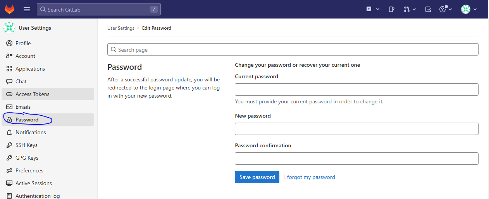

#### gitlab部署

```shell
【10.0.1.21】
### 服务器：ubuntu2204
# 下载安装包
# cd /opt/src
# wget https://mirrors.tuna.tsinghua.edu.cn/gitlab-ce/ubuntu/pool/jammy/main/g/gitlab-ce/gitlab-ce_15.5.0-ce.0_amd64.deb
 
# 安装
# sudo apt-get update
# sudo apt-get install -y curl openssh-server ca-certificates postfix
# apt install ./gitlab-ce_15.5.0-ce.0_amd64.deb

# 编辑站点地址（服务器节点的 ip）
# vi /etc/gitlab/gitlab.rb
external_url 'http://10.0.0.1:6666' 

# 重载配置（过程会比较久，耐心等待）
# gitlab-ctl reconfigure  

# GitLab 服务控制
# gitlab-ctl start      # 启动服务   
# gitlab-ctl status     # 查看状态
# gitlab-ctl stop       # 停止服务

## 注：此方式安装的 GitLab 服务是开机自启的服务

## 配置nginx代理
# cd /etc/nginx/conf.d/
# vi gitlab.conf
server {
   listen       80;
   server_name  gitlab.alnk.com;

   location / {
       proxy_pass http://10.0.1.21:6666;
       proxy_set_header Host $host;
       proxy_set_header X-Real-IP $remote_addr;
       proxy_set_header X-Forwarded-For $proxy_add_x_forwarded_for;
       proxy_set_header X-Forwarded-Proto $scheme;
   }
}
# nginx -t
# systemctl reload nginx

# cat /etc/gitlab/initial_root_password
Password: e+28L8L58YR6d9E91A4OJNYR2x4/SOjat6LxeWADPB0=


## 账号密码
root
e+28L8L58YR6d9E91A4OJNYR2x4/SOjat6LxeWADPB0=
```


> 修改密码
>
> root 
>
> root123456

    

  