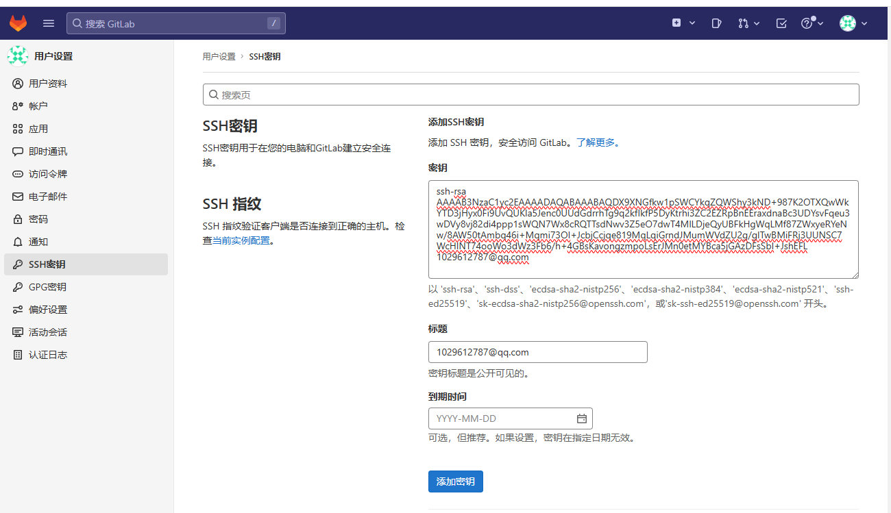
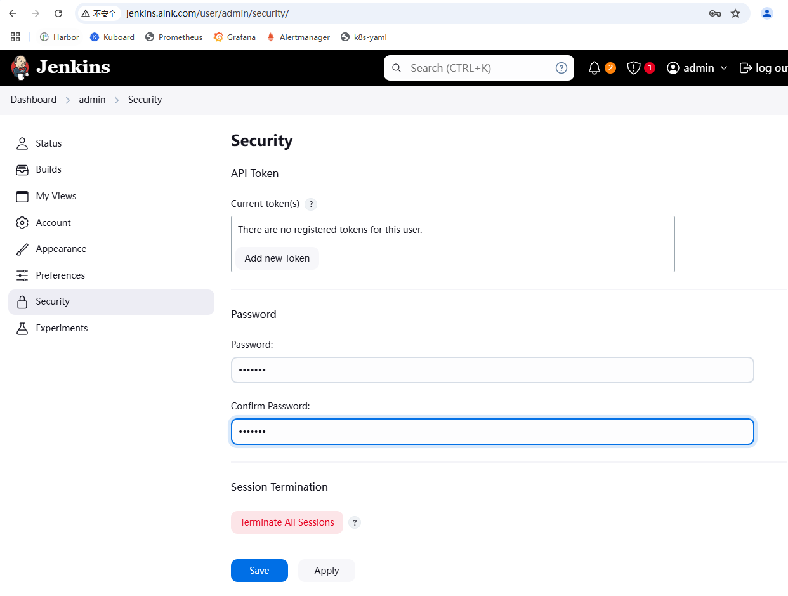
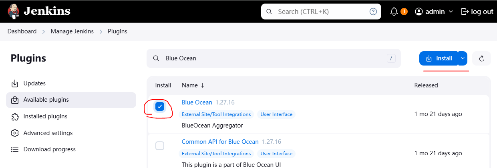
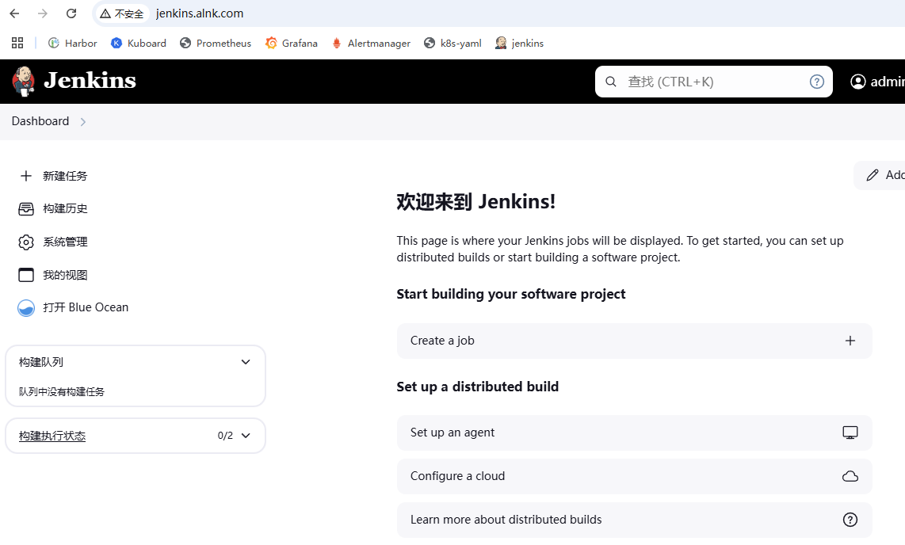

#### jenkins部署（jenkins 2.483版本）

##### jenkins基础镜像准备

```shell
【10.0.1.21】
# docker pull swr.cn-north-4.myhuaweicloud.com/ddn-k8s/docker.io/jenkins/jenkins:2.483
# docker tag swr.cn-north-4.myhuaweicloud.com/ddn-k8s/docker.io/jenkins/jenkins:2.483 harbor.alnk.com/public/jenkins:2.483
# docker push harbor.alnk.com/public/jenkins:2.483
```


##### 定制jenkins基础镜像

> 定制jenkins镜像，使其通过公钥私钥能访问gitlab，
>
> 安装docker客户端，使其能访问宿主机的docker服务端

```shell
【10.0.1.21】
# ssh-keygen -t rsa -b 2048 -C "1029612787@qq.com" -N "" -f /root/.ssh/id_rsa
## 拿到公钥配置到gitlab里面去
# cat /root/.ssh/id_rsa.pub
ssh-rsa AAAAB3NzaC1yc2EAAAADAQABAAABAQDX9XNGfkw1pSWCYkqZQWShy3kND+987K2OTXQwWkYTD3jHyx0Fi9UvQUKla5Jenc0UUdGdrrhTg9q2kfIkfP5DyKtrhi3ZC2EZRpBnEEraxdnaBc3UDYsvFqeu3wDVy8vj82di4ppp1sWQN7Wx8cRQTTsdNwv3Z5eO7dwT4MlLDjeQyUBFkHgWqLMf87ZWxyeRYeNw/8AW50tAmbq46i+Mqmi73OI+JcbjCcjqe819MqLqiGrndJMumWVdZU2g/glTwBMiFRj3UUNSC7WcHlNT74ooWo3dWz3Fb6/h+4GBsKavongzmpoLsErJMn0etMYBca5jGAzDFsSbI+JshEFL 1029612787@qq.com
```

    


```shell
【10.0.1.21】
# mkdir -p /data/dockerfile/jenkins-2.483
# cd /data/dockerfile/jenkins-2.483
# vi Dockerfile

## 拷贝登录gitlab的私钥    
# cp /root/.ssh/id_rsa .

## 拷贝登录harbor的配置文件
# cp /root/.docker/config.json .

## harbor仓库使用http登录
# vi daemon.json
{
  "insecure-registries": ["harbor.alnk.com"]
}


## 构建镜像
# docker build -t harbor.alnk.com/public/jenkins:2.483-docker .

## 推送镜像
# docker push harbor.alnk.com/public/jenkins:2.483-docker

## 简单测试
# docker run --rm harbor.alnk.com/public/jenkins:2.483-docker ssh -T git@10.0.1.21
Warning: Permanently added '10.0.1.21' (ED25519) to the list of known hosts.
Welcome to GitLab, @root!

```

`Dockerfile`

```Dockerfile
FROM harbor.alnk.com/public/jenkins:2.483
USER root
RUN rm -rf /etc/apt/sources.list.d/* &&\
    echo "deb http://mirrors.aliyun.com/debian bookworm main non-free contrib" > /etc/apt/sources.list.d/sources.list &&\
    echo "deb http://mirrors.aliyun.com/debian bookworm-updates main non-free contrib" >> /etc/apt/sources.list.d/sources.list &&\
    echo "deb http://mirrors.aliyun.com/debian bookworm-backports main non-free contrib" >> /etc/apt/sources.list.d/sources.list &&\
   	echo "deb-src http://mirrors.aliyun.com/debian bookworm main non-free contrib" >> /etc/apt/sources.list.d/sources.list &&\
    echo "deb-src http://mirrors.aliyun.com/debian bookworm-updates main non-free contrib" >> /etc/apt/sources.list.d/sources.list &&\
    echo "deb-src http://mirrors.aliyun.com/debian bookworm-backports main non-free contrib" >> /etc/apt/sources.list.d/sources.list &&\
    apt update && \
    apt install -y apt-transport-https ca-certificates curl software-properties-common gnupg lsb-release && \
    curl -fsSL https://download.docker.com/linux/debian/gpg | gpg --dearmor -o /usr/share/keyrings/docker-archive-keyring.gpg && \
    echo "deb [arch=$(dpkg --print-architecture) signed-by=/usr/share/keyrings/docker-archive-keyring.gpg] https://download.docker.com/linux/debian $(lsb_release -cs) stable" | tee /etc/apt/sources.list.d/docker.list > /dev/null && \
    apt update && \
    apt install -y docker-ce docker-ce-cli containerd.io

ADD daemon.json /etc/docker/daemon.json
ADD id_rsa /root/.ssh/id_rsa
ADD config.json /root/.docker/config.json
#ADD get-docker.sh /get-docker.sh
#RUN apt-get update -y
RUN /bin/cp /usr/share/zoneinfo/Asia/Shanghai /etc/localtime &&\ 
    echo 'Asia/Shanghai' >/etc/timezone
RUN echo "    StrictHostKeyChecking no" >> /etc/ssh/ssh_config 
#RUN /get-docker.sh
```


##### 部署jenkins到k8s

```shell
【10.0.1.21】
# mkdir jenkins_home
# chown nobody.nogroup jenkins_home/
# mkdir -p /data/k8s-yaml/jenkins
# cd /data/k8s-yaml/jenkins
# vi jenkins.yaml

【10.0.1.201】
# kubectl create ns jenkins-alnk
# kubectl apply -f http://k8s-yaml.alnk.com/jenkins/jenkins.yaml


【10.0.1.21】
## jenkins账号密码
# cd /data/nfs-volume/jenkins_home
# cat secrets/initialAdminPassword
8d153ac377574a17bd6aeb64bdf9d061
```

`jenkins.yaml`

```yaml
kind: Deployment
apiVersion: apps/v1
metadata:
  name: jenkins
  namespace: jenkins-alnk
  labels: 
    name: jenkins
spec:
  replicas: 1
  selector:
    matchLabels: 
      name: jenkins
  template:
    metadata:
      labels: 
        app: jenkins 
        name: jenkins
    spec:
      volumes:
      - name: data
        nfs: 
          server: 10.0.1.21
          path: /data/nfs-volume/jenkins_home
      - name: docker
        hostPath: 
          path: /run/docker.sock
          type: ''
      containers:
      - name: jenkins
        image: harbor.alnk.com/public/jenkins:2.483-docker
        imagePullPolicy: IfNotPresent
        ports:
        - containerPort: 8080
          protocol: TCP
        env:
        - name: JAVA_OPTS
          value: -Xmx1024m -Xms1024m
        volumeMounts:
        - name: data
          mountPath: /var/jenkins_home
        - name: docker
          mountPath: /run/docker.sock
      imagePullSecrets:
      - name: harbor
      securityContext: 
        runAsUser: 0
  strategy:
    type: RollingUpdate
    rollingUpdate: 
      maxUnavailable: 1
      maxSurge: 1
  revisionHistoryLimit: 7
  progressDeadlineSeconds: 600
  
---
kind: Service
apiVersion: v1
metadata: 
  name: jenkins
  namespace: jenkins-alnk
spec:
  ports:
  - protocol: TCP
    port: 80
    targetPort: 8080
  selector:
    app: jenkins

---    
# ingress.yaml
apiVersion: networking.k8s.io/v1
kind: Ingress
metadata:
  namespace: jenkins-alnk
  name: jenkins
spec:
  rules:
  - host: jenkins.alnk.com
    http:
      paths:
      - backend:
          service:
            name: jenkins
            port:
              number: 80
        path: /
        pathType: Prefix 
```


`访问jenkins`

  


`修改密码 admin/root123`

  


`允许匿名访问`

  


##### 安装蓝海

> 从仪表板到各个Pipeline运行的查看分支和结果，使用可视编辑器修改Pipeline作为代码
>
> 连续交付（CD）Pipeline的复杂可视化，允许快速和直观地了解Pipeline的状态（下面回顾构建镜像流程的时候有使用到）


  


`安装完成后，需要重启jenkins，最底下勾上重启`

  


`可以看到已经有蓝海这个插件了`

  


##### 安装中文插件

  

  


  


