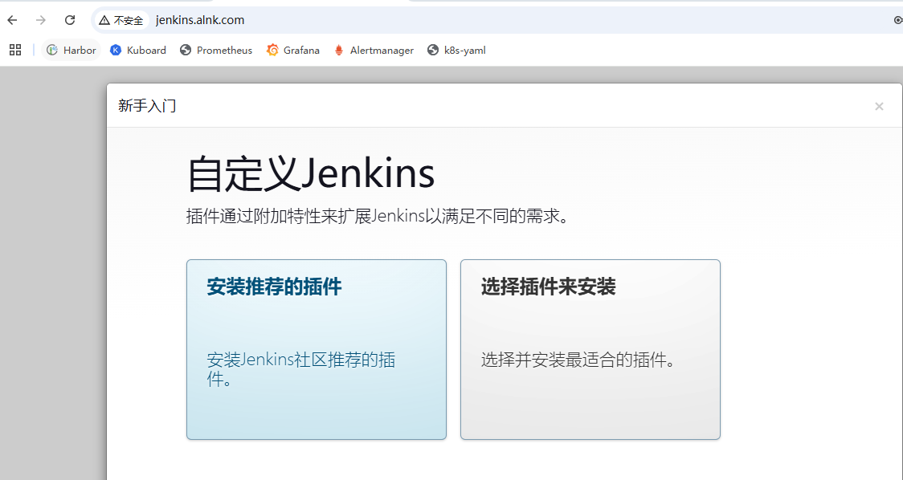
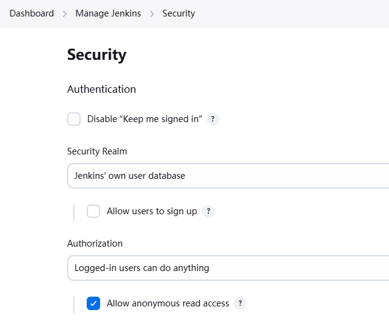
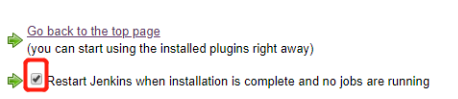
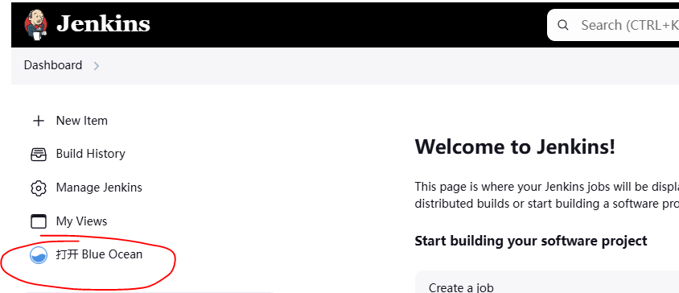
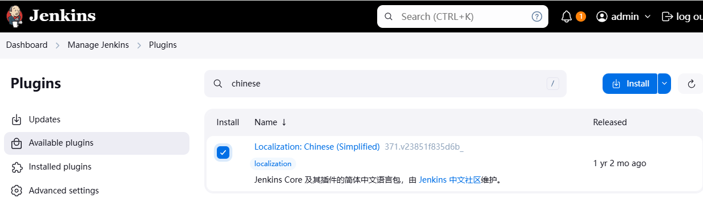
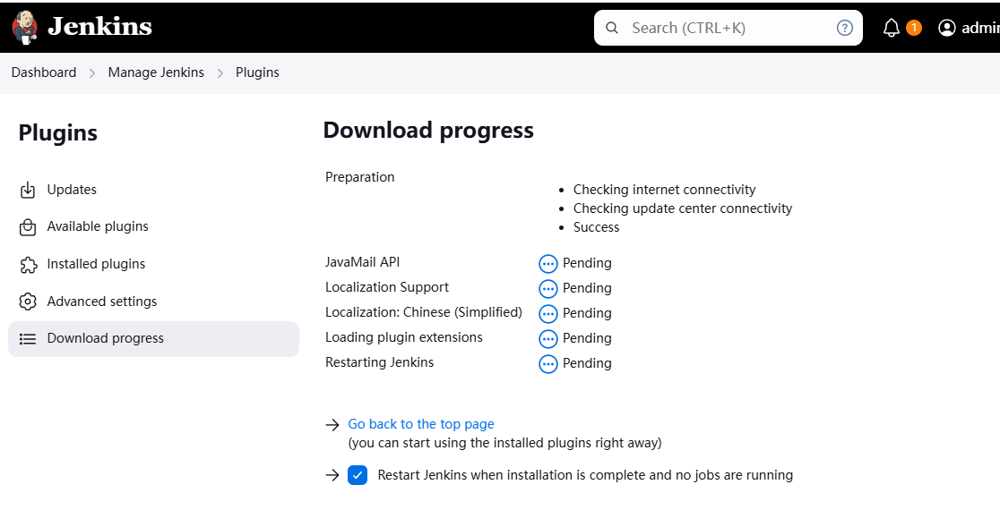
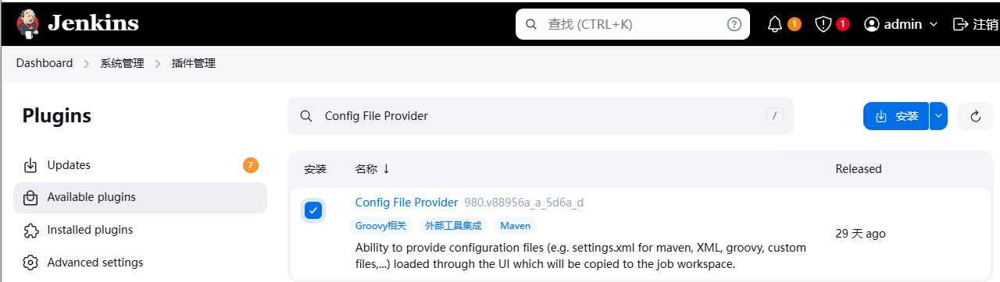
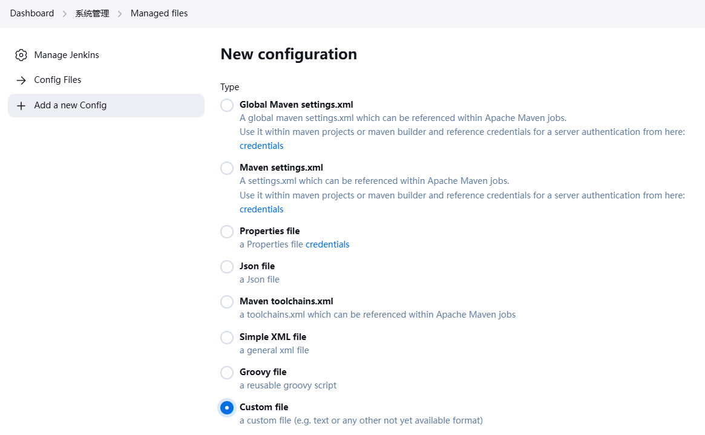
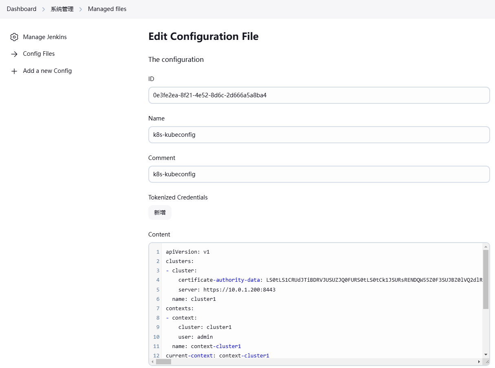

### k8s环境

> k8s部署工具：kubeasz
>
> k8s 版本：1.23.1
>
> 容器运行时： docker
>
> 操作系统 ：ubuntu2204
>
> ##### 服务器规划
>
> | **IP**         | **主机名称** | **角色**        | **系统**       | **软件**                                                     | **配置**  |
> | -------------- | ------------ | --------------- | -------------- | ------------------------------------------------------------ | --------- |
> | **10.0.1.21**  | **ops**      | **运维机**      | ubuntu2204     | **harbor仓库、kubeasz**                                      | **2c/4g** |
> | **10.0.1.100** | **虚拟IP**   | **/**           | **/**          | **流量入口、负载均衡、高可用、七层反向代理**                 | **/**     |
> | **10.0.1.101** | **ha-1**     | **反向代理**    | **ubuntu2204** | **nginx、keepalived**                                        | **1c/2g** |
> | **10.0.1.102** | **ha-2**     | **反向代理**    | **ubuntu2204** | **nginx、keepalived**                                        | **1c/2g** |
> | **10.0.1.200** | **虚拟IP**   | **/**           | **/**          | **apiserver高可用、4层反向代理**                             | **/**     |
> | **10.0.1.201** | **master-1** | **k8s主节点**   | **ubuntu2204** | **apiserver、controller、scheduler、etcd、keepalived、nginx(l4lb)** | **2c/4g** |
> | **10.0.1.202** | **master-2** | **k8s主节点**   | **ubuntu2204** | **apiserver、controller、scheduler、etcd、keepalived、nginx(l4lb)** | **2c/4g** |
> | **10.0.1.203** | **node-1**   | **k8s工作节点** | **ubuntu2204** | **kubelet、kube-proxy**、**etcd**                            | **2c/8g** |
> | **10.0.1.204** | **node-2**   | **k8s工作节点** | **ubuntu2204** | **kubelet、kube-proxy**                                      | **2c/8g** |
>
> `如果使用公有云、10.0.1.100、10.0.1.101、10.0.1.102可直接使用SLB即可`


### jenkins部署(jenkins 2.483)

#### jenkins构建方式

> ```
> ### 在k8s中部署的jenkins(暂时不考虑jenkins slave的情况下)
> 
> 方式1（jenkins本地打包）
> 1. jenkins本地需要安装相关语言的编译环境进行支持，例如java需要安装maven环境，面对多版本的maven环境，安装需要留意；go需要安装go编译环境等
> 2. jenkins本地需要安装docker客户端，然后调用宿主机的docker服务端（docker in docker），把编译后的的代码包拷贝到业务运行容器中去，再进行业务镜像构建
> 3. 这种方式的Dockerfile在其他地方构建时需要有编译后的代码包支持
> 
> 方式2（jenkins启用docker打包）
> 1. 不需要在jenkins本地安装相关编译环境
> 2. jenkins安装docker客户端，然后调用宿主机的docker服务端（docker in docker），把相关的代码拷贝到构建容器进行构建，最后用另外的业务容器运行
> 3. 这种方式的Dockerfile在其他地方构建时需要有相关的代码支持
> 
> ## 方式2 案例
> # from一个go的构建镜像
> FROM harbor.alnk.com/public/golang:1.22.8 as builder
> ENV GOPROXY https://goproxy.cn
> COPY . /app/
> RUN cd  /app \
>  && go mod init go-k8s-one \
>  && go mod tidy \
>  && CGO_ENABLED=0 GOOS=linux GOARCH=amd64 go build -ldflags "-s -w" -o go-k8s-one .
> # 使用其他镜像运行业务
> FROM harbor.od.com/public/alpine:3.18
> RUN sed -i 's/dl-cdn.alpinelinux.org/mirrors.aliyun.com/g' /etc/apk/repositories && \
>  apk update && \
>  apk --no-cache add tzdata ca-certificates && \
>  cp -f /usr/share/zoneinfo/Asia/Shanghai /etc/localtime && \
>  # apk del tzdata && \
>  rm -rf /var/cache/apk/*
> COPY --from=builder /app/go-k8s-one /app/go-k8s-one
> COPY --from=builder /app/conf/config.ini /app/conf/config.ini
> CMD ["/app/go-k8s-one"]
> ```


#### jenkins基础镜像

> ```shell
> 【10.0.1.21】
> # docker pull swr.cn-north-4.myhuaweicloud.com/ddn-k8s/docker.io/jenkins/jenkins:2.483
> # docker tag swr.cn-north-4.myhuaweicloud.com/ddn-k8s/docker.io/jenkins/jenkins:2.483 harbor.alnk.com/public/jenkins:2.483
> # docker push harbor.alnk.com/public/jenkins:2.483
> ```


#### 定制jenkins基础镜像

> ```
> 定制jenkins镜像
> - 通过公钥私钥访问gitlab所有项目
> - 安装docker命令，通过访问宿主机docker服务端进行docker打包
> - 安装maven，能够对java进行编译打包
> - 安装kubectl命令，能够通过config文件直接操作k8s
> ```
>
> `生成公钥私钥`
>
> ```
> 【10.0.1.21】
> # ssh-keygen -t rsa -b 2048 -C "1029612787@qq.com" -N "" -f /root/.ssh/id_rsa
> ## 拿到公钥配置到gitlab里面去
> # cat /root/.ssh/id_rsa.pub
> ssh-rsa AAAAB3NzaC1yc2EAAAADAQABAAABAQCseBxS74NHBxQJLOYaq8/F0ydRcqjee5zTHL+cTIab7WD4RhjlFQpsz/ppx2UreBpu3H4spAoz5d8E5CtzlWF9F1rRg0WNHxoCbtp+k6mRKBgpgAA8NDR7lj09jgbEhFmscqrYJinagcJFODEUECJcTA6Yp/fKuDR10m+5hsOSGobN8sZfqrKso9SAu2IR2JURhmeLDjPFzCz/XJ+uy+PFM4RoGdDY0zrL6TAR9JdDPSyS/t7BF0KavVoRSBC0rn0Db4SBHlAeBIAKaJQEIZtjA3VrvRwZiDn1/3pU6Do3/GW0AhkKjho+o3P/nLM47G5zVVuPqGys/p5SYUI3qFrF 1029612787@qq.com
> ```
>
> `gitlab配置公钥`
>
>   
>
> `其他准备`
>
> ```
> 【10.0.1.21】
> ## 相关文件准备
> # pwd
> /data/dockerfile/jenkins-dockerfile
> # ls -l
> -rw-r--r-- 1 root root  9024147 Nov 22 03:55 apache-maven-3.9.0-bin.tar.gz
> -rw-r--r-- 1 root root      132 Nov 22 03:55 config.json
> -rw-r--r-- 1 root root       52 Nov 22 03:55 daemon.json
> -rwxr-xr-x 1 root root 25838296 Nov 22 03:55 docker
> -rw-r--r-- 1 root root     2279 Nov 22 04:01 Dockerfile
> -rw-r--r-- 1 root root     1848 Nov 22 03:55 id_rsa
> -rwxr-xr-x 1 root root 46587904 Nov 22 04:00 kubectl
> 
> 
> ## 构建镜像
> # docker build -t harbor.alnk.com/public/jenkins:2.483-docker .
> 
> ## 推送镜像
> # docker push harbor.alnk.com/public/jenkins:2.483-docker
> 
> ## 简单测试
> # docker run --rm harbor.alnk.com/public/jenkins:2.483-docker ssh -T git@10.0.1.21
> Warning: Permanently added '10.0.1.21' (ED25519) to the list of known hosts.
> Welcome to GitLab, @root!
> ```
>
> `Dockerfile`
>
> ```Dockerfile
> FROM harbor.alnk.com/public/jenkins:2.483
> USER root
> RUN rm -rf /etc/apt/sources.list.d/* &&\
>  echo "deb http://mirrors.aliyun.com/debian bookworm main non-free contrib" > /etc/apt/sources.list.d/sources.list &&\
>  echo "deb http://mirrors.aliyun.com/debian bookworm-updates main non-free contrib" >> /etc/apt/sources.list.d/sources.list &&\
>  echo "deb http://mirrors.aliyun.com/debian bookworm-backports main non-free contrib" >> /etc/apt/sources.list.d/sources.list &&\
>  echo "deb-src http://mirrors.aliyun.com/debian bookworm main non-free contrib" >> /etc/apt/sources.list.d/sources.list &&\
>  echo "deb-src http://mirrors.aliyun.com/debian bookworm-updates main non-free contrib" >> /etc/apt/sources.list.d/sources.list &&\
>  echo "deb-src http://mirrors.aliyun.com/debian bookworm-backports main non-free contrib" >> /etc/apt/sources.list.d/sources.list &&\
>  apt update
> 
> ## 安装docker客户端
> #  apt update && \
> #  apt install -y apt-transport-https ca-certificates curl software-properties-common gnupg lsb-release && \
> #  curl -fsSL https://download.docker.com/linux/debian/gpg|gpg --dearmor -o /usr/share/keyrings/docker-archive-keyring.gpg && \
> #  echo "deb [arch=$(dpkg --print-architecture) signed-by=/usr/share/keyrings/docker-archive-keyring.gpg] https://download.docker.com/linux/debian $(lsb_release -cs) stable" | tee /etc/apt/sources.list.d/docker.list > /dev/null && \
> #  apt update && \
> #  apt install -y docker-ce docker-ce-cli containerd.io
> 
> ## docker相关设置 ##
> # harbor仓库不使用https以及harbor仓库账号密码
> ADD daemon.json /etc/docker/daemon.json
> ADD config.json /root/.docker/config.json
> # 添加docker命令
> ADD docker /usr/bin/
> 
> # 添加kubectl命令
> Add kubectl /usr/bin/
> 
> # gitlab密钥
> ADD id_rsa /root/.ssh/id_rsa
> 
> # 增加maven环境
> ADD ./apache-maven-3.9.0-bin.tar.gz /usr/local/ 
> ENV MAVEN_HOME=/usr/local/apache-maven-3.9.0
> ENV PATH=$JAVA_HOME/bin:$MAVEN_HOME/bin:$PATH
> 
> RUN /bin/cp /usr/share/zoneinfo/Asia/Shanghai /etc/localtime &&\ 
>     echo 'Asia/Shanghai' >/etc/timezone
> 
> RUN echo "    StrictHostKeyChecking no" >> /etc/ssh/ssh_config
> 
> ## 镜像构建
> ## docker build -t harbor.alnk.com/public/jenkins:2.483-docker .
> ## docker push harbor.alnk.com/public/jenkins:2.483-docker
> ```


#### 部署jenkins到k8s

> ```
> 【10.0.1.21】
> # mkdir jenkins_home
> # chown nobody.nogroup jenkins_home/
> # mkdir -p /data/k8s-yaml/jenkins
> # cd /data/k8s-yaml/jenkins
> # vi jenkins.yaml
> 
> 【10.0.1.201】
> # kubectl create ns jenkins-alnk
> # kubectl apply -f http://k8s-yaml.alnk.com/jenkins/jenkins.yaml
> 
> 
> 【10.0.1.21】
> ## jenkins账号密码
> # cd /data/nfs-volume/jenkins_home
> # cat secrets/initialAdminPassword
> 8d153ac377574a17bd6aeb64bdf9d061
> ```
>
> `jenkins.yaml`
>
> ```yaml
> kind: Deployment
> apiVersion: apps/v1
> metadata:
>   name: jenkins
>   namespace: jenkins-alnk
>   labels:
>     name: jenkins
> spec:
>   replicas: 1
>   selector:
>     matchLabels:
>       name: jenkins
>   template:
>     metadata:
>       labels:
>         app: jenkins
>         name: jenkins
>     spec:
>       volumes:
>       - name: data
>         nfs:
>           server: 10.0.1.21
>           path: /data/nfs-volume/jenkins_home
>       - name: docker
>         hostPath:
>           path: /run/docker.sock
>           type: ''
>       containers:
>       - name: jenkins
>         image: harbor.alnk.com/public/jenkins:2.483-docker
>         imagePullPolicy: Always
>         resources:
>           limits:
>             cpu: "2"
>             memory: "4Gi"
>           requests:
>             cpu: "1"
>             memory: "2G"
>         ports:
>         - name: http
>           containerPort: 8080
>           protocol: TCP
>         - name: jnlp
>           containerPort: 50000
>         env:
>         - name: JAVA_OPTS
>           value: -Xmx1024m -Xms1024m
>         volumeMounts:
>         - name: data
>           mountPath: /var/jenkins_home
>         - name: docker
>           mountPath: /run/docker.sock
>       imagePullSecrets:
>       - name: harbor
>       securityContext:
>         runAsUser: 0
>   strategy:
>     type: RollingUpdate
>     rollingUpdate:
>       maxUnavailable: 1
>       maxSurge: 1
>   revisionHistoryLimit: 7
>   progressDeadlineSeconds: 600
> 
> ---
> kind: Service
> apiVersion: v1
> metadata:
>   name: jenkins
>   namespace: jenkins-alnk
> spec:
>   ports:
>   - name: http # 服务端口
>     protocol: TCP
>     port: 80
>     targetPort: 8080
>   - name: jnlp # 代理端口
>     protocol: TCP
>     port: 50000
>     targetPort: 50000
>   selector:
>     app: jenkins
> 
> ---
> # ingress.yaml
> apiVersion: networking.k8s.io/v1
> kind: Ingress
> metadata:
>   namespace: jenkins-alnk
>   name: jenkins
> spec:
>   rules:
>   - host: jenkins.alnk.com
>     http:
>       paths:
>       - backend:
>           service:
>             name: jenkins
>             port:
>               number: 80
>         path: /
>         pathType: Prefix
> 
> ```
>
> `访问jenkins`
>
> `cat /data/nfs-volume/jenkins_home/secrets/initialAdminPassword`
>
> `c3d74cc864954d3db503e60a2934ddc1`
>
>   
>
> `修改密码 admin/root123`
>
>   
>
> `允许匿名访问`
>
>   


#### 插件安装

##### jenkins插件设置国内源

> ```
> 将jenkins插件安装配置国内源
> https://mirrors.tuna.tsinghua.edu.cn/jenkins/updates/update-center.json
> ```
>
>   


##### 安装Blue Ocean蓝海

> ```
> Blue Ocean
> 从仪表板到各个Pipeline运行的查看分支和结果，使用可视编辑器修改Pipeline代码
> 连续交付（CD）Pipeline的复杂可视化，允许快速和直观地了解Pipeline的状态
> ```
>
>   
>
> `安装完成后，需要重启jenkins，最底下勾上重启`
>
>   
>
> `可以看到已经有蓝海这个插件了`
>
>   


##### 安装中文插件

>   
>
>   
>
>   


##### 安装Config File Provider插件

> ```
> ### 安装 Config File Provider 插件
> 用于加载外部配置文件，如 Maven 的 settings.xml 或者 k8s 的 kubeconfig 等
> ```
>
>   
>
> 
>
> `添加k8s kube config文件`
>
>       
>
>    
>
> ```
> pipeline {
>     agent any
>     stages {
>         stage("get pod") {
>             steps {
>                 configFileProvider([configFile(fileId: '19de7e73-9c1e-436a-920a-e8fa2f56ca90', targetLocation: 'KUBECONFIG')]) {
>                     // some block
>                     sh """
>                     kubectl --kubeconfig=KUBECONFIG get nodes
>                     cat KUBECONFIG
>                     """
>                 }
>             }
> 
>         }
>     }
> }
> ```

