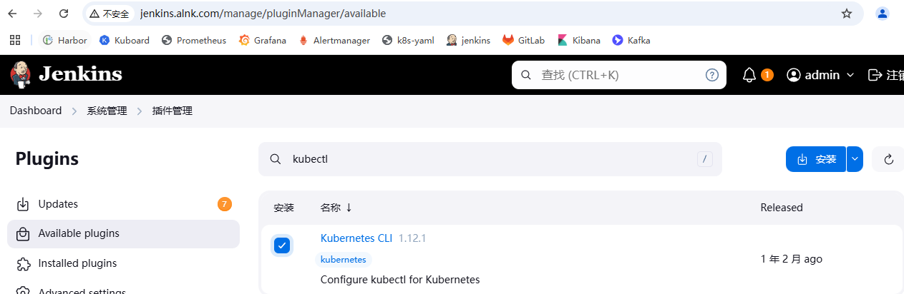

### jenkins-slave[以下TODO] 

##### 安装k8s插件

> ```
> ### 是为了jenkins-slave 动态
> ### 安装Kubernetes插件
> ## 进入Dashboard > 系统管理 > 节点和云管理 > Clouds > install a plugin > kubernetes
> ## 安装完成以后重启jenkins
> ```
>
>   
>
>   
>
>   
>
>  
>
> 
>
> ```
> ### 配置 k8s 集群
> ## 系统管理 -> Clouds -> New cloud
> - 如果jenkins是运行在k8s容器中，配置服务名https://kubernetes.default 然后进行相关的授权
> 具体可以看下面报错解决办法
> - 如果jenkins部署在外部，要配置外部访问ip以及apiserver的端口6443，还需要配置服务证书
> 
> ### Jenkins 地址
> - 如果部署在k8s集群内部：http://jenkins.jenkins-alnk
> - 如果在外部：换成jenkins的地址
> 
> 
> ## 报错，权限不足
> Error testing connection https://kubernetes.default: io.fabric8.kubernetes.client.KubernetesClientException: Failure executing: GET at: https://kubernetes.default/api/v1/namespaces/jenkins-alnk/pods. Message: pods is forbidden: User "system:serviceaccount:jenkins-alnk:default" cannot list resource "pods" in API group "" in the namespace "jenkins-alnk".
> 
> ## 解决办法，给jenkins-alnk这个名称空间授权
> ## 本次实验的jenkins是安装在jenkins-alnk这个名称空间
> ## 编辑rbac权限文件
> # vi service-reader-cluster-role.yaml
> apiVersion: v1
> kind: ServiceAccount
> metadata:
> name: default
> namespace: jenkins-alnk
> 
> --- 
> apiVersion: rbac.authorization.k8s.io/v1
> kind: ClusterRoleBinding
> metadata:
> name: jenkins-cluster-admin
> roleRef:
> apiGroup: rbac.authorization.k8s.io
> kind: ClusterRole
> name: cluster-admin
> subjects:
> - kind: ServiceAccount
> name: default
> namespace: jenkins-alnk  
> 
> ## 应用     
> # kubectl apply -f service-reader-cluster-role.yaml
> ```
>
>   
>
>   
>
>     
>
>     
>
>   
>
>   
>
> 
>
> ```
> # docker pull registry.cn-hangzhou.aliyuncs.com/alnktest/inbound-agent:3261.v9c670a_4748a_9-2
> #docker tag registry.cn-hangzhou.aliyuncs.com/alnktest/inbound-agent:3261.v9c670a_4748a_9-2 harbor.alnk.com/public/inbound-agent:3261.v9c670a_4748a_9-2
> # docker  push harbor.alnk.com/public/inbound-agent:3261.v9c670a_4748a_9-2
> ```
>
> 


##### 安装kubectl插件

>   


