### jenkins-slave

> ```
> 持续构建与发布是我们日常工作中必不可少的一个步骤，目前大多公司都采用Jenkins集群来搭建符合需求的 CI/CD流程，然而传统的Jenkins Slave一主多从方式会存在一些痛点，比如
> -	主Master发生单点故障时，整个流程都不可用了
> -	每个Slave的配置环境不一样，来完成不同语言的编译打包等操作，但是这些差异化的配置导致管理起来非常不	   方便，维护起来也是比较费劲
> -	资源分配不均衡，有的Slave要运行的job出现排队等待，而有的Slave处于空闲状态
> -	资源有浪费，每台Slave可能是物理机或者虚拟机，当Slave处于空闲状态时，也不会完全释放掉资源
> 
> 正因为上面的这些种种痛点，我们渴望一种更高效更可靠的方式来完成这个CI/CD流程，而Docker虚拟化容器技术能很好的解决这个痛点，又特别是在Kubernetes集群环境下面能够更好来解决上面的问题，下图是基于 Kubernetes 搭建Jenkins集群的简单示意图
> ```
>
> 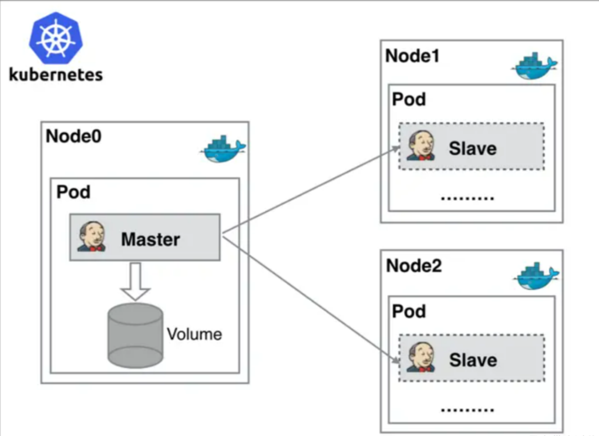 
>
> ```
> Jenkins Master和Jenkins Slave以Pod形式运行在Kubernetes集群的Node 上，Master运行在其中一个节点，并且将其配置数据存储到一个Volume上去，Slave运行在各个节点上，并且它不是一直处于运行状态，它会按照需求动态的创建并自动删除
> 
> 工作流程大致为：当Jenkins Master接受到Build请求时，会根据配置的Label动态创建一个运行在Pod中的 Jenkins Slave并注册到Master上，当运行完Job后，这个Slave会被注销并且这个Pod也会自动删除，恢复到最初状态
> 
> 使用jenkins动态slave的优势
> -	服务高可用，当Jenkins Master出现故障时，Kubernetes会自动创建一个新的Jenkins Master容器，并	且将Volume分配给新创建的容器，保证数据不丢失，从而达到集群服务高可用
> -	动态伸缩，合理使用资源，每次运行Job 时，会自动创建一个Jenkins Slave，Job完成后，Slave自动注销	   并删除容器，资源自动释放，而且Kubernetes会根据每个资源的使用情况，动态分配Slave到空闲的节点上	 创建，降低出现因某节点资源利用率高，还排队等待在该节点的情况
> -	扩展性好，当Kubernetes集群的资源严重不足而导致Job排队等待时，可以很容易的添加一个Kubernetes 	  Node到集群中，从而实现扩展
> ```


#### 安装k8s插件

> ```
> ### 安装Kubernetes插件 是为了动态jenkins-slave 
> 
> ## 进入Dashboard > 系统管理 > 节点和云管理 > Clouds > install a plugin > kubernetes
> ## 安装完成以后重启jenkins
> ```
>
>   
>
> 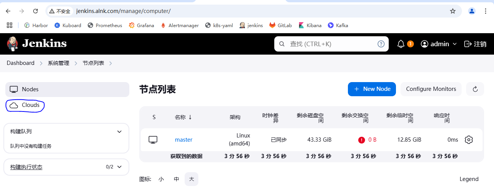  
>
> 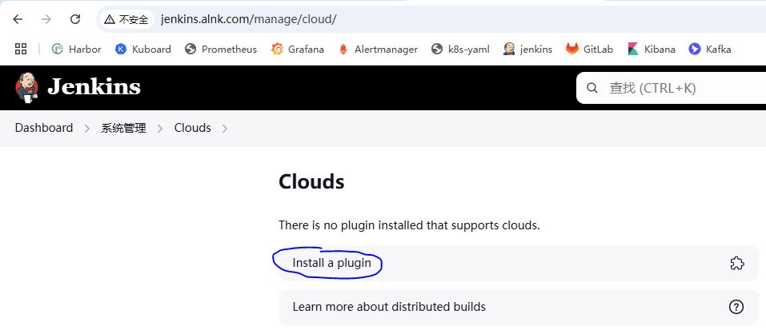  
>
> 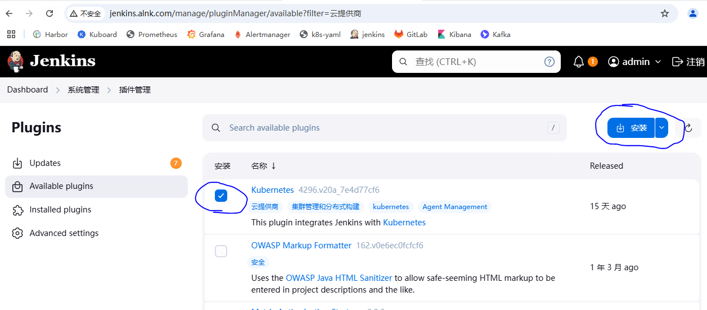   


#### 配置jenkins

> `添加k8s集群配置`
>
> ```
> ### 配置 k8s 集群
> ## 系统管理 -> Clouds -> New cloud
> - 如果jenkins是运行在k8s容器中，配置服务名https://kubernetes.default 然后进行相关的授权
>   具体可以看下面报错解决办法
> - 如果jenkins部署在外部，要配置外部访问ip以及apiserver的端口6443，还需要配置服务证书
> 
> ### Jenkins 地址
> - 如果部署在k8s集群内部：http://jenkins.jenkins-alnk
> - 如果在外部：换成jenkins的地址
> 
> 
> ## 报错，权限不足
> Error testing connection https://kubernetes.default: io.fabric8.kubernetes.client.KubernetesClientException: Failure executing: GET at: https://kubernetes.default/api/v1/namespaces/jenkins-alnk/pods. Message: pods is forbidden: User "system:serviceaccount:jenkins-alnk:default" cannot list resource "pods" in API group "" in the namespace "jenkins-alnk".
> 
> ## 解决办法，给jenkins-alnk这个名称空间授权
> ## 本次实验的jenkins是安装在jenkins-alnk这个名称空间
> ## 编辑rbac权限文件
> # vi service-reader-cluster-role.yaml
> apiVersion: v1
> kind: ServiceAccount
> metadata:
> name: default
> namespace: jenkins-alnk
> 
> --- 
> apiVersion: rbac.authorization.k8s.io/v1
> kind: ClusterRoleBinding
> metadata:
> name: jenkins-cluster-admin
> roleRef:
> apiGroup: rbac.authorization.k8s.io
> kind: ClusterRole
> name: cluster-admin
> subjects:
> - kind: ServiceAccount
> name: default
> namespace: jenkins-alnk  
> 
> ## 应用     
> # kubectl apply -f service-reader-cluster-role.yaml
> ```
>
>   
>
> 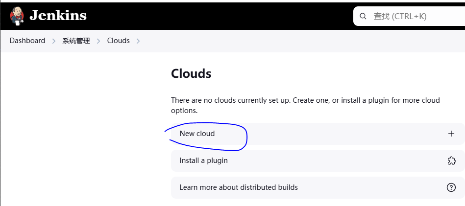  
>
> 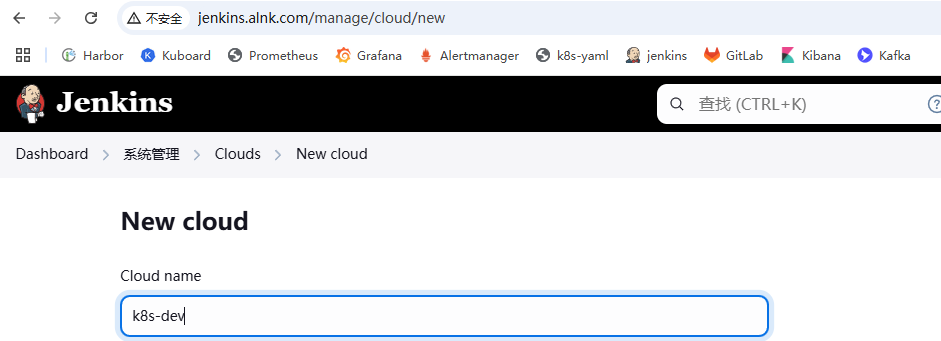    
>
> 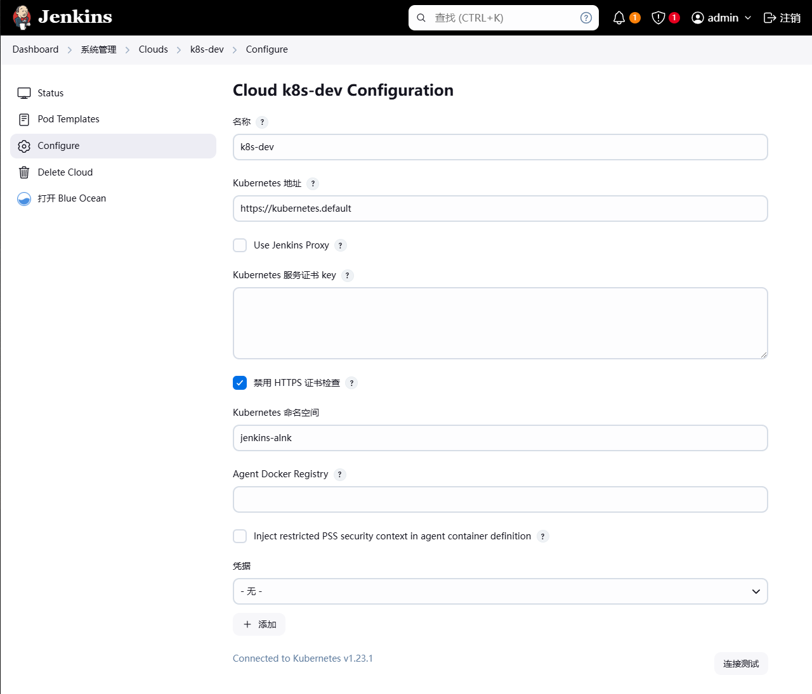    
>
> 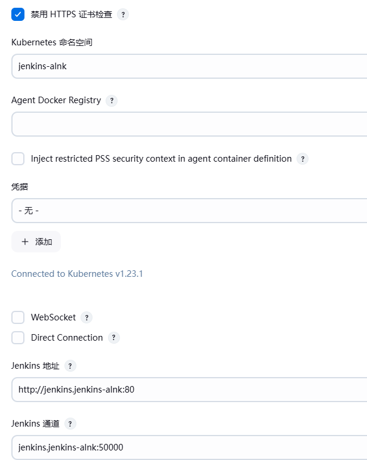  
>
> 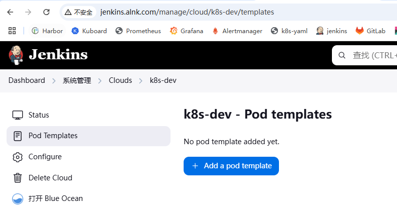  
>
> 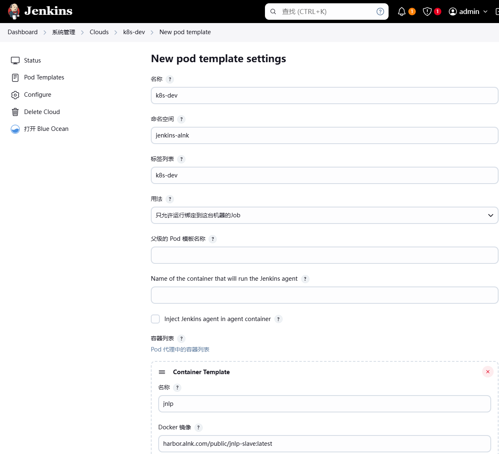  
>
> 
>
> ```
> # docker pull registry.cn-hangzhou.aliyuncs.com/alnktest/inbound-agent:3261.v9c670a_4748a_9-2
> #docker tag registry.cn-hangzhou.aliyuncs.com/alnktest/inbound-agent:3261.v9c670a_4748a_9-2 harbor.alnk.com/public/inbound-agent:3261.v9c670a_4748a_9-2
> # docker  push harbor.alnk.com/public/inbound-agent:3261.v9c670a_4748a_9-2
> ```
>


#### 配置jenkins salve的pod模板

> `也可以直接在jenkinsfile中自己定义pod模板`
>
> 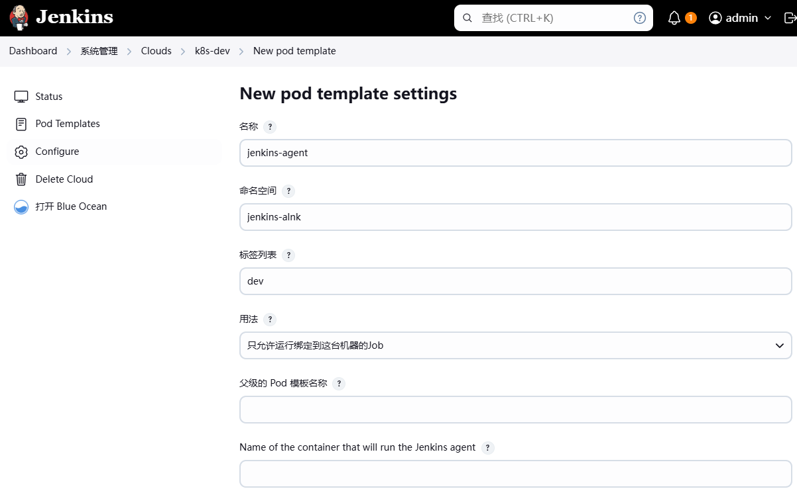  
>
> 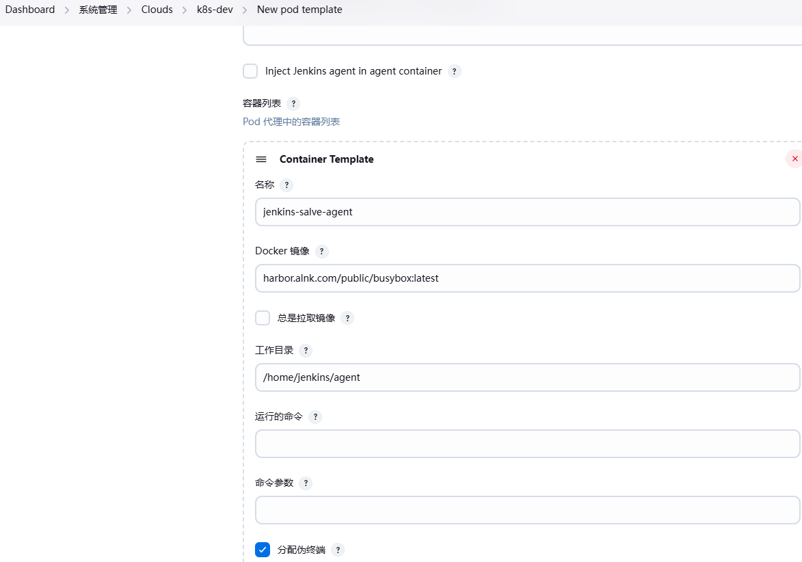  
>
> `配置完重启一下jenkins`


#### 简单测试

> `直接通过pipeline来声明jenkins-slave的pod模板，然后调用`
>
> 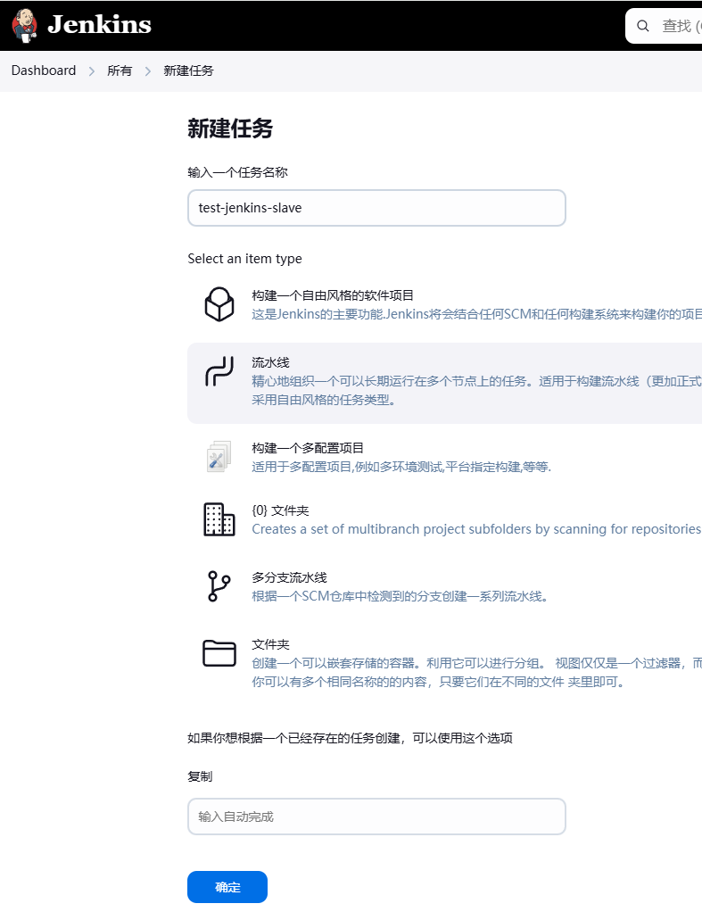 
>
> ```
> // Jenkinsfile 示例，使用 Kubernetes 作为 Jenkins Slave
> pipeline {
>     agent {
>         kubernetes {
>             yaml """
> apiVersion: v1
> kind: Pod
> metadata:
>   labels:
>     some-label: some-value
> spec:
>   containers:
>   - name: jnlp
>     image: 'jenkinsci/jnlp-slave:3.27-1'
>     volumeMounts:
>     - name: docker-certs
>       mountPath: /certs
>       readOnly: true
>     - name: maven-repo
>       mountPath: /home/jenkins/.m2
>     - name: npm-global
>       mountPath: /home/jenkins/.npm-global
>     - name: gradle-cache
>       mountPath: /home/.gradle
>   volumes:
>   - name: docker-certs
>     hostPath:
>       path: /etc/docker
>       readOnly: true
>   - name: maven-repo
>     emptyDir: {}
>   - name: npm-global
>     emptyDir: {}
>   - name: gradle-cache
>     emptyDir: {}
> """
>         }
>     }
>     stages {
>         stage('Build') {
>             steps {
>                 sh 'printenv'
>                 // 添加你的构建步骤
>             }
>         }
>     }
> }
> ```
>
> 

