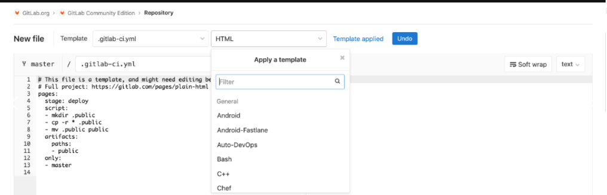
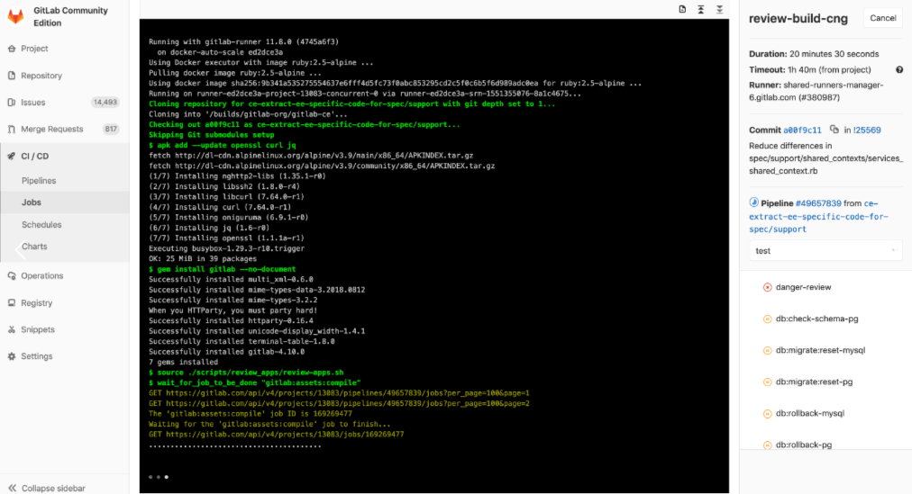
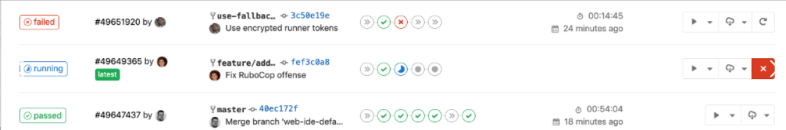
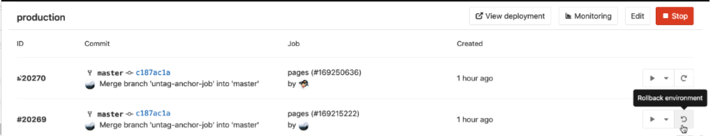

#### 为什么要做 cicd

##### 传统的应用开发发布模式

> ```text
> 传统的应用开发发布模式
> 开发团队：在开发环境中完成软件开发，单元测试，测试通过，提交到代码版本管理库
> 运维团队：把应用部署到测试环境，供QA团队测试，测试通过后部署生产环境
> QA 团队：进行测试，测试通过后通知部署人员发布到生产环境
> ```
>
>   
>
> ```text
> 问题
> 错误发现不及时：很多错误在项目的早期可能就存在，到最后集成的时候才发现问题
> 人工低级错误发生：产品和服务交付中的关键活动全都需要手动操作
> 团队工作效率低：需要等待他人的工作完成后才能进行自己的工作
> 开发运维对立： 开发人员想要快速更新，运维人员追求稳定，各自的针对的方向不同
> ```


##### 持续集成与持续交付

> ```text
> 软件开发的连续方法是基于自动执行脚本，以最大程度地减少在开发应用程序时引入错误的机会
> 从开发新代码到部署新代码，他们几乎不需要人工干预，甚至根本不需要干预
> 它涉及到在每次小的迭代中就不断地构建，测试和部署代码更改，从而减少了基于错误或失败的先前版本开发新代码的机会
> 
> 持续集成（CI）
> 持续合并开发人员正在开发编写的所有代码的一种做法。通常一天内进行多次合并和提交代码，从存储库或生产环境中进行构建和自动化测试，以确保没有集成问题并及早发现任何问题
> 开发人员提交代码的时候一般先在本地测试验证，只要开发人员提交代码到版本控制系统就会触发一条提交流水线，对本次提交进行验证
> 
> 持续交付（CD）
> 持续交付是超越持续集成的一步。不仅会在推送到代码库的每次代码更改时都进行构建和测试，而且，作为附加步骤，即使部署是手动触发的，它也可以连续部署。此方法可确保自动检查代码，但需要人工干预才能从策略上手动触发更改的部署
> 
> 持续部署（CD）
> 通常可以通过将更改自动推送到发布系统来随时将软件发布到生产环境中。持续部署会更进一步，并自动将更改推送到生产中。类似于持续交付，持续部署也是超越持续集成的又一步。不同之处在于，无需将其手动部署，而是将其设置为自动部署。部署的应用程序完全不需要人工干预
> ```


##### cicd的价值体现

> ```text
> 尽早反馈，尽早发现错误
> 减少集成问题，每次发现问题当时解决，避免问题堆积
> 每次更改都能成功发布，降低发布风险
> 更加频繁的交付价值，客户反馈
> ```


##### 常用的cicd工具

###### jenkins

> 专业的 CI 工具，可扩展自动化服务器、安装配置简单、丰富的插件库、分布式架构设计、支持所有的平台、可视化的管理页面
>
>   


###### gitlab

> 端到端 DevOps 工具，常用功能：代码审查、问题跟踪、动态订阅、易于扩展、项目 wiki、多角色项目管理、项目代码在线编译预览、CI 工具集成
>
> - 提交合并代码集成：通过 git push 进行操作或者在 GitLab Web 页面操作。
> - 发布应用到服务器： 获取制品库中的应用，然后用 salt、ansible 发布部署到服务器。
> - 完全自动化：提交代码 -> 构建部署 -> 发布
>
>   


#### gitlab cicd 功能简介

##### GitLab 内置持续集成功能

###### 持续集成（CI）

> - 集成团队中每个开发人员提交的代码到代码存储库中
> - 开发人员在 Merge 或者 Pull 请求中合并拉取新代码
> - 在提交或者合并更改到代码存储库之前，会触发了构建，测试和新代码验证的管道
> - CI 可帮助在开发周期的早期发现并减少错误

###### 连续交付（CD）

> - 可通过结构化的部署管道确保将经过 CI 验证的代码交付给您的应用程序。
> - CD 可以将经过验证的代码更快地移至您的应用程序
>
>  CI/CD 一起可以加快团队为客户和利益相关者交付成果的速度。CI 和 CD 必须无缝协作，以使您的团队快速有效地进行构建，并且对于确保完全优化的开发实践至关重要


##### GitLab CI/CD 优势

> 开源：CI/CD 是开源 GitLab 社区版和专有 GitLab 企业版的一部分。
>
> 易于学习：具有详细的入门文档。
>
> 无缝集成：GitLab CI/CD 是 GitLab 的一部分，支持从计划到部署,具有出色的用户体验。
>
> 可扩展：测试可以在单独的计算机上分布式运行，可以根据需要添加任意数量的计算机。
>
> 更快的结果：每个构建可以拆分为多个作业，这些作业可以在多台计算机上并行运行。
>
> 针对交付进行了优化：多个阶段，手动部署， 环境和变量


##### GitLab CI/CD 特点

> 多平台：Unix，Windows，macOS 和任何其他支持 Go 的平台上执行构建。
>
> 多语言：构建脚本是命令行驱动的，并且可以与 Java，PHP，Ruby，C 和任何其他语言一起使用。
>
> 稳定构建：构建在与 GitLab 不同的机器上运行。
>
> 并行构建：GitLab CI/CD 在多台机器上拆分构建，以实现快速执行。
>
> 实时日志记录：合并请求中的链接将您带到动态更新的当前构建日志。
>
> 灵活的管道：您可以在每个阶段定义多个并行作业，并且可以 触发其他构建。
>
> 版本管道： 一个 .gitlab-ci.yml 文件包含您的测试，整个过程的步骤，使每个人都能贡献更改，并确保每个分支获得所需的管道。
>
> 自动缩放：您可以自动缩放构建机器，以确保立即处理您的构建并将成本降至最低。
>
> 构建工件：您可以将二进制文件和其他构建工件上载到 GitLab 并浏览和下载它们。
>
> Docker 支持：可以使用自定义 Docker 镜像， 作为测试的一部分启动 服务， 构建新的Docker 镜像，甚至可以在 Kubernetes 上运行。
>
> 容器注册表： 内置的容器注册表，用于存储，共享和使用容器镜像。
>
> 受保护的变量： 在部署期间使用受每个环境保护的变量安全地存储和使用机密。
>
> 环境： 定义多个环境
>


##### GitLab CI/CD 架构

###### GitLab CI/CD

> GitLab 的一部分，GitLab 是一个 Web 应用程序，具有将其状态存储在数据库中的 API。 除了 GitLab 的所有功能之外，它还管理项目/构建并提供一个不错的用户界面


###### GitLab Runner

> 是一个处理构建的应用程序。 它可以单独部署，并通过 API 与 GitLab CI/CD一起使用
>
>   


###### .gitlab-ci.yml

> .gitlab-ci.yml：定义流水线作业运行，位于应用项目根目录下
>
>   
>
> **为了运行测试，至少需要一个 GitLab 实例、一个 GitLab Runner、一个 gitlab-ci 文件**


##### GitLab CI/CD 工作原理

> - 将代码托管到 Git 存储库。
> - 在项目根目录创建 ci 文件 `.gitlab-ci.yml` ，在文件中指定构建，测试和部署脚本。
> - GitLab 将检测到它并使用名为 GitLab Runner 的工具运行脚本。
> - 脚本被分组为**作业**，它们共同组成了一个**管道**。
>
>   
>
> 管道状态也会由 GitLab 显示：
>
>   
>
> 最后，如果出现任何问题，可以轻松地回滚所有更改：
>
>   


