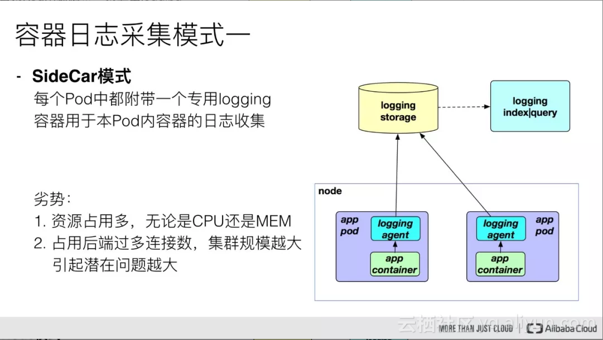

### k8s日志收集方案

#### k8s环境介绍

> ```
> k8s部署工具：kubeasz
> k8s 版本：1.23.1
> 容器运行时： docker
> 操作系统 ：ubuntu2204
> ```
>
> ##### 服务器规划
>
> | **IP**         | **主机名称** | **角色**        | **系统**       | **软件**                                                     | **配置**  |
> | -------------- | ------------ | --------------- | -------------- | ------------------------------------------------------------ | --------- |
> | **10.0.1.21**  | **ops**      | **运维机**      | **ubuntu2204** | **harbor仓库、kubeasz**                                      | **2c/4g** |
> | **10.0.1.100** | **虚拟IP**   | **/**           | **/**          | **流量入口、负载均衡、高可用、七层反向代理**                 | **/**     |
> | **10.0.1.101** | **ha-1**     | **反向代理**    | **ubuntu2204** | **nginx、keepalived**                                        | **1c/2g** |
> | **10.0.1.102** | **ha-2**     | **反向代理**    | **ubuntu2204** | **nginx、keepalived**                                        | **1c/2g** |
> | **10.0.1.200** | **虚拟IP**   | **/**           | **/**          | **apiserver高可用、4层反向代理**                             | **/**     |
> | **10.0.1.201** | **master-1** | **k8s主节点**   | **ubuntu2204** | **apiserver、controller、scheduler、etcd、keepalived、nginx(l4lb)** | **2c/4g** |
> | **10.0.1.202** | **master-2** | **k8s主节点**   | **ubuntu2204** | **apiserver、controller、scheduler、etcd、keepalived、nginx(l4lb)** | **2c/4g** |
> | **10.0.1.203** | **node-1**   | **k8s工作节点** | **ubuntu2204** | **kubelet、kube-proxy**、**etcd**                            | **2c/8g** |
> | **10.0.1.204** | **node-2**   | **k8s工作节点** | **ubuntu2204** | **kubelet、kube-proxy**                                      | **2c/8g** |
>
> ```
> 如果使用公有云、10.0.1.100、10.0.1.101、10.0.1.102可直接使用SLB即可
> ```


#### 方案介绍

> ```
> k8s官网日志收集方案地址 ：https://kubernetes.io/zh/docs/concepts/cluster-administration/logging/
> 
> 1-边车模式
> 使用sidcar容器(一个pod多容器)收集当前pod内一个或者多个业务容器的日志(通常基于emptyDir实现业务容器与sidcar之间的日志共享)
> 该方式的优点：对当前收集日志的pod能做更详细的处理，按照预定义规则处理好的日志，再输出到kafka或者filebeat
> 该方式的缺点：性能可能没那么好，因为一个pod就需要一个sidecar，如果有100个pod，那就需要100个sidecar，那么这个日志收集的agent就必须选用一个轻量级的工具，不然会占用很多额外资源
> 
> 2-node节点收集
> 基于daemonset部署日志收集进程，实现json-file类型(标准输出/dev/stdout、错误输出/dev/stderr)日志收集；
> 该方式的优点：日志收集架构简单，易部署、易维护
> 该方式的缺点：node节点产生的日志、路径、类型、日志内容都不同，很难做到把每个容器的日志都完整的处理好
> 
> 3-在业务容器中内置日志收集服务进程
> 就是除了业务容器，再另外起一个日志收集的进程，然后直接把日志推送到远端存储
> ```
>
>   
>
>   