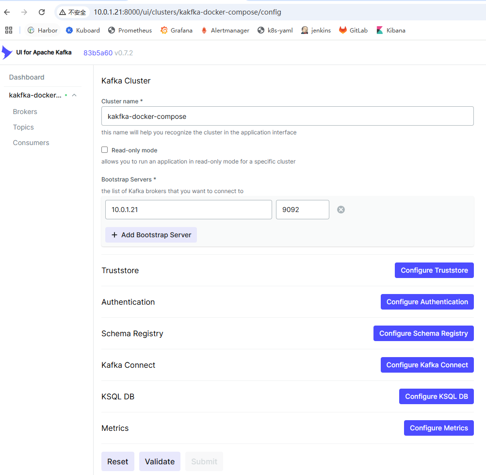

### docker-compose部署kafka

> ```text
> Kafka是一种流行的分布式消息传递系统，设计用于处理大规模的数据流。它在日志传输和流数据处理领域尤为重要。以下是Kafka的一些关键特性，以及它们如何适用于日志传输体系：
> 
> 高吞吐量和可伸缩性
> - Kafka能够处理高速数据流，支持大量数据的读写操作。它通过分区（partitions）和分布式架构来实现高吞吐量和水平扩展
> - 在日志传输中，这意味着Kafka可以高效地收集和分发大量的日志数据，满足大型系统的需求
> 
> 持久性和可靠性
> - Kafka将数据存储在磁盘上，并支持数据的复制，确保信息不会因为单点故障而丢失
> - 对于日志管理来说，这确保了日志数据的安全和完整性，即使在系统故障的情况下也能保持日志的可用性
> 
> 实时处理
> - Kafka支持实时数据流处理，使得数据在产生后立即可用
> - 在日志系统中，这允许实时监控和分析日志数据，有助于快速故障排除和系统性能监控
> 
> 分布式架构
> - Kafka的分布式特性意味着它可以跨多个服务器和数据中心运行，提高了容错能力和系统的稳定性
> - 在分布式日志系统中，这有助于管理跨地域或多个服务的日志数据，提供更好的可扩展性和冗余
> 
> 灵活的消费模型
> - Kafka支持发布-订阅和队列两种消息模式，使消费者能够灵活地读取数据
> - 日志传输中，这使得不同的系统和应用可以根据需要订阅特定类型的日志数据
> 
> 低延迟
> - Kafka设计用于低延迟消息传递，这对于需要快速响应的日志分析和监控系统至关重要
> 
> 结合日志传输体系，Kafka的这些特性使其成为一个理想的中央日志聚合点。它不仅能够高效地收集来自不同源的日志数据，还能将这些数据实时分发给各种日志分析和监控工具，支持大数据分析、实时监控和快速故障检测
> 
> 在Apache Kafka中，几个核心概念包括主题（Topic）、分区（Partition）和消费组（Consumer Group）。这些概念是Kafka高效消息处理和分布式数据流管理的基石
> ```
>
> ```shell
> 【10.0.1.21】
> ### 准备镜像
> ## kafka 2.2.0
> # docker pull registry.cn-hangzhou.aliyuncs.com/alnktest/kafka:2.2.0
> # docker tag  registry.cn-hangzhou.aliyuncs.com/alnktest/kafka:2.2.0  harbor.alnk.com/public/kafka:2.2.0
> # docker push harbor.alnk.com/public/kafka:2.2.0
> 
> ## zookeeper 3.4.13
> # docker pull registry.cn-hangzhou.aliyuncs.com/alnktest/zookeeper:3.4.13
> # docker tag registry.cn-hangzhou.aliyuncs.com/alnktest/zookeeper:3.4.13 harbor.alnk.com/public/zookeeper:3.4.13
> # docker push harbor.alnk.com/public/zookeeper:3.4.13
> 
> ## kafka-ui
> # docker pull registry.cn-hangzhou.aliyuncs.com/alnktest/kafka-ui:v0.7.2
> # docker tag registry.cn-hangzhou.aliyuncs.com/alnktest/kafka-ui:v0.7.2 harbor.alnk.com/public/kafka-ui:v0.7.2 
> # docker push harbor.alnk.com/public/kafka-ui:v0.7.2 
> 
> ### 创建目录
> ## 创建数据目录
> # mkdir /data/zookeeper/data -p
> # mkdir /data/zookeeper/datalog -p
> # mkdir /data/zookeeper/logs -p
> # mkdir /data/kafka1/data -p
> 
> ## docker-compose文件目录
> # mkdir -p /opt/kafka-2.2.0 
> # cd /opt/kafka-2.2.0
> # vi docker-compose.yml
> version: '3.3'
> services:
>   zookeeper:
>     image: harbor.alnk.com/public/zookeeper:3.4.13
>     container_name: zookeeper
>     ports:
>       - 2181:2181
>     volumes:
>       - /data/zookeeper/data:/data
>       - /data/zookeeper/datalog:/datalog
>       - /data/zookeeper/logs:/logs
>     restart: unless-stopped
> 
>   kafka1:
>     image: harbor.alnk.com/public/kafka:2.2.0
>     depends_on:
>       - zookeeper
>     container_name: kafka1
>     ports:
>       - 9092:9092
>     environment:
>       KAFKA_BROKER_ID: 1
>       KAFKA_ZOOKEEPER_CONNECT: 10.0.1.21:2181
>       KAFKA_ADVERTISED_LISTENERS: PLAINTEXT://10.0.1.21:9092
>       KAFKA_LISTENERS: PLAINTEXT://0.0.0.0:9092
>       KAFKA_LOG_DIRS: /data/kafka-data
>       KAFKA_LOG_RETENTION_HOURS: 24
>       ALLOW_PLAINTEXT_LISTENER: yes
>     volumes:
>       - /data/kafka1/data:/data/kafka-data
>     restart: unless-stopped
>   
>   kafka-ui:
>     container_name: kafka-ui
>     image: harbor.alnk.com/public/kafka-ui:v0.7.2
>     ports:
>       - "8000:8080"
>     environment:
>       DYNAMIC_CONFIG_ENABLED: true
>     restart: unless-stopped
> 
> 
> # KAFKA_ZOOKEEPER_CONNECT: zookeeper服务地址
> # KAFKA_ADVERTISED_LISTENERS: kafka服务地址
> # KAFKA_BROKER_ID: kafka节点ID，不可重复
> # KAFKA_LOG_DIRS: kafka数据文件地址(非必选。下面的volumes会将容器内文件挂载到宿主机上)
> # KAFKA_LOG_RETENTION_HOURS: 数据文件保留时间(非必选。缺省168小时)
> # kafka2:
> #     image: harbor.alnk.com/public/kafka:2.2.0
> #     depends_on:
> #       - zookeeper
> #     container_name: kafka2
> #     ports:
> #       - 9093:9093
> #     environment:
> #       KAFKA_BROKER_ID: 2
> #       KAFKA_ZOOKEEPER_CONNECT: 10.0.1.21:2181
> #       KAFKA_ADVERTISED_LISTENERS: PLAINTEXT://10.0.1.21:9093
> #       KAFKA_LISTENERS: PLAINTEXT://0.0.0.0:9093
> #       KAFKA_LOG_DIRS: /data/kafka-data
> #       KAFKA_LOG_RETENTION_HOURS: 24
> #     volumes:
> #       - /data/kafka2/data:/data/kafka-data
> #     restart: unless-stopped
> #   kafka3:
> #     image: harbor.alnk.com/public/kafka:2.2.0
> #     depends_on:
> #       - zookeeper
> #     container_name: kafka3
> #     ports:
> #       - 9094:9094
> #     environment:
> #       KAFKA_BROKER_ID: 3
> #       KAFKA_ZOOKEEPER_CONNECT: 10.0.1.21:2181
> #       KAFKA_ADVERTISED_LISTENERS: PLAINTEXT://10.0.1.21:9094
> #       KAFKA_LISTENERS: PLAINTEXT://0.0.0.0:9094
> #       KAFKA_LOG_DIRS: /data/kafka-data
> #       KAFKA_LOG_RETENTION_HOURS: 24
> #     volumes:
> #       - /data/kafka3/data:/data/kafka-data
> #     restart: unless-stopped
> 
> ## 启动kafka
> # docker-compose up -d
> 
> ## 查看结果
> # docker-compose ps
>                 
> ## 创建生产者
> # docker exec -it kafka1 bash
> $ kafka-console-producer.sh --broker-list 10.0.1.21:9092 --topic tomcat-syslog
> >aaa
> >badfa
> >
> $ kafka-console-producer.sh --broker-list 10.0.1.21:9092 --topic tomcat-access
> 
> ## 创建消费者
> # docker exec -it kafka bash
> $ kafka-console-consumer.sh --bootstrap-server 10.0.1.21:9092 --from-beginning --topic tomcat-syslog
> aaa
> badfa
> ```
>
> `http://10.0.1.21:8000/`
>
>   

