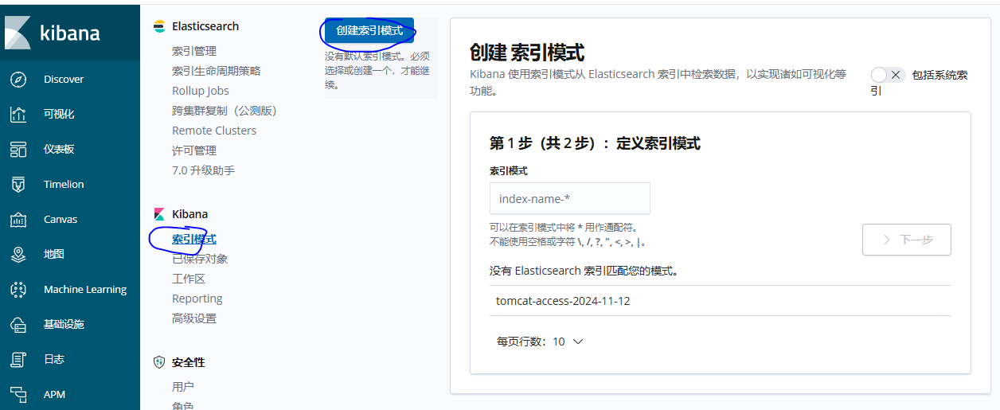
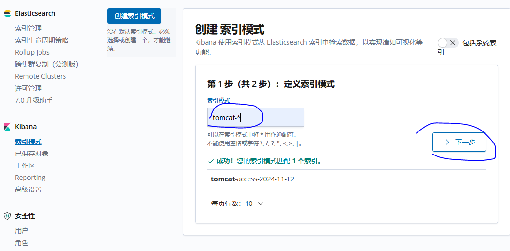
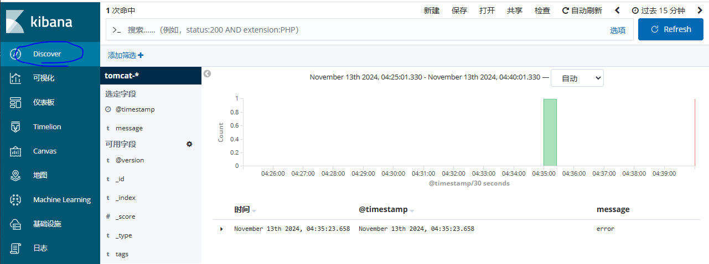

### k8s部署logstash

#### 测试

> ```shell
> 【10.0.1.21】
> ### 准备镜像
> ## logstash的版本需要和es的版本一样
> # docker pull registry.cn-hangzhou.aliyuncs.com/alnktest/logstash:6.8.6
> # docker tag  registry.cn-hangzhou.aliyuncs.com/alnktest/logstash:6.8.6  harbor.alnk.com/public/logstash:6.8.6
> # docker push harbor.alnk.com/public/logstash:6.8.6
> 
> ### 做个简单的测试，看链路 kafka  --> logstash --> elastic --> kibana 是否打通
> # docker run --name logstash-test harbor.alnk.com/public/logstash:6.8.6 tail -f /dev/null
> ## 进入logstash-test容器
> # docker exec -it -u root logstash-test bash
> ## 以下操作是在容器进行
> # cd /root
> # vi logstatsh-test.conf
> input {
>   kafka {
>       bootstrap_servers => "10.0.1.21:9092"
>       auto_offset_reset => "latest" 
>       consumer_threads => 1 
>       decorate_events => true 
>       topics_pattern  => "tomcat-.*"
>       codec => "json"
>       group_id => "logstash"
>       decorate_events => true
>   }
> }
> 
> filter {
> }
> 
> output {
>     elasticsearch {
>       index => "%{[@metadata][kafka][topic]}-%{+YYYY-MM-dd}" 
>       hosts => "http://elastic.alnk.com:80" 
>       user => "elastic"
>       password => "25y69WWe1FC8F6Gh6iVHVt53"
> 
>     }
>     stdout {
>       codec => rubydebug
>     }
> } 
> ## 添加下解析，不然docker容器内访问不到域名
> # vi /etc/hosts
> 10.0.1.100 elastic.alnk.com
> 
> ## 启动logstash测试
> # logstash -f ./logstatsh-test.conf
> ```
>
> `直接在kafka ui 创建消息，看es是否能收到`
>
>   
>
>   
>
> `访问kibana`
>
>   
>
> `可以看到已经有数据传递过来了`
>
>  
>
> `创建索引` 
>
>   
>
> `匹配所有以tomcat开头的记录`
>
>   
>
>   
>
> `Discover:可以看到已经收集到日志`
>
>   


#### 部署至k8s环境中

> ```shell
> 【10.0.1.21】
> ### 准备yaml文件，把logstash以deployment的形式部署到k8s集群中去
> # mkdir -p /data/k8s-yaml/elk -p
> # cd /data/k8s-yaml/elk
> # vi logstash.yaml
> 
> ## 应用
> # kubectl apply -f logstash.yaml
> ```
>
> `logstash.yaml`
>
> ```yaml
> apiVersion: v1
> kind: ConfigMap
> metadata:
>   namespace: elk
>   name: logstash-configmap
> data:
>   logstash.conf: |
>     input {
>       kafka {
>           bootstrap_servers => "10.0.1.21:9092" # kafka地址
>           auto_offset_reset => "latest"  # 从最新的偏移量开始消费
>           consumer_threads => 1 
>           # 此属性会将当前topic、offset、group、partition等信息也带到message中
>           decorate_events => true  
>           topics_pattern  => "tomcat-.*" # 匹配以tomcat开头的topic
>           codec => "json"
>           group_id => "logstash" # 消费组id，如果需要重新从头消费的话，可更换id
>       }
>     }
> 
>     filter {
>     }
> 
>     output {
>         elasticsearch {
>           index => "%{[@metadata][kafka][topic]}-%{+YYYY-MM-dd}" 
>           hosts => "http://quickstart-es-http:9200" # es的地址，这里直接用svc名称
>           user => "elastic" # es账号
>           password => "${ELASTICSEARCH_PASSWORD}" # es密码
> 
>         }
>         stdout {
>           codec => rubydebug # 往控制台也打印收集到的日志
>         }
>     }
> 
> ---
> # es密码
> apiVersion: v1
> kind: Secret
> metadata:
>   name: elasticsearch-pw-elastic
>   namespace: elk
> type: Opaque
> data:
>   # https://www.jb51.net/tools/base64.htm
>   # 这里是es密码25y69WWe1FC8F6Gh6iVHVt53通过base64后加密的字符串
>   password: MjV5NjlXV2UxRkM4RjZHaDZpVkhWdDUz
> 
> ---
> apiVersion: apps/v1
> kind: Deployment
> metadata:
>   namespace: elk
>   name: logstash
> spec:
>   replicas: 1
>   selector:
>     matchLabels:
>       app: logstash
>   template:
>     metadata:
>       labels:
>         app: logstash
>     spec:
>       containers:
>       - name: logstash
>         image: harbor.alnk.com/public/logstash:6.8.6
>         resources:
>           limits:
>             cpu: "1"
>             memory: 1Gi
>         args:
>         - -f
>         - /usr/share/logstash/config/logstash.conf
>         ports:
>         - containerPort: 9600
>           name: logstash
>         env:
>         #- name: XPACK_MONITORING_ENABLED
>           #value: "false"
>         - name: ELASTICSEARCH_PASSWORD
>           valueFrom:
>             secretKeyRef:
>               name: elasticsearch-pw-elastic
>               key: password
>         #- name: ELASTICSEARCH_URL
>           #value: "http://quickstart-es-http:9200"
>         #- name: ELASTICSEARCH_USER
>           #value: "elastic"
>         #- name: ELASTICSEARCH_PASSWORD
>           #value: "37qSPrb68X9Oj641R6qw3nYr"
>         volumeMounts:
>         - name: logstash-conf
>           mountPath: /usr/share/logstash/config/logstash.conf
>           subPath: logstash.conf     
>         - name: localtime
>           mountPath: /etc/localtime
>       volumes:
>       - name: logstash-conf
>         configMap:
>           name: logstash-configmap
>       - name: localtime
>         hostPath:
>           path: /etc/localtime
>           type: File
> ```

