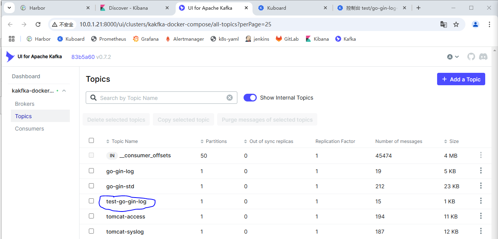
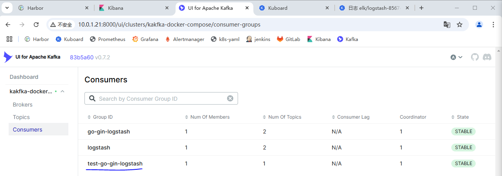
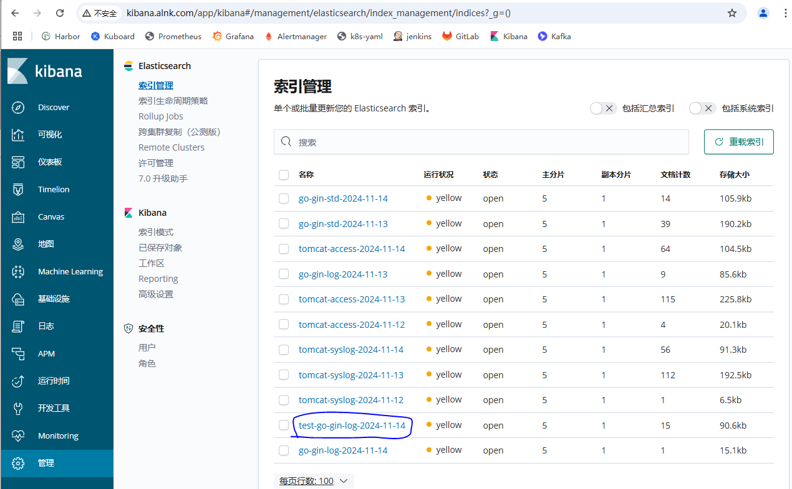

### 边车模式日志收集方案

> ```
> 收集日志的框架流程
> 
> 模拟业务服务/日志收集       日志存储     消费日志         消费目的服务       索引展示
> 业务app/filebeat     ---> kafka ---> logstash ---> elasticsearch ---> kibana
> 
> 日志量很大的时候，怕es扛不住可以使用上面架构
> 如果日志量不大，可以直接使用app/filebeat --- > elasticsearch架构
> ```


#### 模拟业务上线收集日志

> ```shell
> 【10.0.1.21】
> ## 创建目录
> # mkdir -p /data/k8s-yaml/elk && cd /data/k8s-yaml/elk
> # vi go-gin-log-filebeat.yaml
> 
> ## 准备镜像
> # docker pull registry.cn-hangzhou.aliyuncs.com/alnktest/filebeat:6.8.6
> # docker tag registry.cn-hangzhou.aliyuncs.com/alnktest/filebeat:6.8.6 harbor.alnk.com/public/filebeat:6.8.6
> # docker push harbor.alnk.com/public/filebeat:6.8.6
> 
> ## 应用
> # kubectl apply -f go-gin-log-filebeat.yaml
> 
> # 查看
> # kubectl -n test get pod
> ```
>
> `go-gin-log-filebeat.yaml`
>
> ```yaml
> ## filebeat配置文件
> apiVersion: v1
> kind: ConfigMap
> metadata:
>   namespace: test
>   name: filebeat-go-gin-log-configmap
> data:
>   filebeat.yaml: |
>     filebeat.inputs:
>       # 采集日志文件中的日志
>       - type: log
>         enabled: true
>         fields_under_root: true
>         fields:
>           topic: go-gin-log
>         paths:
>           - /logm/*.log # 后续通过共享卷挂载业务容器日志到/logm目录
>     output.kafka:
>       # kafka后端的地址
>       hosts: ["10.0.1.21:9092"]
>       # 输出到kakfa的topic,建议组成为 [dev/test/prod]-[项目名称]
>       # 例如 test-go-gin-log
>       topic: test-%{[topic]}
>       compression: gzip # 使用压缩
>       # borker要求的ACK可靠性级别 
>       # 0=无响应 1=等待本地提交-1=等待所有副本提 交默认值为 1
>       # required_acks: -1 
>       partition.round_robin:
>         # Filebeat提供多种输出至kafka分区的策略 包括random round_robin hash
>         # 默认是hash指定round_robin的策略
>         # 并指定reachable_only为true这表示仅将日志发布到可用分区
>         reachable_only: true
> 
> ---
> # deployment.yaml
> kind: Deployment
> apiVersion: apps/v1
> metadata:
>   name: go-gin-log-test
>   namespace: test
>   labels:
>     name: go-gin-log-test
> spec:
>   replicas: 1
>   selector:
>     matchLabels:
>       name: go-gin-log-test
>   template:
>     metadata:
>       labels:
>         app: go-gin-log-test
>         name: go-gin-log-test
>     spec:
>       containers:
>       - name: go-gin-log-test
>         image: harbor.alnk.com/public/go-gin-log:0.4
>         ports:
>         - containerPort: 3000
>           protocol: TCP
>         terminationMessagePath: /dev/termination-log
>         terminationMessagePolicy: File
>         imagePullPolicy: IfNotPresent
>         # 把日志挂载到共享卷,以便让filebeat收集
>         volumeMounts:
>           - name: logm
>             mountPath: /app/log/ # 具体要看业务容器的日志在哪个目录
>     
>       - name: go-gin-log-filebeat-test
>         image: harbor.alnk.com/public/filebeat:6.8.6
>         imagePullPolicy: IfNotPresent
>         # 按照自定义的配置文件启动
>         args:
>         - -c
>         - /usr/share/filebeat/filebeat.yaml             
>         volumeMounts:
>         # filebeat配置文件
>         - name: filebeat-conf
>           mountPath: /usr/share/filebeat/filebeat.yaml
>           # 防止覆盖/usr/share/filebeat/下的文件
>           subPath: filebeat.yaml
>         # 把共享卷挂载到本容器的/logm目录下
>         - name: logm
>           mountPath: /logm
>       # 声明一个共享卷,让业务容器和filebeat容器都能访问
>       volumes:
>       - name: logm
>         emptyDir: {}
>       # 挂载filebeat的配置文件
>       - name: filebeat-conf
>         configMap:
>           # filebeat容器以filebeat用户运行，防止权限不错报错
>           defaultMode: 0644
>           name: filebeat-go-gin-log-configmap   
>       imagePullSecrets:
>       - name: harbor
>       restartPolicy: Always
>       terminationGracePeriodSeconds: 30
>       securityContext:
>         runAsUser: 0
>       schedulerName: default-scheduler
>   strategy:
>     type: RollingUpdate
>     rollingUpdate:
>       maxUnavailable: 1
>       maxSurge: 1
>   revisionHistoryLimit: 7
>   progressDeadlineSeconds: 600
> 
> ---
> # service.yaml
> kind: Service
> apiVersion: v1
> metadata:
>   name: go-gin-log-test
>   namespace: test
>   labels:
>     go-app: go-gin-log-test
> spec:
>   ports:
>   - protocol: TCP
>     port: 80
>     targetPort: 3000
>     name: http
>   selector:
>     app: go-gin-log-test
> 
> ---
> # ingress.yaml
> apiVersion: networking.k8s.io/v1
> kind: Ingress
> metadata:
>   namespace: test
>   name: go-gin-log-test
> spec:
>   rules:
>   - host: go-gin-log-test.alnk.com
>     http:
>       paths:
>       - backend:
>           service:
>             name: go-gin-log-test
>             port:
>               number: 80
>         path: /
>         pathType: Prefix
> ```
>
> `kafka已经收到test-go-gin-log日志`
>
>  
>
> `接下来修改logstash从kafka获取日志推送到es就完工`
>
> `修改logstash配置`
>
> ```yaml
> ---
> apiVersion: v1
> kind: ConfigMap
> metadata:
>   name: logstash-configmap
>   namespace: elk
> data:
>   logstash.conf: |
>     input {
>       kafka {
>           bootstrap_servers => "10.0.1.21:9092" # kafka地址
>           auto_offset_reset => "latest"  # 从最新的偏移量开始消费
>           consumer_threads => 1 
>           # 此属性会将当前topic、offset、group、partition等信息也带到message中
>           decorate_events => true  
>           topics_pattern  => "tomcat-.*" # 匹配以tomcat开头的topic
>           codec => "json"
>           group_id => "logstash" # 消费组id，如果需要重新从头消费的话，可更换id
>       }
>       # 匹配go-gin-log的日志
>       kafka {
>           bootstrap_servers => "10.0.1.21:9092" # kafka地址
>           auto_offset_reset => "latest"  # 从最新的偏移量开始消费
>           consumer_threads => 1 
>           # 此属性会将当前topic、offset、group、partition等信息也带到message中
>           decorate_events => true  
>           topics_pattern  => "go-gin-.*" # 匹配以go-gin开头的topic
>           codec => "json"
>           group_id => "go-gin-logstash" # 消费组id，如果需要重新从头消费的话，可更换id
>       }
>       ### 以下为添加内容 ###
>       # 匹配test-go-gin-log的日志
>       kafka {
>           bootstrap_servers => "10.0.1.21:9092" # kafka地址
>           auto_offset_reset => "latest"  # 从最新的偏移量开始消费
>           consumer_threads => 1 
>           # 此属性会将当前topic、offset、group、partition等信息也带到message中
>           decorate_events => true  
>           topics_pattern  => "test-go-gin-.*" # 匹配以go-gin开头的topic
>           codec => "json"
>           group_id => "test-go-gin-logstash" # 消费组id，如果需要重新从头消费的话，可更换id
>       }
>       ### 以上为添加内容 ###
>     }
> 
>     filter {
>     }
> 
>     output {
>         elasticsearch {
>           index => "%{[@metadata][kafka][topic]}-%{+YYYY-MM-dd}" 
>           hosts => "http://quickstart-es-http:9200" # es的地址，这里直接用svc名称
>           user => "elastic" # es账号
>           password => "${ELASTICSEARCH_PASSWORD}" # es密码
> 
>         }
>         stdout {
>           codec => rubydebug # 往控制台也打印收集到的日志
>         }
>     }
> ```
>
>   
>
>   

