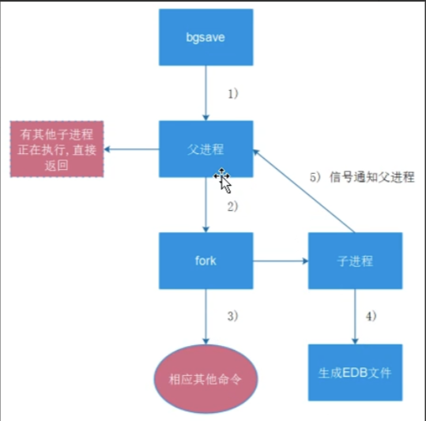

### 基本概念

> ```
> 1 基本概念
> redis是一个开源的、使用C语言编写的、支持网络交互的、可基于内存也可持久化的Key-Value数据库（非关系性数据库）
> 
> redis运维的责任
>   1.保证服务不挂
>   2.备份数据
>   3.协助开发查询数据 get k2
> 
> redis必做的事情
>   限制使用内存大小，建议设置为操作系统内存的50%
>   
>   
> 
> 2 redis的优势
>   速度快，因为数据存在内存中
>   支持丰富数据类型，支持string、list、set、hash
>   支持事务，操作都是原子性，所谓的原子性就是对数据的更改要么全部执行，要么全部不执行
>   丰富的特性：可用于缓存，消息，按key设置过期时间，过期后将会自动删除
>   
>   
>   
> 3 redis的应用场景
>   键过期功能：
>     缓存、session会话保存、优惠券过期
>   列表：
>     排行榜
>   天然计数器：
>     帖子浏览数、视频播放数、评论留言数
>   集合：
>     兴趣标签、广告投放
>   消息队列：
>     ELK缓存
> 
> 缓存
>   对于一些要返回给前端数据的缓存，当有大量数据库sql操作时候，为了避免每次接口请求都要去查询数据库，
>   可以把一些数据缓存到redis中，这样是直接从内存中获取数据，速度会增快很多
>   web端用户，用于登陆缓存session数据，登陆的一些信息存到session中，缓存到redis中
> 
> 队列
>   redis中提供了list接口，这个list提供了lpush和rpop，这两个方法具有原子性，可以插入队列元素和弹出队列元素
> 
> 数据存储
>   redis是非关系型数据库，可以把redis直接用于数据存储，提供了增删改查等操作，
>   因为redis有良好的硬盘持久化机制，redis数据就可以定期持久化到硬盘中，保证了redis数据的完整性和安全性
> 
> redis锁实现防刷机制
>   redis锁可以处理并发问题,redis数据类型中有一个set类型，set类型在存储数据的时候是无序的，
>   而且每个值是不一样的，不能重复，这样就可以快速的查找元素中某个值是否存在，精确的进行增加删除操作
> 
> ```


### 安装

#### 目录规划

> ```
> 服务器
> 10.0.1.51 test01	ubuntu2204
> 10.0.1.52 test02	ubuntu2204
> 10.0.1.53 test03	ubuntu2204
> 
> 下载目录，存放redis安装包
> /data/soft/
> 
> 安装目录、软件目录、配置文件
> /opt/redis_cluster/redis_{PORT}/{conf,logs,pid}
> 
> 数据目录
> /data/redis_cluster/redis_{PROT}/redis_{PROT}.rdb
> 
> 运维脚本
> /root/scripts/redis_shell.sh
> ```

#### 编辑hosts文件

> ```
> # 三台都需要
> tail -3 /etc/hosts
> 10.0.1.51 test01
> 10.0.1.52 test02
> 10.0.1.53 test03
> ```

#### 创建相应目录

> ```
> # [10.0.1.51]
> mkdir -p /data/soft
> mkdir -p /data/redis_cluster/redis_6379
> mkdir -p /opt/redis_cluster/redis_6379/{conf,pid,logs}
> ```

#### 下载redis二进制包

> ```
> # [10.0.1.51]
> cd /data/soft/
> wget http://download.redis.io/releases/redis-6.2.9.tar.gz
> ```

#### 解压redis安装包，创建软链接

> ```
> # [10.0.1.51]
> tar -xzvf redis-6.2.9.tar.gz -C /opt/redis_cluster/
> ln -s /opt/redis_cluster/redis-6.2.9/ /opt/redis_cluster/redis
> ```

#### 安装redis

> ```
> # [10.0.1.51]
> cd /opt/redis_cluster/redis
> make && make install
> 
> 一般的编译安装
> ./config       生成makefile文件
> make           生成二进制命令文件
> make install   把二进制命令文件移动到/usr/local/bin/下面，相当于设置环境变量
> ```

#### 配置文件

> ```
> # [10.0.1.51]
> 本次使用的配置文件，建议使用这个配置文件，后面可能还会加入一些参数配置
> 
> # pwd
> /opt/redis_cluster/redis_6379/conf
> 
> # vi /opt/redis_cluster/redis_6379/conf/redis_6379.conf
> # 以守护进程模式启动
> daemonize yes
> # 绑定主机地址
> bind 10.0.1.51
> # 监听端口
> port 6379
> # pid文件和log文件的保存地址
> pidfile  /opt/redis_cluster/redis_6379/pid/redis_6379.pid
> logfile  /opt/redis_cluster/redis_6379/logs/redis_6379.log
> # 设置数据库的数量，默认数据库为0
> databases 16
> # 指定本地持久化的文件名，默认是dump.rdb
> dbfilename redis_6379.rdb
> # 本地数据库目录
> dir /data/redis_cluster/redis_6379
> ```

#### redis管理

> ```
> 启动
> # redis-server /opt/redis_cluster/redis_6379/conf/redis_6379.conf 
> # ps -ef|grep redis
> root       16345       1  0 07:58 ?        00:00:00 redis-server 10.0.1.51:6379
> 
> 登录
> # redis-cli -h 10.0.1.51
> 10.0.1.51:6379>
>  
> 
> 关闭
> 方式1
> # redis-cli -h 10.0.1.51
> 10.0.1.51:6379> SHUTDOWN
> 
> # ps -ef|grep redis
> root      13020   9465  0 12:02 pts/0    00:00:00 grep --color=auto redis
> 
> 方式2
> # redis-server /opt/redis_cluster/redis_6379/conf/redis_6379.conf 
> # ps -ef|grep redis
> root       16402       1  0 07:59 ?        00:00:00 redis-server 10.0.1.51:6379
> 
> # redis-cli -h 10.0.1.51 shutdown
> # ps -ef|grep redis
> root       16438    1707  0 07:59 pts/0    00:00:00 grep --color=auto redis
> 
> 
> 日志
> tail -f  /opt/redis_cluster/redis_6379/logs/redis_6379.log
> ```


### 常用命令

#### 字符串常用命令

> ```
> 1 插入查看key值，如果key不存在则会返回nil
> 10.0.1.51:6379> set k1 v1
> OK
> 10.0.1.51:6379> get k1
> "v1"
> 10.0.1.51:6379> get k2
> (nil)
> 
> 
> 
> 2 查看key值类型
> 10.0.1.51:6379> TYPE k1
> string
> 
> 
> 
> 3 插入多个key 查看多个key
> 10.0.1.51:6379> mset k1 v1 k2 v3 k3 v3
> OK
> 10.0.1.51:6379> mget k1 k2 k3
> 1) "v1"
> 2) "v3"
> 3) "v3"
> 
> 
> 
> 4 重复插入的值会被覆盖
> 10.0.1.51:6379> set k1 1
> OK
> 10.0.1.51:6379> get k1
> "1"
> 10.0.1.51:6379> set k1 2
> OK
> 10.0.1.51:6379> get k1
> "2"
> 
> 
> 
> 5 判断key是否存在，存在返回1，不存在返回0
> 10.0.1.51:6379> exists k1
> (integer) 1
> 10.0.1.51:6379> exists k0
> (integer) 0
> 
> 
> 
> 6 删除一个key
> 10.0.1.51:6379> del k1
> (integer) 1
> 10.0.1.51:6379> get k1
> (nil)
> 
> 
> 
> 7 计数功能
> 10.0.1.51:6379> set k2 1
> OK
> 10.0.1.51:6379> incr k2
> (integer) 2
> 10.0.1.51:6379> incr k2
> (integer) 3
> 10.0.1.51:6379> incr k2
> (integer) 4
> 10.0.1.51:6379> incr k2
> (integer) 5
> 10.0.1.51:6379> incrby k2 100
> (integer) 105
> 
> 
> 
> 8 EXPIRE 设置key过期时间 默认秒
> 已经设置了过期时间的key，再重新给这个key重新赋值，那么这个key会永远不过期
> 过期之后，会删除这个key
> TTL  查看key过期时间   
> -1 永不过期    默认秒
> -2 没有这个key
> 
> 10.0.1.51:6379> set k1 v1
> OK
> 10.0.1.51:6379>  expire k1 30
> (integer) 1
> 10.0.1.51:6379> ttl k1
> (integer) 24
> 10.0.1.51:6379> ttl k1
> (integer) 23
> 10.0.1.51:6379> ttl k1
> (integer) 8
> 10.0.1.51:6379> ttl k1
> (integer) 7
> 10.0.1.51:6379> ttl k1
> (integer) 4
> 10.0.1.51:6379> ttl k1
> (integer) 3
> 10.0.1.51:6379> ttl k1
> (integer) 2
> 10.0.1.51:6379> ttl k1
> (integer) 2
> 10.0.1.51:6379> ttl k1
> (integer) 0
> 10.0.1.51:6379> ttl k1
> (integer) -2
> 
> 
> 
> 9 删除key过期时间，key永不过期
> 10.0.1.51:6379> set k1 v1
> OK
> 10.0.1.51:6379> expire k1 30
> (integer) 1
> 10.0.1.51:6379> ttl k1
> (integer) 27
> 10.0.1.51:6379> ttl k1
> (integer) 24
> 10.0.1.51:6379> persist k1
> (integer) 1
> 10.0.1.51:6379> ttl k1
> (integer) -1
> 
> 
> 
> 10 keys * 这个命令不要在生产环境中使用，可能会导致redis挂掉
> 10.0.1.51:6379> KEYS *
> 1) "k1"
> 2) "k2"
> 3) "k3"
> ...
> ```

#### 列表常用命令

> ```
> 1 向列表左边添加一个元素
> 10.0.1.51:6379> lpush list1 A
> (integer) 1
> 
> 
> 
> 2 向列表右边添加一个元素
> 10.0.1.51:6379> rpush list1 1
> (integer) 2
> 
> 
> 
> 3 查看列表元素，这个和python中的列表索引相似
> 10.0.1.51:6379> lrange list1 0 -1
> 1) "A"
> 2) "1"
> 
> 
> 
> 4 一次添加多个元素
> 10.0.1.51:6379> rpush list1 2 3 4 5 6
> (integer) 7
> 10.0.1.51:6379> lpush list1 b c d
> (integer) 10
> 10.0.1.51:6379> lrange list1 0 -1
>  1) "d"
>  2) "c"
>  3) "b"
>  4) "A"
>  5) "1"
>  6) "2"
>  7) "3"
>  8) "4"
>  9) "5"
> 10) "6"
> 
> 
> 
> 5 删除，这个和python中列表的pop相似
> 10.0.1.51:6379> lpop list1
> "d"
> 10.0.1.51:6379> rpop list1
> "6"
> 10.0.1.51:6379> lrange list1 0 -1
> 1) "c"
> 2) "b"
> 3) "A"
> 4) "1"
> 5) "2"
> 6) "3"
> 7) "4"
> 8) "5"
> ```

#### 哈希常用命令

> ```
> 可以把mysql数据库中的记录，缓存到redis当中来
> 例如mysql有一条这样的记录 
> uid		name		age		job
> 1000	zhang		28		it
> 
> 
> 添加到redis中
> 10.0.1.51:6379> hmset uid:1000 name zhang age 28 job it
> OK
> 10.0.1.51:6379> hget uid:1000 name
> "zhang"
> 10.0.1.51:6379> hget uid:1000 age
> "28"
> 10.0.1.51:6379> hgetall uid:1000
> 1) "name"
> 2) "zhang"
> 3) "age"
> 4) "28"
> 5) "job"
> 6) "it"
> ```

#### 集合常用命令

> ```
> 集合： 不允许出现重复的元素
> 
> 
> 1 创建一个集合，查看一个集合
> 10.0.1.51:6379> sadd set1 1 2 3 4
> (integer) 4
> 10.0.1.51:6379> smembers set1
> 1) "1"
> 2) "2"
> 3) "3"
> 4) "4"
> 
> 
> 2 集合差集（set1 - set2）
> 10.0.1.51:6379> sadd set1 1 2 3 4
> (integer) 0
> 10.0.1.51:6379> sadd set2 3 4 5 6
> (integer) 4
> 10.0.1.51:6379> sdiff set1 set2
> 1) "1"
> 2) "2"
> 
> 
> 3 集合并集
> 10.0.1.51:6379> sunion set1 set2
> 1) "1"
> 2) "2"
> 3) "3"
> 4) "4"
> 5) "5"
> 6) "6"
> ```


### 数据持久化

> ```
> redis持久化提供了两种方式，分别是RDB持久化方式和AOF持久化方式
> 
> RDB持久化方式
>   能够在指定的时间间隔，对你的数据进行快照存储
> 
> AOF持久化方式
>   记录每次对服务器写的操作,当服务器重启的时候会重新执行这些命令来恢复原始的数据
>   AOF命令以redis协议追加保存每次写的操作到文件末尾
>   Redis还能对AOF文件进行后台重写,使得AOF文件的体积不至于过大
> 
> 可以同时开启两种持久化方式, 在这种情况下, 当redis重启的时候会优先载入AOF文件来恢复原始的数据
> 因为在通常情况下AOF文件保存的数据集要比RDB文件保存的数据集要完整
> ```


#### RDB持久化

> ```
> RDB在保存RDB文件时父进程唯一需要做的就是fork出一个子进程,接下来的工作全部由子进程来做
> 父进程不需要再做其他IO操作，所以RDB持久化方式可以最大化redis的性能
> 
> 
> 优点
>   可以在指定时间内生成
>   速度快，适合用于做备份，主从复制也是基于RDB持久功能实现的
> 
> 
> 缺点
>   会丢失一段时间的数据
> ```
>
>   
>
> ```shell
> # 配置参数
> # pwd
> /opt/redis_cluster/redis_6379/conf
> 
> # cat redis_6379.conf 
> # 以守护进程模式启动
> daemonize yes
> # 绑定主机地址
> bind 10.0.1.51
> # 监听端口
> port 6379
> # pid文件和log文件的保存地址
> pidfile  /opt/redis_cluster/redis_6379/pid/redis_6379.pid
> logfile  /opt/redis_cluster/redis_6379/logs/redis_6379.log
> # 设置数据库的数量，默认数据库为0
> databases 16
> # 指定本地持久化的文件名，默认是dump.rdb
> # 900s有1一条数据，bgsave保存数据一次
> save 900 1
> # 300s 有10条数据，bgsave保存数据一次
> save 300 10
> # 60s 有1w条数据，bgsave保存数据一次
> save 60 10000
> dbfilename redis_6379.rdb
> # 本地数据库目录
> dir /data/redis_cluster/redis_6379
> ```
>
> ```shell
> # 修改配置文件，重启redis
> # redis-server /opt/redis_cluster/redis_6379/conf/redis_6379.conf 
> 
> # 登录
> # redis-cli -h 10.0.1.51
> 
> # 插入数据
> 10.0.1.51:6379> set k1 v1
> OK
> 10.0.1.51:6379> set k2 v2
> OK
> 10.0.1.51:6379> set k3 v3
> OK
> 
> # 现在命令行执行bgsave保存一下数据。把内存中的数据保存到磁盘上
> 10.0.1.51:6379> BGSAVE
> Background saving started
> 
> 
> # 重启redis后，在插入数据，数据不丢失
> 10.0.1.51:6379> shutdown
> not connected>
> 
> # redis-server /opt/redis_cluster/redis_6379/conf/redis_6379.conf 
> # redis-cli -h 10.0.1.51
> 10.0.1.51:6379> keys *
> 1) "list1"
> 2) "k2"
> 3) "uid:1000"
> 4) "k3"
> 5) "k1"
> 
> 
> # RDB文件
> # ll /data/redis_cluster/redis_6379
> -rw-r--r-- 1 root root  209 Nov 28 08:18 redis_6379.rdb
> ```
>
> ```
> 1. 没有满足bgsave条件，执行redis shutdown以后，redis的数据会不会丢？为什么？
> 不会丢，原因是当执行shutdown的时候，实际上是执行了2条命令。bgsave+关闭的命令
> 
> 
> 2. 当kill -9 redis的进程，会丢失数据，普通 kill redis的进程，数据不会丢失，为什么？
> 普通的 kill、kill -15、pkill 优雅的退出，活干完就退出，正常的退出流程，和shutdown一个意思
> kill -9  直接中断程序运行了。工作中不要用 kill -9
> 
> 
> 3.AOF和ROB文件同时存在，redis重启会先加载哪个文件？
> 当redis重启的时候会优先载入AOF文件来恢复原始的数据,
> 因为在通常情况下AOF文件保存的数据集要比RDB文件保存的数据集要完整
> ```


#### AOF持久化

> ```
> 以追加的方式记录redis操作日志的文件，可以最大程度的保证redis数据安全。类似于mysql的binlog模式
> 
> 优点
> AOF文件是一个只进行追加的日志文件,所以不需要写入seek,即使由于某些原因(磁盘空间已满，写的过程中宕机等等)未执行完整的写入命令,你也也可使用redis-check-aof工具修复这些问题.
> 
> 使用AOF会让你的Redis更加耐久: 你可以使用不同的fsync策略：无fsync,每秒fsync,每次写的时候fsync.
> 使用默认的每秒fsync策略,Redis的性能依然很好(fsync是由后台线程进行处理的,主线程会尽力处理客户端请求),一旦出现故障，你最多丢失1秒的数据
> 
> Redis 可以在 AOF 文件体积变得过大时，自动地在后台对 AOF 进行重写
> 
> AOF文件有序地保存了对数据库执行的所有写入操作， 这些写入操作以 Redis 协议的格式保存， 因此 AOF文件的内容非常容易被人读懂， 对文件进行分析（parse）也很轻松。 导出（export） AOF 文件也非常简单
> 
> 
> 
> 缺点
> 据所使用的 fsync 策略，AOF 的速度可能会慢于 RDB 。 在一般情况下， 每秒 fsync 的性能依然非常高， 而关闭 fsync 可以让 AOF 的速度和 RDB 一样快， 即使在高负荷之下也是如此。 不过在处理巨大的写入载入时，RDB 可以提供更有保证的最大延迟时间（latency）
> 
> 配置文件
> # cat /opt/redis_cluster/redis_6379/conf/redis_6379.conf 
> # 以守护进程模式启动
> daemonize yes
> # 绑定主机地址
> bind 10.0.1.51
> # 监听端口
> port 6379
> # pid文件和log文件的保存地址
> pidfile  /opt/redis_cluster/redis_6379/pid/redis_6379.pid
> logfile  /opt/redis_cluster/redis_6379/logs/redis_6379.log
> # 设置数据库的数量，默认数据库为0
> databases 16
> 
> # 指定本地持久化的文件名，默认是dump.rdb
> save 900 1
> save 300 10
> save 60 10000
> dbfilename redis_6379.rdb
> # 本地数据库目录
> dir /data/redis_cluster/redis_6379
> 
> # 是否打开aof日志功能
> appendonly yes
> # 每一个命令都立即同步到aof
> appendfsync always
> # 每秒写1次
> appendfsync everysec
> # 写入工作交给操作系统，由操作系统判断缓冲区大小，统一写入到aof文件
> appendfsync no
> appendfilename "appendonly.aof"
> ```
>
>   

