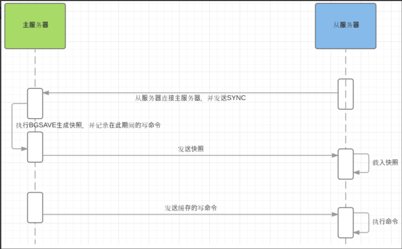

### 安全认证

#### 开启认证

> ```
> redis默认开启了保护模式，只允许本地回环地址登录并访问数据库
> 
> 
> 修改redis的配置文件，并重启redis的服务
> # vi /opt/redis_cluster/redis_6379/conf/redis_6379.conf
> # 绑定主机地址
> bind 10.0.1.51
> # 开启验证
> requirepass 123456
> 
> 
> 重启redis服务
> # pkill redis
> # ps -ef|grep redis
> # redis-server /opt/redis_cluster/redis_6379/conf/redis_6379.conf
> # ps -ef|grep redis
> 
> ```

#### 验证安全认证是否成功

> ```
> # 没认证的情况
> # redis-cli -h 10.0.1.51
> 10.0.1.51:6379> set k1 v1
> (error) NOAUTH Authentication required.
> 
> # 认证之后的情况
> # redis-cli -h 10.0.1.51 -a 123456
> 10.0.1.51:6379> set k1 v1
> OK
> 10.0.1.51:6379> get k1
> "v1"
> ```


### 主从复制

#### 部署第二个redis的环境(10.0.1.52)

> ```
> 1 从10.0.1.51拷贝redis到10.0.1.52上
> [10.0.1.51]
> # tar -czvf redis.tar.gz /opt/redis_cluster/
> # scp redis.tar.gz 10.0.1.52:/opt
> 
> 
> 2 解压压缩包
> [10.0.1.52]
> # cd /opt/
> # tar -xf redis.tar.gz 
> # mv opt/* ./
> # ls
> # rm -rf opt/
> # ls redis_cluster/
> # ll redis_cluster/
> 
> 
> 3 执行 make install 命令，把redis相关的命令添加的环境变量中
> # cd /opt/redis_cluster/redis-6.2.9
> # make install
> 
> 
> 4 创建数据存放目录
> # mkdir /data/redis_cluster/redis_6379 -p
> 
> 
> 5 修改配置文件
> # vi /opt/redis_cluster/redis_6379/conf/redis_6379.conf
> # 以守护进程模式启动
> daemonize yes
> # 绑定主机地址
> bind 10.0.1.52
> # 监听端口
> port 6379
> # pid文件和log文件的保存地址
> pidfile  /opt/redis_cluster/redis_6379/pid/redis_6379.pid
> logfile  /opt/redis_cluster/redis_6379/logs/redis_6379.log
> # 设置数据库的数量，默认数据库为0
> databases 16
> # 指定本地持久化的文件名，默认是dump.rdb
> save 900 1
> save 300 10
> save 60 10000
> dbfilename redis_6379.rdb
> # 本地数据库目录
> dir /data/redis_cluster/redis_6379
> # 是否打开aof日志功能
> appendonly yes
> # 每一个命令都立即同步到aof
> appendfsync always
> # 每秒写1次
> appendfsync everysec
> # 写入工作交给操作系统，由操作系统判断缓冲区大小，统一写入到aof文件
> appendfsync no
> appendfilename "appendonly.aof"
> 
> 
> 6 启动redis
> # redis-server /opt/redis_cluster/redis_6379/conf/redis_6379.conf
> # redis-cli -h 10.0.1.52
> 10.0.1.52:6379> set k1 v1
> OK
> 10.0.1.52:6379> get k1
> "v1"
> ```

#### 建立主从复制关系

> ```
> # 注释10.0.1.51上的验证
> # 开启验证
> # requirepass 123456
> 
> 从库默认只有只读权限，建立主从关系后，从库默认会被清空
> 
> 
> 1 建立主从方式1
> 不推荐使用这种方式，因为重启主从关系失效
> # redis-cli -h 10.0.1.52
> 10.0.1.52:6379> SLAVEOF 10.0.1.51 6379
> 
> 
> 2 建立主从方式2：
> 写入从库配置文件中
> # vi /opt/redis_cluster/redis_6379/conf/redis_6379.conf
> # 开启主从关系
> slaveof 10.0.1.51 6379
> 
> 
> 重启redis
> # pkill redis
> # redis-server /opt/redis_cluster/redis_6379/conf/redis_6379.conf 
> # ps -ef|grep redis
> 
> 
> 验证
> # redis-cli -h 10.0.1.52
> 10.0.1.52:6379> set k5 v5
> (error) READONLY You can't write against a read only replica.
> 10.0.1.52:6379> keys *
> 1) "k1"
> ```

#### 主从复制过程

>   
>
> ```
> 流程
> 1）从服务器连接主服务器，发送SYNC命令； 
> 2）主服务器接收到SYNC命名后，开始执行BGSAVE命令生成RDB文件并使用缓冲区记录此后执行的所有写命令； 
> 3）主服务器BGSAVE执行完后，向所有从服务器发送快照文件，并在发送期间继续记录被执行的写命令； 
> 4）从服务器收到快照文件后丢弃所有旧数据，载入收到的快照； 
> 5）主服务器快照发送完毕后开始向从服务器发送缓冲区中的写命令； 
> 6）从服务器完成对快照的载入，开始接收命令请求，并执行来自主服务器缓冲区的写命令； 
> ```
>
> ```
> # 主库日志
> # tail -f /opt/redis_cluster/redis_6379/logs/redis_6379.log
> 17521:M 28 Nov 2024 08:51:52.975 * Ready to accept connections
> 17521:M 28 Nov 2024 08:51:53.550 * Replica 10.0.1.52:6379 asks for synchronization
> 17521:M 28 Nov 2024 08:51:53.550 * Full resync requested by replica 10.0.1.52:6379
> 17521:M 28 Nov 2024 08:51:53.550 * Replication backlog created, my new replication IDs are '14ab8e4fca7e168d135bb96f407bba31a2e4e421' and '0000000000000000000000000000000000000000'
> 17521:M 28 Nov 2024 08:51:53.550 * Starting BGSAVE for SYNC with target: disk
> 17521:M 28 Nov 2024 08:51:53.551 * Background saving started by pid 17535
> 17535:C 28 Nov 2024 08:51:53.552 * DB saved on disk
> 17535:C 28 Nov 2024 08:51:53.552 * RDB: 0 MB of memory used by copy-on-write
> 17521:M 28 Nov 2024 08:51:53.586 * Background saving terminated with success
> 17521:M 28 Nov 2024 08:51:53.586 * Synchronization with replica 10.0.1.52:6379 succeeded
> 
> # 从库日志
> ~# tail -f /opt/redis_cluster/redis_6379/logs/redis_6379.log
> 16893:S 28 Nov 2024 08:51:53.585 * MASTER <-> REPLICA sync: Finished with success
> 16893:S 28 Nov 2024 08:51:53.585 * Background append only file rewriting started by pid 16984
> 16893:S 28 Nov 2024 08:51:53.657 * AOF rewrite child asks to stop sending diffs.
> 16984:C 28 Nov 2024 08:51:53.657 * Parent agreed to stop sending diffs. Finalizing AOF...
> 16984:C 28 Nov 2024 08:51:53.657 * Concatenating 0.00 MB of AOF diff received from parent.
> 16984:C 28 Nov 2024 08:51:53.657 * SYNC append only file rewrite performed
> 16984:C 28 Nov 2024 08:51:53.657 * AOF rewrite: 0 MB of memory used by copy-on-write
> 16893:S 28 Nov 2024 08:51:53.754 * Background AOF rewrite terminated with success
> 16893:S 28 Nov 2024 08:51:53.754 * Residual parent diff successfully flushed to the rewritten AOF (0.00 MB)
> 16893:S 28 Nov 2024 08:51:53.754 * Background AOF rewrite finished successfully
> ```

#### 主从复制的局限性

> ```
> 1. 执行主从复制前，将现有的数据备份一份到其他目录
> 2. 建议将主从复制写入到配置文件中
> 3. 在业务低峰时期做主从复制
> 4. 拷贝数据会占用服务器资源
> 5. 不能自动完成主从切换，需要人工介入
> ```

#### 断开主从

> ```
> # redis-cli -h 10.0.1.52
> 10.0.1.52:6379> SLAVEOF no one
> OK
> 10.0.1.52:6379>
> ```