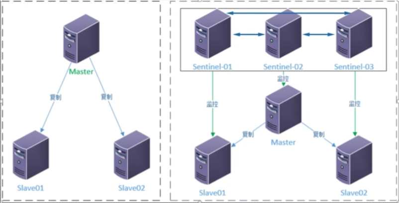

### 哨兵模式

#### 说明

> ```
> 哨兵模式也要基于主从复制模式
> 
> 
> redis的主从模式下，主节点一旦发送故障不能提供服务，需要人工干预，将从节点升为主节点，同时，还需要修改客户端配置，对于很多的应用场景这种方式无法接受
> 
> Sentinel(哨兵)架构解决了 redis 主从需要人工干预的问题
> 
> 哨兵模式是redis的高可用实现方案，实际生产环境中，对提高整个系统可用性非常有帮助的
> 
> 特点
> 1. 监控：哨兵会不断的定期检查你的主服务器和从服务器是否都运作正常
> 2. 提醒：当监控到某个redis服务器出现问题时， 哨兵可以通过 api 向管理员或者其他应用程序发送通知
> 3. 自动故障迁移 ：当主服务器不能正常工作时，哨兵会开始一次自动故障迁移
> ```

#### 架构图

>   

#### 规划

> ```
> 需要三台服务器
> 10.0.1.51 主
> 10.0.1.52 从
> 10.0.1.53 从	注意这里也要部署一下redis基础环境，和10.0.1.52部署的时候一样
> 
> ----------------------------------
> | 角色         | IP        | 端口  |
> | ----------- | --------- | ----- |
> | Master      | 10.0.1.51 | 6379  |
> | Sentinel-01 | 10.0.1.51 | 26379 |
> 
> | slave       | 10.0.1.52 | 6379  |
> | Sentinel-02 | 10.0.1.52 | 26379 |
> 
> | slave       | 10.0.1.53 | 6379  |
> | Sentinel-03 | 10.0.1.53 | 26379 |
> ```

#### 部署

##### 10.0.1.51 主服务器

> ```
> # mkdir -p /data/redis_cluster/redis_26379/
> # mkdir -p /opt/redis_cluster/redis_26379/{conf,pid,logs}
> # vi /opt/redis_cluster/redis_26379/conf/redis_26379.conf
> bind 10.0.1.51
> port 26379
> daemonize yes
> logfile /opt/redis_cluster/redis_26379/logs/redis_26379.log
> dir /data/redis_cluster/redis_26379/
> # master 主节点别名 主节点IP 端口，需要2个 sentinel 节点同意
> sentinel monitor mymaster 10.0.1.51 6379 2
> # 选项指定了 sentinel 意味服务器已经断线所需的毫秒数
> sentinel down-after-milliseconds mymaster 3000
> # 向新的主节点发起复制操作的从服务器个数，1： 轮询发起复制
> # 轮询发起复制的好处，降低主节点的开销
> sentinel parallel-syncs mymaster 1
> # 故障转移超时时间
> sentinel failover-timeout mymaster 18000
> 
> 
> 启动
> # redis-sentinel /opt/redis_cluster/redis_26379/conf/redis_26379.conf
> # ps -ef|grep redis
> root       17521       1  0 08:51 ?        00:00:02 redis-server 10.0.1.51:6379
> root       17624       1  0 09:27 ?        00:00:00 redis-sentinel 10.0.1.51:26379 [sentinel]
> ```

##### 10.0.1.52 从服务器

> ```
> # mkdir -p /data/redis_cluster/redis_26379/
> # mkdir -p /opt/redis_cluster/redis_26379/{conf,pid,logs}
> # vi /opt/redis_cluster/redis_26379/conf/redis_26379.conf
> bind 10.0.1.52
> port 26379
> daemonize yes
> logfile /opt/redis_cluster/redis_26379/logs/redis_26379.log
> dir /data/redis_cluster/redis_26379/
> # master 主节点别名 主节点IP 端口，需要2个 sentinel 节点同意
> sentinel monitor mymaster 10.0.1.51 6379 2
> # 选项指定了 sentinel 惹味服务器已经断线所需的毫秒数
> sentinel down-after-milliseconds mymaster 3000
> # 向新的主节点发起复制操作的丛及诶单个数，1 轮询发起复制
> sentinel parallel-syncs mymaster 1
> # 故障转移超时时间
> sentinel failover-timeout mymaster 18000
> 
> 
> 启动
> # redis-sentinel /opt/redis_cluster/redis_26379/conf/redis_26379.conf
> # ps -ef|grep redis
> root       16893       1  1 08:48 ?        00:00:29 redis-server 10.0.1.52:6379
> root       17545       1  0 09:30 ?        00:00:00 redis-sentinel 10.0.1.52:26379 [sentinel]
> ```

##### 10.0.1.53从服务器

> ```
> 1 从10.0.1.51拷贝redis到10.0.1.53上
> [10.0.1.51]
> # tar -czvf redis.tar.gz /opt/redis_cluster/
> # scp redis.tar.gz 10.0.1.52:/opt
> 
> 
> 2 解压压缩包
> [10.0.1.53]
> # cd /opt/
> # tar -xf redis.tar.gz 
> # mv opt/* ./
> # ls
> # rm -rf opt/
> # ls redis_cluster/
> # ll redis_cluster/
> 
> 
> 3 执行 make install 命令，把redis相关的命令添加的环境变量中
> # cd /opt/redis_cluster/redis-6.2.9
> # make install
> 
> 
> 4 创建数据存放目录
> # mkdir /data/redis_cluster/redis_6379 -p
> 
> 
> 5 修改配置文件
> # vi /opt/redis_cluster/redis_6379/conf/redis_6379.conf
> # 以守护进程模式启动
> daemonize yes
> # 绑定主机地址
> bind 10.0.1.53
> # 监听端口
> port 6379
> # pid文件和log文件的保存地址
> pidfile  /opt/redis_cluster/redis_6379/pid/redis_6379.pid
> logfile  /opt/redis_cluster/redis_6379/logs/redis_6379.log
> # 设置数据库的数量，默认数据库为0
> databases 16
> # 指定本地持久化的文件名，默认是dump.rdb
> save 900 1
> save 300 10
> save 60 10000
> dbfilename redis_6379.rdb
> # 本地数据库目录
> dir /data/redis_cluster/redis_6379
> # 是否打开aof日志功能
> appendonly yes
> # 每一个命令都立即同步到aof
> appendfsync always
> # 每秒写1次
> appendfsync everysec
> # 写入工作交给操作系统，由操作系统判断缓冲区大小，统一写入到aof文件
> appendfsync no
> appendfilename "appendonly.aof"
> # 开启主从关系
> slaveof 10.0.1.51 6379
> masterauth 123456
> 
> 
> 6 启动redis
> # redis-server /opt/redis_cluster/redis_6379/conf/redis_6379.conf
> # redis-cli -h 10.0.1.53 -a 123456
> 10.0.1.53:6379> set k1 v1
> OK
> 10.0.1.53:6379> get k1
> "v1"
> ```
>
> ```
> # mkdir -p /data/redis_cluster/redis_26379/
> # mkdir -p /opt/redis_cluster/redis_26379/{conf,pid,logs}
> # vi /opt/redis_cluster/redis_26379/conf/redis_26379.conf
> bind 10.0.1.53
> port 26379
> daemonize yes
> logfile /opt/redis_cluster/redis_26379/logs/redis_26379.log
> dir /data/redis_cluster/redis_26379/
> # master 主节点别名 主节点IP 端口，需要2个 sentinel 节点同意
> sentinel monitor mymaster 10.0.1.51 6379 2
> # 选项指定了 sentinel 惹味服务器已经断线所需的毫秒数
> sentinel down-after-milliseconds mymaster 3000
> # 向新的主节点发起复制操作的丛及诶单个数，1 轮询发起复制
> sentinel parallel-syncs mymaster 1
> # 故障转移超时时间
> sentinel failover-timeout mymaster 18000
> 
> 
> 启动
> # redis-sentinel /opt/redis_cluster/redis_26379/conf/redis_26379.conf
> # ps -ef |grep redis
> root       16697       1  0 09:32 ?        00:00:00 redis-server 10.0.1.53:6379
> root       16752       1  0 09:33 ?        00:00:00 redis-sentinel 10.0.1.53:26379 [sentinel]
> ```

#### 配置文件的变化

> ```
> 当所有的节点都启动后，配置文件发生了变化，体现在三个方面
> 1. sentinel 节点自动发现了从节点
> 2. 去掉了默认的配置，例如 sentinel parallel-syncs mymaster 1 参数
> 3. 添加了配置记录相关参数
> 
> # cat /opt/redis_cluster/redis_26379/conf/redis_26379.conf
> bind 10.0.1.53
> port 26379
> daemonize yes
> logfile "/opt/redis_cluster/redis_26379/logs/redis_26379.log"
> dir "/data/redis_cluster/redis_26379"
> # master 主节点别名 主节点IP 端口，需要2个 sentinel 节点同意
> sentinel monitor mymaster 10.0.1.51 6379 2
> # 选项指定了 sentinel 惹味服务器已经断线所需的毫秒数
> sentinel down-after-milliseconds mymaster 3000
> # 向新的主节点发起复制操作的丛及诶单个数，1 轮询发起复制
> 
> # 故障转移超时时间
> sentinel failover-timeout mymaster 18000
> 
> # Generated by CONFIG REWRITE
> protected-mode no
> pidfile "/var/run/redis.pid"
> user default on nopass ~* &* +@all
> sentinel myid 5f2f0032f71f7999c7bde1c3ed87524c1de4ede5
> sentinel config-epoch mymaster 0
> sentinel leader-epoch mymaster 0
> sentinel current-epoch 0
> sentinel known-sentinel mymaster 10.0.1.52 26379 38014572e50e4303468363ee215e4817f80d5183
> sentinel known-sentinel mymaster 10.0.1.51 26379 35bb57a68a88b1d3bf3fe0045b3ad38a29f0f30c
> ```

#### 登录命令

> ```
> # redis-cli -h 10.0.1.51 -p 26379
> 10.0.1.51:26379> INFO sentinel
> # Sentinel
> sentinel_masters:1
> sentinel_tilt:0
> sentinel_running_scripts:0
> sentinel_scripts_queue_length:0
> sentinel_simulate_failure_flags:0
> master0:name=mymaster,status=ok,address=10.0.1.51:6379,slaves=0,sentinels=3
> 
> 
> 
> # redis-cli -h 10.0.1.52 -p 26379
> 10.0.1.52:26379> info sentinel
> # Sentinel
> sentinel_masters:1
> sentinel_tilt:0
> sentinel_running_scripts:0
> sentinel_scripts_queue_length:0
> sentinel_simulate_failure_flags:0
> master0:name=mymaster,status=ok,address=10.0.1.51:6379,slaves=0,sentinels=3
> ```

#### 模拟故障转移

> ```
> 在 10.0.1.51 主服务器上
> # pkill redis
> # ps -ef|grep reids
> 
> 
> 在 10.0.0.52 服务器上查看（从这里可以看出 10.0.1.53 成为了主服务器）
> # redis-cli -h 10.0.1.52 -p 26379
> 10.0.0.52:26379> INFO sentinel
> # Sentinel
> sentinel_masters:1
> sentinel_tilt:0
> sentinel_running_scripts:0
> sentinel_scripts_queue_length:0
> sentinel_simulate_failure_flags:0
> master0:name=mymaster,status=ok,address=10.0.0.53:6379,slaves=2,sentinels=3
> ```

#### 手动选出主节点

> ```
> 10.0.1.51 上启动redis和sentinel服务
> # redis-server /opt/redis_cluster/redis_6379/conf/redis_6379.conf 
> # redis-sentinel /opt/redis_cluster/redis_26379/conf/redis_26379.conf 
> # ps -ef|grep redis
> 
> # redis-cli -h 10.0.1.51 -p 26379
> 10.0.0.51:26379> info sentinel
> # Sentinel
> sentinel_masters:1
> sentinel_tilt:0
> sentinel_running_scripts:0
> sentinel_scripts_queue_length:0
> sentinel_simulate_failure_flags:0
> master0:name=mymaster,status=ok,address=10.0.1.53:6379,slaves=2,sentinels=3
> 
> 从上可以看出主节点还在 10.0.1.53 上，我们手动切回10.0.1.51
> redis sentinel 存在多个从节点时，如果想将指定的从节点升为主节点
> 可以将其他节点的 slavepriority 配置为0，但是需要注意 failover后，将 slave-priority 调回原来值
> 
> 
> 查看 slave-priority 值
> # redis-cli -h 10.0.1.52
> 10.0.0.52:6379> CONFIG GET slave-priority
> 1) "slave-priority"
> 2) "100"
> 
> 
> 设置 slave-priority 值（10.0.1.52 10.0.1.53 都要设置）
> # redis-cli -h 10.0.1.52
> 10.0.1.52:6379> CONFIG GET slave-priority
> 10.0.1.52:6379> CONFIG SET slave-priority 0
> 
> 10.0.1.52:6379> CONFIG GET slave-priority
> 1) "slave-priority"
> 2) "0"
> 
> # redis-cli -h 10.0.1.53
> 10.0.1.53:6379> CONFIG GET slave-priority
> 1) "slave-priority"
> 2) "100"
> 10.0.1.53:6379> CONFIG SET slave-priority 0
> 
> 10.0.1.53:6379> CONFIG GET slave-priority
> 1) "slave-priority"
> 2) "0"
> 
> 
> # redis-cli -h 10.0.1.53 -p 26379
> 10.0.1.53:26379> sentinel failover mymaster
> OK
> 10.0.1.53:26379> info sentinel
> # Sentinel
> sentinel_masters:1
> sentinel_tilt:0
> sentinel_running_scripts:0
> sentinel_scripts_queue_length:0
> sentinel_simulate_failure_flags:0
> master0:name=mymaster,status=ok,address=10.0.1.51:6379,slaves=2,sentinels=3
> 可以看到已经把 主服务器切回到 10.0.1.51 上了
> 
> 恢复 10.0.1.52 10.0.1.53 上的 slave-priority 值
> # redis-cli -h 10.0.1.52
> 10.0.1.52:6379>  CONFIG SET slave-priority 100
> OK
> 10.0.1.52:6379> CONFIG GET slave-priority
> 1) "slave-priority"
> 2) "100"
> 
> # redis-cli -h 10.0.1.53 -p 6379
> 10.0.1.53:6379>  CONFIG SET slave-priority 100
> OK
> 10.0.1.53:6379> CONFIG GET slave-priority
> 1) "slave-priority"
> 2) "100"
> ```


#### 哨兵模式读写分离

> ```
> 参考博客：https://www.cnblogs.com/kevingrace/p/9004460.html
> 
> 
> 客户端配置连接的是sentinel信息，比如连接sentinel.conf文件中定义的master名称。在sentinel监听时，当master节点挂了，它会在slave节点中自动选举出新
> 的master节点，而当挂了的老master节点重新恢复后就会成为新的slave节点。对于客户端来说，redis主从切换后它不需要修改连接配置。
> 
> 
> python连接redis sentinel集群（需要安装python redis客户端，即执行"pip install redis"）
> import redis
> from redis.sentinel import Sentinel
> 
> # 连接哨兵服务器(主机名也可以用域名)
> sentinel = Sentinel([('10.0.1.51', 26379), ('10.0.1.52', 26379), ('10.0.1.53', 26379)], socket_timeout=0.5)
> 
> # 获取主服务器地址
> master = sentinel.discover_master('mymaster')
> print(master)
> 
> 
> # 获取从服务器地址
> slave = sentinel.discover_slaves('mymaster')
> print(slave)
> 
> # 获取主服务器进行写入
> master = sentinel.master_for('mymaster', socket_timeout=0.5, password='redis_auth_pass', db=15)
> w_ret = master.set('foo', 'bar')
> 
> # # 获取从服务器进行读取（默认是round-roubin）
> slave = sentinel.slave_for('mymaster', socket_timeout=0.5, password='redis_auth_pass', db=15)
> r_ret = slave.get('foo')
> print(r_ret)
> ```


