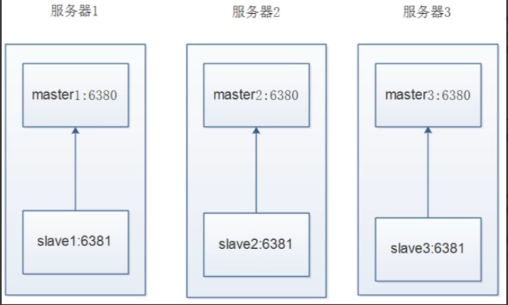
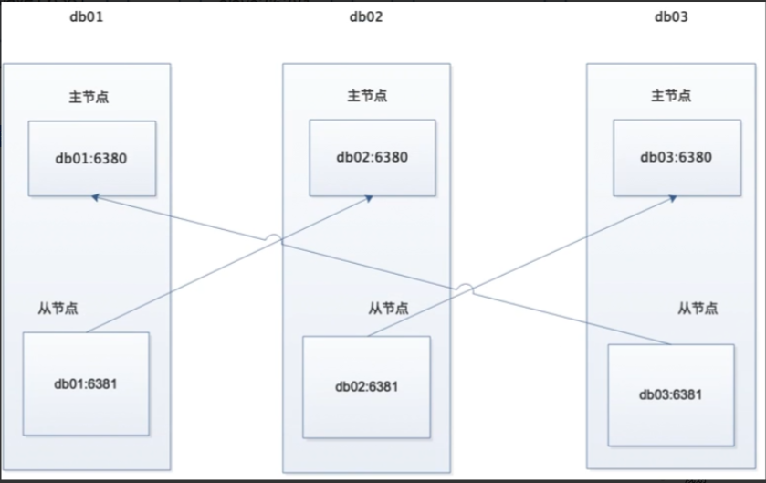

### 集群介绍

> ```
> Redis Cluster是redis的分布式解决方案
> 在3.0版本正式推出，当遇到单机、内存、并发、流量等瓶颈时，可以采用Cluster架构方案达到负载均衡目的
> 
> Redis Cluster之前的分布式方案有两种
> 1 客户端分区方案，优点分区逻辑可控，缺点是需要自己处理数据路由，高可用和故障转移等
> 2 代理方案，优点是简化客户端分布式逻辑和升级维护便利，缺点加重架构部署和性能消耗
> 
> 官方提供的Redis Cluster集群方案，很好的解决了集群方面的问题
> ```


### 数据分布

> ```
> 分布式数据库首先要解决把整个数据库集按照分区规则映射到多个节点的问题
> 即把数据集划分到多个节点上，每个节点负责整体数据的一个子集
> 需要关注的是数据分片规则
> Redis Cluster采用哈希分片规则
> ```


### 规划

> ```
> 服务器IP
> test01 10.0.1.51
> test02 10.0.1.52
> test03 10.0.1.53
> 
> 
> 修改这三台服务器的hosts文件，添加如下
> vim /etc/hosts
> 10.0.1.51 test01
> 10.0.1.52 test02
> 10.0.1.53 test03
> 
> 
> 目录
> # redis安装目录
> /opt/redis_cluster/redis_{PORT}/{conf,logs,pid}
> # redis数据目录
> /data/redis_cluster/redis_{PORT}/redis_{PORT}.rdb
> # redis运维脚本
> /root/scripts/redis_shell.sh
> ```


### 集群拓扑

> 不太合理的拓扑
>
>   
>
> 合理的拓扑
>
>   


### 手动搭建部署集群

#### 1 实现命令

> ```
> test01操作
> mkdir -p /opt/redis_cluster/redis_{6380,6381}/{conf,logs,pid}
> mkdir –p /data/redis_cluster/redis_{6380,6381}
> 
> 
> cat >/opt/redis_cluster/redis_6380/conf/redis_6380.conf<<EOF
> bind 10.0.1.51
> port 6380
> daemonize yes
> pidfile "/opt/redis_cluster/redis_6380/pid/redis_6380.pid"
> logfile "/opt/redis_cluster/redis_6380/logs/redis_6380.log"
> dbfilename "redis_6380.rdb"
> dir "/data/redis_cluster/redis_6380/"
> cluster-enabled yes
> cluster-config-file nodes_6380.conf
> cluster-node-timeout 15000
> EOF
> 
> 
> cd /opt/redis_cluster/
> cp redis_6380/conf/redis_6380.conf redis_6381/conf/redis_6381.conf
> sed -i 's#6380#6381#g' redis_6381/conf/redis_6381.conf 
> 
> 
> rsync -avz /opt/redis_cluster/redis_638* test02:/opt/redis_cluster/
> rsync -avz /opt/redis_cluster/redis_638* test03:/opt/redis_cluster/
> 
> 
> redis-server /opt/redis_cluster/redis_6380/conf/redis_6380.conf
> redis-server /opt/redis_cluster/redis_6381/conf/redis_6381.conf
> ######################################################################
> 
> 
> 
> test02操作
> find /opt/redis_cluster/redis_638* -type f -name "*.conf"|xargs sed -i "/bind/s#51#52#g"
> mkdir –p /data/redis_cluster/redis_{6380,6381}
> 
> 
> redis-server /opt/redis_cluster/redis_6380/conf/redis_6380.conf
> redis-server /opt/redis_cluster/redis_6381/conf/redis_6381.conf
> ######################################################################
> 
> 
> test03操作
> find /opt/redis_cluster/redis_638* -type f -name "*.conf"|xargs sed -i "/bind/s#51#53#g"
> mkdir –p /data/redis_cluster/redis_{6380,6381}
> 
> 
> redis-server /opt/redis_cluster/redis_6380/conf/redis_6380.conf
> redis-server /opt/redis_cluster/redis_6381/conf/redis_6381.conf
> ```

#### 2 手动配置节点发现

> ```
> 当把所有节点都启动后查看进程会有cluster的字样
> 
> 但是登录后执行CLUSTER NODES命令会发现只有每个节点自己的ID,目前集群内的节点，还没有互相发现,所以搭建redis集群我们第一步要做的就是让集群内的节点互相发现.
> 
> 在执行节点发现命令之前，我们先查看一下集群的数据目录会发现有生成集群的配置文件。查看后发现只有自己的节点内容,等节点全部发现后会把所发现的节点ID写入这个文件
> 
> 集群模式的Redis除了原有的配置文件之外又加了一份集群配置文件.当集群内节点信息发生变化,如添加节点,节点下线,故障转移等.节点会自动保存集群状态到配置文件.
> 
> 需要注意的是,Redis自动维护集群配置文件,不需要手动修改,防止节点重启时产生错乱.
> 
> 节点发现使用命令: CLUSTER MEET {IP} {PORT}
> 提示:在集群内任意一台机器执行此命令就可以
> 
> # sh redis_shell.sh login 6380
> 10.0.1.51:6380> CLUSTER MEET 10.0.1.51 6381
> OK
> 10.0.1.51:6380> CLUSTER MEET 10.0.1.52 6380
> OK
> 10.0.1.51:6380> CLUSTER MEET 10.0.1.53 6380
> OK
> 10.0.1.51:6380> CLUSTER MEET 10.0.1.52 6381
> OK
> 10.0.1.51:6380> CLUSTER MEET 10.0.1.53 6381
> OK
> 10.0.1.51:6380> CLUSTER NODES
> 026d4ed11025dec9ef9fece538d792298365df1c 10.0.1.52:6381@16381 master - 0 1732762609000 5 connected
> 3e0e49238f3848369e19f9b9e818239008050323 10.0.1.52:6380@16380 master - 0 1732762609848 3 connected
> 0678eed3853fa21d1762a1ee913e9896335c52e9 10.0.1.51:6381@16381 master - 0 1732762610000 1 connected
> 7070390bcd814dc743c0fc603412c1131e710f9a 10.0.1.53:6380@16380 master - 0 1732762610867 4 connected
> 88a8e6ab44798214491c4105b134a33310c8b02e 10.0.1.53:6381@16381 master - 0 1732762608830 0 connected
> 2a81d975dfda4eea901305827c0d3131fa412db9 10.0.1.51:6380@16380 myself,master - 0 1732762609000 2 connected
> 
> 节点都发现完毕后我们再次查看集群配置文件
> 可以看到,发现到的节点的ID也被写入到了集群的配置文件里
> ```

#### 3 Redis Cluster通讯流程

> ```
> 在分布式存储中需要提供维护节点元数据信息的机制，所谓元数据是指：节点负责哪些数据，是否出现故障灯状态信息，redis 集群采用 Gossip(流言)协议，Gossip 协议工作原理就是节点彼此不断交换信息，一段时间后所有的节点都会知道集群完整信息，这种方式类似流言传播。
> 
> 通信过程：
> 1)集群中的每一个节点都会单独开辟一个 Tcp 通道，用于节点之间彼此通信，通信端口在基础端口上加10000.
> 2)每个节点在固定周期内通过特定规则选择结构节点发送 ping 消息
> 3)接收到 ping 消息的节点用 pong 消息作为响应。集群中每个节点通过一定规则挑选要通信的节点，每个节点可能知道全部节点，也可能仅知道部分节点，只要这些节点彼此可以正常通信，最终他们会打成一致的状态，当节点出现故障，新节点加入，主从角色变化等，它能够给不断的ping/pong消息，从而达到同步目的。
> 
> 通讯消息类型：
> Gossip
> Gossip 协议职责就是信息交换，信息交换的载体就是节点间彼此发送Gossip 消息。
> 常见 Gossip 消息分为：ping、 pong、 meet、 fail 等
> meet
> meet 消息：用于通知新节点加入，消息发送者通知接受者加入到当前集群，meet 消息通信正常完成后，接收节点会加入到集群中并进行ping、 pong 消息交换
> ping
> ping 消息：集群内交换最频繁的消息，集群内每个节点每秒想多个其他节点发送 ping 消息，用于检测节点是否在线和交换彼此信息。
> pong
> Pong 消息：当接收到 ping，meet 消息时，作为相应消息回复给发送方确认消息正常通信，节点也可以向集群内广播自身的 pong 消息来通知整个集群对自身状态进行更新。
> fail
> fail 消息：当节点判定集群内另一个节点下线时，回向集群内广播一个fail 消息，其他节点收到 fail 消息之后把对应节点更新为下线状态
> ```

#### 4 Redis Cluster手动分配槽位

> ```
> 虽然节点之间已经互相发现了,但是此时集群还是不可用的状态,因为并没有给节点分配槽位,
> 而且必须是所有的槽位都分配完毕后整个集群才是可用的状态.
> 反之,也就是说只要有一个槽位没有分配,那么整个集群就是不可用的.
> 
> 测试命令：
> # sh redis_shell.sh login 6380 
> 10.0.1.51:6380> set k1 v1
> (error) CLUSTERDOWN Hash slot not served
> 
> 10.0.1.51:6380> CLUSTER INFO
> cluster_state:fail
> cluster_slots_assigned:0
> cluster_slots_ok:0
> cluster_slots_pfail:0
> cluster_slots_fail:0
> cluster_known_nodes:6
> cluster_size:0
> cluster_current_epoch:5
> cluster_my_epoch:4
> cluster_stats_messages_sent:1200
> cluster_stats_messages_received:1200
> 
> 前面说了,我们虽然有6个节点,但是真正负责数据写入的只有3个节点,其他3个节点只是作为主节点的从节点,也就是说,只需要分配其中三个节点的槽位就可以了
> 
> 分配槽位的方法:
> 总共有16384个槽位，分配槽位需要在每个主节点上来配置,此时有2种方法执行:
> 1.分别登录到每个主节点的客户端来执行命令
> 2.在其中一台机器上用redis客户端远程登录到其他机器的主节点上执行命令
> 
> 执行命令:
> # redis-cli -h test01 -p 6380 cluster addslots {0..5461}
> # redis-cli -h test02 -p 6380 cluster addslots {5462..10922}
> # redis-cli -h test03 -p 6380 cluster addslots {10923..16383}
> 
> 
> 分配完所有槽位之后我们再查看一下集群的节点状态和集群状态
> 可以看到三个节点都分配了槽位,而且集群的状态是OK的
> # sh redis_shell.sh login 6380 
> 10.0.1.51:6380> set k1 v1
> -> Redirected to slot [12706] located at 10.0.1.53:6380
> OK
> 
> 10.0.1.51:6380> CLUSTER INFO
> cluster_state:ok
> cluster_slots_assigned:16384
> cluster_slots_ok:16384
> cluster_slots_pfail:0
> cluster_slots_fail:0
> cluster_known_nodes:6
> cluster_size:3
> cluster_current_epoch:5
> cluster_my_epoch:2
> cluster_stats_messages_ping_sent:221
> cluster_stats_messages_pong_sent:252
> cluster_stats_messages_meet_sent:5
> cluster_stats_messages_sent:478
> cluster_stats_messages_ping_received:252
> cluster_stats_messages_pong_received:226
> cluster_stats_messages_received:478
> 
> ```

#### 5 手动配置集群高可用

> ```
> 虽然这时候集群是可用的了,但是整个集群只要有一台机器坏掉了,那么整个集群都是不可用的.
> 所以这时候需要用到其他三个节点分别作为现在三个主节点的从节点,以应对集群主节点故障时可以进行自动切换以保证集群持续可用.
> 
> 
> 注意:
> 1.不要让复制节点复制本机器的主节点, 因为如果那样的话机器挂了集群还是不可用状态, 所以复制节点要复制其他服务器的主节点.
> 2.使用redis-trid工具自动分配的时候会出现复制节点和主节点在同一台机器上的情况,需要注意
> ```

#### 6 测试集群

> ```
> 这一次我们采用在一台机器上使用redis客户端远程操作集群其他节点
> 注意:
> 1.需要执行命令的是每个服务器的从节点
> 2.注意主从的ID不要搞混了.
> 
> 执行命令：
> # redis-cli -h test01 -p 6381 CLUSTER REPLICATE 3e0e49238f3848369e19f9b9e818239008050323
> 
> # redis-cli -h test02 -p 6381 CLUSTER REPLICATE 7070390bcd814dc743c0fc603412c1131e710f9a
> 
> # redis-cli -h test03 -p 6381 CLUSTER REPLICATE 2a81d975dfda4eea901305827c0d3131fa412db9
> 
> ```

#### 7 Redis Cluster测试集群

> ```
> 我们使用常规插入redis数据的方式往集群里写入数据看看会发生什么
> # redis-cli -h test01 -p 6380 set k1 v1
> (error) MOVED 12706 10.0.1.53:6380
> 
> 结果提示error, 但是给出了集群另一个节点的地址
> 
> 那么这条数据到底有没有写入呢? 我们登录这两个节点分别查看
> # redis-cli -h db03 -p 6380 get k1    
> (nil)
> 
> 
> 结果没有,这是因为使用集群后由于数据被分片了,所以并不是说在那台机器上写入数据就会在哪台机器的节点上写入,集群的数据写入和读取就涉及到了另外一个概念,ASK路由
> ```

#### 8 Redis Cluster ASK路由介绍

> ```
> 在集群模式下,Redis接受任何键相关命令时首先会计算键对应的槽,再根据槽找出所对应的节点
> 如果节点是自身,则处理键命令;
> 否则回复MOVED重定向错误,通知客户端请求正确的节点,这个过程称为Mover重定向.
> 
> 知道了ask路由后,我们使用-c选项批量插入一些数据
> # cat input_key.sh 
> #!/bin/bash
> for i in $(seq 1 1000)
> do
>     redis-cli -c -h test01 -p 6380 set k_${i} v_${i} && echo "set k_${i} is ok"
> done
> 
> 
> 写入后我们同样使用-c选项来读取刚才插入的键值,然后查看下redis会不会帮我们路由到正确的节点上
> root@test01:/opt/redis_cluster# redis-cli -c -h test01 -p 6380
> test01:6380>  get k_1
> "v_1"
> test01:6380>  get k_100
> -> Redirected to slot [5541] located at 10.0.1.52:6380
> "v_100"
> 10.0.1.52:6380> get k_1000
> -> Redirected to slot [79] located at 10.0.1.51:6380
> "v_1000"
> ```

#### 9 模拟故障转移

> ```
> 至此,我们已经手动的把一个redis高可用的集群部署完毕了, 但是还没有模拟过故障
> 
> 这里我们就模拟故障,停掉期中一台主机的redis节点,然后查看一下集群的变化
> 我们使用暴力的kill -9杀掉 test02上的redis集群节点,然后观察节点状态
> 
> 理想情况应该是test01上的6381从节点升级为主节点
> 在test01上查看集群节点状态
> 
> 虽然我们已经测试了故障切换的功能,但是节点修复后还是需要重新上线
> 所以这里测试节点重新上线后的操作
> 重新启动test02的6380,然后观察日志
> 观察test01上的日志
> 
> 这时假如我们想让修复后的节点重新上线,可以在想变成主库的从库执行 CLUSTER FAILOVER 命令
> 这里我们在test02的6380上执行
> ```


### 工具搭建部署集群

#### 部署

> ```
> 手动搭建集群便于理解集群创建的流程和细节，不过手动搭建集群需要很多步骤，
> 当集群节点众多时，必然会加大搭建集群的复杂度和运维成本，
> 因此官方提供了redis-trib.rb的工具方便我们快速搭建集群（6.0直接使用redis-cli）
> redis-trib.rb是采用 Ruby 实现的 redis 集群管理工具，
> 内部通过Cluster相关命令帮我们简化集群创建、检查、槽迁移和均衡等常见运维操作，
> 使用前要安装 ruby 依赖环境
> 安装命令：
> # apt install libtool bzip2 -y
> # apt install rubygems -y
> gem sources --remove https://rubygems.org/
> gem sources -a http://mirrors.aliyun.com/rubygems/
> gem update - system
> gem install redis
> 
> 我们可以停掉所有的节点，然后清空数据，恢复成一个全新的集群，所有机器执行命令
> pkill redis
> rm -rf /data/redis_cluster/redis_6380/*
> rm -rf /data/redis_cluster/redis_6381/*
> 
> 
> 全部清空之后启动所有的节点，所有机器执行
> redis-server /opt/redis_cluster/redis_6380/conf/redis_6380.conf
> redis-server /opt/redis_cluster/redis_6381/conf/redis_6381.conf
> 
> 
> test01执行创建集群命令
> # cd /opt/redis_cluster/redis/src/
> # redis-cli --cluster create 10.0.1.51:6380 10.0.1.52:6380 10.0.1.53:6380 10.0.1.51:6381 10.0.1.52:6381 10.0.1.53:6381 --cluster-replicas 1
> >>> Performing hash slots allocation on 6 nodes...
> Master[0] -> Slots 0 - 5460
> Master[1] -> Slots 5461 - 10922
> Master[2] -> Slots 10923 - 16383
> Adding replica 10.0.1.52:6381 to 10.0.1.51:6380
> Adding replica 10.0.1.53:6381 to 10.0.1.52:6380
> Adding replica 10.0.1.51:6381 to 10.0.1.53:6380
> M: 6d2d6294c98d66be8b56bfb72f25887dc3d25e0e 10.0.1.51:6380
>    slots:[0-5460] (5461 slots) master
> M: a16c549d764260bcefe98944739cb7b13d54c0a8 10.0.1.52:6380
>    slots:[5461-10922] (5462 slots) master
> M: 2bd98de16970e150cd3aba83d52f9615741e8e74 10.0.1.53:6380
>    slots:[10923-16383] (5461 slots) master
> S: 9429041848c5652cec161bfd71fd05a46f9f26a1 10.0.1.51:6381
>    replicates 2bd98de16970e150cd3aba83d52f9615741e8e74
> S: 790cfee8bbe8d51f2ec885838c385cae1f8d7cab 10.0.1.52:6381
>    replicates 6d2d6294c98d66be8b56bfb72f25887dc3d25e0e
> S: 177a03001f48ccba2dc4bc0cd4b9ee520983fe58 10.0.1.53:6381
>    replicates a16c549d764260bcefe98944739cb7b13d54c0a8
> Can I set the above configuration? (type 'yes' to accept): yes
> >>> Nodes configuration updated
> >>> Assign a different config epoch to each node
> >>> Sending CLUSTER MEET messages to join the cluster
> Waiting for the cluster to join
> 
> >>> Performing Cluster Check (using node 10.0.1.51:6380)
> M: 6d2d6294c98d66be8b56bfb72f25887dc3d25e0e 10.0.1.51:6380
>    slots:[0-5460] (5461 slots) master
>    1 additional replica(s)
> M: 2bd98de16970e150cd3aba83d52f9615741e8e74 10.0.1.53:6380
>    slots:[10923-16383] (5461 slots) master
>    1 additional replica(s)
> M: a16c549d764260bcefe98944739cb7b13d54c0a8 10.0.1.52:6380
>    slots:[5461-10922] (5462 slots) master
>    1 additional replica(s)
> S: 790cfee8bbe8d51f2ec885838c385cae1f8d7cab 10.0.1.52:6381
>    slots: (0 slots) slave
>    replicates 6d2d6294c98d66be8b56bfb72f25887dc3d25e0e
> S: 9429041848c5652cec161bfd71fd05a46f9f26a1 10.0.1.51:6381
>    slots: (0 slots) slave
>    replicates 2bd98de16970e150cd3aba83d52f9615741e8e74
> S: 177a03001f48ccba2dc4bc0cd4b9ee520983fe58 10.0.1.53:6381
>    slots: (0 slots) slave
>    replicates a16c549d764260bcefe98944739cb7b13d54c0a8
> [OK] All nodes agree about slots configuration.
> >>> Check for open slots...
> >>> Check slots coverage...
> [OK] All 16384 slots covered.
> 
> 
> 检查集群完整性
> # redis-cli --cluster check 10.0.1.51:6380
> 10.0.1.51:6380 (6d2d6294...) -> 0 keys | 5461 slots | 1 slaves.
> 10.0.1.53:6380 (2bd98de1...) -> 0 keys | 5461 slots | 1 slaves.
> 10.0.1.52:6380 (a16c549d...) -> 0 keys | 5462 slots | 1 slaves.
> [OK] 0 keys in 3 masters.
> 0.00 keys per slot on average.
> >>> Performing Cluster Check (using node 10.0.1.51:6380)
> M: 6d2d6294c98d66be8b56bfb72f25887dc3d25e0e 10.0.1.51:6380
>    slots:[0-5460] (5461 slots) master
>    1 additional replica(s)
> M: 2bd98de16970e150cd3aba83d52f9615741e8e74 10.0.1.53:6380
>    slots:[10923-16383] (5461 slots) master
>    1 additional replica(s)
> M: a16c549d764260bcefe98944739cb7b13d54c0a8 10.0.1.52:6380
>    slots:[5461-10922] (5462 slots) master
>    1 additional replica(s)
> S: 790cfee8bbe8d51f2ec885838c385cae1f8d7cab 10.0.1.52:6381
>    slots: (0 slots) slave
>    replicates 6d2d6294c98d66be8b56bfb72f25887dc3d25e0e
> S: 9429041848c5652cec161bfd71fd05a46f9f26a1 10.0.1.51:6381
>    slots: (0 slots) slave
>    replicates 2bd98de16970e150cd3aba83d52f9615741e8e74
> S: 177a03001f48ccba2dc4bc0cd4b9ee520983fe58 10.0.1.53:6381
>    slots: (0 slots) slave
>    replicates a16c549d764260bcefe98944739cb7b13d54c0a8
> [OK] All nodes agree about slots configuration.
> >>> Check for open slots...
> >>> Check slots coverage...
> [OK] All 16384 slots covered.
> ```

#### 工具扩容节点

> ```
> Redis集群的扩容操作可分为以下几个步骤
> 1)准备新节点
> 2)加入集群
> 3)迁移槽和数据
> 
> 
> 我们在test01上创建2个新节点
> mkdir -p /opt/redis_cluster/redis_{6390,6391}/{conf,logs,pid}
> mkdir -p /data/redis_cluster/redis_{6390,6391}
> cd /opt/redis_cluster/
> cp redis_6380/conf/redis_6380.conf redis_6390/conf/redis_6390.conf
> cp redis_6380/conf/redis_6380.conf redis_6391/conf/redis_6391.conf
> sed -i 's#6380#6390#g' redis_6390/conf/redis_6390.conf
> sed -i 's#6380#6391#g' redis_6391/conf/redis_6391.conf
> 
> 
> 启动节点
> redis-server /opt/redis_cluster/redis_6390/conf/redis_6390.conf
> redis-server /opt/redis_cluster/redis_6391/conf/redis_6391.conf
> 
> 
> 发现节点
> redis-cli -c -h test01 -p 6380 cluster meet 10.0.1.51 6390
> redis-cli -c -h test01 -p 6380 cluster meet 10.0.1.51 6391
> 
> 节点id
> # sh redis_shell.sh login 6380
> 10.0.1.51:6380>  CLUSTER NODES
> 49bfc268c3c3ccda3c72d66111390c635063f205 10.0.1.51:6391@16391 master - 0 1732764137433 7 connected
> 2bd98de16970e150cd3aba83d52f9615741e8e74 10.0.1.53:6380@16380 master - 0 1732764139000 3 connected 10923-16383
> 6dd262c9cdef9d682709cc00cb2937339236bca6 10.0.1.51:6390@16390 master - 0 1732764140500 0 connected
> a16c549d764260bcefe98944739cb7b13d54c0a8 10.0.1.52:6380@16380 master - 0 1732764139477 2 connected 5461-10922
> 790cfee8bbe8d51f2ec885838c385cae1f8d7cab 10.0.1.52:6381@16381 slave 6d2d6294c98d66be8b56bfb72f25887dc3d25e0e 0 1732764136411 1 connected
> 9429041848c5652cec161bfd71fd05a46f9f26a1 10.0.1.51:6381@16381 slave 2bd98de16970e150cd3aba83d52f9615741e8e74 0 1732764138000 3 connected
> 177a03001f48ccba2dc4bc0cd4b9ee520983fe58 10.0.1.53:6381@16381 slave a16c549d764260bcefe98944739cb7b13d54c0a8 0 1732764138452 2 connected
> 6d2d6294c98d66be8b56bfb72f25887dc3d25e0e 10.0.1.51:6380@16380 myself,master - 0 1732764136000 1 connected 0-5460
> 
> 
> 
> 主从复制
> # redis-cli -h test01 -p 6391 CLUSTER REPLICATE 6dd262c9cdef9d682709cc00cb2937339236bca6
> 
> 
> 在test01上使用工具扩容
> cd /opt/redis_cluster/redis/src/
> ./redis-cli --cluster reshard 10.0.1.51:6380
> 
> 
> 打印出进群每个节点信息后,reshard命令需要确认迁移的槽数量,这里我们输入4096个（总共有16384个槽位，除以4，等于4096）:
> How many slots do you want to move (from 1 to 16384)? 4096
> 
> 
> 输入6390的节点ID作为目标节点,也就是要扩容的节点,目标节点只能指定一个
> What is the receiving node ID? 6dd262c9cdef9d682709cc00cb2937339236bca6
> 
> 
> 之后输入源节点的ID,这里分别输入每个主节点的6380的ID最后输入done,或者直接输入all
> Source node #1:all
> 
> 
> 迁移完成后命令会自动退出,这时候我们查看一下集群的状态
> redis-cli --cluster rebalance 10.0.1.51:6380
> 
> ```

#### 工具收缩节点

> ```
> 流程说明
> 1).首先需要确定下线节点是否有负责的槽,
> 如果是,需要把槽迁移到其他节点,保证节点下线后整个集群槽节点映射的完整性.
> 
> 2).当下线节点不再负责槽或者本身是从节点时,
> 就可以通知集群内其他节点忘记下线节点,当所有的节点忘记该节点后可以正常关闭.
> 
> 这里我们准备将刚才新添加的节点下线,也就是6390和6391
> 收缩和扩容迁移的方向相反,6390变为源节点,其他节点变为目标节点,源节点把自己负责的4096个槽均匀的迁移到其他节点上,.
> 
> 由于redis-trib..rb reshard命令只能有一个目标节点,因此需要执行3次reshard命令,分别迁移1365,1365,1366个槽（这里也是计算出来的，4096除以3）
> 操作命令：
> cd /opt/redis_cluster/redis/src/
> ./redis-cli reshard 10.0.1.51:6380
> How many slots do you want to move (from 1 to 16384)? 1365
> 输入6380的id
> 输入6390的id
> done
> 
> 3) 忘记节点
> 由于我们的集群是做了高可用的,所以当主节点下线的时候从节点也会顶上,所以最好我们先下线从节点,然后在下线主节点
> cd /opt/redis_cluster/redis/src/
> ./redis-cli del-node 10.0.1.51:6391 49bfc268c3c3ccda3c72d66111390c635063f205
> ./redis-cli del-node 10.0.1.51:6390 6dd262c9cdef9d682709cc00cb2937339236bca6
> 
> ```


### Redis集群常用命令

> ```
> 集群(cluster)
> CLUSTER INFO 打印集群的信息
> CLUSTER NODES 列出集群当前已知的所有节点（node），以及这些节点的相关信息。 
> 
> 
> 节点(node)
> CLUSTER MEET <ip> <port> 将 ip 和 port 所指定的节点添加到集群当中，让它成为集群的一份子。
> CLUSTER FORGET <node_id> 从集群中移除 node_id 指定的节点。
> CLUSTER REPLICATE <node_id> 将当前节点设置为 node_id 指定的节点的从节点。
> CLUSTER SAVECONFIG 将节点的配置文件保存到硬盘里面。 
> 
> 
> 槽(slot)
> CLUSTER ADDSLOTS <slot> [slot ...] 将一个或多个槽（slot）指派（assign）给当前节点。
> CLUSTER DELSLOTS <slot> [slot ...] 移除一个或多个槽对当前节点的指派。
> CLUSTER FLUSHSLOTS 移除指派给当前节点的所有槽，让当前节点变成一个没有指派任何槽的节点。
> CLUSTER SETSLOT <slot> NODE <node_id> 将槽 slot 指派给 node_id 指定的节点，如果槽已经指派给另一个节点，那么先让另一个节点删除该槽>，然后再进行指派。
> CLUSTER SETSLOT <slot> MIGRATING <node_id> 将本节点的槽 slot 迁移到 node_id 指定的节点中。
> CLUSTER SETSLOT <slot> IMPORTING <node_id> 从 node_id 指定的节点中导入槽 slot 到本节点。
> CLUSTER SETSLOT <slot> STABLE 取消对槽 slot 的导入（import）或者迁移（migrate）。 
> 
> 
> 键 (key)
> CLUSTER KEYSLOT <key> 计算键 key 应该被放置在哪个槽上。
> CLUSTER COUNTKEYSINSLOT <slot> 返回槽 slot 目前包含的键值对数量。CLUSTER GETKEYSINSLOT <slot> <count> 返回 count 个 slot 槽中的键。
> 
> ```


### Redis运维工具

#### 运维脚本

> ```
> # cat redis_shell.sh 
> #!/bin/bash
> 
> USAG(){
>     echo "sh $0 {start|stop|restart|login|ps|tail} PORT"
> }
> if [ "$#" = 1 ]
> then
>     REDIS_PORT='6379'
> elif 
>     [ "$#" = 2 -a -z "$(echo "$2"|sed 's#[0-9]##g')" ]
> then
>     REDIS_PORT="$2"
> else
>     USAG
>     exit 0
> fi
> 
> REDIS_IP=$(hostname -I|awk '{print $1}')
> PATH_DIR=/opt/redis_cluster/redis_${REDIS_PORT}/
> PATH_CONF=/opt/redis_cluster/redis_${REDIS_PORT}/conf/redis_${REDIS_PORT}.conf
> PATH_LOG=/opt/redis_cluster/redis_${REDIS_PORT}/logs/redis_${REDIS_PORT}.log
> 
> CMD_START(){
>     redis-server ${PATH_CONF}
> }
> 
> CMD_SHUTDOWN(){
>     redis-cli -c -h ${REDIS_IP} -p ${REDIS_PORT} shutdown
> }
> 
> CMD_LOGIN(){
>     redis-cli -c -h ${REDIS_IP} -p ${REDIS_PORT}
> }
> 
> CMD_PS(){
>     ps -ef|grep redis
> }
> 
> CMD_TAIL(){
>     tail -f ${PATH_LOG}
> }
> 
> case $1 in
>     start)
>         CMD_START
>         CMD_PS
>         ;;
>     stop)
>         CMD_SHUTDOWN
>         CMD_PS
>         ;;
>     restart)
>         CMD_START
>         CMD_SHUTDOWN
>         CMD_PS
>         ;;
>     login)
>         CMD_LOGIN
>         ;;
>     ps)
>         CMD_PS
>         ;;
>     tail)
>         CMD_TAIL
>         ;;
>     *)
>         USAG
> esac
> 
> ```

#### 数据导入导出工具

> ```
> 需求背景
> 刚切换到redis集群的时候肯定会面临数据导入的问题,所以这里推荐使用redis-migrate-tool工具来导入单节点数据到集群里
> 
> 官方地址：
> http://www.oschina.net/p/redis-migrate-tool
> 
> 安装工具
> cd /opt/redis_cluster/
> git clone https://github.com/vipshop/redis-migrate-tool.git
> cd redis-migrate-tool/
> autoreconf -fvi
> ./configure
> make && make install 
> 
> 
> 创建配置文件
> # cat redis_6379_to_6380.conf    
> [source]
> type: single
> servers:
> - 10.0.1.51:6379
>  
> [target]
> type: redis cluster
> servers:
> - 10.0.1.51:6380 
>  
> [common]
> listen: 0.0.0.0:8888
> source_safe: true
> 
> 
> 生成测试数据
> # cat input_key.sh 
> #!/bin/bash
> for i in $(seq 1 1000)
> do
>     redis-cli -c -h test01 -p 6379 set k_${i} v_${i} && echo "set k_${i} is ok"
> done
> 
> 
> 执行导入命令（注意这条命令执行之后会卡住，等会ctrl+c就行了）
> # redis-migrate-tool -c redis_6379_to_6380.conf 
> 
> 
> 数据校验
> # redis-migrate-tool -c redis_6379_to_6380.conf -C redis_check
> ```

#### 分析键值大小

> ```
> 需求背景
> redis的内存使用太大键值太多,不知道哪些键值占用的容量比较大,而且在线分析会影响性能.
> 
> 安装工具
> yum install python-pip gcc python-devel  -y
> cd /opt/
> git clone https://github.com/sripathikrishnan/redis-rdb-tools
> cd redis-rdb-tools
> python setup.py install
> 
> 
> pip install python-lzf
> 
> 插入一个很大的key
> redis-cli -h db01 set www `cat a.txt`
> 
> 
> 使用方法
> cd /data/redis_cluster/redis_6379/
> rdb -c memory redis_6379.rdb -f redis_6379.rdb.csv
> 
> 分析rdb并导出
> awk -F ',' '{print $4,$2,$3,$1}' redis_6379.rdb.csv |sort  >6379.txt
> ```

#### 监控过期键

> ```
> 需求背景
> 因为开发重复提交，导致优惠卷过期时间失效
> 
> 问题分析
> 如果一个键已经设置了过期时间，这时候在set这个键，过期时间就会取消
> 
> 解决思路
> 如何在不影响机器性能的前提下批量获取需要监控键过期时间
> 1.Keys * 查出来匹配的键名。然后循环读取ttl时间
> 2.scan * 范围查询键名。然后循环读取ttl时间
> Keys 重操作，会影响服务器性能，除非是不提供服务的从节点
> Scan 负担小，但是需要去多次才能取完，需要写脚本
> 
> 脚本内容：
> cat 01get_key.sh 
> #!/bin/bash
> key_num=0
> > key_name.log
> for line in $(cat key_list.txt)
> do
>     while true
>     do
>         scan_num=$(redis-cli -h 192.168.47.75 -p 6380 SCAN ${key_num} match ${line}\* count 1000|awk 'NR==1{print $0}')
>         key_name=$(redis-cli -h 192.168.47.75 -p 6380 SCAN ${key_num} match ${line}\* count 1000|awk 'NR>1{print $0}')
>         echo ${key_name}|xargs -n 1 >> key_name.log
>         ((key_num=scan_num))
>         if [ ${key_num} == 0 ]
>            then
>            break
>         fi
>     done
> done
> ```